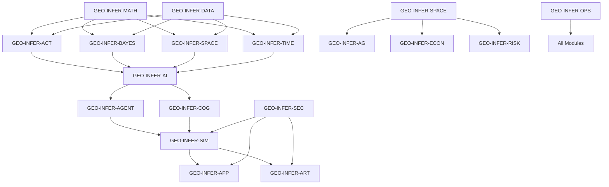

# GEO-INFER Modules Overview

> **Purpose**: Understanding the complete GEO-INFER framework
> 
> This overview provides a comprehensive guide to all GEO-INFER modules, their capabilities, and how they work together to provide geospatial inference capabilities.

## Framework Architecture

GEO-INFER is a geospatial inference framework consisting of many modules organized into distinct categories with clear dependency relationships and data flow patterns.

### Conventions
- Language is concise and technical; avoid unverifiable claims.
- Examples are illustrative; see each module's `examples/` for runnable code.
- Use `GEO-INFER-SPACE` for spatial, `GEO-INFER-PLACE` for place-based, and `GEO-INFER-TIME` for temporal workflows.
- H3 usage follows the H3 v4 API. See `GEO-INFER-SPACE` for details.

### Core Module Categories

#### 🧠 Analytical Core
- **[GEO-INFER-ACT](../modules/geo-infer-act.md)** - Active Inference Engine ✅
- **[GEO-INFER-BAYES](../modules/geo-infer-bayes.md)** - Bayesian Inference Engine ✅
- **[GEO-INFER-AI](../modules/geo-infer-ai.md)** - Artificial Intelligence Engine ✅
- **[GEO-INFER-MATH](../modules/geo-infer-math.md)** - Mathematical Foundations ✅
- **[GEO-INFER-COG](../modules/geo-infer-cog.md)** - Cognitive Modeling ✅
- **[GEO-INFER-AGENT](../modules/geo-infer-agent.md)** - Multi-Agent Systems ✅
- **[GEO-INFER-SPM](../modules/geo-infer-spm.md)** - Spatial Process Modeling ✅

#### 🗺️ Spatial-Temporal
- **[GEO-INFER-SPACE](../modules/geo-infer-space.md)** - Spatial Analysis Engine ✅
- **[GEO-INFER-TIME](../modules/geo-infer-time.md)** - Temporal Analysis Engine ✅
- **[GEO-INFER-IOT](../modules/geo-infer-iot.md)** - Internet of Things Integration ✅

#### 💾 Data Management
- **[GEO-INFER-DATA](../modules/geo-infer-data.md)** - Data Management Engine ✅
- **[GEO-INFER-API](../modules/geo-infer-api.md)** - API Management System ✅

#### 🔒 Security & Governance
- **[GEO-INFER-SEC](../modules/geo-infer-sec.md)** - Security Framework ✅
- **[GEO-INFER-NORMS](../modules/geo-infer-norms.md)** - Normative Systems ✅
- **[GEO-INFER-REQ](../modules/geo-infer-req.md)** - Requirements Management ✅

#### 🧪 Simulation & Modeling
- **[GEO-INFER-SIM](../modules/geo-infer-sim.md)** - Simulation Engine ✅
- **[GEO-INFER-ANT](../modules/geo-infer-ant.md)** - Ant Colony Optimization ✅

#### 👥 People & Community
- **[GEO-INFER-CIV](../modules/geo-infer-civ.md)** - Civic Engagement ✅
- **[GEO-INFER-PEP](../modules/geo-infer-pep.md)** - People Management ✅
- **[GEO-INFER-ORG](../modules/geo-infer-org.md)** - Organizational Systems ✅
- **[GEO-INFER-COMMS](../modules/geo-infer-comms.md)** - Communication Systems ✅

#### 🖥️ Applications
- **[GEO-INFER-APP](../modules/geo-infer-app.md)** - Application Framework ✅
- **[GEO-INFER-ART](../modules/geo-infer-art.md)** - Artificial Intelligence Art ✅

#### 🏢 Domain-Specific
- **[GEO-INFER-AG](../modules/geo-infer-ag.md)** - Agricultural Systems ✅
- **[GEO-INFER-ECON](../modules/geo-infer-econ.md)** - Economic Analysis ✅
- **[GEO-INFER-RISK](../modules/geo-infer-risk.md)** - Risk Assessment ✅
- **[GEO-INFER-LOG](../modules/geo-infer-log.md)** - Logistics Systems ✅
- **[GEO-INFER-BIO](../modules/geo-infer-bio.md)** - Biological Systems ✅
- **[GEO-INFER-HEALTH](../modules/geo-infer-health.md)** - Health Systems ✅

#### 📍 Place-Based
- **[GEO-INFER-PLACE](../modules/geo-infer-place.md)** - Place-Based Analysis ✅

#### ⚙️ Operations
- **[GEO-INFER-OPS](../modules/geo-infer-ops.md)** - Operations Management ✅
- **[GEO-INFER-INTRA](../modules/geo-infer-intra.md)** - Knowledge Integration ✅
- **[GEO-INFER-GIT](../modules/geo-infer-git.md)** - Version Control ✅
- **[GEO-INFER-TEST](../modules/geo-infer-test.md)** - Testing Framework ✅

## Module Dependencies

### Core Dependencies



### Data Flow Patterns

#### Linear Pipeline
```
GEO-INFER-DATA → GEO-INFER-SPACE → GEO-INFER-TIME → GEO-INFER-ACT → Analysis Results
```

#### Hub and Spoke
```
GEO-INFER-API (Central Hub)
├── GEO-INFER-ACT (Active Inference)
├── GEO-INFER-SPACE (Spatial Analysis)
├── GEO-INFER-TIME (Temporal Analysis)
└── GEO-INFER-BAYES (Bayesian Inference)
```

#### Event-Driven
```
GEO-INFER-IOT → GEO-INFER-ACT → GEO-INFER-SPACE → GEO-INFER-TIME → Response
```

#### Feedback Loop
```
GEO-INFER-ACT → GEO-INFER-BAYES → GEO-INFER-AI → GEO-INFER-ACT (Continuous Learning)
```

## Module Capabilities

### Analytical Core Modules

#### GEO-INFER-ACT: Active Inference Engine
- **Purpose**: Implements Active Inference principles for geospatial analysis
- **Key Features**:
  - Generative model building
  - Belief updating with observations
  - Policy selection and action optimization
  - Uncertainty quantification
  - Free energy minimization
 - **Use Cases**: Environmental monitoring, urban planning, climate analysis
 - **Integration**: Works with SPACE, TIME, and BAYES modules

#### GEO-INFER-BAYES: Bayesian Inference Engine
- **Purpose**: Provides Bayesian statistical analysis for geospatial data
- **Key Features**:
  - Bayesian parameter estimation
  - Uncertainty quantification
  - Model comparison and selection
  - Hierarchical modeling
  - MCMC sampling algorithms
- **Use Cases**: Risk assessment, environmental modeling, economic forecasting
- **Integration**: Enhances ACT and SPACE modules with statistical rigor
 

#### GEO-INFER-AI: Artificial Intelligence Engine
- **Purpose**: Provides machine learning and AI capabilities for geospatial analysis
- **Key Features**:
  - Deep learning models for spatial data
  - Neural network architectures
  - Transfer learning capabilities
  - Model interpretability tools
  - AutoML for spatial problems
- **Use Cases**: Pattern recognition, prediction, classification
- **Integration**: Powers analysis in ACT, SPACE, and TIME modules
 

### Spatial-Temporal Modules

#### GEO-INFER-SPACE: Spatial Analysis Engine
- **Purpose**: Provides comprehensive spatial analysis capabilities
- **Key Features**:
  - H3 geospatial indexing
  - Spatial statistics and clustering
  - Spatial interpolation and relationships
  - Coordinate system transformations
  - Spatial optimization algorithms
- **Use Cases**: Environmental monitoring, urban planning, transportation analysis
- **Integration**: Core spatial capabilities for all other modules
 

#### GEO-INFER-TIME: Temporal Analysis Engine
- **Purpose**: Provides time series analysis and temporal pattern recognition
- **Key Features**:
  - Time series decomposition
  - Temporal forecasting
  - Seasonal pattern detection
  - Spatiotemporal analysis
  - Real-time streaming analysis
- **Use Cases**: Climate analysis, environmental monitoring, urban mobility
- **Integration**: Enhances ACT and SPACE with temporal capabilities
 

#### GEO-INFER-IOT: Internet of Things Integration
- **Purpose**: Integrates IoT devices and sensor networks
- **Key Features**:
  - Real-time data ingestion
  - Sensor network management
  - Edge computing capabilities
  - Device communication protocols
  - Data quality monitoring
- **Use Cases**: Smart cities, environmental monitoring, industrial IoT
- **Integration**: Provides real-time data to ACT, SPACE, and TIME modules
 

### Data Management Modules

#### GEO-INFER-DATA: Data Management Engine
- **Purpose**: Manages data ingestion, storage, and processing
- **Key Features**:
  - Multi-format data support
  - Data validation and quality control
  - ETL pipelines
  - Data versioning and lineage
  - Real-time data streaming
- **Use Cases**: Data preprocessing, quality assurance, pipeline management
- **Integration**: Provides data services to all analytical modules
 

#### GEO-INFER-API: API Management System
- **Purpose**: Provides RESTful and GraphQL APIs for external integration
- **Key Features**:
  - RESTful API endpoints
  - GraphQL schema
  - Authentication and authorization
  - Rate limiting and monitoring
  - API versioning and documentation
- **Use Cases**: External integrations, web applications, mobile apps
- **Integration**: Exposes functionality from all modules
 

### Domain-Specific Modules

#### GEO-INFER-AG: Agricultural Systems
- **Purpose**: Specialized analysis for agricultural applications
- **Key Features**:
  - Crop modeling and prediction
  - Soil analysis and monitoring
  - Precision agriculture tools
  - Climate impact assessment
  - Yield optimization algorithms
- **Use Cases**: Precision agriculture, crop planning, climate adaptation
- **Integration**: Uses ACT, SPACE, and TIME for agricultural analysis
 

#### GEO-INFER-ECON: Economic Analysis
- **Purpose**: Economic modeling and analysis for geospatial contexts
- **Key Features**:
  - Economic impact assessment
  - Market analysis tools
  - Cost-benefit analysis
  - Economic forecasting
  - Spatial economic modeling
- **Use Cases**: Economic development, policy analysis, investment planning
- **Integration**: Combines with ACT and BAYES for economic modeling
 

#### GEO-INFER-RISK: Risk Assessment
- **Purpose**: Comprehensive risk assessment and management
- **Key Features**:
  - Multi-hazard risk modeling
  - Vulnerability assessment
  - Risk communication tools
  - Scenario analysis
  - Real-time risk monitoring
- **Use Cases**: Disaster preparedness, insurance, policy planning
- **Integration**: Uses BAYES, ACT, and SPACE for risk modeling
 

## Integration Patterns

### Common Integration Scenarios

#### Environmental Monitoring System
```
GEO-INFER-IOT → GEO-INFER-DATA → GEO-INFER-SPACE → GEO-INFER-TIME → GEO-INFER-ACT → Results
```

#### Urban Planning Analysis
```
GEO-INFER-SPACE → GEO-INFER-ACT → GEO-INFER-BAYES → GEO-INFER-ECON → Recommendations
```

#### Climate Change Assessment
```
GEO-INFER-TIME → GEO-INFER-ACT → GEO-INFER-BAYES → GEO-INFER-RISK → Impact Analysis
```

#### Smart City Operations
```
GEO-INFER-IOT → GEO-INFER-ACT → GEO-INFER-AGENT → GEO-INFER-APP → Automated Response
```

### Integration Patterns

#### Multi-Modal Analysis
```python
from geo_infer_act import ActiveInferenceModel
from geo_infer_space import SpatialAnalyzer
from geo_infer_time import TemporalAnalyzer
from geo_infer_bayes import BayesianAnalyzer

# Create integrated analysis pipeline
spatial_analyzer = SpatialAnalyzer()
temporal_analyzer = TemporalAnalyzer()
bayesian_analyzer = BayesianAnalyzer()
active_model = ActiveInferenceModel()

# Perform multi-modal analysis
spatial_features = spatial_analyzer.extract_features(spatial_data)
temporal_patterns = temporal_analyzer.analyze_patterns(temporal_data)
uncertainty = bayesian_analyzer.quantify_uncertainty(combined_data)

# Update active inference model
active_model.update_beliefs({
    'spatial_features': spatial_features,
    'temporal_patterns': temporal_patterns,
    'uncertainty': uncertainty
})
```

#### Real-Time Decision Making
```python
from geo_infer_agent import MultiAgentSystem
from geo_infer_act import ActiveInferenceModel
from geo_infer_iot import IoTManager

# Create real-time decision system
iot_manager = IoTManager()
agent_system = MultiAgentSystem()
active_model = ActiveInferenceModel()

# Set up real-time processing
iot_manager.setup_streaming_processing(
    data_sources=['sensors', 'cameras', 'weather_stations'],
    processing_pipeline=[active_model, agent_system]
)

# Enable real-time decision making
agent_system.enable_real_time_decisions(
    decision_threshold=0.8,
    response_time_ms=100
)
```

### Cross-Module Communication

#### Data Flow Standards
- **Standardized Data Models**: All modules use consistent data structures
- **API Versioning**: Backward-compatible API evolution
- **Error Handling**: Consistent error reporting across modules
- **Performance Monitoring**: Unified performance metrics
- **Security Protocols**: End-to-end encryption and authentication

#### Integration Best Practices
- **Loose Coupling**: Modules communicate through well-defined interfaces
- **High Cohesion**: Each module focuses on specific capabilities
- **Dependency Injection**: Flexible module composition
- **Event-Driven Architecture**: Asynchronous communication patterns
- **Circuit Breaker Pattern**: Fault tolerance and resilience

## Getting Started with Modules

### Beginner Path
1. **Start with Core Modules**: [GEO-INFER-MATH](../modules/geo-infer-math.md) → [GEO-INFER-SPACE](../modules/geo-infer-space.md) → [GEO-INFER-ACT](../modules/geo-infer-act.md)
2. **Add Temporal Analysis**: [GEO-INFER-TIME](../modules/geo-infer-time.md)
3. **Explore Applications**: [GEO-INFER-APP](../modules/geo-infer-app.md)

### Advanced Path
1. **Master Active Inference**: [GEO-INFER-ACT](../modules/geo-infer-act.md) → [GEO-INFER-BAYES](../modules/geo-infer-bayes.md)
2. **Add AI Capabilities**: [GEO-INFER-AI](../modules/geo-infer-ai.md)
3. **Build Complex Systems**: [GEO-INFER-AGENT](../modules/geo-infer-agent.md) → [GEO-INFER-SIM](../modules/geo-infer-sim.md)

### Domain-Specific Paths

#### Environmental Science
- [GEO-INFER-SPACE](../modules/geo-infer-space.md) → [GEO-INFER-TIME](../modules/geo-infer-time.md) → [GEO-INFER-ACT](../modules/geo-infer-act.md) → [GEO-INFER-BIO](../modules/geo-infer-bio.md)

#### Urban Planning
- [GEO-INFER-SPACE](../modules/geo-infer-space.md) → [GEO-INFER-ACT](../modules/geo-infer-act.md) → [GEO-INFER-ECON](../modules/geo-infer-econ.md) → [GEO-INFER-CIV](../modules/geo-infer-civ.md)

#### Risk Assessment
- [GEO-INFER-BAYES](../modules/geo-infer-bayes.md) → [GEO-INFER-ACT](../modules/geo-infer-act.md) → [GEO-INFER-RISK](../modules/geo-infer-risk.md) → [GEO-INFER-SEC](../modules/geo-infer-sec.md)

#### Smart Cities
- [GEO-INFER-IOT](../modules/geo-infer-iot.md) → [GEO-INFER-ACT](../modules/geo-infer-act.md) → [GEO-INFER-AGENT](../modules/geo-infer-agent.md) → [GEO-INFER-APP](../modules/geo-infer-app.md)

## Performance Optimization

### Scalability Guidelines

#### Horizontal Scaling
```python
# Enable distributed processing
from geo_infer_ops import OperationsManager

ops_manager = OperationsManager()
ops_manager.enable_distributed_processing(
    cluster_size=10,
    load_balancing='round_robin',
    fault_tolerance=True
)
```

#### Vertical Scaling
```python
# Optimize resource usage
from geo_infer_ops import ResourceOptimizer

resource_optimizer = ResourceOptimizer()
resource_optimizer.optimize_memory_usage(
    max_memory_gb=64,
    garbage_collection='aggressive',
    caching_strategy='lru'
)
```

### Performance Monitoring

#### Real-Time Metrics
```python
from geo_infer_ops import PerformanceMonitor

monitor = PerformanceMonitor()
monitor.track_metrics([
    'response_time',
    'throughput',
    'error_rate',
    'resource_usage'
])
```

#### Performance Optimization
```python
# Enable performance optimization
from geo_infer_ops import PerformanceOptimizer

optimizer = PerformanceOptimizer()
optimizer.enable_optimizations([
    'query_optimization',
    'caching',
    'parallel_processing',
    'memory_optimization'
])
```

## Security Considerations

### Data Security
- **Encryption**: End-to-end encryption for all data transmission
- **Authentication**: Multi-factor authentication for API access
- **Authorization**: Role-based access control (RBAC)
- **Audit Logging**: Comprehensive audit trails for all operations

### System Security
- **Network Security**: Firewall and intrusion detection
- **Application Security**: Input validation and sanitization
- **Infrastructure Security**: Secure deployment and configuration
- **Compliance**: GDPR, HIPAA, and industry-specific compliance

## Related Documentation

### Tutorials
- **[Getting Started with Modules](../getting_started/module_basics.md)** - Learn how to use GEO-INFER modules
- **[Module Integration Tutorial](../getting_started/module_integration.md)** - Combine multiple modules effectively
- **[Performance Optimization Guide](../getting_started/performance_optimization.md)** - Optimize module performance

### How-to Guides
- **[Building Environmental Systems](../examples/environmental_system.md)** - Complete environmental monitoring system
- **[Urban Planning Workflow](../examples/urban_planning_workflow.md)** - End-to-end urban planning analysis
- **[Risk Assessment Pipeline](../examples/risk_assessment_pipeline.md)** - Comprehensive risk assessment system
- **[Smart City Implementation](../examples/smart_city_implementation.md)** - Complete smart city solution

### Technical Reference
- **[Module API Reference](../api/module_reference.md)** - Complete module API documentation
- **[Integration Patterns](../api/integration_patterns.md)** - Standard integration patterns
- **[Performance Guidelines](../advanced/performance_guidelines.md)** - Optimizing module performance
- **[Security Best Practices](../advanced/security_best_practices.md)** - Security implementation guidelines

### Explanations
- **[Framework Architecture](../architecture/framework_overview.md)** - Deep dive into framework design
- **[Module Design Principles](../architecture/module_design.md)** - Understanding module design philosophy
- **[Integration Theory](../architecture/integration_theory.md)** - Theoretical foundations of module integration
- **[Performance Theory](../architecture/performance_theory.md)** - Performance optimization principles

### Individual Module Documentation

#### 🧠 Analytical Core
- **[GEO-INFER-ACT](../modules/geo-infer-act.md)** - Active Inference Engine ✅
- **[GEO-INFER-BAYES](../modules/geo-infer-bayes.md)** - Bayesian Inference Engine ✅
- **[GEO-INFER-MATH](../modules/geo-infer-math.md)** - Mathematical Foundations ✅
- **[GEO-INFER-AI](../modules/geo-infer-ai.md)** - Artificial Intelligence Engine ✅
- **[GEO-INFER-COG](../modules/geo-infer-cog.md)** - Cognitive Modeling ✅
- **[GEO-INFER-AGENT](../modules/geo-infer-agent.md)** - Multi-Agent Systems ✅
- **[GEO-INFER-SPM](../modules/geo-infer-spm.md)** - Spatial Process Modeling ✅

#### 🗺️ Spatial-Temporal
- **[GEO-INFER-SPACE](../modules/geo-infer-space.md)** - Spatial Analysis Engine ✅
- **[GEO-INFER-TIME](../modules/geo-infer-time.md)** - Temporal Analysis Engine ✅
- **[GEO-INFER-IOT](../modules/geo-infer-iot.md)** - Internet of Things Integration ✅

#### 💾 Data Management
- **[GEO-INFER-DATA](../modules/geo-infer-data.md)** - Data Management Engine ✅
- **[GEO-INFER-API](../modules/geo-infer-api.md)** - API Management System ✅

#### 🔒 Security & Governance
- **[GEO-INFER-SEC](../modules/geo-infer-sec.md)** - Security Framework ✅
- **[GEO-INFER-NORMS](../modules/geo-infer-norms.md)** - Normative Systems ✅
- **[GEO-INFER-REQ](../modules/geo-infer-req.md)** - Requirements Management ✅

#### 🧪 Simulation & Modeling
- **[GEO-INFER-SIM](../modules/geo-infer-sim.md)** - Simulation Engine ✅
- **[GEO-INFER-ANT](../modules/geo-infer-ant.md)** - Ant Colony Optimization ✅

#### 👥 People & Community
- **[GEO-INFER-CIV](../modules/geo-infer-civ.md)** - Civic Engagement ✅
- **[GEO-INFER-PEP](../modules/geo-infer-pep.md)** - People Management ✅
- **[GEO-INFER-ORG](../modules/geo-infer-org.md)** - Organizational Systems ✅
- **[GEO-INFER-COMMS](../modules/geo-infer-comms.md)** - Communication Systems ✅

#### 🖥️ Applications
- **[GEO-INFER-APP](../modules/geo-infer-app.md)** - Application Framework ✅
- **[GEO-INFER-ART](../modules/geo-infer-art.md)** - Artificial Intelligence Art ✅

#### 🏢 Domain-Specific
- **[GEO-INFER-AG](../modules/geo-infer-ag.md)** - Agricultural Systems ✅
- **[GEO-INFER-ECON](../modules/geo-infer-econ.md)** - Economic Analysis ✅
- **[GEO-INFER-RISK](../modules/geo-infer-risk.md)** - Risk Assessment ✅
- **[GEO-INFER-LOG](../modules/geo-infer-log.md)** - Logistics Systems ✅
- **[GEO-INFER-BIO](../modules/geo-infer-bio.md)** - Biological Systems ✅
- **[GEO-INFER-HEALTH](../modules/geo-infer-health.md)** - Health Systems ✅

#### 📍 Place-Based
- **[GEO-INFER-PLACE](../modules/geo-infer-place.md)** - Place-Based Analysis ✅

#### ⚙️ Operations
- **[GEO-INFER-OPS](../modules/geo-infer-ops.md)** - Operations Management ✅
- **[GEO-INFER-INTRA](../modules/geo-infer-intra.md)** - Knowledge Integration ✅
- **[GEO-INFER-GIT](../modules/geo-infer-git.md)** - Version Control ✅
- **[GEO-INFER-TEST](../modules/geo-infer-test.md)** - Testing Framework ✅

### Documentation Status Notes
- Coverage varies by module. Use this index to navigate to current content.
- Prefer module `README.md` and `examples/` for runnable code.

---

**Ready to explore?** Start with **[Getting Started with Modules](../getting_started/module_basics.md)** or dive into specific modules like **[GEO-INFER-ACT](../modules/geo-infer-act.md)** for Active Inference or **[GEO-INFER-SPACE](../modules/geo-infer-space.md)** for Spatial Analysis! 