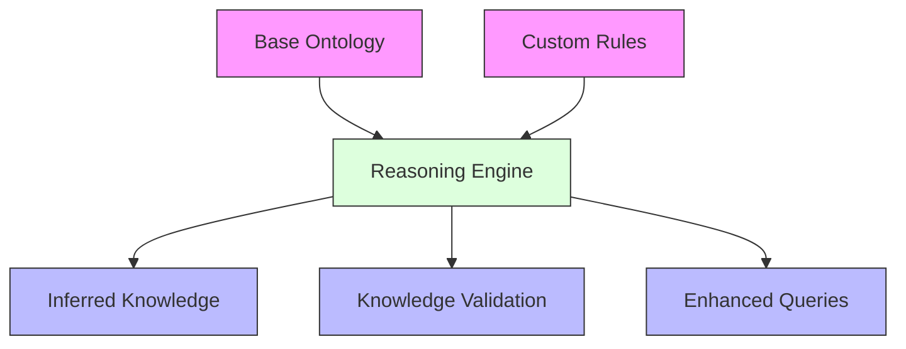
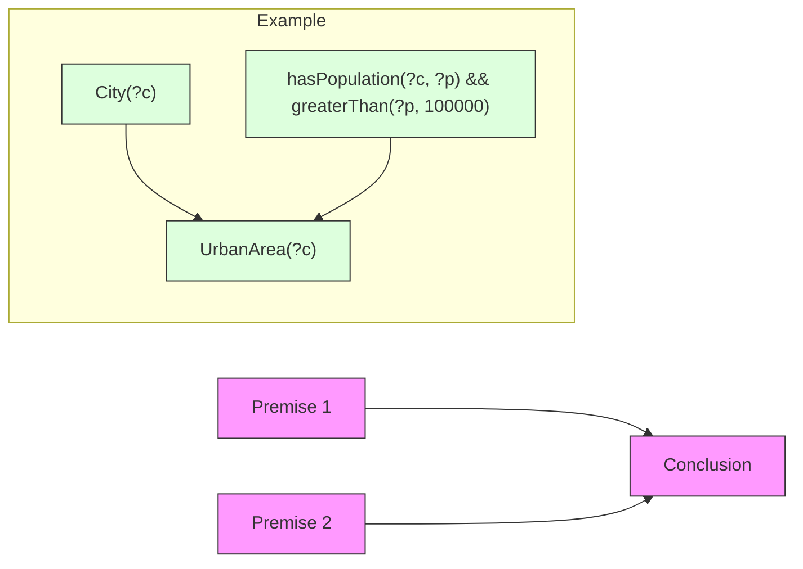
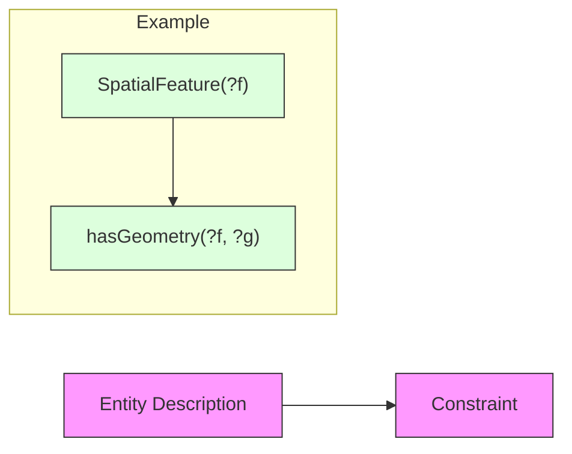
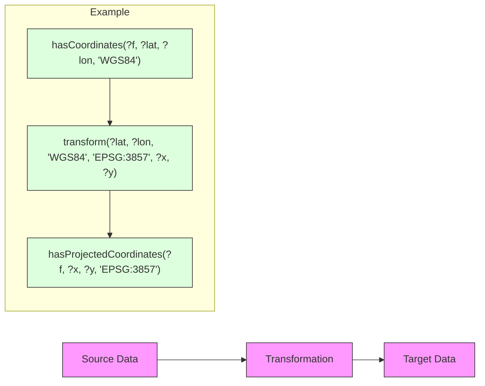
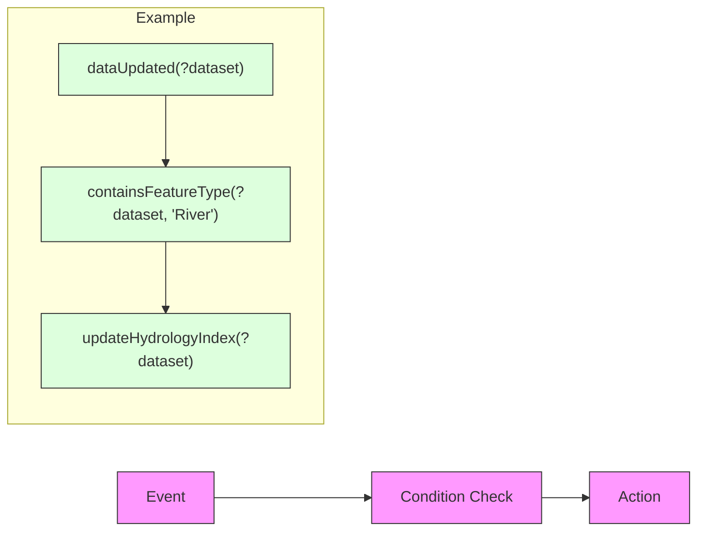
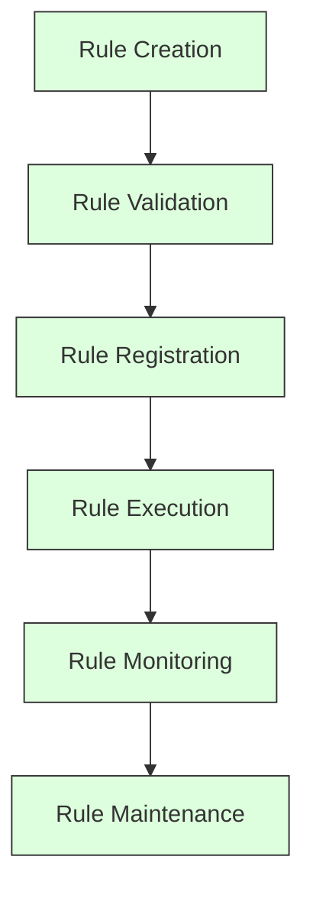
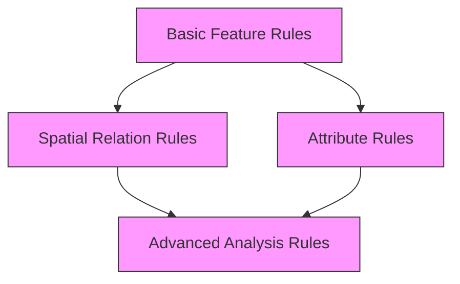
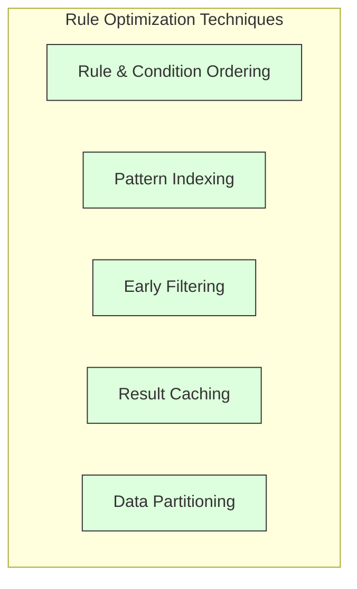

# Custom Ontology Rules Development Guide

This document provides comprehensive guidance for developing and implementing custom ontology rules in GEO-INFER-INTRA.

## Contents

- [Introduction](#introduction)
- [Rule Types](#rule-types)
- [Rule Syntax](#rule-syntax)
- [Rule Management](#rule-management)
- [Testing and Validation](#testing-and-validation)
- [Geospatial Rule Examples](#geospatial-rule-examples)
- [Performance Considerations](#performance-considerations)
- [Best Practices](#best-practices)
- [Troubleshooting](#troubleshooting)

## Introduction

Custom rules extend the reasoning capabilities of ontologies in GEO-INFER-INTRA, allowing domain-specific knowledge and constraints to be encoded and applied. Rules enable automated inference of new facts, validation of knowledge, and complex query capabilities.



### Benefits of Custom Rules

- **Domain-Specific Knowledge**: Encode specialized knowledge that cannot be expressed in standard ontology languages
- **Complex Relationships**: Define relationships involving multiple conditions and constraints
- **Inference Capabilities**: Generate new knowledge based on existing facts
- **Validation Logic**: Implement specialized validation rules for data consistency
- **Process Automation**: Automate complex reasoning processes

## Rule Types

GEO-INFER-INTRA supports several types of rules, each with different purposes and capabilities.

### Inference Rules

Rules that derive new facts from existing knowledge.



### Constraint Rules

Rules that define constraints that must be satisfied for valid knowledge.



### Transformation Rules

Rules that transform data from one form to another.



### Event-Triggered Rules

Rules that trigger actions based on specific events or conditions.



## Rule Syntax

GEO-INFER-INTRA supports multiple rule languages and formats to accommodate different use cases and user preferences.

### SWRL Format

Semantic Web Rule Language format, integrated with OWL ontologies.

```
# SWRL Rule Example - Cities in the same administrative region are connected
City(?c1) ^ City(?c2) ^ locatedIn(?c1, ?r) ^ locatedIn(?c2, ?r) ^ differentFrom(?c1, ?c2) -> connected(?c1, ?c2)

# SWRL Rule Example - Rivers flowing through contaminated areas are at risk
River(?r) ^ ContaminatedArea(?a) ^ flowsThrough(?r, ?a) -> atRisk(?r, true) ^ riskSource(?r, ?a)
```

### Jena Rules Format

A more flexible rule format used with Apache Jena reasoning engine.

```
# Jena Rule Example - Deriving watershed relationships
[WatershedRule:
    (?river rdf:type geo:River)
    (?tributary rdf:type geo:River)
    (?tributary geo:flowsInto ?river)
    ->
    (?tributary geo:partOf ?river),
    (?river geo:hasComponent ?tributary)
]

# Jena Rule Example - Urban density classification
[UrbanDensityRule:
    (?area rdf:type geo:UrbanArea)
    (?area geo:hasPopulation ?pop)
    (?area geo:hasAreaSize ?size)
    (?density math:quotient ?pop ?size)
    greaterThan(?density, 5000)
    ->
    (?area rdf:type geo:HighDensityUrbanArea)
]
```

### GeoSPARQL Rules

Specialized rules for geospatial reasoning using GeoSPARQL standard.

```
# GeoSPARQL Rule Example - Identifying adjacent features
[AdjacentFeaturesRule:
    (?a rdf:type geo:SpatialFeature)
    (?b rdf:type geo:SpatialFeature)
    (?a geo:hasGeometry ?geomA)
    (?b geo:hasGeometry ?geomB)
    (?geomA geof:sfTouches ?geomB)
    different(?a, ?b)
    ->
    (?a geo:adjacentTo ?b),
    (?b geo:adjacentTo ?a)
]

# GeoSPARQL Rule Example - Features within a distance
[ProximityRule:
    (?a rdf:type geo:SpatialFeature)
    (?b rdf:type geo:SpatialFeature)
    (?a geo:hasGeometry ?geomA)
    (?b geo:hasGeometry ?geomB)
    (?distance geof:distance(?geomA, ?geomB, units:Kilometers))
    lessThan(?distance, 10)
    different(?a, ?b)
    ->
    (?a geo:nearTo ?b),
    (?b geo:nearTo ?a)
]
```

### Python Rules API

Rules defined programmatically using Python.

```python
from geo_infer.ontology import OntologyManager
from geo_infer.rules import RuleManager, Rule, Condition, Action

# Initialize managers
ontology_manager = OntologyManager()
rule_manager = RuleManager(ontology_manager)

# Define a rule
watershed_rule = Rule(
    name="WatershedRule",
    description="Derive watershed relationships between rivers",
    conditions=[
        Condition("?river rdf:type geo:River"),
        Condition("?tributary rdf:type geo:River"),
        Condition("?tributary geo:flowsInto ?river")
    ],
    actions=[
        Action("?tributary geo:partOf ?river"),
        Action("?river geo:hasComponent ?tributary")
    ]
)

# Register the rule
rule_manager.register_rule(watershed_rule)

# Define a geospatial rule with a function call
proximity_rule = Rule(
    name="ProximityRule",
    description="Identify features within a specified distance",
    conditions=[
        Condition("?a rdf:type geo:SpatialFeature"),
        Condition("?b rdf:type geo:SpatialFeature"),
        Condition("?a geo:hasGeometry ?geomA"),
        Condition("?b geo:hasGeometry ?geomB"),
        Condition("?distance = geof:distance(?geomA, ?geomB, units:Kilometers)"),
        Condition("?distance < 10"),
        Condition("?a != ?b")
    ],
    actions=[
        Action("?a geo:nearTo ?b"),
        Action("?b geo:nearTo ?a")
    ]
)

# Register the rule
rule_manager.register_rule(proximity_rule)
```

## Rule Management

GEO-INFER-INTRA provides a comprehensive system for managing custom rules throughout their lifecycle.



### Rule Organization

Rules are organized into rule sets to manage complexity and improve maintainability.

```yaml
ruleset:
  name: "GeospatialAnalysisRules"
  description: "Rules for geospatial analysis and inference"
  namespace: "http://geo-infer.org/rules/geospatial/"
  author: "GEO-INFER Team"
  version: "1.0.0"
  rules:
    - id: "watershed-rule"
      file: "watershed-rules.swrl"
      enabled: true
      priority: 1
    - id: "proximity-rule"
      file: "proximity-rules.swrl"
      enabled: true
      priority: 2
    - id: "adjacency-rule"
      file: "adjacency-rules.swrl"
      enabled: true
      priority: 3
```

### Rule Dependency Management

Managing dependencies between rules to ensure proper execution order.



### Rule API

Programmatically manage rules through the API.

```python
from geo_infer.rules import RuleManager

# Initialize rule manager
rule_manager = RuleManager()

# List all rules
all_rules = rule_manager.list_rules()
for rule in all_rules:
    print(f"Rule: {rule.name}, Enabled: {rule.enabled}, Priority: {rule.priority}")

# Enable/disable rules
rule_manager.set_rule_enabled("proximity-rule", False)

# Update rule priority
rule_manager.set_rule_priority("watershed-rule", 5)

# Create a rule set
rule_manager.create_ruleset(
    name="HydrologyRules",
    description="Rules for hydrology analysis",
    rules=["watershed-rule", "river-network-rule", "drainage-basin-rule"]
)

# Export rules to file
rule_manager.export_rules("hydrology-rules.json", format="json")

# Import rules from file
rule_manager.import_rules("urban-analysis-rules.swrl", format="swrl")
```

## Testing and Validation

Ensuring rules work correctly before deploying them.

### Rule Testing Framework

```python
from geo_infer.rules import RuleTester
from geo_infer.ontology import OntologyManager

# Initialize the rule tester
ontology_manager = OntologyManager()
ontology = ontology_manager.load_ontology("geospatial")
tester = RuleTester(ontology)

# Define test case
test_case = {
    "input": [
        "River(MississippiRiver)",
        "River(MissouriRiver)",
        "flowsInto(MissouriRiver, MississippiRiver)"
    ],
    "expected": [
        "partOf(MissouriRiver, MississippiRiver)",
        "hasComponent(MississippiRiver, MissouriRiver)"
    ]
}

# Test a rule
result = tester.test_rule("watershed-rule", test_case)
if result.success:
    print("Rule test passed!")
else:
    print("Rule test failed!")
    print(f"Missing assertions: {result.missing}")
    print(f"Unexpected assertions: {result.unexpected}")

# Run a batch of tests
test_results = tester.run_test_suite("hydrology-tests.json")
tester.generate_report(test_results, "hydrology-test-report.html")
```

### Rule Validation

Validating rules for syntax and semantic correctness.

```python
from geo_infer.rules import RuleValidator

# Initialize validator
validator = RuleValidator()

# Validate a rule
rule_file = "watershed-rules.swrl"
validation_result = validator.validate(rule_file)

if validation_result.valid:
    print(f"Rule {rule_file} is valid!")
else:
    print(f"Rule {rule_file} has validation errors:")
    for error in validation_result.errors:
        print(f"Line {error.line}: {error.message}")
```

## Geospatial Rule Examples

Examples of custom rules for common geospatial scenarios.

### Topological Relationship Rules

```
# Identify water bodies that are part of a watershed
[WatershedRule:
    (?river rdf:type geo:River)
    (?lake rdf:type geo:Lake)
    (?river geo:hasGeometry ?riverGeom)
    (?lake geo:hasGeometry ?lakeGeom)
    (?watershed rdf:type geo:Watershed)
    (?watershed geo:hasGeometry ?watershedGeom)
    (?watershedGeom geof:sfContains ?riverGeom)
    (?watershedGeom geof:sfContains ?lakeGeom)
    ->
    (?river geo:partOf ?watershed)
    (?lake geo:partOf ?watershed)
]

# Identify features crossing administrative boundaries
[BoundaryCrossingRule:
    (?feature rdf:type geo:SpatialFeature)
    (?region1 rdf:type geo:AdministrativeRegion)
    (?region2 rdf:type geo:AdministrativeRegion)
    (?feature geo:hasGeometry ?featureGeom)
    (?region1 geo:hasGeometry ?region1Geom)
    (?region2 geo:hasGeometry ?region2Geom)
    (?region1Geom geof:sfIntersects ?featureGeom)
    (?region2Geom geof:sfIntersects ?featureGeom)
    different(?region1, ?region2)
    ->
    (?feature geo:crossesBoundary ?region1)
    (?feature geo:crossesBoundary ?region2)
]
```

### Proximity-Based Rules

```
# Identify features at risk from flood zones
[FloodRiskRule:
    (?feature rdf:type geo:Building)
    (?floodZone rdf:type geo:FloodZone)
    (?feature geo:hasGeometry ?featureGeom)
    (?floodZone geo:hasGeometry ?floodGeom)
    (?featureGeom geof:sfWithin ?floodGeom)
    (?floodZone geo:hasRiskLevel ?level)
    ->
    (?feature geo:hasFloodRisk ?level)
]

# Create buffer zones around sensitive areas
[BufferZoneRule:
    (?feature rdf:type geo:ProtectedArea)
    (?feature geo:hasGeometry ?featureGeom)
    (?bufferGeom geof:buffer(?featureGeom, 1000, units:Meters))
    ->
    (?feature geo:hasBufferZone ?bufferGeom)
    (?bufferZoneEntity rdf:type geo:BufferZone)
    (?bufferZoneEntity geo:hasGeometry ?bufferGeom)
    (?bufferZoneEntity geo:protects ?feature)
]
```

### Spatial Analysis Rules

```
# Classify land use based on multiple factors
[LandUseClassificationRule:
    (?area rdf:type geo:LandArea)
    (?area geo:hasLandCover ?landCover)
    (?area geo:hasSlope ?slope)
    (?area geo:hasElevation ?elevation)
    greaterThan(?elevation, 1000)
    greaterThan(?slope, 15)
    equal(?landCover, "Forest")
    ->
    (?area rdf:type geo:MountainForest)
]

# Identify urban growth patterns
[UrbanGrowthRule:
    (?urbanArea rdf:type geo:UrbanArea)
    (?urbanArea geo:hasPopulationDensity ?density)
    (?urbanArea geo:hasYearlyGrowthRate ?growth)
    (?urbanArea geo:hasInfrastructureDevelopment ?infra)
    greaterThan(?density, 1000)
    greaterThan(?growth, 2.5)
    greaterThan(?infra, 0.7)
    ->
    (?urbanArea rdf:type geo:RapidlyGrowingUrbanArea)
]
```

### Temporal Rules

```
# Identify seasonal water bodies
[SeasonalWaterBodyRule:
    (?waterBody rdf:type geo:WaterBody)
    (?observation1 rdf:type geo:Observation)
    (?observation1 geo:observedProperty geo:waterExtent)
    (?observation1 geo:featureOfInterest ?waterBody)
    (?observation1 geo:hasTime ?time1)
    (?observation1 geo:hasValue ?extent1)
    (?time1 geo:inSeason "Wet")
    
    (?observation2 rdf:type geo:Observation)
    (?observation2 geo:observedProperty geo:waterExtent)
    (?observation2 geo:featureOfInterest ?waterBody)
    (?observation2 geo:hasTime ?time2)
    (?observation2 geo:hasValue ?extent2)
    (?time2 geo:inSeason "Dry")
    
    greaterThan(?extent1, ?extent2)
    quotient(?extent2, ?extent1, ?ratio)
    lessThan(?ratio, 0.3)
    ->
    (?waterBody rdf:type geo:SeasonalWaterBody)
]

# Identify land cover changes
[LandCoverChangeRule:
    (?area rdf:type geo:LandArea)
    (?observation1 rdf:type geo:Observation)
    (?observation1 geo:observedProperty geo:landCover)
    (?observation1 geo:featureOfInterest ?area)
    (?observation1 geo:hasTime ?time1)
    (?observation1 geo:hasValue ?cover1)
    
    (?observation2 rdf:type geo:Observation)
    (?observation2 geo:observedProperty geo:landCover)
    (?observation2 geo:featureOfInterest ?area)
    (?observation2 geo:hasTime ?time2)
    (?observation2 geo:hasValue ?cover2)
    
    temporallyFollows(?time2, ?time1)
    different(?cover1, ?cover2)
    equal(?cover1, "Forest")
    equal(?cover2, "Urban")
    ->
    (?area rdf:type geo:DeforestedArea)
    (?change rdf:type geo:LandCoverChange)
    (?change geo:hasSubject ?area)
    (?change geo:from ?cover1)
    (?change geo:to ?cover2)
    (?change geo:hasStartTime ?time1)
    (?change geo:hasEndTime ?time2)
]
```

## Performance Considerations

Optimizing rules for efficient execution.

### Rule Optimization Techniques



#### Condition Ordering Example

Original rule with suboptimal ordering:
```
# Original rule - inefficient ordering
[InefficiendRule:
    (?feature geo:hasGeometry ?geom)  # Very common pattern, many matches
    (?feature rdf:type geo:Building)  # More specific, fewer matches
    (?feature geo:hasHeight ?height)  # Even more specific
    greaterThan(?height, 100)         # Most specific filter
    ->
    (?feature rdf:type geo:Skyscraper)
]
```

Optimized rule with better condition ordering:
```
# Optimized rule - more efficient ordering
[EfficientRule:
    (?feature rdf:type geo:Building)  # Start with more specific pattern
    (?feature geo:hasHeight ?height)  # Continue with specific attributes
    greaterThan(?height, 100)         # Apply filter early
    (?feature geo:hasGeometry ?geom)  # Only process geometry for matching buildings
    ->
    (?feature rdf:type geo:Skyscraper)
]
```

### Incremental Processing

```python
from geo_infer.rules import IncrementalProcessor

# Initialize incremental processor
processor = IncrementalProcessor()

# Process initial data
processor.process_initial_data(ontology)

# When data changes, only process the affected rules
def on_data_change(changes):
    # changes contains added and removed statements
    affected_rules = processor.get_affected_rules(changes)
    processor.process_changes(changes, affected_rules)
```

## Best Practices

Guidelines for effective rule development.

1. **Start Simple**: Begin with basic rules and incrementally add complexity
2. **Test Thoroughly**: Create comprehensive test cases for each rule
3. **Document Well**: Include detailed comments and documentation for each rule
4. **Consistent Naming**: Use consistent naming conventions for variables and predicates
5. **Modular Approach**: Break complex rules into simpler, modular rules
6. **Optimize Early**: Consider performance implications during rule design
7. **Version Control**: Maintain versioning for rules and rule sets
8. **Review Regularly**: Periodically review and refine rules as requirements evolve
9. **Monitor Performance**: Track rule execution time and resource usage
10. **Consider Maintainability**: Design rules with long-term maintenance in mind

### Rule Naming Conventions

```
# Entity types: PascalCase
# Relationships: camelCase
# Variables: ?prefixedWithQuestionMark

# Good example
[WatershedDelineationRule:
    (?river rdf:type geo:River)
    (?tributary rdf:type geo:River)
    (?tributary geo:flowsInto ?river)
    ->
    (?tributary geo:partOf ?river)
]

# Poor example - inconsistent naming, unclear purpose
[rule1:
    (?r type River)
    (?t type River)
    (?t flows ?r)
    ->
    (?t part ?r)
]
```

## Troubleshooting

Common issues and solutions when working with custom rules.

| Issue | Possible Causes | Solutions |
|-------|----------------|-----------|
| Rule never triggers | Conditions too restrictive, Data doesn't match pattern | Simplify conditions, Verify data, Check variable bindings |
| Unexpected results | Incorrect rule logic, Rule interaction, Order dependency | Review logic, Check for conflicting rules, Adjust priority |
| Performance issues | Inefficient condition ordering, Too many conditions, Complex expressions | Reorder conditions, Split into multiple rules, Simplify expressions |
| Inconsistent behavior | Non-deterministic rule execution, Missing constraints | Add explicit ordering constraints, Add negative conditions |
| Stack overflow | Circular rule dependencies, Recursive rule firing | Break dependency cycle, Add termination conditions |

### Debugging Techniques

```python
from geo_infer.rules import RuleDebugger

# Initialize debugger
debugger = RuleDebugger()

# Enable tracing
debugger.enable_tracing("watershed-rule")

# Execute rules with tracing
results = debugger.execute_with_tracing(ontology)

# Print execution trace
debugger.print_trace()

# Save trace to file
debugger.save_trace("rule-execution-trace.log")

# Visualize rule execution
debugger.visualize_rule_execution("rule-execution.html")
```

## Related Resources

- [Ontology Modeling Guide](ontology_modeling.md)
- [Reasoning Guide](reasoning.md)
- [Ontology Visualization](visualization.md)
- [Knowledge Base Integration](../knowledge_base/integration.md)
- [Geospatial Analysis](../geospatial/analysis.md) 