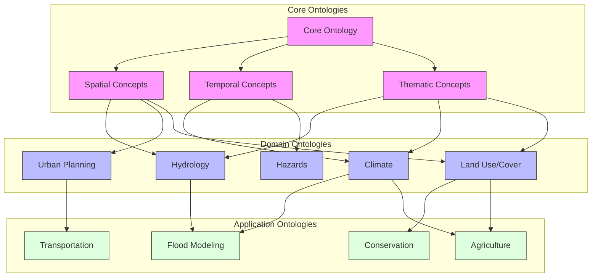
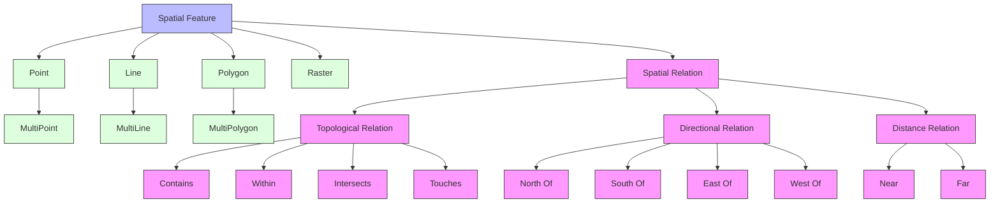
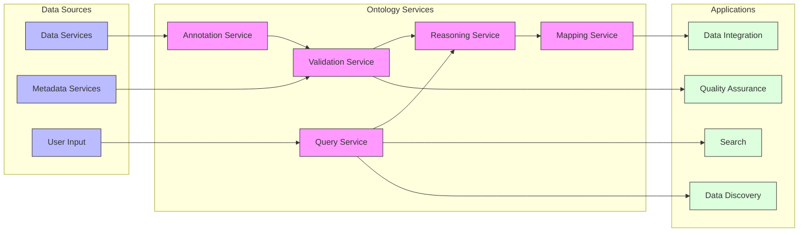
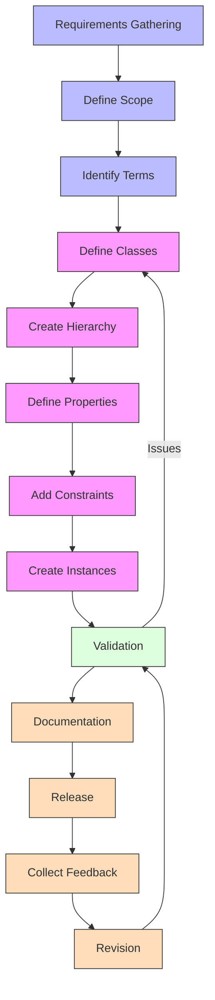

# Ontology Management

This section provides information about the ontology management system within the GEO-INFER framework, which standardizes terminology, defines relationships between concepts, and enables semantic interoperability between components.

## Contents

- [Ontology Overview](overview.md) - Introduction to ontologies in GEO-INFER
- [Core Ontology](core_ontology.md) - The central ontology defining fundamental concepts
- [Domain Ontologies](domain_ontologies/index.md) - Domain-specific ontological models
- [Ontology Tools](tools.md) - Tools for working with ontologies
- [Ontology Integration](integration.md) - Integrating ontologies with other components
- [Ontology Mapping](mapping.md) - Connecting concepts across different ontologies
- [Reasoning](reasoning.md) - Inference capabilities and reasoning engines
- [Ontology Development](development.md) - Guidelines for extending and maintaining ontologies
- [Ontology Governance](governance.md) - Processes for managing ontology changes

## Ontology Structure

The GEO-INFER ontology system consists of interconnected ontology modules:



## Ontology Concept Example

The following diagram shows an example of concept relationships in the GEO-INFER Spatial Ontology:



## Ontology Functions

The GEO-INFER ontology management system provides several key functions:

### Knowledge Representation

Formal representation of domain knowledge through:

- **Concepts** (Classes) - Representing categories of things
- **Instances** (Individuals) - Specific occurrences of concepts
- **Properties** - Relationships between concepts
- **Axioms** - Rules and constraints that define valid relationships

### Semantic Integration

Enabling meaningful data sharing across systems:

- Cross-domain concept alignment
- Terminology standardization
- Semantic annotation of data
- Controlled vocabularies for metadata

### Reasoning and Inference

Deriving new knowledge from existing information:

- Subsumption classification
- Property inheritance
- Consistency checking
- Query expansion

## Ontology Services

The GEO-INFER ontology management system provides the following services:



## Ontology Development Workflow

The process for developing and maintaining ontologies in GEO-INFER:



## Ontology Implementation

GEO-INFER implements ontologies using standard semantic web technologies:

- **RDF** (Resource Description Framework) - Basic data model
- **OWL** (Web Ontology Language) - Expressive ontology language
- **SKOS** (Simple Knowledge Organization System) - For thesauri and classification schemes
- **SPARQL** - Query language for retrieving and manipulating data
- **JSON-LD** - JSON-based linked data serialization format

### Example OWL Implementation

```xml
<!-- Example of OWL encoding for a geospatial concept -->
<owl:Class rdf:about="http://geo-infer.org/ontology/SpatialFeature">
  <rdfs:label>Spatial Feature</rdfs:label>
  <rdfs:comment>A representation of a spatial object or phenomenon.</rdfs:comment>
  <rdfs:subClassOf rdf:resource="http://geo-infer.org/ontology/Entity"/>
</owl:Class>

<owl:Class rdf:about="http://geo-infer.org/ontology/Point">
  <rdfs:label>Point</rdfs:label>
  <rdfs:comment>A zero-dimensional spatial feature.</rdfs:comment>
  <rdfs:subClassOf rdf:resource="http://geo-infer.org/ontology/SpatialFeature"/>
</owl:Class>

<owl:ObjectProperty rdf:about="http://geo-infer.org/ontology/hasSpatialRelation">
  <rdfs:label>has spatial relation</rdfs:label>
  <rdfs:domain rdf:resource="http://geo-infer.org/ontology/SpatialFeature"/>
  <rdfs:range rdf:resource="http://geo-infer.org/ontology/SpatialFeature"/>
</owl:ObjectProperty>
```

## API Usage

Example of using the GEO-INFER ontology API:

```python
from geo_infer.ontology import OntologyManager, SpatialOntology

# Load the spatial ontology
ontology = OntologyManager.load_ontology("spatial")

# Query for concepts
point_concept = ontology.get_concept("Point")
spatial_relations = ontology.get_relations_for_concept("SpatialFeature")

# Check if a relationship is valid
is_valid = ontology.validate_relation(
    source_concept="River", 
    relation="flows_through", 
    target_concept="City"
)

# Annotate a dataset with ontology terms
annotator = ontology.create_annotator()
annotated_data = annotator.annotate_dataset(
    dataset, 
    column_mappings={"geom_type": "spatialType", "name": "label"}
)

# Perform semantic search
results = ontology.semantic_search(
    "water bodies near urban areas",
    search_space="hydrology",
    max_results=10
)
```

## Integration with Other Components

The ontology system integrates with other GEO-INFER components:

- **Documentation** - Provides standardized terminology and definitions
- **Knowledge Base** - Structures knowledge articles and classifications
- **Workflows** - Ensures semantic compatibility between workflow steps
- **Data Services** - Enables semantic data discovery and integration
- **User Interfaces** - Powers smart search and context-aware help

## Best Practices

- **Reuse existing ontologies** whenever possible
- **Follow naming conventions** for consistency
- **Document all concepts** with clear definitions
- **Validate ontologies** for consistency and correctness
- **Version control** all ontology changes
- **Modularize ontologies** to manage complexity
- **Maintain alignment** with external standards

## Related Resources

- [Core Ontology Specification](core_ontology.md)
- [Ontology Development Guide](development.md)
- [Semantic Integration](integration.md)
- [Knowledge Base](../knowledge_base/index.md)
- [External Ontology Standards](standards.md) 