# Ontology Modeling Guide

This document provides a comprehensive guide to ontology modeling in GEO-INFER-INTRA, covering concepts, methodologies, and best practices.

## Contents

- [Introduction to Ontology Modeling](#introduction-to-ontology-modeling)
- [Ontology Components](#ontology-components)
- [Modeling Methodologies](#modeling-methodologies)
- [Geospatial Ontology Patterns](#geospatial-ontology-patterns)
- [Ontology Implementation](#ontology-implementation)
- [Integration with Knowledge Base](#integration-with-knowledge-base)
- [Validation and Testing](#validation-and-testing)
- [Use Cases](#use-cases)

## Introduction to Ontology Modeling

Ontology modeling is the process of creating a formal representation of knowledge within a domain, defining concepts, properties, and relationships. In GEO-INFER-INTRA, ontologies serve as the backbone for organizing geospatial knowledge.

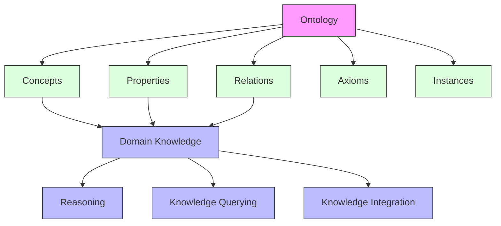

### Benefits of Ontology Modeling

- **Knowledge Organization**: Structured representation of domain knowledge
- **Semantic Interoperability**: Common understanding across systems
- **Reasoning Support**: Logical inference over knowledge
- **Knowledge Discovery**: Identification of implicit relationships
- **Integration**: Common framework for disparate data sources

## Ontology Components

### Concepts (Classes)

Concepts represent types or categories of entities within the domain.

Examples in geospatial domain:
- SpatialFeature
- GeographicRegion
- Coordinate
- SpatialRelation
- CoordinateReferenceSystem

### Properties (Attributes)

Properties describe characteristics of concepts.

Examples:
- name
- description
- geometry
- area
- length
- elevation

### Relations (Object Properties)

Relations define how concepts are connected to each other.

Examples:
- contains
- intersects
- adjacentTo
- northOf
- derivedFrom

### Hierarchical Structure

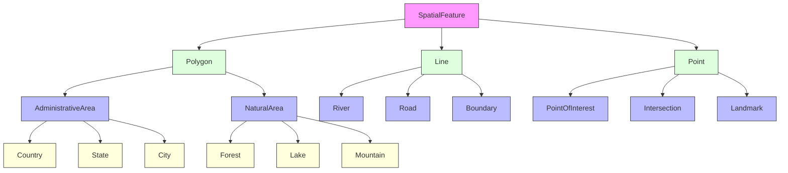

## Modeling Methodologies

### Top-Down Approach

Start with general concepts and progressively refine them into more specific categories.

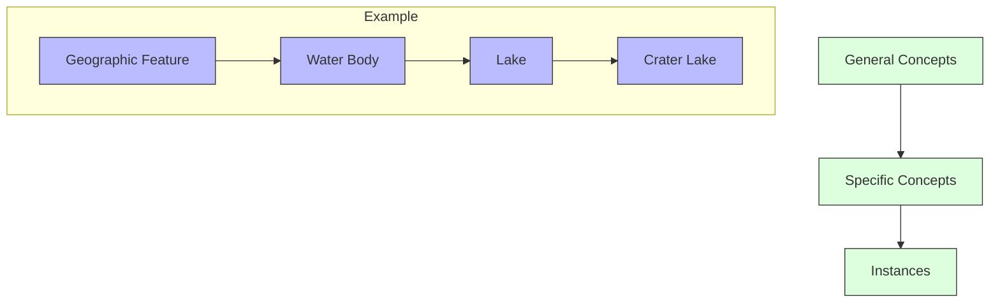

### Bottom-Up Approach

Start with specific instances and group them into progressively more general categories.

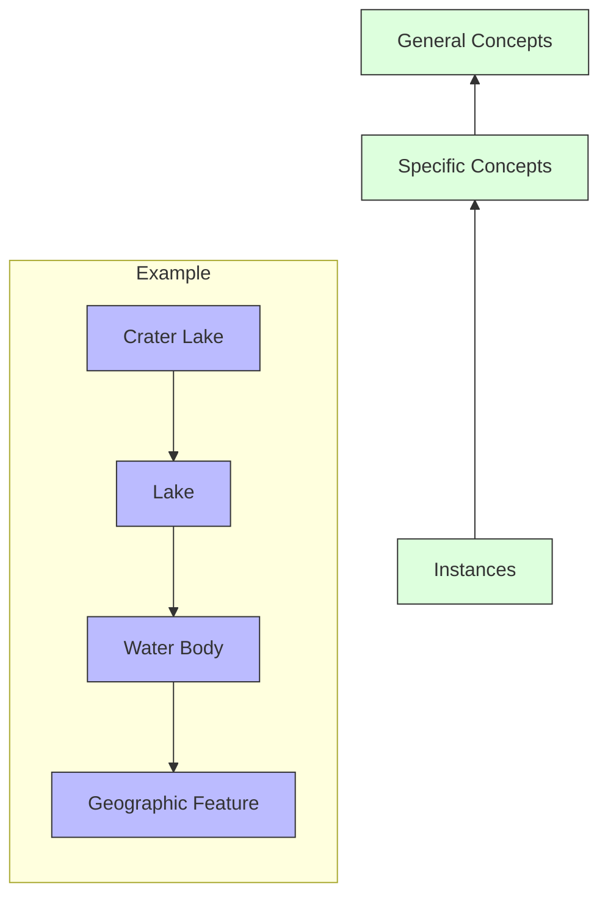

### Middle-Out Approach

Start with the most important concepts and work outward in both directions.

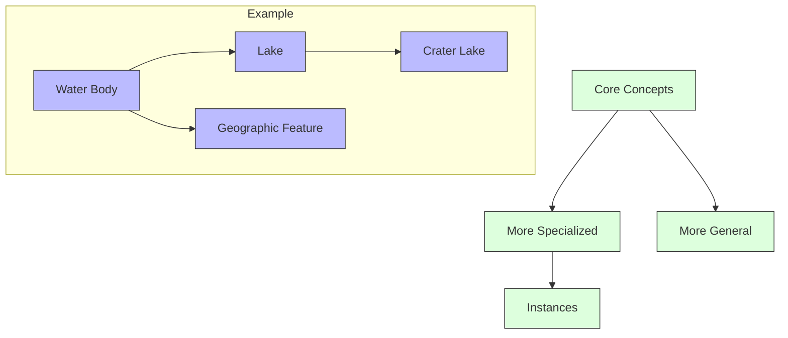

## Geospatial Ontology Patterns

### Spatial Relation Pattern

Represents relationships between spatial entities.

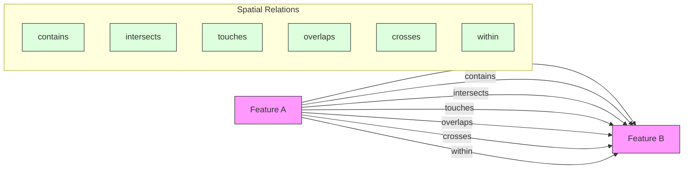

### Feature-Geometry Pattern

Links spatial features with their geometric representations.

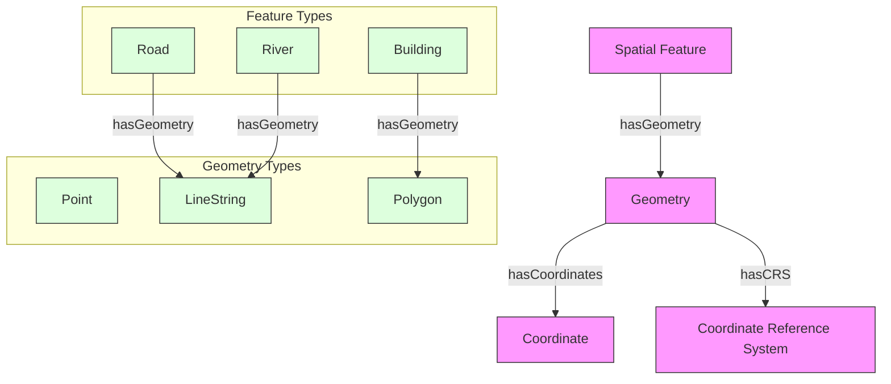

### Scale-Dependent Representation Pattern

Represents how features change at different scales of analysis.

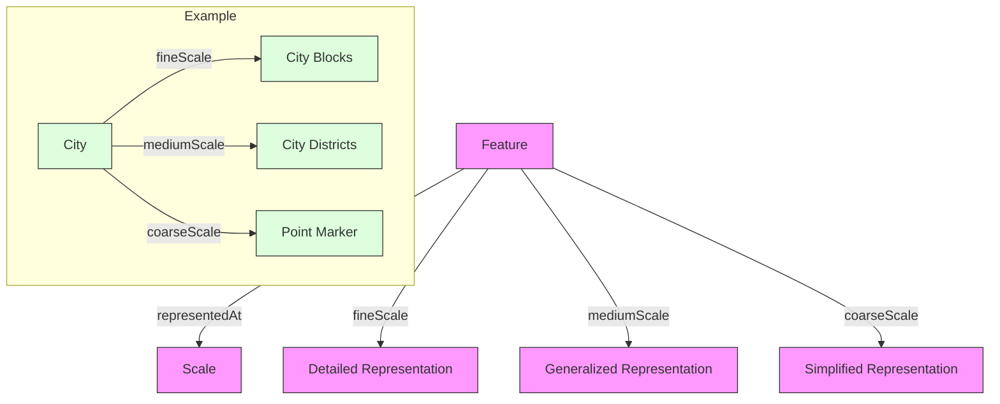

## Ontology Implementation

### Ontology Languages

GEO-INFER-INTRA supports multiple ontology representation languages:

- **OWL (Web Ontology Language)**: For complex ontologies with rich semantics
- **RDF/RDFS**: For lightweight semantic modeling
- **JSON-LD**: For web-friendly linked data

### Implementation Process

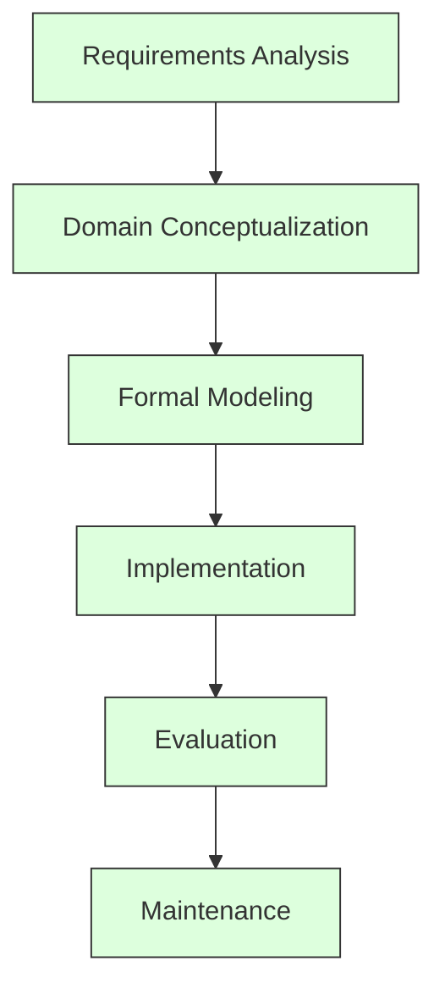

### Example: Simple Geospatial Ontology in OWL

```xml
<owl:Ontology rdf:about="http://geo-infer.org/ontology/geospatial">
    
    <!-- Classes -->
    <owl:Class rdf:about="#SpatialFeature"/>
    
    <owl:Class rdf:about="#Point">
        <rdfs:subClassOf rdf:resource="#SpatialFeature"/>
    </owl:Class>
    
    <owl:Class rdf:about="#LineString">
        <rdfs:subClassOf rdf:resource="#SpatialFeature"/>
    </owl:Class>
    
    <owl:Class rdf:about="#Polygon">
        <rdfs:subClassOf rdf:resource="#SpatialFeature"/>
    </owl:Class>
    
    <owl:Class rdf:about="#City">
        <rdfs:subClassOf rdf:resource="#SpatialFeature"/>
    </owl:Class>
    
    <!-- Properties -->
    <owl:ObjectProperty rdf:about="#hasGeometry">
        <rdfs:domain rdf:resource="#SpatialFeature"/>
        <rdfs:range rdf:resource="#Geometry"/>
    </owl:ObjectProperty>
    
    <owl:ObjectProperty rdf:about="#contains">
        <rdfs:domain rdf:resource="#SpatialFeature"/>
        <rdfs:range rdf:resource="#SpatialFeature"/>
        <rdf:type rdf:resource="&owl;TransitiveProperty"/>
    </owl:ObjectProperty>
    
    <owl:DatatypeProperty rdf:about="#name">
        <rdfs:domain rdf:resource="#SpatialFeature"/>
        <rdfs:range rdf:resource="&xsd;string"/>
    </owl:DatatypeProperty>
    
    <owl:DatatypeProperty rdf:about="#area">
        <rdfs:domain rdf:resource="#Polygon"/>
        <rdfs:range rdf:resource="&xsd;double"/>
    </owl:DatatypeProperty>
</owl:Ontology>
```

### Example: JSON-LD Representation

```json
{
  "@context": {
    "geo": "http://geo-infer.org/ontology/geospatial#",
    "rdfs": "http://www.w3.org/2000/01/rdf-schema#",
    "xsd": "http://www.w3.org/2001/XMLSchema#"
  },
  "@graph": [
    {
      "@id": "geo:SpatialFeature",
      "@type": "rdfs:Class"
    },
    {
      "@id": "geo:Point",
      "@type": "rdfs:Class",
      "rdfs:subClassOf": {"@id": "geo:SpatialFeature"}
    },
    {
      "@id": "geo:LineString",
      "@type": "rdfs:Class",
      "rdfs:subClassOf": {"@id": "geo:SpatialFeature"}
    },
    {
      "@id": "geo:Polygon",
      "@type": "rdfs:Class",
      "rdfs:subClassOf": {"@id": "geo:SpatialFeature"}
    },
    {
      "@id": "geo:hasGeometry",
      "@type": "rdf:Property",
      "rdfs:domain": {"@id": "geo:SpatialFeature"},
      "rdfs:range": {"@id": "geo:Geometry"}
    }
  ]
}
```

## Integration with Knowledge Base

GEO-INFER-INTRA integrates ontologies with the knowledge base to enhance search, navigation, and inference capabilities.

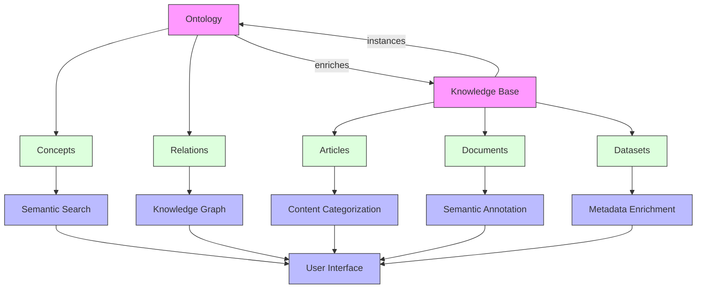

### Integration Example

```python
from geo_infer.ontology import OntologyManager
from geo_infer.knowledge_base import KnowledgeBase

# Load ontology
ontology_manager = OntologyManager()
geo_ontology = ontology_manager.load_ontology("geospatial")

# Get knowledge base
kb = KnowledgeBase()

# Query knowledge base using ontology concepts
city_concept = geo_ontology.get_concept("City")
related_concepts = geo_ontology.get_related_concepts(city_concept)

# Find articles related to cities and related concepts
city_articles = kb.search_by_concept(city_concept)
related_articles = kb.search_by_concepts(related_concepts)

# Annotate an article with ontology concepts
article = kb.get_article("urban-planning-101")
annotations = geo_ontology.annotate_text(article.content)
kb.update_article_annotations(article.id, annotations)

# Generate a knowledge graph visualization
graph = kb.generate_knowledge_graph(city_concept, depth=2)
graph.visualize("city_knowledge_graph.html")
```

## Validation and Testing

### Ontology Validation

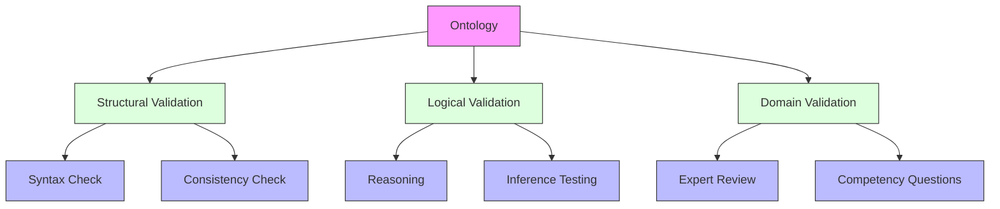

### Competency Questions

Competency questions are queries that the ontology should be able to answer. Examples:

1. What spatial features are contained within a specific region?
2. Which rivers flow through a particular city?
3. What are all the features that border a given country?
4. Which areas are at risk of flooding based on elevation and proximity to water bodies?
5. What is the most appropriate coordinate reference system for a specific analysis in a given region?

### Testing with SPARQL Queries

```sparql
# Find all cities within a specific state
PREFIX geo: <http://geo-infer.org/ontology/geospatial#>
SELECT ?city
WHERE {
  ?city a geo:City .
  ?state a geo:State .
  ?state geo:name "California" .
  ?state geo:contains ?city .
}

# Find features that intersect with a river
PREFIX geo: <http://geo-infer.org/ontology/geospatial#>
SELECT ?feature ?featureType
WHERE {
  ?river a geo:River .
  ?river geo:name "Mississippi" .
  ?river geo:intersects ?feature .
  ?feature a ?featureType .
}
```

## Use Cases

### Environmental Monitoring

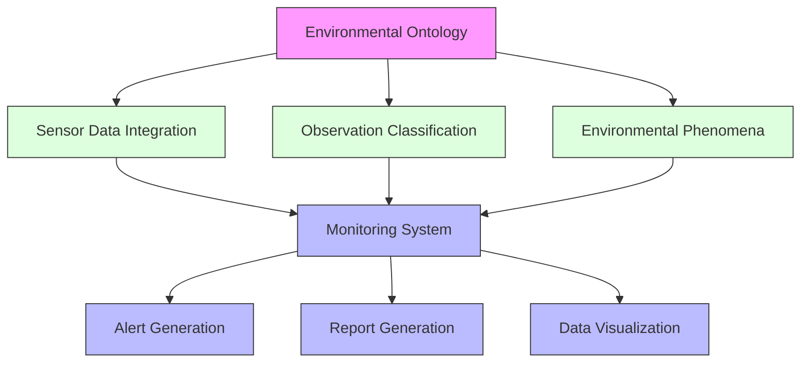

### Urban Planning

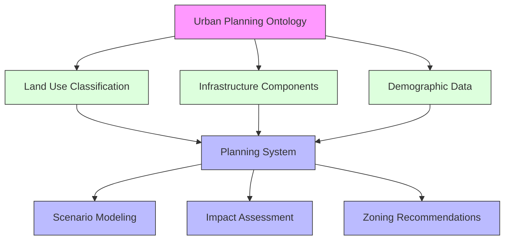

### Disaster Response

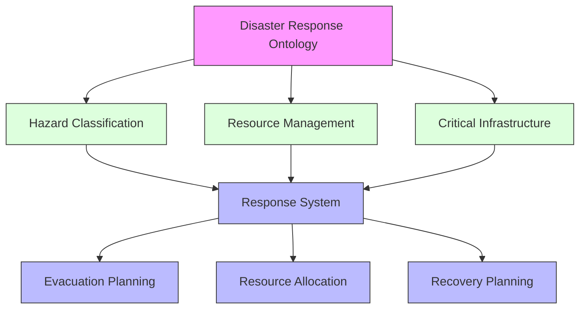

## Best Practices

1. **Reuse Existing Ontologies**: Leverage established ontologies when possible
2. **Keep It Simple**: Start with a minimal viable ontology and expand as needed
3. **Focus on Use Cases**: Design the ontology to address specific requirements
4. **Collaborative Development**: Involve domain experts in the modeling process
5. **Documentation**: Document concepts, relations, and design decisions
6. **Versioning**: Maintain proper versioning for ontology evolution
7. **Testing**: Continuously validate the ontology against competency questions
8. **Modularity**: Create modular ontologies that can be combined as needed
9. **Consistency**: Ensure consistent naming conventions and modeling patterns
10. **Maintenance Plan**: Establish a process for ongoing ontology maintenance

## Related Resources

- [Ontology Management in GEO-INFER-INTRA](index.md)
- [Ontology Integration Guide](integration.md)
- [Ontology Visualization](visualization.md)
- [Advanced Reasoning Techniques](reasoning.md)
- [Ontology Development Toolkit](toolkit.md) 