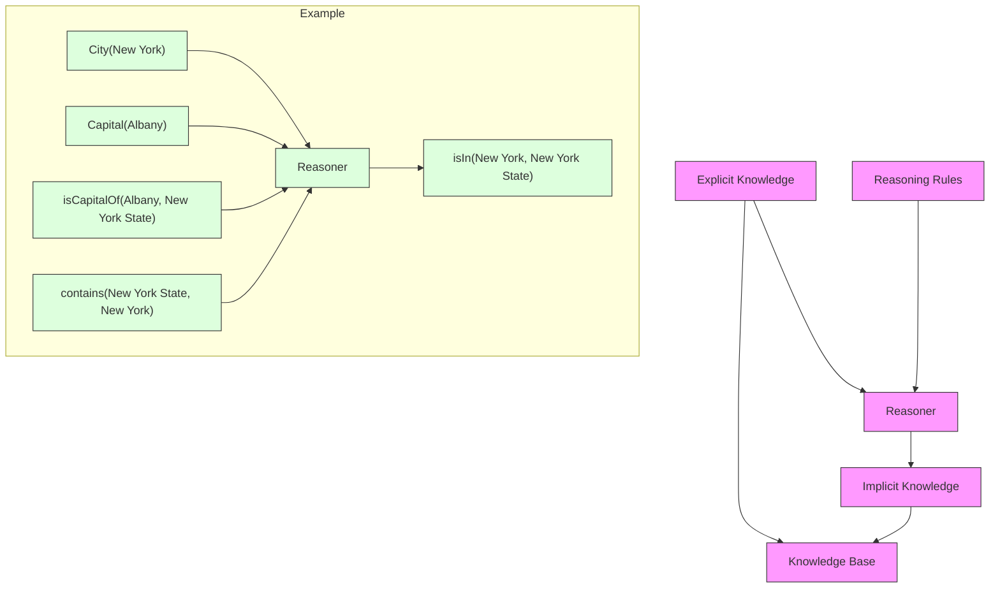
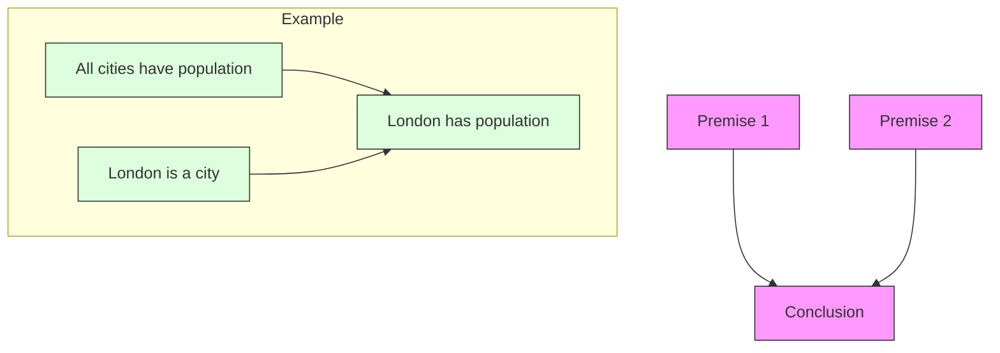
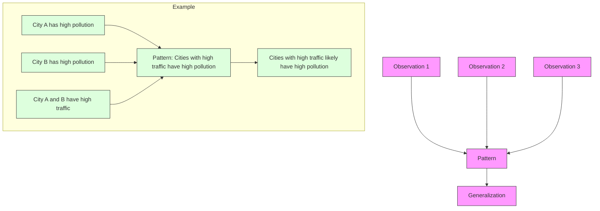
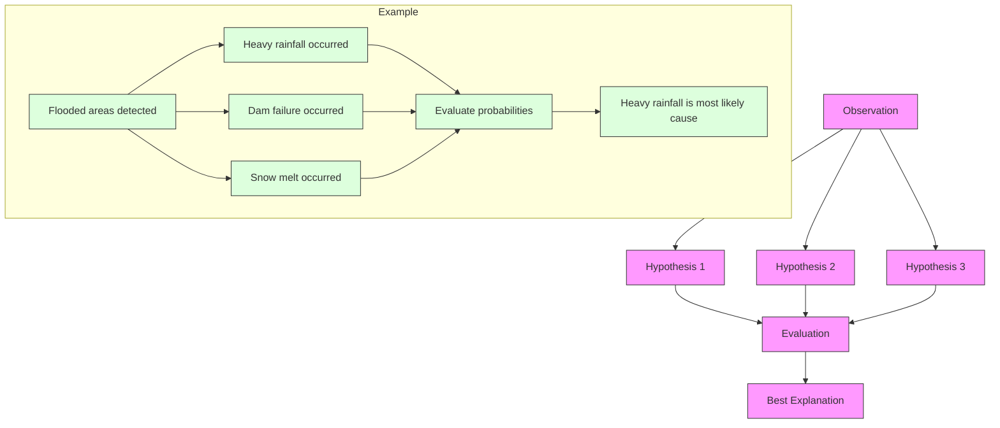
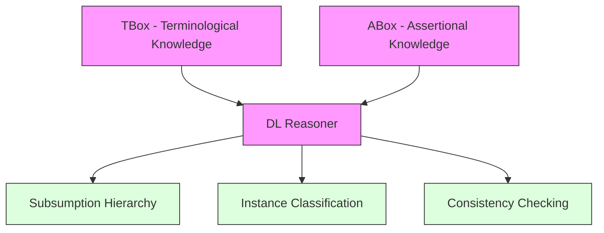
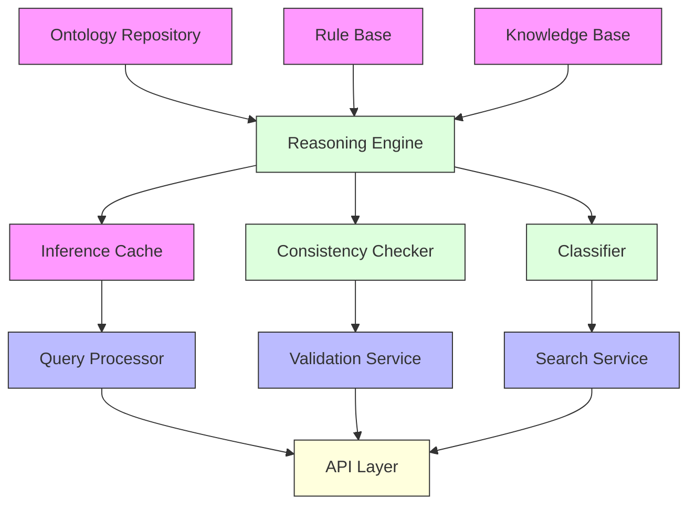
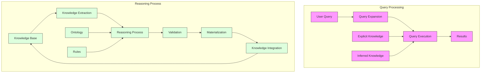
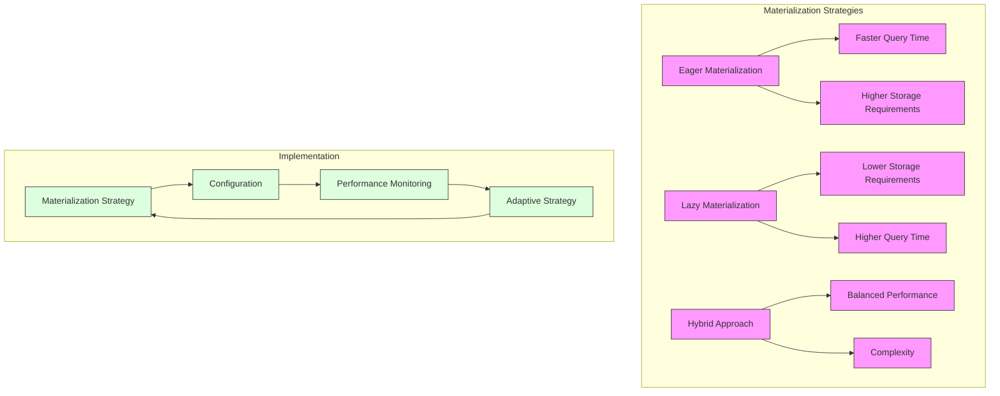
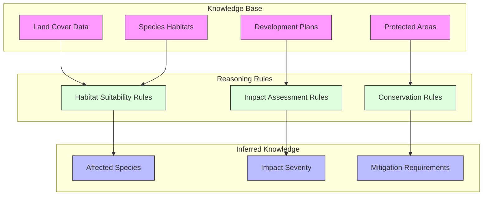
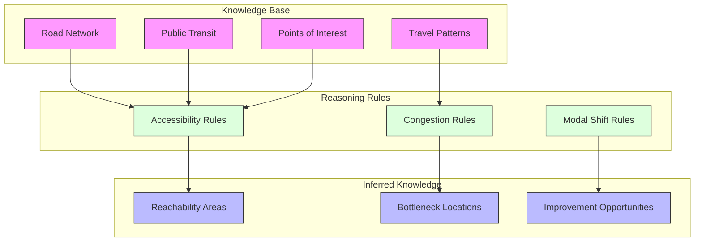

# Ontology Reasoning Guide

This document explores the reasoning capabilities provided by GEO-INFER-INTRA's ontology system, outlining the theoretical foundations, implementation details, and practical applications.

## Contents

- [Introduction to Reasoning](#introduction-to-reasoning)
- [Types of Reasoning](#types-of-reasoning)
- [Reasoning Architecture](#reasoning-architecture)
- [Geospatial Reasoning Rules](#geospatial-reasoning-rules)
- [Integration with Knowledge Base](#integration-with-knowledge-base)
- [Performance Optimization](#performance-optimization)
- [Use Cases](#use-cases)
- [Troubleshooting](#troubleshooting)

## Introduction to Reasoning

Ontology reasoning refers to deriving logical consequences from a set of explicitly asserted facts or axioms. In GEO-INFER-INTRA, reasoning extends the capabilities of the knowledge base by inferring implicit knowledge from explicit statements.



### Benefits of Reasoning

- **Knowledge Enrichment**: Derive new facts from existing knowledge
- **Consistency Checking**: Detect logical inconsistencies in the knowledge base
- **Query Enhancement**: Improve search results by including inferred knowledge
- **Knowledge Validation**: Verify that the knowledge base adheres to domain rules
- **Automated Classification**: Organize entities based on their properties

## Types of Reasoning

### Deductive Reasoning

Drawing logical conclusions from premises known to be true.



### Inductive Reasoning

Deriving general principles from specific observations.



### Abductive Reasoning

Finding the most likely explanation for observations.



### Description Logic Reasoning

Reasoning over structured knowledge using formal description logic.



## Reasoning Architecture

GEO-INFER-INTRA implements a flexible reasoning architecture that supports multiple reasoning strategies.



### Supported Reasoners

GEO-INFER-INTRA supports multiple reasoning engines:

- **OWL Reasoners**: HermiT, Pellet, FaCT++
- **Rule Engines**: Drools, Jena Rules
- **Probabilistic Reasoners**: PSL, MLN
- **Spatial Reasoners**: GeoSPARQL, RCC8

### Reasoning Configuration

```yaml
reasoning:
  # Default reasoner configuration
  default_reasoner: "HermiT"
  
  # Reasoning levels
  reasoning_level: "FULL"  # Options: NONE, RDFS, OWL2_RL, FULL
  
  # Performance settings
  incremental: true
  materialization: "ON_DEMAND"  # Options: EAGER, ON_DEMAND, NEVER
  
  # Cache settings
  cache_inferences: true
  cache_size_mb: 512
  cache_ttl_minutes: 60
  
  # Rule settings
  custom_rules_enabled: true
  custom_rules_path: "config/rules/"
```

## Geospatial Reasoning Rules

### Topological Relations

Rules for inferring topological relationships between spatial features.

```
# RCC8 Composition Table (Partial)
# If region A is inside region B and region B is inside region C,
# then region A is inside region C
RULE: inside(?a, ?b) AND inside(?b, ?c) -> inside(?a, ?c)

# If region A contains region B and region B contains region C,
# then region A contains region C
RULE: contains(?a, ?b) AND contains(?b, ?c) -> contains(?a, ?c)

# If region A overlaps region B and region B is inside region C,
# then region A overlaps region C
RULE: overlaps(?a, ?b) AND inside(?b, ?c) -> overlaps(?a, ?c)
```

### Spatial Hierarchy Rules

Rules for inferring relationships in spatial hierarchies.

```
# Administrative hierarchy
# If city A is in state B and state B is in country C,
# then city A is in country C
RULE: City(?a) AND State(?b) AND Country(?c) AND isIn(?a, ?b) AND isIn(?b, ?c) -> isIn(?a, ?c)

# Water body hierarchy
# If stream A flows into river B and river B flows into water body C,
# then stream A is part of water system C
RULE: Stream(?a) AND River(?b) AND WaterBody(?c) AND flowsInto(?a, ?b) AND flowsInto(?b, ?c) -> partOf(?a, ?c)
```

### Proximity Rules

Rules for inferring spatial proximity relationships.

```
# Proximity-based risk inference
# If location A is within 10km of an active volcano B,
# then location A has volcanic risk
RULE: Location(?a) AND Volcano(?b) AND isActive(?b, true) AND distance(?a, ?b, ?d) AND lessThan(?d, 10) -> hasRisk(?a, "volcanic")

# Service area inference
# If a service point A has radius B and location C is within distance B of A,
# then location C is served by service point A
RULE: ServicePoint(?a) AND hasRadius(?a, ?r) AND Location(?c) AND distance(?a, ?c, ?d) AND lessThan(?d, ?r) -> servedBy(?c, ?a)
```

## Integration with Knowledge Base

The reasoner integrates with the knowledge base to enhance search, querying, and knowledge discovery capabilities.



### Example: Query Enhancement with Reasoning

```python
from geo_infer.ontology import OntologyManager
from geo_infer.knowledge_base import KnowledgeBase
from geo_infer.reasoning import ReasoningService

# Initialize components
ontology = OntologyManager().get_ontology("geospatial")
kb = KnowledgeBase()
reasoner = ReasoningService(ontology)

# Enable reasoning
reasoner.set_reasoning_level("FULL")
kb.set_reasoner(reasoner)

# Original query: Find all water bodies in California
original_query = "water bodies in California"
original_results = kb.search(original_query)
print(f"Original results count: {len(original_results)}")

# Enhanced query using reasoning
# This will also find instances of subclasses of WaterBody
# and water bodies in regions that are part of California
enhanced_query = reasoner.enhance_query(original_query)
enhanced_results = kb.search(enhanced_query)
print(f"Enhanced results count: {len(enhanced_results)}")

# Show inferred knowledge
for result in enhanced_results:
    if result not in original_results:
        print(f"Inferred result: {result}")
        print(f"Inference path: {reasoner.explain_inference(result)}")
```

## Performance Optimization

### Materialization Strategies



### Incremental Reasoning

Updating inference results based on changes to the knowledge base, rather than re-computing all inferences.

```python
from geo_infer.reasoning import IncrementalReasoner

# Initialize the incremental reasoner
reasoner = IncrementalReasoner(ontology)

# Process initial knowledge base
reasoner.materialize(kb)

# When knowledge base changes
def on_kb_update(changes):
    # changes contains added and removed statements
    reasoner.update(changes)
    
    # Get affected inferences
    affected = reasoner.get_affected_inferences(changes)
    
    # Update cache or indexes as needed
    update_cache(affected)
```

### Reasoning Optimization Techniques

- **Selective Materialization**: Only materialize frequently accessed inference paths
- **Parallel Reasoning**: Distribute reasoning tasks across multiple threads or nodes
- **Query-Driven Reasoning**: Perform reasoning only for relevant portions of the ontology
- **Approximation**: Use approximate reasoning for large-scale datasets
- **Indexing**: Create specialized indexes for common reasoning patterns

## Use Cases

### Environmental Impact Assessment



#### Example Rules

```
# Habitat impact rule
RULE: Development(?d) AND hasLocation(?d, ?loc) AND SpeciesHabitat(?h) AND 
      hasLocation(?h, ?hloc) AND intersects(?loc, ?hloc) AND 
      hasSpecies(?h, ?s) AND isProtected(?s, true) -> 
      impactsSpecies(?d, ?s)

# Impact severity rule
RULE: Development(?d) AND impactsSpecies(?d, ?s) AND 
      hasCriticalityStatus(?s, "endangered") ->
      hasImpactSeverity(?d, "high")

# Mitigation requirement rule
RULE: Development(?d) AND hasImpactSeverity(?d, "high") ->
      requiresMitigation(?d, "comprehensive")
```

### Urban Mobility Analysis



## Troubleshooting

### Common Issues and Solutions

| Issue | Possible Causes | Solutions |
|-------|----------------|-----------|
| Slow reasoning performance | Large ontology size, Complex rules, Inefficient materialization | Use incremental reasoning, Optimize rules, Adjust materialization strategy |
| Inconsistent ontology | Contradictory assertions, Incompatible rules | Run consistency checker, Review rule interactions, Add disjointness axioms |
| Memory issues | Excessive materialization, Large datasets | Implement paging, Use selective materialization, Increase memory allocation |
| Unexpected inference results | Rule interactions, Missing constraints | Enable explanation generation, Review rule precedence, Add negative constraints |
| Integration errors | API incompatibilities, Version mismatches | Check version compatibility, Review API documentation, Use adapters |

### Debugging Tools

GEO-INFER-INTRA provides several tools for debugging reasoning issues:

- **Explanation Generator**: Traces the inference path for derived knowledge
- **Rule Profiler**: Identifies rules that consume the most resources
- **Consistency Checker**: Detects logical contradictions in the knowledge base
- **Performance Monitor**: Tracks reasoning time and resource usage
- **Visualization Tools**: Graphically represents inference paths and rule interactions

```python
from geo_infer.reasoning import Debugger

# Initialize debugger
debugger = Debugger(reasoner)

# Explain an inference
explanation = debugger.explain_inference(inferred_statement)
debugger.visualize_explanation(explanation, "explanation.html")

# Profile rule performance
profile = debugger.profile_rules(kb)
print("Top 5 most expensive rules:")
for rule, stats in profile.get_top_rules(5):
    print(f"Rule: {rule}")
    print(f"Execution time: {stats.execution_time}ms")
    print(f"Inferences generated: {stats.inference_count}")

# Check consistency
consistency_result = debugger.check_consistency(kb)
if not consistency_result.is_consistent:
    print("Inconsistencies detected:")
    for conflict in consistency_result.conflicts:
        print(f"Conflict: {conflict}")
        print(f"Involved axioms: {conflict.get_axioms()}")
```

## Related Resources

- [Ontology Modeling Guide](ontology_modeling.md)
- [Knowledge Base Integration](../knowledge_base/integration.md)
- [Query Language Reference](../api/query_language.md)
- [Performance Tuning Guide](../deployment/performance_tuning.md)
- [Custom Rules Development](custom_rules.md) 