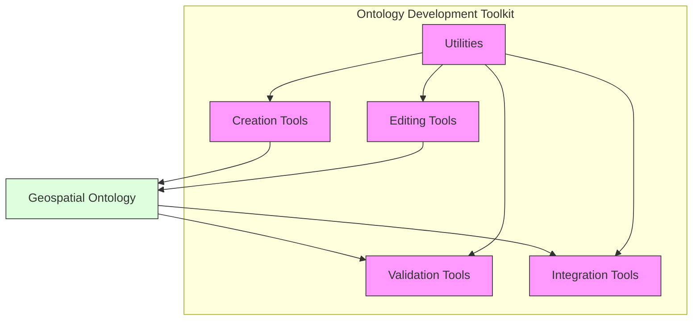
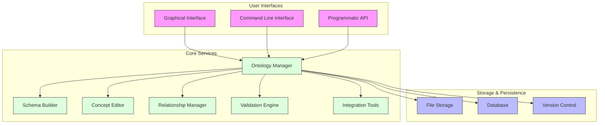

# Ontology Development Toolkit

This document provides a comprehensive guide to the ontology development toolkit available in GEO-INFER-INTRA, detailing tools, utilities, and best practices for creating and maintaining geospatial ontologies.

## Contents

- [Introduction](#introduction)
- [Toolkit Components](#toolkit-components)
- [Ontology Creation](#ontology-creation)
- [Ontology Editing](#ontology-editing)
- [Validation and Testing](#validation-and-testing)
- [Ontology Integration](#ontology-integration)
- [Command Line Interface](#command-line-interface)
- [Programmatic API](#programmatic-api)
- [Best Practices](#best-practices)
- [Troubleshooting](#troubleshooting)

## Introduction

The GEO-INFER-INTRA Ontology Development Toolkit provides a comprehensive set of tools for creating, editing, validating, and managing geospatial ontologies. The toolkit supports various ontology formats and offers both graphical and programmatic interfaces to accommodate different development workflows.



## Toolkit Components

The toolkit consists of several integrated components designed to support the ontology development lifecycle.

### Core Components

- **Ontology Manager**: Central component for loading, saving, and managing ontologies
- **Schema Builder**: Tools for defining ontology schemas and structures
- **Concept Editor**: Interface for creating and editing ontology concepts
- **Relationship Manager**: Tools for defining and managing relationships between concepts
- **Validation Engine**: Validation and verification of ontology consistency
- **Integration Tools**: Utilities for integrating with external systems and data sources

### Architecture



## Ontology Creation

Tools and workflows for creating new ontologies from scratch or based on existing templates.

### Ontology Templates

The toolkit provides several templates for common geospatial ontology patterns:

- **Basic Geospatial**: Core concepts for representing geospatial features
- **Administrative Regions**: Template for administrative boundaries and regions
- **Natural Features**: Template focused on physical geography features
- **Urban Systems**: Template for urban and built environment concepts
- **Environmental Monitoring**: Template for environmental observation and monitoring

### Template Usage

```python
from geo_infer.ontology import OntologyManager, Template

# Initialize ontology manager
manager = OntologyManager()

# List available templates
templates = manager.list_templates()
for template in templates:
    print(f"Template: {template.name}")
    print(f"Description: {template.description}")
    print(f"Concepts: {len(template.concepts)}")
    print("---")

# Create ontology from template
template = manager.get_template("basic-geospatial")
ontology = template.create_ontology(
    name="My Geospatial Ontology",
    namespace="http://example.org/geo-ontology#",
    version="1.0.0"
)

# Save the new ontology
ontology.save("my-geospatial-ontology.owl")
```

### Creating Ontology from Scratch

```python
from geo_infer.ontology import OntologyManager, Ontology, Concept, Relationship

# Initialize manager
manager = OntologyManager()

# Create a new ontology
ontology = Ontology(
    name="Urban Infrastructure Ontology",
    namespace="http://example.org/urban-infrastructure#",
    version="1.0.0"
)

# Add top-level concepts
infrastructure = Concept(
    id="Infrastructure",
    label="Infrastructure",
    description="Physical and organizational structures needed for operation of society or enterprise"
)

transportation = Concept(
    id="TransportationInfrastructure",
    label="Transportation Infrastructure",
    description="Infrastructure that supports movement of people and goods"
)

utility = Concept(
    id="UtilityInfrastructure",
    label="Utility Infrastructure",
    description="Infrastructure that provides utility services"
)

# Add concept hierarchy
ontology.add_concept(infrastructure)
ontology.add_concept(transportation)
ontology.add_concept(utility)

# Add subclass relationships
ontology.add_relationship(
    Relationship(
        source=transportation.id,
        target=infrastructure.id,
        type="subClassOf"
    )
)

ontology.add_relationship(
    Relationship(
        source=utility.id,
        target=infrastructure.id,
        type="subClassOf"
    )
)

# Add more specific concepts
road = Concept(
    id="Road",
    label="Road",
    description="Linear path for vehicular transportation"
)

power_line = Concept(
    id="PowerLine",
    label="Power Line",
    description="Infrastructure for electricity transmission"
)

ontology.add_concept(road)
ontology.add_concept(power_line)

# Add relationships
ontology.add_relationship(
    Relationship(
        source=road.id,
        target=transportation.id,
        type="subClassOf"
    )
)

ontology.add_relationship(
    Relationship(
        source=power_line.id,
        target=utility.id,
        type="subClassOf"
    )
)

# Save the ontology
ontology.save("urban-infrastructure.owl")
```

### Import from Existing Sources

```python
from geo_infer.ontology import OntologyManager, ImportOptions

# Initialize manager
manager = OntologyManager()

# Import from a file
ontology = manager.import_ontology(
    source="existing-ontology.owl",
    format="owl"
)

# Import from a URL
geonames_ontology = manager.import_ontology(
    source="http://www.geonames.org/ontology/ontology_v3.2.rdf",
    format="rdf"
)

# Import with custom options
options = ImportOptions(
    resolve_imports=True,
    validate=True,
    merge_strategy="keep_existing"
)

merged_ontology = manager.import_ontology(
    source="supplementary-concepts.owl",
    format="owl",
    target_ontology=ontology,
    options=options
)

# Save the imported ontology
merged_ontology.save("enhanced-ontology.owl")
```

## Ontology Editing

Tools and workflows for modifying and extending existing ontologies.

### Concept Editor

```python
from geo_infer.ontology import OntologyManager

# Load existing ontology
manager = OntologyManager()
ontology = manager.load_ontology("urban-infrastructure.owl")

# Get a concept
road = ontology.get_concept("Road")

# Edit concept properties
road.label = "Road Infrastructure"
road.description = "Linear path and associated structures for vehicular transportation"

# Add attributes to concept
road.add_attribute(
    name="numberOfLanes",
    datatype="xsd:integer",
    description="Number of lanes in the road"
)

road.add_attribute(
    name="surfaceType",
    datatype="xsd:string",
    description="Type of road surface material"
)

# Create a new concept
highway = ontology.create_concept(
    id="Highway",
    label="Highway",
    description="Major road connecting cities or regions"
)

# Add subclass relationship
ontology.add_subclass_relationship(
    subclass=highway.id,
    superclass=road.id
)

# Save the updated ontology
ontology.save("urban-infrastructure-updated.owl")
```

### Relationship Editor

```python
from geo_infer.ontology import OntologyManager, Relationship

# Load ontology
manager = OntologyManager()
ontology = manager.load_ontology("urban-infrastructure.owl")

# Create a new relationship type
ontology.add_relationship_type(
    id="connects",
    label="connects",
    description="Indicates a connection between two infrastructure elements",
    domain="Infrastructure",
    range="Infrastructure",
    is_symmetric=True
)

# Add relationships between concepts
road1 = ontology.get_concept("Highway")
road2 = ontology.get_concept("Road")
city1 = ontology.get_concept("City")
city2 = ontology.get_concept("City")

# Add relationship instances
ontology.add_relationship_instance(
    source=road1.id,
    target=road2.id,
    relationship_type="connects"
)

ontology.add_relationship_instance(
    source=road1.id,
    target=city1.id,
    relationship_type="connects"
)

ontology.add_relationship_instance(
    source=road1.id,
    target=city2.id,
    relationship_type="connects"
)

# Check relationships
connections = ontology.get_relationships_by_type("connects")
for connection in connections:
    source = ontology.get_concept(connection.source)
    target = ontology.get_concept(connection.target)
    print(f"{source.label} connects {target.label}")

# Save the updated ontology
ontology.save("urban-infrastructure-with-connections.owl")
```

### Batch Editing

```python
from geo_infer.ontology import OntologyManager, BatchEditor

# Load ontology
manager = OntologyManager()
ontology = manager.load_ontology("urban-infrastructure.owl")

# Create a batch editor
editor = BatchEditor(ontology)

# Define batch operations
editor.add_operation(
    operation_type="add_concepts",
    concepts=[
        {"id": "LocalRoad", "label": "Local Road", "parent": "Road"},
        {"id": "CollectorRoad", "label": "Collector Road", "parent": "Road"},
        {"id": "ArterialRoad", "label": "Arterial Road", "parent": "Road"}
    ]
)

editor.add_operation(
    operation_type="add_attributes",
    concept="Road",
    attributes=[
        {"name": "width", "datatype": "xsd:float", "unit": "meter"},
        {"name": "speedLimit", "datatype": "xsd:float", "unit": "km/h"},
        {"name": "constructionYear", "datatype": "xsd:integer"}
    ]
)

editor.add_operation(
    operation_type="add_relationships",
    relationships=[
        {"source": "LocalRoad", "target": "CollectorRoad", "type": "connectsTo"},
        {"source": "CollectorRoad", "target": "ArterialRoad", "type": "connectsTo"},
        {"source": "ArterialRoad", "target": "Highway", "type": "connectsTo"}
    ]
)

# Execute all operations
editor.execute()

# Verify changes
for concept_id in ["LocalRoad", "CollectorRoad", "ArterialRoad"]:
    concept = ontology.get_concept(concept_id)
    print(f"Added concept: {concept.label}")

road = ontology.get_concept("Road")
for attr in road.attributes:
    print(f"Road attribute: {attr.name} ({attr.datatype})")

# Save the updated ontology
ontology.save("urban-infrastructure-batch-edited.owl")
```

## Validation and Testing

Tools for validating ontology structure, consistency, and quality.

### Structure Validation

```python
from geo_infer.ontology import OntologyManager, Validator

# Load ontology
manager = OntologyManager()
ontology = manager.load_ontology("urban-infrastructure.owl")

# Create validator
validator = Validator(ontology)

# Run structural validation
validation_result = validator.validate_structure()

# Check results
if validation_result.is_valid:
    print("Ontology structure is valid")
else:
    print("Ontology structure has issues:")
    for issue in validation_result.issues:
        print(f"- {issue.severity}: {issue.message} ({issue.location})")

# Validate specific aspects
validator.validate_concept_hierarchy()
validator.validate_relationship_types()
validator.validate_property_domains()
validator.validate_datatype_ranges()
```

### Logical Consistency

```python
from geo_infer.ontology import OntologyManager, Validator

# Load ontology
manager = OntologyManager()
ontology = manager.load_ontology("urban-infrastructure.owl")

# Create validator
validator = Validator(ontology)

# Check logical consistency
consistency_result = validator.check_consistency()

if consistency_result.is_consistent:
    print("Ontology is logically consistent")
else:
    print("Logical inconsistencies found:")
    for inconsistency in consistency_result.inconsistencies:
        print(f"- {inconsistency.description}")
        print(f"  Affected elements: {', '.join(inconsistency.affected_elements)}")
        print(f"  Suggestion: {inconsistency.suggestion}")
```

### Quality Metrics

```python
from geo_infer.ontology import OntologyManager, QualityAnalyzer

# Load ontology
manager = OntologyManager()
ontology = manager.load_ontology("urban-infrastructure.owl")

# Create quality analyzer
analyzer = QualityAnalyzer(ontology)

# Calculate basic metrics
metrics = analyzer.calculate_metrics()

print(f"Ontology: {ontology.name}")
print(f"Concepts: {metrics.concept_count}")
print(f"Relationships: {metrics.relationship_count}")
print(f"Properties: {metrics.property_count}")
print(f"Hierarchy depth: {metrics.max_hierarchy_depth}")
print(f"Complexity score: {metrics.complexity_score}")

# Generate detailed report
report = analyzer.generate_quality_report()
report.save_html("ontology-quality-report.html")
```

### Competency Questions

```python
from geo_infer.ontology import OntologyManager, CompetencyValidator

# Load ontology
manager = OntologyManager()
ontology = manager.load_ontology("urban-infrastructure.owl")

# Define competency questions
questions = [
    {
        "question": "What types of roads connect to highways?",
        "sparql": """
            SELECT ?roadType WHERE {
                ?roadType rdfs:subClassOf :Road .
                ?roadType :connectsTo :Highway .
            }
        """
    },
    {
        "question": "Which infrastructure elements are older than 50 years?",
        "sparql": """
            SELECT ?element WHERE {
                ?element rdf:type :Infrastructure .
                ?element :constructionYear ?year .
                FILTER(?year < 1973)
            }
        """
    }
]

# Create competency validator
validator = CompetencyValidator(ontology)

# Validate competency questions
for question in questions:
    result = validator.validate_question(
        question["question"],
        question["sparql"]
    )
    
    print(f"Question: {question['question']}")
    print(f"Can be answered: {result.can_be_answered}")
    if not result.can_be_answered:
        print(f"Missing elements: {result.missing_elements}")
        print(f"Suggested additions: {result.suggestions}")
    print("---")
```

## Ontology Integration

Tools for integrating ontologies with other systems and data sources.

### Ontology Alignment

```python
from geo_infer.ontology import OntologyManager, OntologyAligner

# Load ontologies
manager = OntologyManager()
source_ontology = manager.load_ontology("urban-infrastructure.owl")
target_ontology = manager.load_ontology("city-planning.owl")

# Create aligner
aligner = OntologyAligner(source_ontology, target_ontology)

# Run automatic alignment
alignments = aligner.align()

print(f"Found {len(alignments)} potential alignments:")
for alignment in alignments:
    print(f"Source: {alignment.source.label}")
    print(f"Target: {alignment.target.label}")
    print(f"Confidence: {alignment.confidence}")
    print(f"Alignment type: {alignment.type}")
    print("---")

# Review and filter alignments
verified_alignments = [a for a in alignments if a.confidence > 0.8]

# Apply verified alignments
merged_ontology = aligner.apply_alignments(verified_alignments)

# Save the merged ontology
merged_ontology.save("merged-urban-planning.owl")
```

### External Data Integration

```python
from geo_infer.ontology import OntologyManager
from geo_infer.integration import DataIntegrator, DataSource

# Load ontology
manager = OntologyManager()
ontology = manager.load_ontology("urban-infrastructure.owl")

# Create data integrator
integrator = DataIntegrator(ontology)

# Define data source
gis_data = DataSource(
    name="GIS Road Network",
    type="shapefile",
    uri="data/city_roads.shp"
)

# Create mapping
mapping = {
    "Road": {
        "source_class": "ROAD",
        "id_attribute": "ROAD_ID",
        "attributes": {
            "name": "ROAD_NAME",
            "numberOfLanes": "NUM_LANES",
            "width": "WIDTH_M",
            "surfaceType": "SURFACE"
        },
        "subclass_mapping": {
            "LocalRoad": {"filter": "ROAD_CLASS = 'local'"},
            "CollectorRoad": {"filter": "ROAD_CLASS = 'collector'"},
            "ArterialRoad": {"filter": "ROAD_CLASS = 'arterial'"},
            "Highway": {"filter": "ROAD_CLASS = 'highway'"}
        }
    }
}

# Perform integration
integration_result = integrator.integrate_data(
    data_source=gis_data,
    mapping=mapping
)

print(f"Integrated {integration_result.instance_count} instances")
print(f"Created {integration_result.relationship_count} relationships")
print(f"Validation issues: {len(integration_result.issues)}")

# Save the integrated ontology with instances
ontology.save("urban-infrastructure-with-instances.owl")
```

## Command Line Interface

The toolkit provides a command-line interface for common ontology management tasks.

### CLI Usage

```
# Get help
$ geo-infer-ontology --help

# Create a new ontology from template
$ geo-infer-ontology create --template basic-geospatial --name "My Geospatial Ontology" --output my-ontology.owl

# Import an ontology
$ geo-infer-ontology import --source external-ontology.owl --output imported-ontology.owl

# Validate an ontology
$ geo-infer-ontology validate --input my-ontology.owl --report validation-report.html

# Compare two ontologies
$ geo-infer-ontology compare --source1 ontology-v1.owl --source2 ontology-v2.owl --report comparison-report.html

# Convert between formats
$ geo-infer-ontology convert --input my-ontology.owl --output my-ontology.ttl --format turtle

# Merge ontologies
$ geo-infer-ontology merge --sources ontology1.owl,ontology2.owl --output merged.owl

# Generate documentation
$ geo-infer-ontology document --input my-ontology.owl --output docs/ --format html
```

### Batch Processing

```bash
#!/bin/bash
# Example batch script for ontology processing

# Process a directory of ontologies
for ontology in ontologies/*.owl; do
  # Validate each ontology
  geo-infer-ontology validate --input "$ontology" --report "reports/$(basename "$ontology" .owl)-validation.html"
  
  # Generate documentation
  geo-infer-ontology document --input "$ontology" --output "docs/$(basename "$ontology" .owl)" --format html
  
  # Convert to Turtle format
  geo-infer-ontology convert --input "$ontology" --output "converted/$(basename "$ontology" .owl).ttl" --format turtle
done

# Merge all validated ontologies
geo-infer-ontology merge --sources ontologies/*.owl --output merged-ontology.owl
```

## Programmatic API

Examples of using the toolkit's API for integration with other systems.

### Basic API Usage

```python
from geo_infer.ontology import OntologyManager

# Initialize the manager
manager = OntologyManager()

# Load an ontology
ontology = manager.load_ontology("geospatial-ontology.owl")

# Get all top-level concepts
top_concepts = ontology.get_top_concepts()

# Process concepts
for concept in top_concepts:
    print(f"Concept: {concept.label}")
    
    # Get direct subconcepts
    children = ontology.get_subconcepts(concept.id, direct=True)
    print(f"  Subconcepts: {len(children)}")
    
    # Get properties
    properties = ontology.get_concept_properties(concept.id)
    print(f"  Properties: {len(properties)}")
    
    # Get relationships
    relationships = ontology.get_concept_relationships(concept.id)
    print(f"  Relationships: {len(relationships)}")
```

### Integration with Web Applications

```python
from flask import Flask, request, jsonify
from geo_infer.ontology import OntologyManager

app = Flask(__name__)
manager = OntologyManager()

# Load ontology at startup
ontology = manager.load_ontology("geospatial-ontology.owl")

@app.route('/concepts', methods=['GET'])
def get_concepts():
    # Get query parameters
    parent = request.args.get('parent', None)
    
    if parent:
        # Get subconcepts of the specified parent
        concepts = ontology.get_subconcepts(parent)
    else:
        # Get top-level concepts
        concepts = ontology.get_top_concepts()
    
    # Convert to JSON-serializable format
    result = [{
        'id': concept.id,
        'label': concept.label,
        'description': concept.description,
        'has_children': ontology.has_subconcepts(concept.id)
    } for concept in concepts]
    
    return jsonify(result)

@app.route('/concept/<concept_id>', methods=['GET'])
def get_concept(concept_id):
    concept = ontology.get_concept(concept_id)
    
    if concept is None:
        return jsonify({'error': 'Concept not found'}), 404
    
    # Get related information
    properties = ontology.get_concept_properties(concept_id)
    relationships = ontology.get_concept_relationships(concept_id)
    
    result = {
        'id': concept.id,
        'label': concept.label,
        'description': concept.description,
        'properties': [{
            'name': prop.name,
            'datatype': prop.datatype,
            'description': prop.description
        } for prop in properties],
        'relationships': [{
            'type': rel.type,
            'target': rel.target,
            'target_label': ontology.get_concept(rel.target).label
        } for rel in relationships]
    }
    
    return jsonify(result)

if __name__ == '__main__':
    app.run(debug=True)
```

## Best Practices

Guidelines for effective ontology development using the toolkit.

1. **Start with Requirements**: Define competency questions and use cases before modeling
2. **Use Templates**: Leverage existing templates and patterns when possible
3. **Consistent Naming**: Adopt consistent naming conventions for concepts and properties
4. **Modular Design**: Create modular ontologies that can be easily combined
5. **Regular Validation**: Validate ontologies frequently during development
6. **Documentation**: Document concepts, relationships, and design decisions
7. **Version Control**: Maintain ontology versions using version control systems
8. **Reuse Existing Ontologies**: Incorporate well-established ontologies rather than creating everything from scratch
9. **Test with Real Data**: Test ontologies with representative real-world data
10. **Collaborative Development**: Involve domain experts in the modeling process

### Naming Conventions

```
# Concept naming
- Use PascalCase for concept names (e.g., RoadNetwork, WaterBody)
- Use singular nouns for concept names

# Property naming
- Use camelCase for property names (e.g., hasName, flowsInto)
- Use verbs or verb phrases for object properties
- Use nouns for data properties

# Relationship naming
- Use descriptive relationship names that clearly express the semantics
- Prefer established relationship patterns when available
```

## Troubleshooting

Common issues and solutions when working with the ontology toolkit.

| Issue | Possible Causes | Solutions |
|-------|----------------|-----------|
| Ontology fails to load | Invalid syntax, Missing imports, Encoding issues | Check syntax with validator, Verify import references, Ensure correct encoding |
| Inconsistent ontology | Contradictory class definitions, Disjoint violations | Use reasoner to identify inconsistencies, Check disjoint assertions |
| Performance issues with large ontologies | Too many axioms, Inefficient reasoning | Use modular design, Implement lazy loading, Use appropriate reasoner |
| Integration errors | Schema mismatches, Identifier conflicts | Use alignment tools, Define proper mapping, Resolve conflicts manually |
| Conversion errors | Unsupported constructs, Format limitations | Check format compatibility, Simplify complex constructs |

### Debugging Techniques

```python
from geo_infer.ontology import OntologyManager, Debugger

# Load ontology
manager = OntologyManager()
ontology = manager.load_ontology("problematic-ontology.owl")

# Create debugger
debugger = Debugger(ontology)

# Enable debug logging
debugger.set_log_level("DEBUG")

# Identify problematic elements
issues = debugger.identify_issues()

# Generate repair suggestions
for issue in issues:
    print(f"Issue: {issue.description}")
    print(f"Affected elements: {issue.elements}")
    print("Repair suggestions:")
    for suggestion in issue.suggestions:
        print(f"- {suggestion}")
    print("---")

# Apply automatic fixes where possible
fixed_ontology = debugger.auto_repair(issues, safety_level="medium")

# Save the fixed ontology
fixed_ontology.save("fixed-ontology.owl")
```

## Related Resources

- [Ontology Modeling Guide](ontology_modeling.md)
- [Reasoning Guide](reasoning.md)
- [Visualization Guide](visualization.md)
- [Custom Rules Development](custom_rules.md)
- [Knowledge Base Integration](../knowledge_base/integration.md) 