# Ontology Visualization Guide

This document provides a comprehensive guide to visualizing ontologies in GEO-INFER-INTRA, covering visualization techniques, tools, and best practices.

## Contents

- [Introduction](#introduction)
- [Visualization Methods](#visualization-methods)
- [Visualization Architecture](#visualization-architecture)
- [Interactive Visualization](#interactive-visualization)
- [Visualization Use Cases](#visualization-use-cases)
- [Implementation Guide](#implementation-guide)
- [Customization](#customization)
- [Integrations](#integrations)
- [Best Practices](#best-practices)
- [Troubleshooting](#troubleshooting)

## Introduction

Ontology visualization is the graphical representation of ontological structures, relationships, and hierarchies. In GEO-INFER-INTRA, visualization plays a crucial role in understanding complex geospatial ontologies, supporting knowledge exploration, and enabling intuitive interaction with the knowledge base.

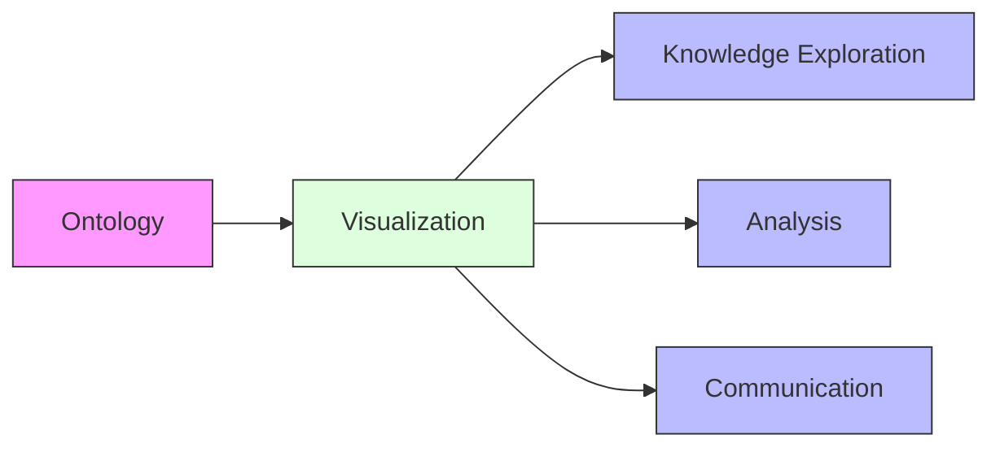

### Benefits of Ontology Visualization

- **Improved Comprehension**: Visual representation enhances understanding of complex ontologies
- **Knowledge Discovery**: Reveals patterns and relationships not easily discernible in textual representations
- **Communication Tool**: Facilitates sharing and explaining ontological concepts to stakeholders
- **Validation Aid**: Helps identify inconsistencies or design issues in the ontology structure
- **Navigation**: Supports intuitive navigation of large knowledge bases

## Visualization Methods

GEO-INFER-INTRA supports multiple visualization methods for different aspects of ontologies.

### Hierarchical Visualization

Represents class hierarchies using tree-like structures.

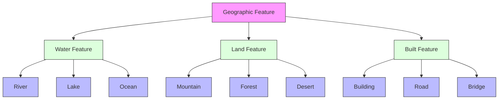

### Network Visualization

Represents relationships between concepts as a network graph.

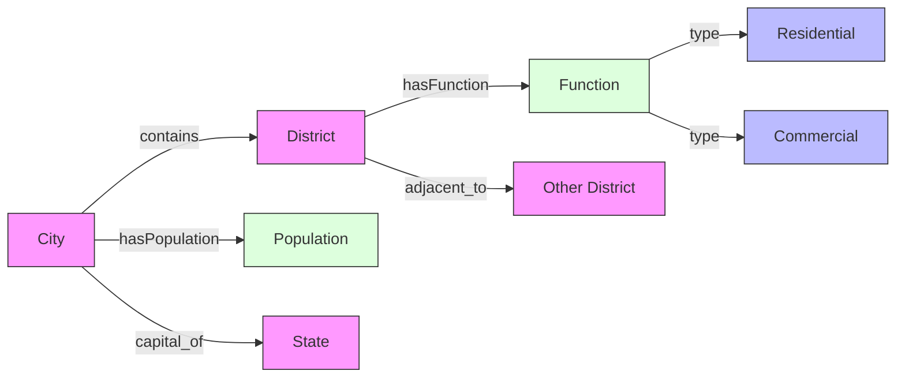

### Radial Visualization

Organizes concepts around a central node, useful for showing immediate relationships.

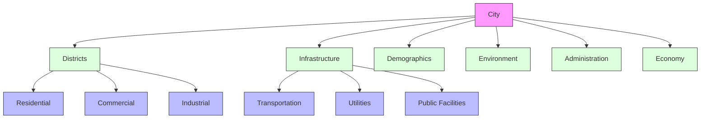

### Map-Based Visualization

Integrates geospatial data with ontology visualization.

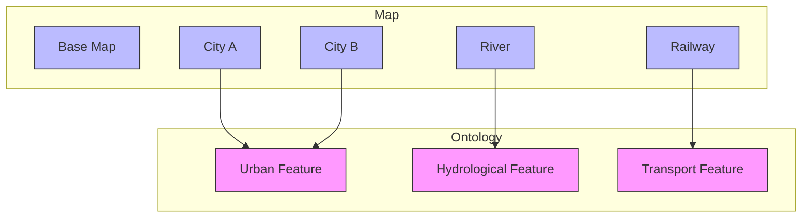

## Visualization Architecture

GEO-INFER-INTRA implements a layered architecture for ontology visualization.

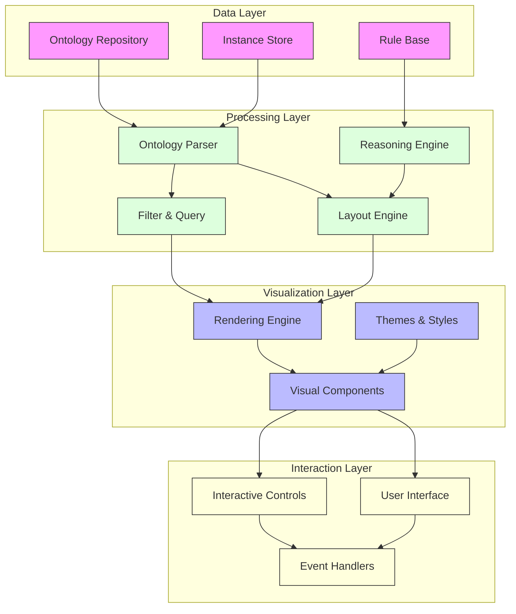

### Key Components

1. **Ontology Parser**: Processes ontology files (OWL, RDF, etc.) into a structured format suitable for visualization
2. **Layout Engine**: Applies various layout algorithms to arrange ontology elements
3. **Renderer**: Converts layout data into visual representations
4. **Interactive Controls**: Provides tools for navigating and manipulating the visualization

## Interactive Visualization

GEO-INFER-INTRA provides rich interactive capabilities for exploring ontologies.

### Navigation Controls

- **Zoom**: Adjust the level of detail
- **Pan**: Move around large ontologies
- **Focus**: Center the view on a specific concept
- **Expand/Collapse**: Show or hide child nodes
- **Search**: Find and highlight specific concepts

### Filtering Options

- **Concept Type**: Filter by class, property, individual
- **Relationship Type**: Show only specific relations
- **Depth Level**: Control the number of levels displayed
- **Importance**: Filter by concept significance or centrality

### Interaction Patterns

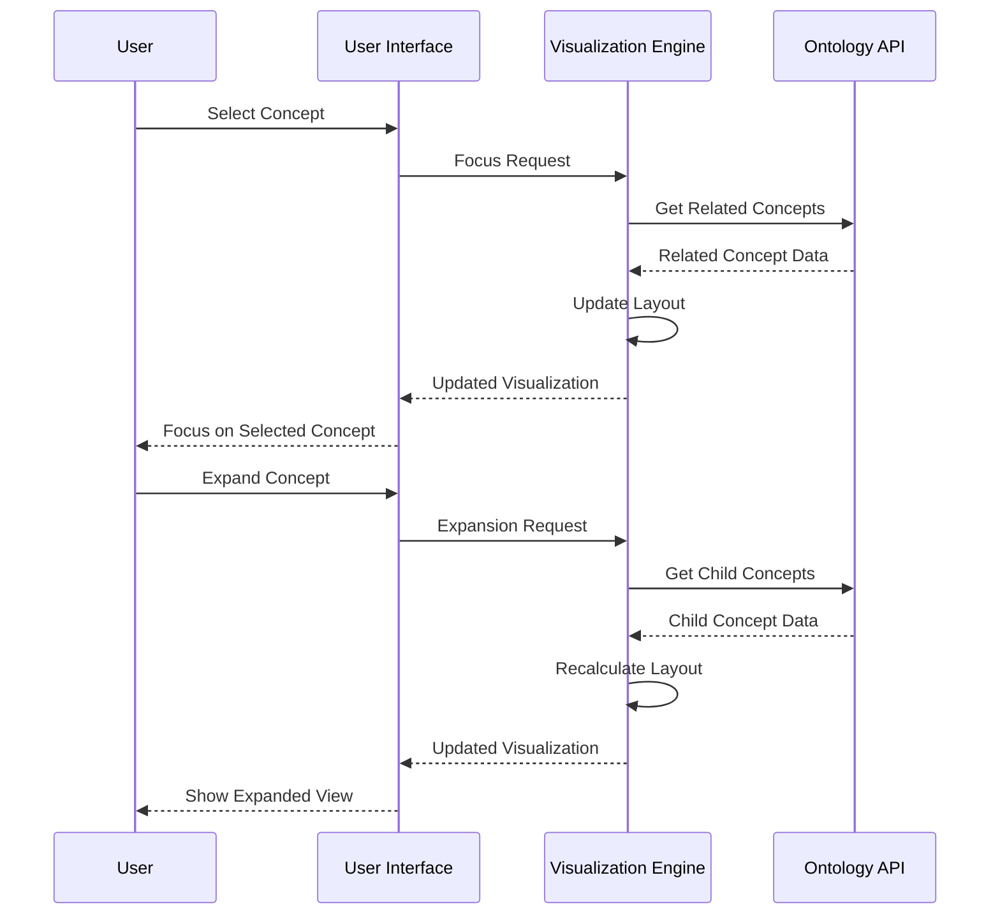

## Visualization Use Cases

### Ontology Exploration

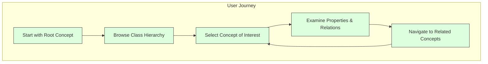

#### Implementation Example

```javascript
// Example: Implementing concept exploration interaction
function onConceptSelect(conceptId) {
  // 1. Fetch the concept details
  const concept = ontologyService.getConcept(conceptId);
  
  // 2. Update the detail panel
  ui.updateDetailPanel({
    name: concept.name,
    description: concept.description,
    properties: concept.properties,
    relations: concept.relations
  });
  
  // 3. Highlight in visualization
  visualizer.highlightConcept(conceptId);
  
  // 4. Fetch and show related concepts
  const related = ontologyService.getRelatedConcepts(conceptId);
  visualizer.showRelated(conceptId, related);
}
```

### Knowledge Base Navigation

Visualizing the relationship between ontology concepts and knowledge base articles.

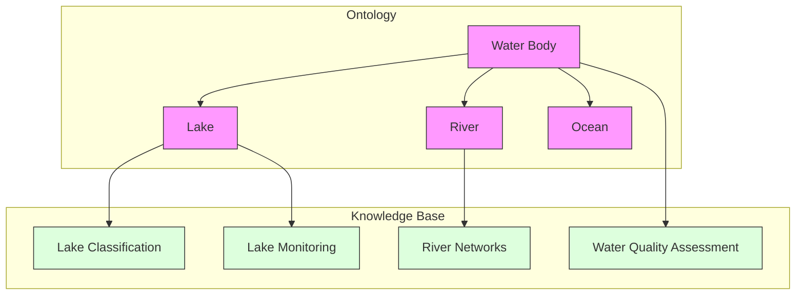

### Ontology Comparison

Visualizing differences between ontology versions or different ontologies.

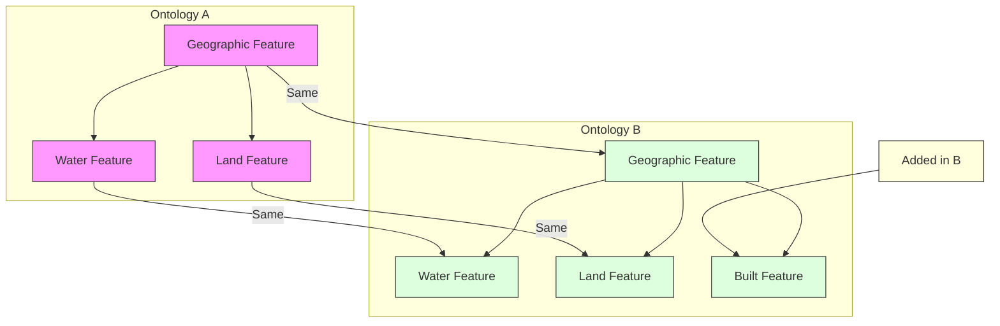

## Implementation Guide

### Setting Up the Visualization Component

```python
from geo_infer.ontology import OntologyManager
from geo_infer.visualization import OntologyVisualizer

# Load an ontology
ontology_manager = OntologyManager()
ontology = ontology_manager.load_ontology("geospatial-core")

# Create visualizer with options
visualizer = OntologyVisualizer(
    layout_type="hierarchical",  # Options: hierarchical, network, radial, circular
    include_properties=True,
    include_instances=False,
    max_depth=3
)

# Generate visualization
visualization = visualizer.visualize(ontology)

# Save as HTML file
visualization.save("geospatial_ontology.html")

# Generate visualization for a specific concept and its relations
concept = ontology.get_concept("City")
concept_vis = visualizer.visualize_concept(concept, relation_depth=2)
concept_vis.save("city_concept.html")
```

### Customizing Visualization Appearance

```python
# Configure visualization styling
visualizer.configure({
    "themes": {
        "default": {
            "classes": {
                "node": {
                    "shape": "rectangle",
                    "fill": "#f0f0f0",
                    "stroke": "#333333",
                    "stroke_width": 1,
                    "font_size": 12
                },
                "edge": {
                    "color": "#666666",
                    "width": 1,
                    "arrow_size": 5,
                    "style": "solid"
                }
            },
            "types": {
                "Class": {
                    "fill": "#bbdefb",
                    "icon": "circle"
                },
                "Property": {
                    "fill": "#c8e6c9",
                    "icon": "square"
                },
                "Individual": {
                    "fill": "#ffecb3",
                    "icon": "diamond"
                }
            },
            "relations": {
                "subClassOf": {
                    "color": "#1976d2",
                    "style": "solid"
                },
                "hasProperty": {
                    "color": "#388e3c",
                    "style": "dashed"
                }
            }
        }
    }
})
```

### Embedding in Web Applications

```html
<!-- Example of embedding the visualization in a web page -->
<!DOCTYPE html>
<html>
<head>
    <title>Ontology Visualization</title>
    <script src="geo-infer-visualization.js"></script>
    <link rel="stylesheet" href="geo-infer-visualization.css">
</head>
<body>
    <div class="container">
        <div class="controls">
            <select id="layout-selector">
                <option value="hierarchical">Hierarchical</option>
                <option value="network">Network</option>
                <option value="radial">Radial</option>
            </select>
            <input type="range" id="zoom" min="0.1" max="2" step="0.1" value="1">
            <button id="reset">Reset View</button>
        </div>
        
        <div id="visualization-container" style="width: 100%; height: 600px;"></div>
        
        <div class="details-panel">
            <h3 id="selected-concept">Select a concept to see details</h3>
            <div id="concept-details"></div>
        </div>
    </div>
    
    <script>
        document.addEventListener('DOMContentLoaded', function() {
            // Initialize visualization
            const visualizer = new GeoInfer.OntologyVisualizer({
                container: 'visualization-container',
                ontologyUrl: '/api/ontology/geospatial',
                layout: 'hierarchical',
                theme: 'default'
            });
            
            // Handle layout changes
            document.getElementById('layout-selector').addEventListener('change', function(e) {
                visualizer.setLayout(e.target.value);
            });
            
            // Handle zoom
            document.getElementById('zoom').addEventListener('input', function(e) {
                visualizer.setZoom(parseFloat(e.target.value));
            });
            
            // Handle reset
            document.getElementById('reset').addEventListener('click', function() {
                visualizer.resetView();
            });
            
            // Handle concept selection
            visualizer.on('conceptSelect', function(concept) {
                document.getElementById('selected-concept').textContent = concept.name;
                document.getElementById('concept-details').innerHTML = `
                    <p><strong>Description:</strong> ${concept.description}</p>
                    <p><strong>Type:</strong> ${concept.type}</p>
                    <h4>Properties:</h4>
                    <ul>
                        ${concept.properties.map(p => `<li>${p.name}: ${p.description}</li>`).join('')}
                    </ul>
                    <h4>Relations:</h4>
                    <ul>
                        ${concept.relations.map(r => `<li>${r.type}: ${r.target}</li>`).join('')}
                    </ul>
                `;
            });
        });
    </script>
</body>
</html>
```

## Customization

### Custom Layouts

GEO-INFER-INTRA supports creating custom layout algorithms for specialized visualization needs.

```python
from geo_infer.visualization import BaseLayoutAlgorithm

class GeospatialContextLayout(BaseLayoutAlgorithm):
    """Layout algorithm that places concepts according to their geospatial context"""
    
    def __init__(self, reference_location=None, spatial_property="hasLocation"):
        self.reference_location = reference_location
        self.spatial_property = spatial_property
    
    def compute_layout(self, ontology, concepts, relations):
        layout = {}
        
        # Get geospatial positions for concepts that have them
        for concept in concepts:
            spatial_value = concept.get_property_value(self.spatial_property)
            if spatial_value:
                # Convert to x, y coordinates based on reference location
                x, y = self._convert_to_coordinates(spatial_value)
                layout[concept.id] = {"x": x, "y": y}
            else:
                # Place concepts without spatial context using default algorithm
                layout[concept.id] = self._compute_default_position(concept)
        
        return layout
    
    def _convert_to_coordinates(self, spatial_value):
        # Implementation to convert geospatial positions to 2D coordinates
        # ...
        
    def _compute_default_position(self, concept):
        # Default positioning for concepts without spatial context
        # ...

# Register the custom layout
from geo_infer.visualization import register_layout

register_layout("geospatial-context", GeospatialContextLayout)
```

### Visualization Plugins

Extending visualization capabilities with custom plugins.

```python
from geo_infer.visualization import VisualizationPlugin

class SpatialAnalysisOverlay(VisualizationPlugin):
    """Plugin to overlay spatial analysis results on ontology visualization"""
    
    def __init__(self, analysis_service):
        self.analysis_service = analysis_service
    
    def initialize(self, visualizer):
        self.visualizer = visualizer
        
        # Register a new control button
        visualizer.add_control({
            "id": "toggle-analysis",
            "label": "Toggle Analysis",
            "action": self.toggle_analysis
        })
    
    def toggle_analysis(self):
        # Get current visualization state
        concepts = self.visualizer.get_visible_concepts()
        
        # Run analysis on visible concepts
        analysis_results = self.analysis_service.analyze(concepts)
        
        # Apply visual effects based on analysis
        for concept_id, result in analysis_results.items():
            # Apply visual effects based on analysis results
            self.visualizer.set_node_style(concept_id, {
                "stroke": self._get_color_for_value(result.value),
                "stroke_width": 3
            })
    
    def _get_color_for_value(self, value):
        # Map value to color
        # ...

# Register and use the plugin
visualizer.register_plugin(SpatialAnalysisOverlay(analysis_service))
```

## Integrations

### Integration with GIS Systems

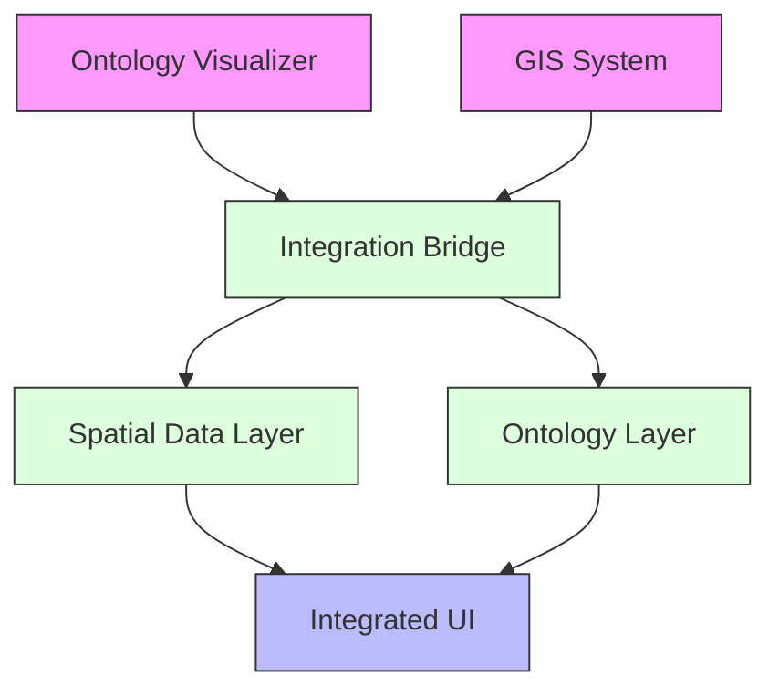

#### Example: QGIS Integration

```python
# Example code for QGIS plugin integration
from qgis.PyQt.QtWidgets import QDockWidget
from qgis.PyQt.QtCore import Qt
from qgis.core import QgsProject

from geo_infer.integration.qgis import OntologyWidget
from geo_infer.ontology import OntologyManager

class GeoInferOntologyPlugin:
    def __init__(self, iface):
        self.iface = iface
        self.dock_widget = None
        self.ontology_manager = OntologyManager()
    
    def initGui(self):
        # Create action
        self.action = QAction("Ontology Viewer", self.iface.mainWindow())
        self.action.triggered.connect(self.show_dock)
        self.iface.addToolBarIcon(self.action)
    
    def show_dock(self):
        if self.dock_widget is None:
            # Create dock widget
            self.dock_widget = QDockWidget("GEO-INFER Ontology", self.iface.mainWindow())
            self.dock_widget.setAllowedAreas(Qt.LeftDockWidgetArea | Qt.RightDockWidgetArea)
            
            # Create ontology widget
            ontology = self.ontology_manager.load_ontology("geospatial")
            self.ontology_widget = OntologyWidget(ontology)
            
            # Connect signals
            self.ontology_widget.concept_selected.connect(self.on_concept_selected)
            
            self.dock_widget.setWidget(self.ontology_widget)
            self.iface.addDockWidget(Qt.RightDockWidgetArea, self.dock_widget)
        else:
            self.dock_widget.setVisible(True)
    
    def on_concept_selected(self, concept_id):
        # Find related layers in the current QGIS project
        concept = self.ontology_manager.get_concept(concept_id)
        layers = QgsProject.instance().mapLayers().values()
        
        related_layers = []
        for layer in layers:
            # Check if layer is related to the selected concept
            if self._is_layer_related(layer, concept):
                related_layers.append(layer)
        
        # Highlight related layers
        for layer in related_layers:
            self.iface.layerTreeView().setCurrentLayer(layer)
```

### Integration with Knowledge Base

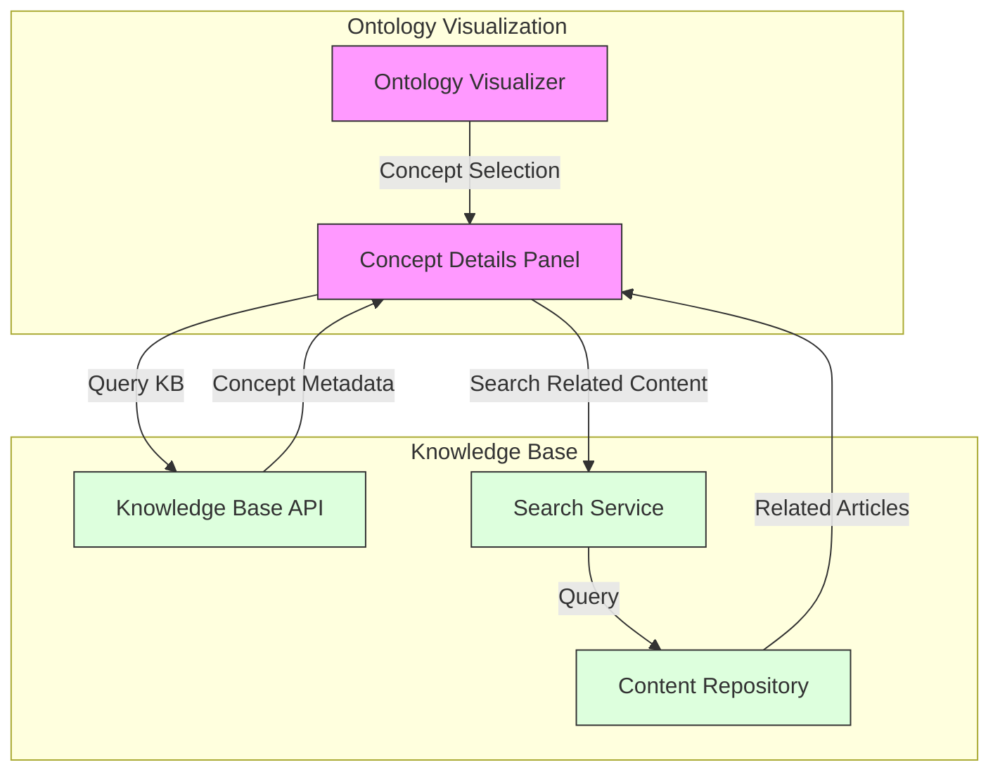

## Best Practices

1. **Focus on User Needs**: Design visualizations based on specific user tasks and goals
2. **Progressive Disclosure**: Start with simplified views and provide mechanisms to reveal more details as needed
3. **Consistent Visual Language**: Use consistent shapes, colors, and patterns to represent ontology elements
4. **Performance Optimization**: Implement lazy loading and level-of-detail techniques for large ontologies
5. **Interactive Feedback**: Provide immediate visual feedback during user interactions
6. **Accessibility**: Ensure visualizations are accessible with keyboard navigation and screen reader support
7. **Contextual Information**: Show relevant contextual information when users interact with elements
8. **Multiple Views**: Offer different visualization types that are suited for different tasks
9. **Search Integration**: Integrate search functionality to help users find concepts in large ontologies
10. **Save & Share**: Allow users to save, export, and share visualization states

### Design Guidelines

```mermaid
graph TD
    subgraph "Visualization Design Process"
        REQUIREMENTS[Identify Requirements]
        TASKS[Define User Tasks]
        ELEMENTS[Identify Visual Elements]
        MAPPING[Create Visual Mapping]
        PROTOTYPE[Prototype]
        TEST[Usability Testing]
        REFINE[Refine Design]
        IMPLEMENT[Implement]
        DEPLOY[Deploy]
        
        REQUIREMENTS --> TASKS
        TASKS --> ELEMENTS
        ELEMENTS --> MAPPING
        MAPPING --> PROTOTYPE
        PROTOTYPE --> TEST
        TEST --> REFINE
        REFINE --> IMPLEMENT
        IMPLEMENT --> DEPLOY
    end
    
    classDef process fill:#dfd,stroke:#333,stroke-width:1px
    
    class REQUIREMENTS,TASKS,ELEMENTS,MAPPING,PROTOTYPE,TEST,REFINE,IMPLEMENT,DEPLOY process
```

## Troubleshooting

### Common Visualization Issues

| Issue | Possible Causes | Solutions |
|-------|----------------|-----------|
| Performance issues with large ontologies | Too many elements rendered simultaneously | Implement pagination, use level-of-detail techniques, enable lazy loading |
| Layout issues (overlapping elements) | Inadequate layout algorithm for the ontology structure | Try different layout algorithms, adjust layout parameters, implement custom layout |
| Missing relationships | Filtering settings excluding certain relation types | Check filter settings, ensure all relevant relation types are included |
| Inconsistent visual appearance | Theme configuration issues, CSS conflicts | Review theme configuration, check for CSS conflicts, use scoped styles |
| Browser compatibility issues | Different browser rendering engines | Test across browsers, use polygon_to_cellss, implement graceful degradation |

### Performance Optimization Techniques

1. **Data Reduction**: Filter and aggregate data before visualization
2. **Progressive Loading**: Load and render data in batches
3. **Level of Detail**: Adjust detail level based on zoom level
4. **Cached Rendering**: Cache rendered views for common navigation paths
5. **Efficient Algorithms**: Use optimized layout and rendering algorithms

## Related Resources

- [Ontology Modeling Guide](ontology_modeling.md)
- [Knowledge Base Visualization](../knowledge_base/visualization.md)
- [Interactive User Interface](../ui/components.md)
- [Geospatial Data Visualization](../geospatial/visualization.md)
- [API Reference](../api/visualization_api.md) 