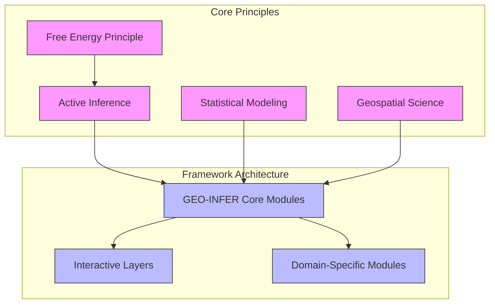
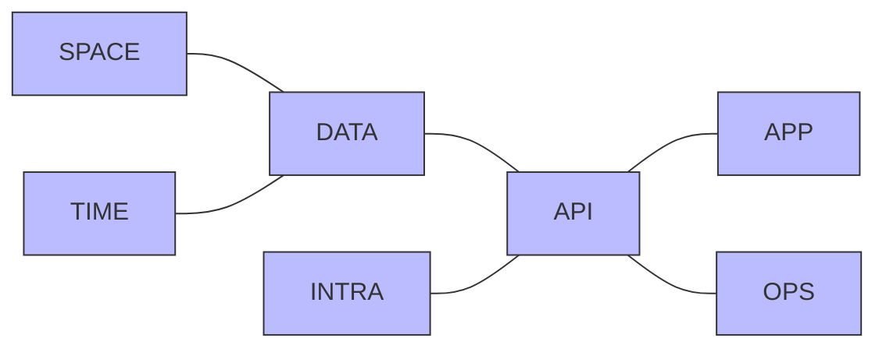

# GEO-INFER Framework Overview

## Vision and Purpose

The GEO-INFER framework is an innovative, integrated platform that combines Active Inference principles with advanced geospatial technologies. It aims to revolutionize how we understand, model, and interact with geographic data by applying a unified cognitive framework based on the Free Energy Principle.

At its core, GEO-INFER treats geospatial systems—from cities and ecosystems to climate patterns—as adaptive systems that can be modeled through the lens of perception, belief, and action. This approach enables more intelligent analysis, prediction, and decision-making in spatial contexts.

## Conceptual Foundation

GEO-INFER stands on three conceptual pillars:

1. **Active Inference**: A framework that unifies perception, learning, and action under the principle that adaptive systems minimize expected free energy. In GEO-INFER, this provides a mathematical foundation for understanding how geospatial entities (from individuals to ecosystems) perceive their environment, form beliefs, and take actions.

2. **Geospatial Intelligence**: The science of analyzing location-based data to understand patterns, relationships, and behaviors across space and time. GEO-INFER leverages cutting-edge geospatial technologies including spatial indexing, remote sensing, GIS analysis, and cartography.

3. **Integrative Systems Approach**: Rather than treating spatial phenomena in isolation, GEO-INFER connects multiple scales, domains, and data types through a consistent mathematical framework, enabling more holistic analysis and modeling.

## Framework Architecture

The GEO-INFER framework is organized into three layers:

### 1. Core Modules

These provide the fundamental capabilities that power the entire framework:

- **GEO-INFER-SPACE**: Spatial data structures, indexes, and operations
- **GEO-INFER-TIME**: Temporal analysis and time-series processing
- **GEO-INFER-INTRA**: Knowledge integration and documentation
- **GEO-INFER-DATA**: Data management and access
- **GEO-INFER-API**: Service interfaces and communication
- **GEO-INFER-APP**: User interfaces and visualization
- **GEO-INFER-OPS**: Deployment and operational support

### 2. Active Inference Implementation

Modules that implement the active inference mathematical framework:

- **GEO-INFER-ACT**: Core active inference algorithms
- **GEO-INFER-AGENT**: Agent-based modeling and simulation
- **GEO-INFER-BAYES**: Bayesian inference and probabilistic programming
- **GEO-INFER-COG**: Cognitive modeling and perception
- **GEO-INFER-MATH**: Mathematical utilities and specialized algorithms

### 3. Domain-Specific Modules

Specialized modules for different application domains:

- **GEO-INFER-AG**: Agricultural applications
- **GEO-INFER-BIO**: Ecological and biological applications
- **GEO-INFER-CIV**: Urban planning and civil engineering
- **GEO-INFER-ECON**: Economic and market analysis
- **GEO-INFER-RISK**: Risk assessment and management
- **GEO-INFER-SIM**: Advanced simulation capabilities

## Key Capabilities

GEO-INFER provides several key capabilities that set it apart from traditional geospatial frameworks:

1. **Integrated Perception-Action Loops**: Models that can iteratively update beliefs and take actions based on new observations within spatial contexts.

2. **Multi-scale Analysis**: Seamless movement between different spatial and temporal scales, from individual entities to global patterns.

3. **Uncertainty Quantification**: Explicit handling of uncertainty in data, models, and predictions.

4. **Counterfactual Reasoning**: Ability to reason about hypothetical scenarios and potential interventions.

5. **Cross-domain Integration**: Common mathematical foundation that enables integration of models from different domains.

6. **Knowledge Management**: Structured organization of geospatial knowledge, ontologies, and workflows.

## Usage Paradigms

GEO-INFER supports multiple usage paradigms:

### Interactive Analysis

Data scientists, researchers, and analysts can use GEO-INFER for interactive exploration and analysis of geospatial data, with tools for visualization, statistical modeling, and active inference analysis.

### Model Development

Researchers and developers can build custom active inference models for specific geospatial problems, leveraging the framework's mathematical foundations and utility libraries.

### Application Integration

Software developers can integrate GEO-INFER capabilities into larger applications through its comprehensive API layer and microservices architecture.

### Automated Pipelines

Data engineers can build automated data processing and analysis pipelines that incorporate active inference principles for more intelligent processing.

## Getting Started

To begin working with GEO-INFER:

1. See the [Installation Guide](installation.md) for setup instructions
2. Follow the [Quick Start Tutorial](tutorials/getting_started/index.md) for an introduction to key concepts
3. Explore [Example Notebooks](examples/index.md) that demonstrate common workflows
4. Read the [Architecture Documentation](architecture/index.md) for a deeper understanding of the framework

## Framework Evolution

GEO-INFER is designed with extensibility as a core principle. The framework evolves through:

1. **New Module Integration**: Domain-specific modules can be added to address new application areas
2. **Algorithm Enhancement**: Improvements to core active inference algorithms and spatial methods
3. **Data Source Integration**: Connection to new geospatial data sources and formats
4. **Community Extensions**: User-contributed components and extensions

## License and Usage

GEO-INFER is licensed under [license details], which allows for [permitted uses] while restricting [restrictions]. For commercial applications, please contact [contact information]. 