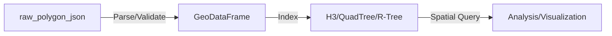
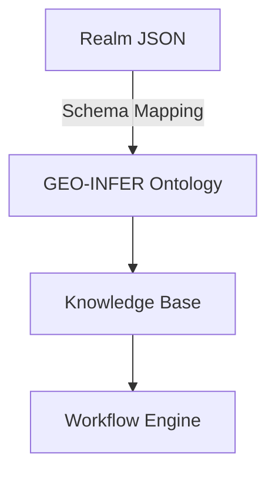
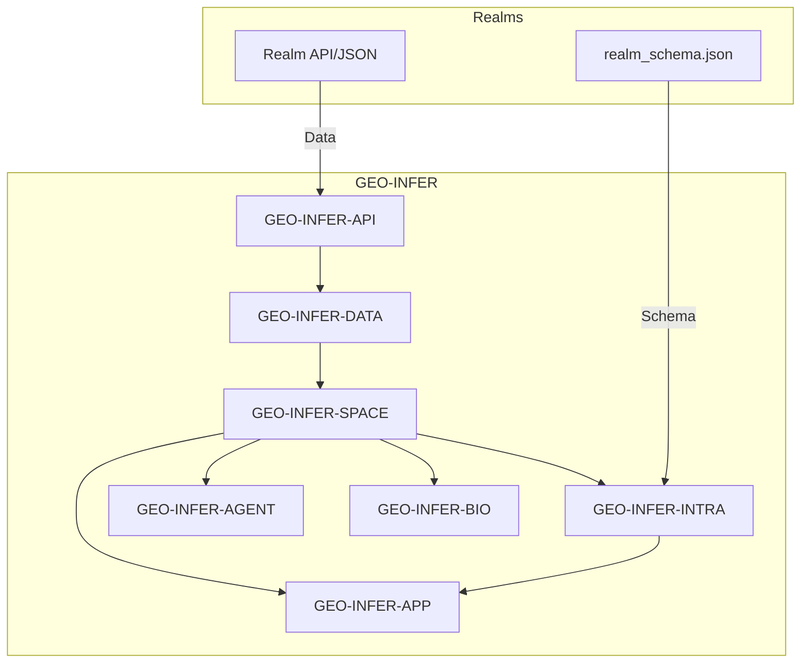

# Integrating Realms with the GEO-INFER Framework

---

## Overview

This document provides a comprehensive guide to integrating **Realms** (as defined in `realm_schema.json` and the Realms API) with the **GEO-INFER** framework. It covers data model mapping, API integration, geospatial processing, and advanced analytics, with mermaid diagrams illustrating key concepts and data flows.

---

## 1. What is a Realm?

A **Realm** represents a geospatial region with rich metadata, including:
- Unique ID, name, description
- Images (logo, header)
- Geospatial boundaries (raw polygons, centroid lat/lng)
- Statistical and ecological scores (bioscore, health, diversity, etc.)
- Observation and species counts
- Status, subscription, and display flags

**Schema Reference:** See `realm_schema.json` for the full property list.

---

## 2. GEO-INFER Framework: Relevant Capabilities

GEO-INFER is a modular geospatial intelligence platform supporting:
- Spatial data processing (GEO-INFER-SPACE)
- Knowledge management (GEO-INFER-INTRA)
- API integration (GEO-INFER-API)
- Agent-based modeling (GEO-INFER-AGENT)
- Ecological, biological, and statistical analysis (GEO-INFER-BIO, -BAYES, etc.)

**Key Integration Points:**
- Geospatial data ingestion and transformation
- Knowledge base and ontology mapping
- API and workflow orchestration
- Advanced analytics and simulation

---

## 3. Data Model Mapping: Realms → GEO-INFER

```mermaid
erDiagram
    REALM ||--o{ GEO_DATASET : "has"
    REALM {
      int id
      string name
      string description
      string logo_image_url
      string header_image_url
      array raw_polygon_json
      float lat
      float lng
      ...
    }
    GEO_DATASET {
      geometry polygon
      float centroid_lat
      float centroid_lng
      dict attributes
      ...
    }
```

- **raw_polygon_json** → `geometry` in GEO-INFER spatial datasets
- **lat/lng** → `centroid` or point geometry
- **scores/counts** → `attributes`/metadata in GEO-INFER datasets

---

## 4. Data Flow: Realms API to GEO-INFER

```mermaid
graph TD
    A[Realms API / Data Source] -->|JSON/GeoJSON| B[GEO-INFER-API]
    B --> C[GEO-INFER-DATA]
    C --> D[GEO-INFER-SPACE]
    D --> E[GEO-INFER-INTRA (Knowledge Base)]
    D --> F[GEO-INFER-APP (Visualization)]
    D --> G[GEO-INFER-AGENT (Modeling/Simulation)]
    D --> H[GEO-INFER-BIO (Ecological Analysis)]
```

- **Ingestion:** Realms data (via API or file) is parsed and validated
- **Transformation:** Polygons and attributes are mapped to GEO-INFER data structures
- **Storage:** Managed in GEO-INFER-DATA, accessible to all modules
- **Processing:** Used for spatial analysis, modeling, and visualization

---

## 5. Geospatial Processing: Polygons, Points, and Indexing

- **Polygons:** `raw_polygon_json` is converted to standard geospatial formats (GeoJSON, Shapefile)
- **Centroids:** `lat`/`lng` used for point-based queries and overlays
- **Spatial Indexing:** H3, R-Tree, or QuadTree indexing for efficient queries



---

## 6. Knowledge Integration: Ontologies and Metadata

- **Ontology Mapping:** Realm properties are mapped to GEO-INFER ontologies for semantic interoperability
- **Metadata Management:** All Realm attributes are stored in the knowledge base for search, discovery, and workflow automation



---

## 7. Example: Realm Ingestion Workflow

1. **Fetch** Realm data from API
2. **Validate** against `realm_schema.json`
3. **Transform** polygons to standard geospatial format
4. **Store** in GEO-INFER-DATA as a `GeospatialDataset`
5. **Index** for spatial queries
6. **Link** metadata to knowledge base
7. **Enable** downstream analysis (ecological, agent-based, etc.)

---

## 8. Advanced Use Cases

- **Ecological Modeling:** Use Realm boundaries for species distribution, biodiversity, and habitat analysis (GEO-INFER-BIO)
- **Agent-Based Simulation:** Model agents operating within or across Realms (GEO-INFER-AGENT)
- **Health & Community Analysis:** Integrate health scores and community metrics for socio-ecological studies
- **Visualization:** Render Realms and their attributes in GEO-INFER-APP dashboards

---

## 9. Conceptual Integration Map



---

## 10. Best Practices & Recommendations

- **Schema Validation:** Always validate incoming Realm data against `realm_schema.json`
- **Coordinate Standards:** Use EPSG:4326 (WGS84) for all geospatial data
- **Metadata Completeness:** Populate all available Realm attributes for maximum analytical value
- **Modular Workflows:** Leverage GEO-INFER's modularity for custom pipelines (e.g., only spatial, only ecological, or full-stack analysis)
- **FAIR Principles:** Ensure all integrated data is Findable, Accessible, Interoperable, and Reusable

---

## 11. References

- `realm_schema.json` (this folder)
- Realms API documentation (see README.md)
- GEO-INFER-INTRA documentation
- GEO-INFER-SPACE, -DATA, -BIO, -AGENT, -APP modules

---

*This document is maintained as part of the GEO-INFER knowledge base. For updates or suggestions, please submit a pull request or contact the maintainers.* 