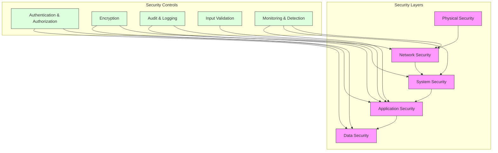
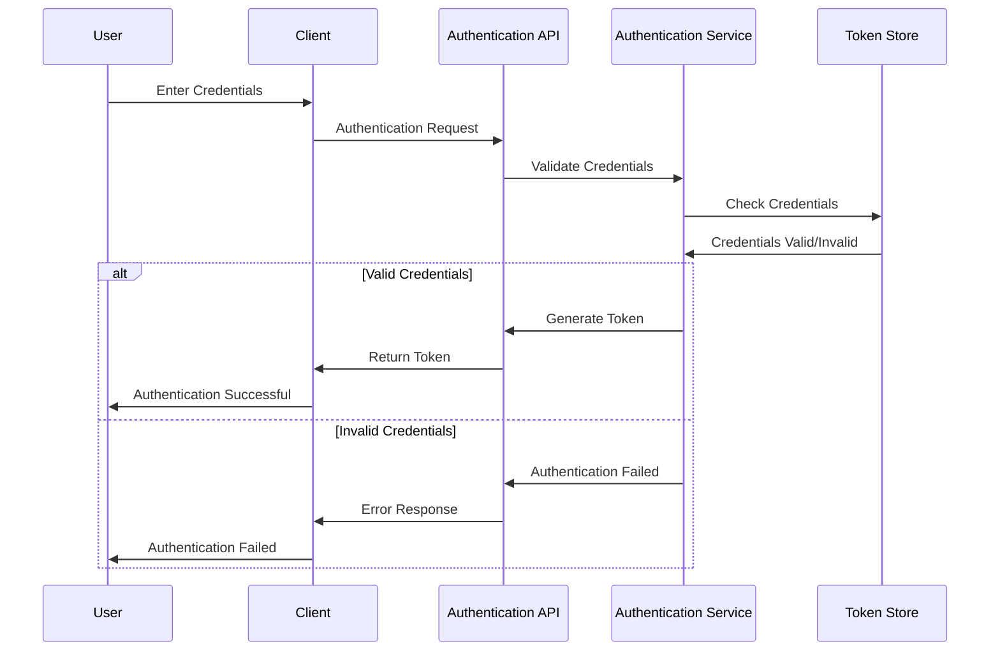
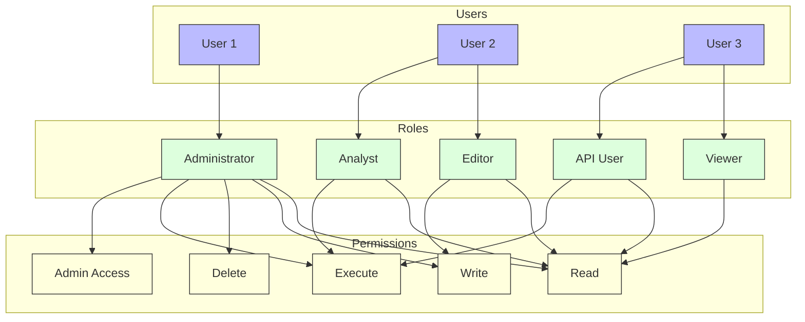
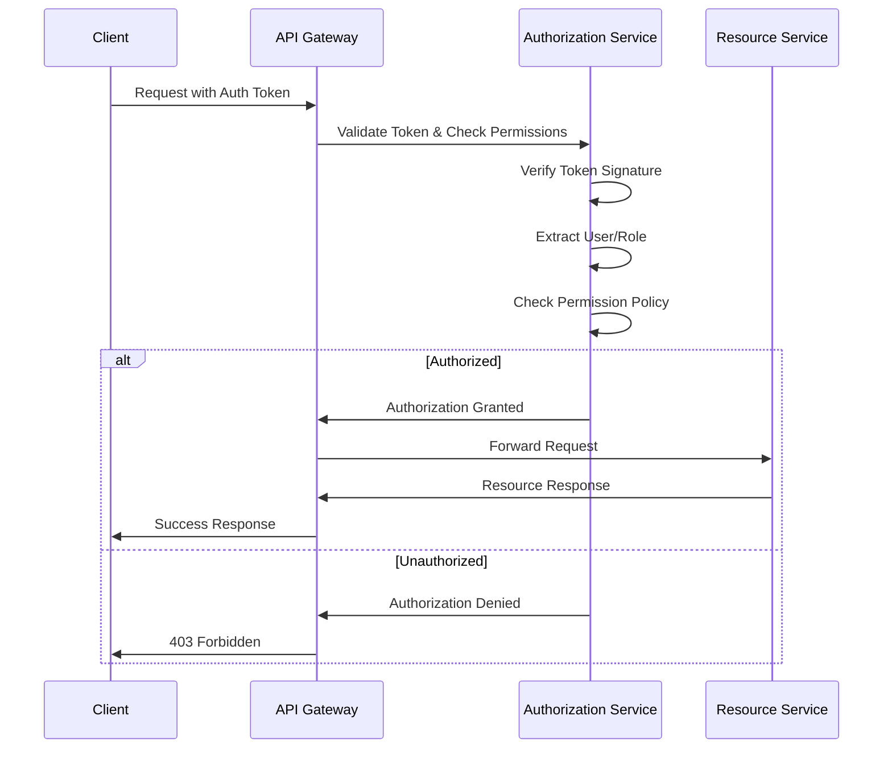
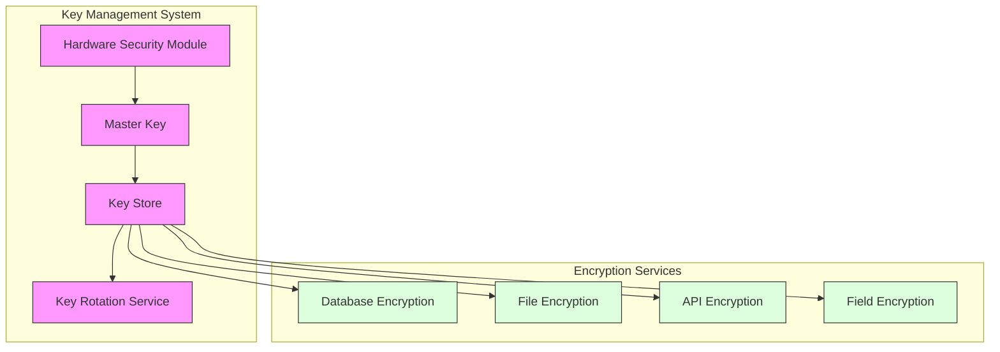
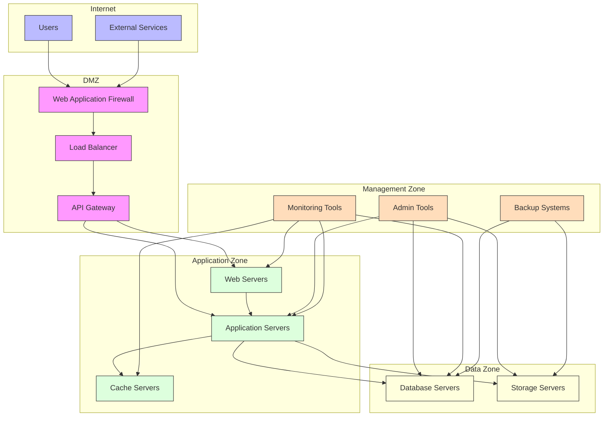
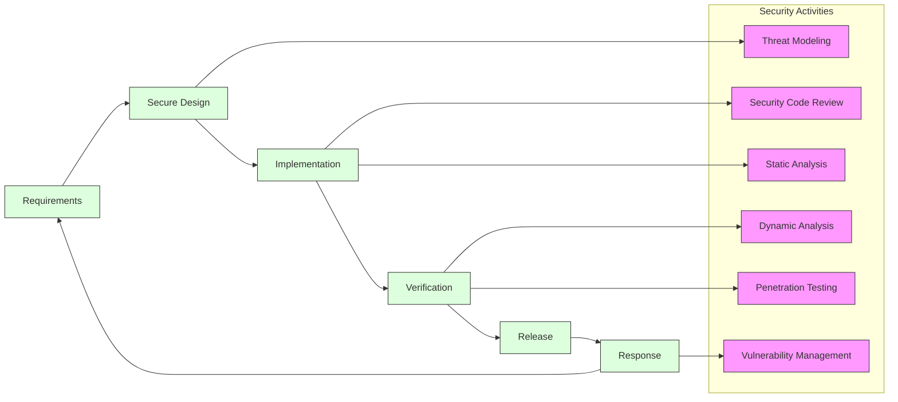
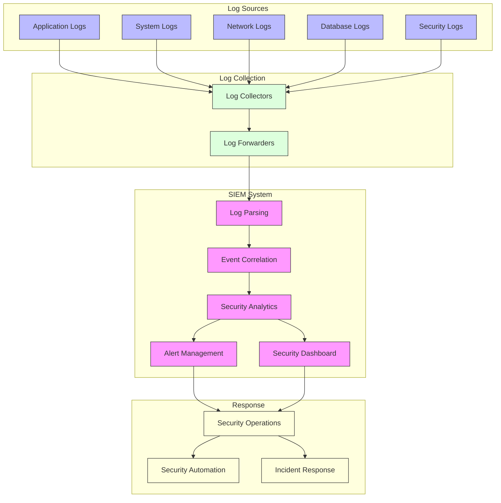
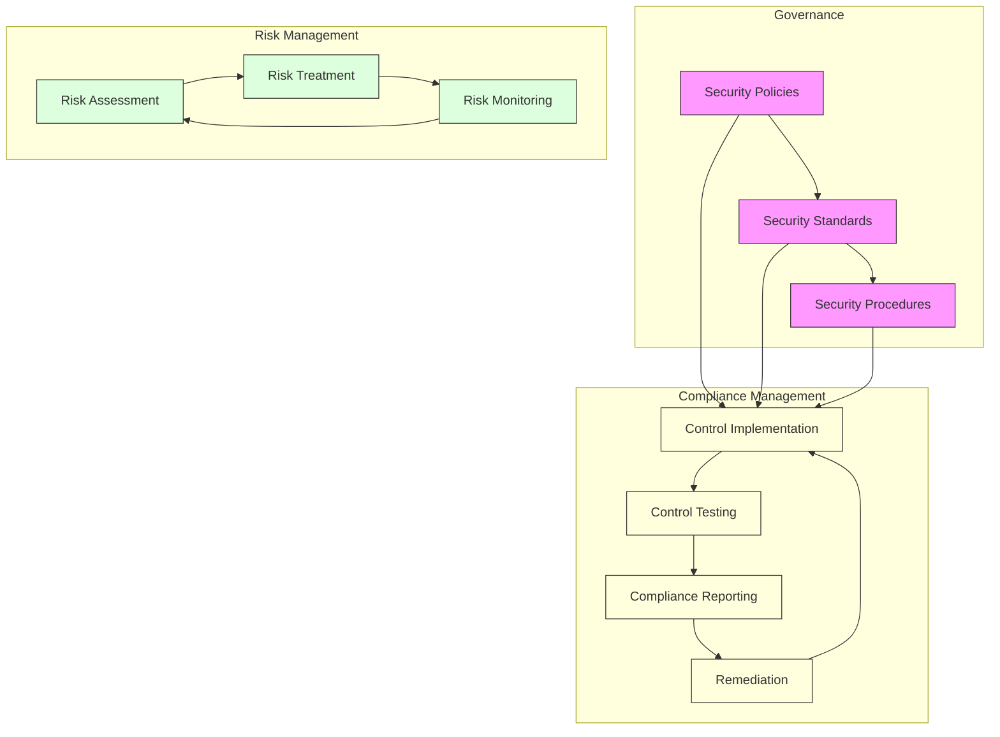
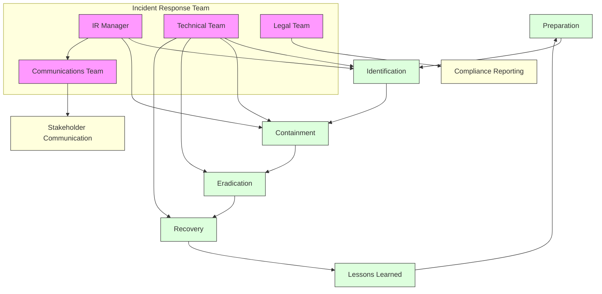

# Security Guide

This document provides comprehensive information about security considerations, implementation details, and best practices for GEO-INFER-INTRA.

## Contents

- [Security Overview](#security-overview)
- [Authentication](#authentication)
- [Authorization](#authorization)
- [Data Protection](#data-protection)
- [Network Security](#network-security)
- [Secure Development](#secure-development)
- [Security Monitoring](#security-monitoring)
- [Compliance](#compliance)
- [Incident Response](#incident-response)

## Security Overview

GEO-INFER-INTRA implements a comprehensive security model to protect data, services, and users. This security model follows a defense-in-depth approach with multiple layers of security controls.



## Authentication

### Authentication Methods

GEO-INFER-INTRA supports multiple authentication methods:

- **Username/Password**: Basic authentication with strong password policies
- **API Keys**: For programmatic access to APIs
- **OAuth 2.0**: For third-party integrations
- **JWT (JSON Web Tokens)**: For stateless authentication
- **Multi-Factor Authentication (MFA)**: Optional second factor for enhanced security

### Authentication Flow

The authentication process follows these steps:



### Password Policies

The system enforces the following password policies:

- Minimum length of 12 characters
- Combination of uppercase, lowercase, numbers, and special characters
- No common dictionary words
- No reuse of the last 10 passwords
- Password expiration after 90 days (configurable)
- Account lockout after 5 failed attempts

### API Key Management

API keys are managed through:

- Secure generation using cryptographically strong random functions
- Key rotation policies
- Usage restrictions by IP, service, or operation
- Activity monitoring and anomaly detection

## Authorization

### Role-Based Access Control (RBAC)

GEO-INFER-INTRA implements RBAC with predefined roles and granular permissions:



### Permission Model

The authorization system uses a hierarchical permission model:

- **Resource Types**: Document, Ontology, Workflow, etc.
- **Operations**: Read, Write, Execute, Delete, Admin
- **Scope**: Global, Project, Team, Personal

Example permission structure:

```
{
  "resource_type": "workflow",
  "resource_id": "wf-123456",
  "operations": ["read", "execute"],
  "scope": "team:engineering"
}
```

### Authorization Flow



## Data Protection

### Data Classification

GEO-INFER-INTRA classifies data into the following categories:

- **Public**: Information that can be freely disclosed
- **Internal**: Information for internal use only
- **Confidential**: Sensitive information requiring protection
- **Restricted**: Highly sensitive information with strict access controls

### Encryption

The system implements encryption at multiple levels:

- **Data in Transit**: TLS 1.3 for all communications
- **Data at Rest**: AES-256 encryption for stored data
- **Database Encryption**: Transparent data encryption for database
- **Field-Level Encryption**: For highly sensitive data fields

### Encryption Key Management



### Data Retention and Deletion

The system implements:

- Configurable data retention policies
- Secure data deletion methods
- Anonymization of personal data when appropriate
- Audit trails for data deletion operations

## Network Security

### Network Architecture

The GEO-INFER-INTRA network is designed with security zones:



### Firewall Rules

Implement strict firewall rules following the principle of least privilege:

- Default deny all inbound traffic
- Allow only necessary outbound traffic
- Segment internal networks with internal firewalls
- Regular firewall rule audits

### DDoS Protection

Measures to protect against Distributed Denial of Service attacks:

- Rate limiting at the application and network levels
- Traffic analysis and anomaly detection
- CDN integration for traffic distribution
- Automatic scaling for traffic spikes

## Secure Development

### Secure Development Lifecycle

GEO-INFER-INTRA follows a secure development lifecycle:



### Secure Coding Practices

The development team follows these secure coding practices:

- Input validation for all user-supplied data
- Output encoding to prevent injection attacks
- Use of parameterized queries to prevent SQL injection
- Proper error handling that doesn't expose sensitive information
- Regular security training for developers

### Dependency Management

- Regular scanning of third-party libraries for vulnerabilities
- Automated alerts for vulnerable dependencies
- Vendor security assessment for critical dependencies
- Policy for timely application of security patches

## Security Monitoring

### Logging and Auditing

GEO-INFER-INTRA implements comprehensive logging:

- Authentication and authorization events
- System and application changes
- Data access and modifications
- Security-relevant events
- Administrator activities

Log format example:

```json
{
  "timestamp": "2023-06-15T10:25:43.511Z",
  "level": "INFO",
  "event_type": "AUTH_SUCCESS",
  "user_id": "user123",
  "ip_address": "192.168.1.1",
  "resource": "/api/v1/workflows",
  "method": "GET",
  "user_agent": "Mozilla/5.0...",
  "request_id": "req-abc-123"
}
```

### Security Information and Event Management (SIEM)



### Intrusion Detection and Prevention

The system employs:

- Network-based intrusion detection (NIDS)
- Host-based intrusion detection (HIDS)
- Behavioral analysis for anomaly detection
- Automated blocking of suspicious activities
- Regular security scanning and penetration testing

## Compliance

### Regulatory Compliance

GEO-INFER-INTRA is designed to help meet requirements for:

- GDPR (General Data Protection Regulation)
- HIPAA (Health Insurance Portability and Accountability Act)
- FISMA (Federal Information Security Management Act)
- PCI DSS (Payment Card Industry Data Security Standard)
- SOC 2 (Service Organization Control 2)

### Compliance Controls



### Compliance Documentation

The system maintains documentation for compliance purposes:

- Security policies and procedures
- Risk assessments and treatment plans
- Audit logs and reports
- Security incident reports
- Compliance attestations and certifications

## Incident Response

### Incident Response Plan

GEO-INFER-INTRA has a defined incident response plan:



### Security Incident Classification

Incidents are classified based on severity:

- **Critical**: Significant impact, data breach, system compromise
- **High**: Serious security issue with limited impact
- **Medium**: Security issue with minimal impact
- **Low**: Minor security concern

### Incident Response Procedures

1. **Identification**: Detect and validate security incidents
2. **Containment**: Isolate affected systems to prevent spread
3. **Eradication**: Remove the cause of the incident
4. **Recovery**: Restore systems to normal operation
5. **Lessons Learned**: Review and improve security controls

## Security Configuration

### Security Configuration Files

Example security configuration in `config/security.yaml`:

```yaml
# Security Configuration
security:
  # Authentication settings
  authentication:
    methods:
      password:
        enabled: true
        min_length: 12
        complexity: high
        expiration_days: 90
        history_count: 10
      mfa:
        enabled: true
        methods: ["totp", "email"]
      oauth:
        enabled: true
        providers: ["google", "github", "azure"]
      api_key:
        enabled: true
        expiration_days: 365
        
  # Authorization settings
  authorization:
    rbac:
      enabled: true
      default_role: "viewer"
    
  # Session settings
  session:
    timeout: 3600  # seconds
    absolute_timeout: 86400  # seconds
    idle_timeout: 1800  # seconds
    
  # Encryption settings
  encryption:
    tls:
      min_version: "TLSv1.2"
      preferred_ciphers: "ECDHE-RSA-AES256-GCM-SHA384:ECDHE-RSA-AES128-GCM-SHA256"
    data_at_rest:
      enabled: true
      algorithm: "AES-256-GCM"
    
  # Network security
  network:
    rate_limiting:
      enabled: true
      requests_per_minute: 100
    ip_filtering:
      enabled: false
      allowed_ips: []
      blocked_ips: []
    
  # Audit logging
  audit:
    enabled: true
    log_level: "INFO"
    events:
      - "authentication"
      - "authorization"
      - "data_access"
      - "configuration_change"
      - "administrative_action"
```

## Integrating with External Security Systems

```python
from geo_infer.security import SecurityManager
from geo_infer.security.integration import SIEMIntegration, IDSIntegration

# Initialize security manager
security_manager = SecurityManager()

# Configure SIEM integration
siem_config = {
    "type": "splunk",
    "url": "https://splunk.example.com",
    "token": "your-splunk-token",
    "index": "geo_infer_logs",
    "events": ["auth", "data_access", "admin"]
}
siem = SIEMIntegration(siem_config)
security_manager.add_integration(siem)

# Configure IDS integration
ids_config = {
    "type": "wazuh",
    "url": "https://wazuh.example.com",
    "username": "wazuh-user",
    "password": "wazuh-password",
    "agent_group": "geo_infer"
}
ids = IDSIntegration(ids_config)
security_manager.add_integration(ids)

# Initialize and start security monitoring
security_manager.initialize()
security_manager.start_monitoring()
```

## Security Best Practices

1. **Apply the principle of least privilege** - Grant users only the permissions they need for their job functions
2. **Implement defense-in-depth** - Use multiple layers of security controls
3. **Keep systems updated** - Apply security patches promptly
4. **Encrypt sensitive data** - Both in transit and at rest
5. **Implement strong authentication** - Use MFA where possible
6. **Regular security assessments** - Conduct penetration testing and vulnerability assessments
7. **Security awareness training** - Regular training for all users
8. **Monitor and log security events** - Maintain comprehensive audit trails
9. **Develop an incident response plan** - Be prepared for security incidents
10. **Regular security reviews** - Periodically review and update security controls

## Related Resources

- [Deployment Security](../deployment/security.md)
- [API Security](../api/security.md)
- [Authentication Configuration](authentication.md)
- [Authorization Configuration](authorization.md)
- [Encryption Guide](encryption.md)
- [Security Monitoring](monitoring.md)
- [Compliance Documentation](compliance.md) 