# GEO-INFER and TNFD: A Strategic Convergence for Nature-Related Financial Disclosures

## Executive Summary

The GEO-INFER (Geospatial Intelligence Framework for Environmental Risk) project represents a transformative technological infrastructure that directly aligns with and significantly enhances the Taskforce on Nature-related Financial Disclosures (TNFD) framework objectives. This comprehensive analysis demonstrates how GEO-INFER's distributed intelligence architecture, advanced geospatial analytics, and multi-domain expertise create an ideal technological foundation for implementing TNFD's vision of accessible, reliable, and decision-useful nature-related data.

GEO-INFER's modular ecosystem—spanning active inference agents, Bayesian analytics, biological assessment, economic modeling, health surveillance, and real-time IoT integration—provides the technical capabilities necessary to operationalize the TNFD's LEAP (Locate, Evaluate, Assess, Prepare) methodology at scale. The project's emphasis on open standards, data sovereignty, and distributed processing directly supports TNFD's Nature Data Public Facility (NDPF) vision while addressing critical gaps in SME accessibility through AI-driven assessment tools.

## Strategic Alignment Overview

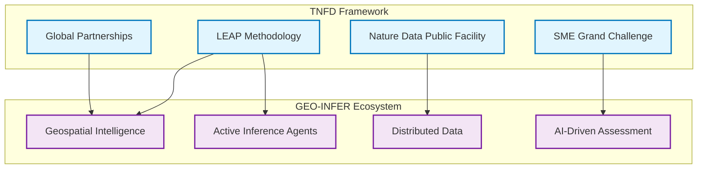

### Core Mission Convergence

The GEO-INFER project's foundational mission—to democratize access to sophisticated geospatial intelligence for environmental decision-making—directly supports TNFD's objective to transform global financial flows toward nature-positive outcomes. Both initiatives recognize that effective nature-related risk management requires:

1. **Location-specific Assessment Capabilities**: GEO-INFER's [spatial intelligence core](../../GEO-INFER-SPACE/README.md) provides the technical infrastructure for TNFD's emphasis on location-based nature assessments
2. **Scalable Data Integration**: The project's [distributed architecture](../architecture/system_integration.md) supports TNFD's vision of a comprehensive Nature Data Public Facility
3. **Multi-stakeholder Accessibility**: GEO-INFER's modular design enables both enterprise-scale implementations and SME-focused simplified interfaces
4. **Real-time Monitoring and Assessment**: The framework's [IoT integration](../../GEO-INFER-IOT/README.md) and [active inference capabilities](../active_inference_guide.md) support dynamic nature-related risk monitoring

### Technological Foundation for TNFD Implementation

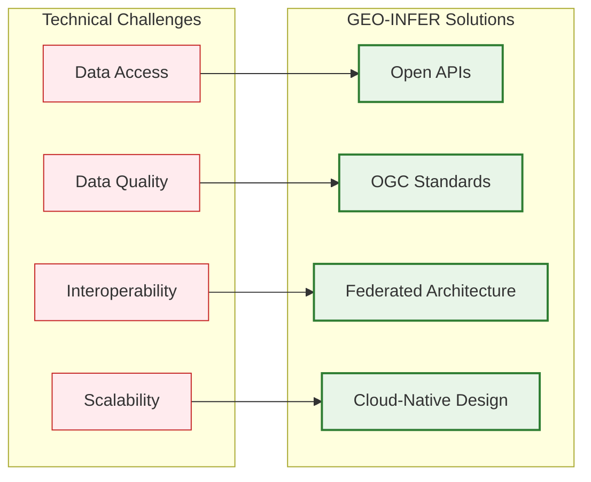

GEO-INFER's architecture provides the technological substrate necessary for implementing TNFD recommendations across multiple organizational scales and operational contexts. The project's emphasis on interoperability, open standards, and distributed processing directly addresses the technical challenges identified in TNFD's roadmap for upgrading market access to nature-related data. For detailed system integration patterns, see our [cross-module interaction guide](../architecture/cross_module_interaction.md).

## GEO-INFER Architecture Supporting TNFD Objectives

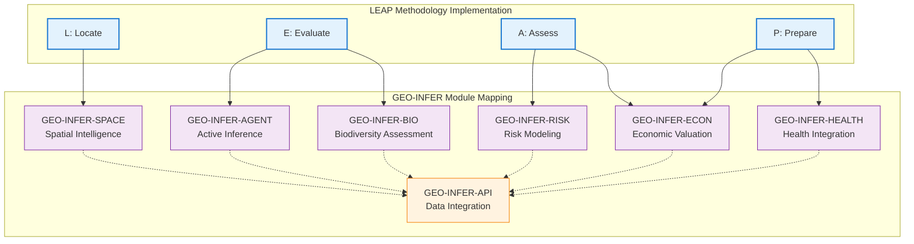

### 1. Geospatial Intelligence Core ([GEO-INFER-SPACE](../../GEO-INFER-SPACE/README.md))

**TNFD Alignment**: Direct support for the "Locate" phase of the LEAP methodology

**Technical Capabilities**:
- **H3 Hierarchical Spatial Indexing**: Enables consistent global spatial referencing for nature-related assessments, supporting portfolio-level analysis across diverse geographic contexts
- **Multi-resolution Analysis**: Supports assessment from individual asset level to ecosystem-wide impact evaluation
- **Temporal-spatial Integration**: Tracks ecosystem changes over time, enabling dynamic risk assessment and transition planning
- **Satellite Data Integration**: Provides real-time environmental monitoring capabilities essential for ongoing nature-related risk management

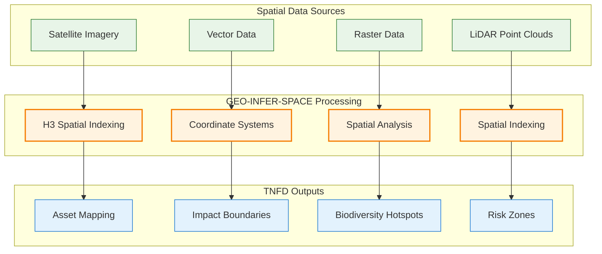

**TNFD Implementation Value**:
The geospatial core provides the foundational infrastructure for location-specific nature assessments required by TNFD's framework. This addresses the critical challenge of translating global biodiversity data into asset-specific risk evaluations, enabling financial institutions to assess nature-related risks across geographically distributed portfolios. For implementation details, see the [GEO-INFER-SPACE documentation](../../GEO-INFER-SPACE/README.md).

### 2. Active Inference Agent Network ([GEO-INFER-AGENT](../../GEO-INFER-AGENT/README.md))

**TNFD Alignment**: Operationalizes the "Evaluate" and "Assess" phases through intelligent, adaptive assessment agents

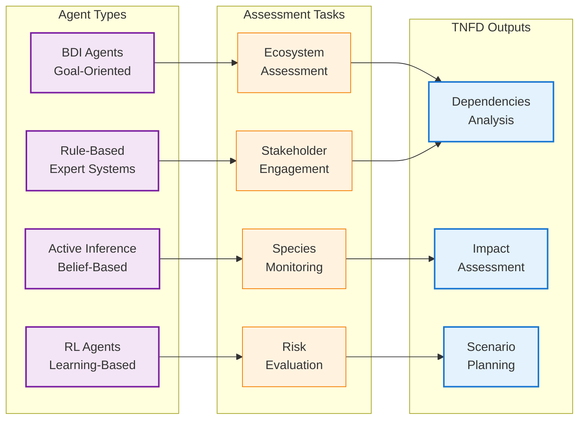

**Technical Capabilities**:
- **Distributed Assessment Agents**: Deploy specialized agents for different ecosystem types, species groups, and environmental indicators
- **[Active Inference Methodology](../active_inference_guide.md)**: Continuously update risk assessments based on new data, supporting dynamic nature-related risk management
- **Multi-scale Coordination**: Coordinate assessments across individual assets, value chains, and ecosystem-wide impacts
- **Stakeholder Integration**: Facilitate engagement with Indigenous peoples and local communities through culturally-informed assessment protocols

**TNFD Implementation Value**:
The agent network provides the intelligent processing capability necessary for transforming raw environmental data into decision-useful nature-related risk assessments. This directly supports TNFD's requirement for organizations to evaluate their dependencies and impacts on natural assets and ecosystem services. For detailed agent architectures, see our [agent integration guide](../../GEO-INFER-APP/docs/agent_integration_guide.md).

### 3. Biological and Biodiversity Assessment ([GEO-INFER-BIO](../../GEO-INFER-BIO/README.md))

**TNFD Alignment**: Core capability for biodiversity impact and dependency assessment

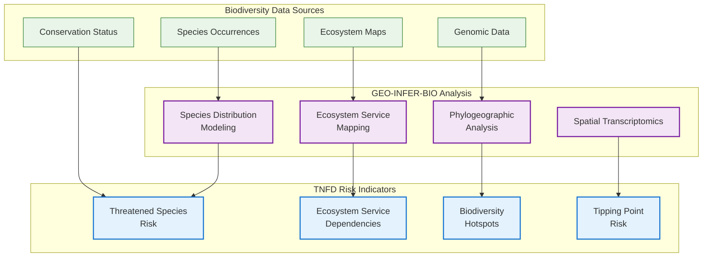

**Technical Capabilities**:
- **Species Distribution Modeling**: Assess potential impacts on threatened and endangered species across operational footprints
- **Ecosystem Service Mapping**: Quantify organizational dependencies on ecosystem services including water regulation, pollination, and climate regulation
- **Biodiversity Risk Metrics**: Generate standardized biodiversity risk indicators aligned with Global Biodiversity Framework targets
- **Conservation Effectiveness Analysis**: Evaluate the effectiveness of nature-positive interventions and conservation investments
- **[Spatial Transcriptomics](../../GEO-INFER-BIO/docs/index.md)**: Advanced genomic analysis with spatial context for ecosystem health assessment

**TNFD Implementation Value**:
Provides the specialized biological expertise necessary for credible biodiversity impact assessment, supporting organizations in understanding their nature-related dependencies and impacts as required by TNFD disclosure recommendations. The module's integration of genomic data with spatial analysis enables unprecedented precision in biodiversity risk assessment.

### 4. Economic Valuation and Analysis (GEO-INFER-ECON)

**TNFD Alignment**: Enables the "Prepare" phase by translating nature assessments into financial risk and opportunity metrics

**Technical Capabilities**:
- **Natural Capital Accounting**: Quantify the economic value of ecosystem services and natural capital dependencies
- **Nature-related Financial Risk Modeling**: Translate biodiversity loss scenarios into financial impact projections
- **Transition Risk Assessment**: Evaluate financial implications of policy changes related to nature protection
- **Investment Opportunity Analysis**: Identify nature-positive investment opportunities and their financial returns

**TNFD Implementation Value**:
Bridges the gap between environmental science and financial decision-making, enabling organizations to quantify nature-related risks and opportunities in financial terms essential for TNFD disclosure requirements.

### 5. Health and Environmental Monitoring (GEO-INFER-HEALTH)

**TNFD Alignment**: Supports assessment of nature-related health risks and social dependencies

**Technical Capabilities**:
- **Environmental Health Risk Assessment**: Evaluate health impacts of environmental degradation across operational footprints
- **Community Health Monitoring**: Track health outcomes in communities affected by organizational operations
- **Ecosystem Health Indicators**: Monitor ecosystem health as a predictor of nature-related risks
- **Public Health Integration**: Connect nature-related risks to broader public health outcomes

**TNFD Implementation Value**:
Provides comprehensive health risk assessment capabilities that support TNFD's emphasis on stakeholder engagement and social impact evaluation, particularly important for Indigenous peoples and local communities.

### 6. Data Integration and API Framework (GEO-INFER-API & GEO-INFER-DATA)

**TNFD Alignment**: Foundational infrastructure for the Nature Data Public Facility

**Technical Capabilities**:
- **Open Standards Compliance**: Full compatibility with OGC standards and TNFD data principles
- **Federated Data Architecture**: Support data sovereignty while enabling seamless integration
- **Real-time Data Streaming**: Enable continuous monitoring and assessment capabilities
- **Multi-format Data Integration**: Integrate diverse data types from satellite imagery to ground-based sensors

**TNFD Implementation Value**:
Provides the technical infrastructure necessary for implementing TNFD's vision of a distributed, open-access Nature Data Public Facility while maintaining data sovereignty and quality standards.

## Supporting TNFD's Nature Data Public Facility (NDPF)

### Technical Architecture Alignment

GEO-INFER's distributed architecture directly supports TNFD's vision for the NDPF as a distributed, open-access platform that maintains data sovereignty with original providers. The project's modular design enables:

**Data Sovereignty Preservation**:
- Federated data access that maintains ownership with original providers
- Cryptographic verification of data integrity and provenance
- Flexible data sharing agreements that respect Indigenous data sovereignty
- Technical infrastructure for differential privacy and selective data access

**Quality Assurance and Standards Compliance**:
- Automated data quality assessment using machine learning validation
- Compliance checking against TNFD data principles and OGC standards
- Version control and metadata management for data lineage tracking
- Continuous integration testing for data consistency and reliability

**Scalable Access and Discovery**:
- Semantic search capabilities for nature-related data discovery
- API-first architecture enabling integration with diverse user systems
- Progressive data access from summary statistics to detailed datasets
- Geographic and temporal indexing for efficient data retrieval

### Integration with TNFD Pilot Testing Program

GEO-INFER provides immediate technical capabilities for TNFD's 2025 pilot testing program:

**Upstream Data Provider Testing**:
- Technical infrastructure for testing data quality and fitness-for-purpose
- Automated assessment of data coverage and temporal consistency
- Integration testing with diverse data formats and standards
- Performance evaluation under varying load conditions

**Downstream User Experience Testing**:
- Beta testing platform for NDPF user interfaces
- Customizable dashboards for different stakeholder groups
- API testing environments for software developers
- User experience analytics and feedback collection systems

**Market Use Case Validation**:
- Corporate reporting data pipeline testing
- Target setting and tracking system validation
- Transition planning scenario modeling capabilities
- Integration testing with existing ESG reporting platforms

## LEAP Methodology Implementation

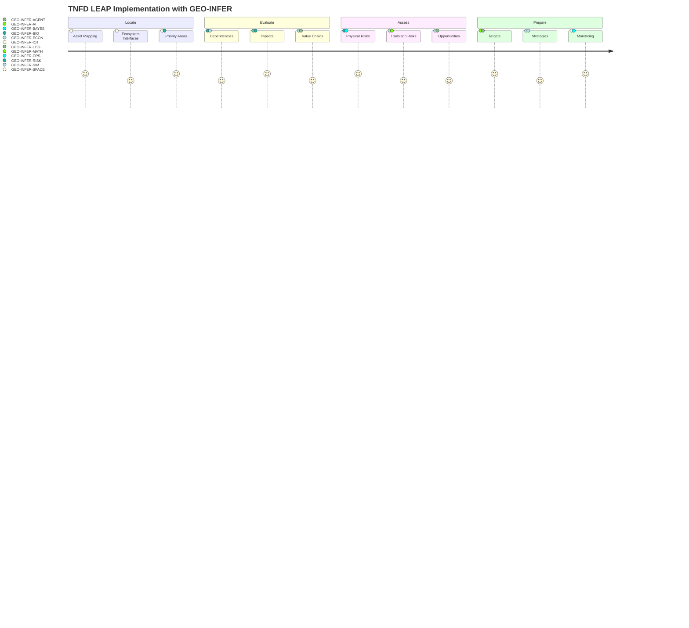

### Locate: Geospatial Asset Mapping

GEO-INFER's [spatial intelligence core](../../GEO-INFER-SPACE/README.md) provides comprehensive support for the "Locate" phase of TNFD's LEAP methodology:

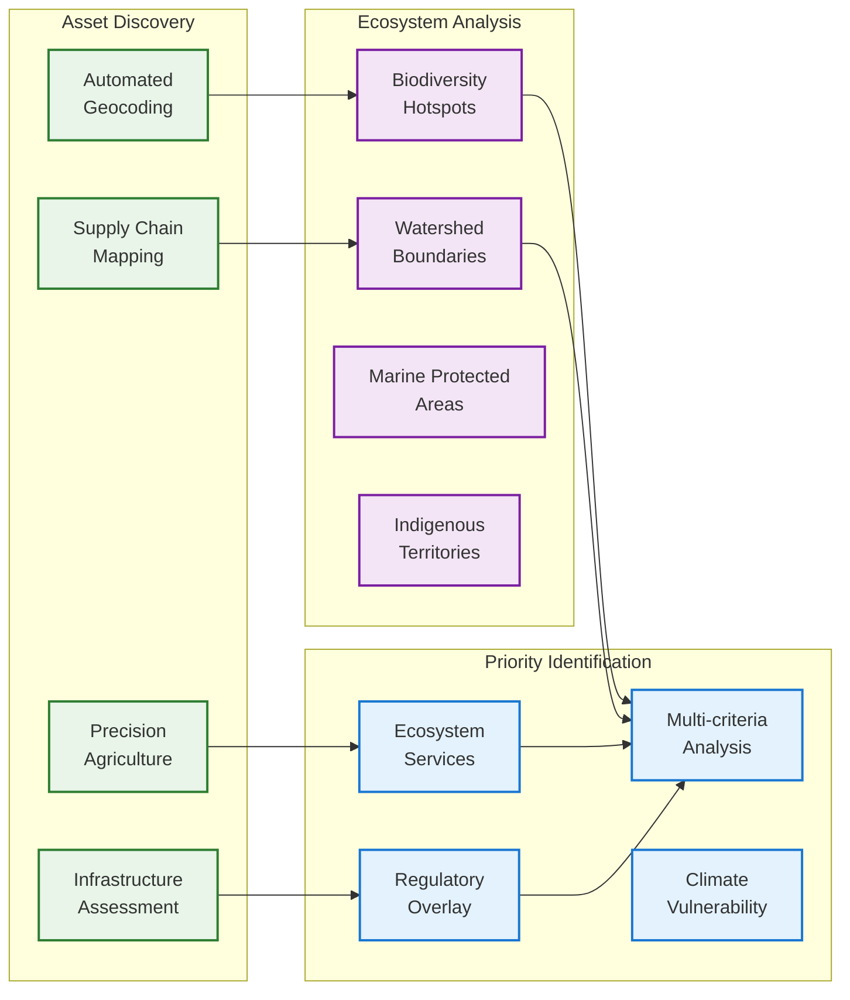

**Asset Geolocation and Mapping**:
- Automated geocoding of organizational assets and operations using [GEO-INFER-SPACE](../../GEO-INFER-SPACE/README.md) capabilities
- Supply chain mapping using trade flow data and satellite imagery integrated through [GEO-INFER-DATA](../../GEO-INFER-DATA/README.md)
- Precision agriculture monitoring for land-use operations leveraging [GEO-INFER-AG](../../GEO-INFER-AG/README.md)
- Infrastructure impact assessment for linear assets (pipelines, transmission lines)

**Ecosystem Interface Analysis**:
- Biodiversity hotspot proximity analysis for operational sites using [GEO-INFER-BIO](../../GEO-INFER-BIO/README.md) data
- Watershed and airshed impact boundary mapping
- Marine protected area interaction assessment for offshore operations
- Indigenous territory and community land rights mapping respecting [data sovereignty principles](../ontology/integration.md)

**Priority Area Identification**:
- Multi-criteria spatial analysis for high-risk area identification using [GEO-INFER-MATH](../../GEO-INFER-MATH/README.md) algorithms
- Ecosystem service dependency mapping at asset level
- Climate change vulnerability assessment for operational sites
- Regulatory risk overlay analysis including protected area designations using [GEO-INFER-RISK](../../GEO-INFER-RISK/README.md)

### Evaluate: Dependency and Impact Assessment

The project's biological and economic analysis capabilities directly support comprehensive dependency and impact evaluation:

**Natural Asset Dependency Analysis**:
- Water dependency assessment including quantity, quality, and timing requirements
- Pollination service dependency for agricultural operations
- Climate regulation dependency assessment for climate-sensitive operations
- Raw material dependency tracking from ecosystem sources

**Impact Assessment Methodology**:
- Direct impact assessment using before/after satellite analysis
- Indirect impact assessment through value chain analysis
- Cumulative impact assessment at landscape and regional scales
- Positive impact quantification for restoration and conservation activities

**Ecosystem Service Quantification**:
- Economic valuation of ecosystem service dependencies
- Risk assessment for ecosystem service disruption
- Alternative ecosystem service source identification
- Ecosystem service degradation trend analysis

### Assess: Risk and Opportunity Transformation

GEO-INFER's economic modeling and risk assessment capabilities transform environmental data into financial risk and opportunity metrics:

**Physical Risk Assessment**:
- Acute physical risk assessment from extreme weather events
- Chronic physical risk assessment from long-term environmental changes
- Ecosystem collapse risk assessment using ecological tipping point analysis
- Resource scarcity risk assessment including water and raw material availability

**Transition Risk Assessment**:
- Policy risk assessment from changing environmental regulations
- Market risk assessment from shifting consumer preferences toward sustainability
- Technology risk assessment from nature-positive innovation adoption
- Reputation risk assessment from nature-related controversies

**Opportunity Identification**:
- Nature-positive investment opportunity mapping
- Ecosystem restoration potential assessment
- Sustainable supply chain development opportunities
- Natural capital financing opportunity identification

### Prepare: Strategy and Action Planning

The framework's planning and optimization capabilities support comprehensive strategy development:

**Target Setting and Planning**:
- Science-based target development using biodiversity impact models
- Conservation priority identification using systematic conservation planning
- Restoration opportunity assessment using ecosystem recovery potential
- Timeline optimization for nature-positive transition planning

**Implementation Strategy Development**:
- Cost-benefit analysis for nature-positive interventions
- Implementation pathway optimization using multi-criteria decision analysis
- Stakeholder engagement strategy development including Indigenous consultation protocols
- Monitoring and verification system design for impact tracking

## AI-Driven SME Assessment Solutions

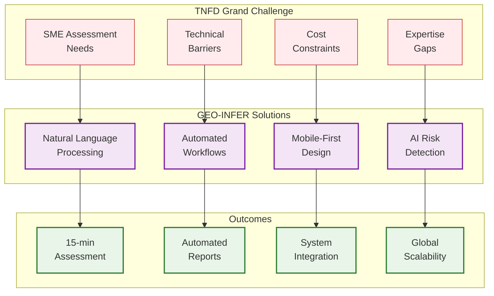

### Addressing the Grand Challenge

GEO-INFER's [AI capabilities](../../GEO-INFER-AI/README.md) directly address TNFD's Grand Challenge to develop technology solutions enabling SMEs to conduct rapid nature-related assessments:

**Simplified Assessment Interfaces**:
- Natural language query interfaces for non-technical users leveraging [GEO-INFER-COG](../../GEO-INFER-COG/README.md) cognitive modeling
- Automated assessment workflow generation based on business sector and location using [workflow engine](../workflows/index.md)
- Pre-configured assessment templates for common SME operation types
- Mobile-first interfaces for field-based assessment activities through [GEO-INFER-APP](../../GEO-INFER-APP/README.md)

**AI-Powered Risk Identification**:
- Automated asset geolocation using business registration and satellite data via [GEO-INFER-SPACE](../../GEO-INFER-SPACE/README.md)
- Machine learning-based ecosystem impact prediction from minimal input data
- Automated supply chain risk assessment using trade database analysis through [GEO-INFER-LOG](../../GEO-INFER-LOG/README.md)
- Intelligent questionnaire adaptation based on user responses and context using [active inference principles](../active_inference_guide.md)

**Rapid Assessment Methodology**:
- 15-minute initial assessment for basic nature-related risk screening
- Progressive disclosure enabling deeper analysis for high-risk areas
- Automated report generation with sector-specific recommendations
- Integration with existing SME management systems and workflows via [GEO-INFER-API](../../GEO-INFER-API/README.md)

### Technology Innovation Focus Areas

**Artificial Intelligence Applications**:
- Computer vision for automated ecosystem monitoring from user-uploaded imagery
- Natural language processing for extracting nature-related information from business documents
- Machine learning for predictive risk modeling with limited historical data
- Expert system development for automated assessment guidance

**Digital Solution Development**:
- Progressive web applications for cross-platform accessibility
- Offline capability for areas with limited internet connectivity
- Multi-language support for global SME adoption
- Integration APIs for embedding in existing business software

**Emerging Market Accessibility**:
- Low-bandwidth optimization for developing economy internet infrastructure
- Local ecosystem data integration for region-specific assessments
- Cultural adaptation including Indigenous knowledge system integration
- Micro-payment systems for affordable access to premium features

## Partnership Integration and Collaboration

### Strategic Partnership Alignment

GEO-INFER's development directly supports and enhances TNFD's extensive partnership network:

**Open Geospatial Consortium (OGC) Integration**:
- Native support for OGC standards including WMS, WFS, and GeoPackage
- Participation in OGC working groups for environmental data standards
- Implementation of OGC SensorThings API for IoT environmental monitoring
- Support for OGC Testbed initiatives for interoperability testing

**UNEP-WCMC Collaboration**:
- Integration with World Database on Protected Areas (WDPA)
- Species occurrence data integration from GBIF and UNEP-WCMC databases
- Ecosystem service mapping collaboration using UNEP-WCMC methodologies
- Support for Key Biodiversity Area (KBA) assessment and monitoring

**Esri Partnership Enhancement**:
- Native ArcGIS integration for enterprise GIS environments
- Esri Living Atlas data integration for comprehensive environmental baselines
- Support for ArcGIS Online for cloud-based SME solutions
- Collaboration on geospatial AI development for nature assessment

**WWF Geospatial ESG Consortium Integration**:
- Technical contribution to Biodiversity Data Puzzle Report recommendations
- Implementation of geospatially-driven approaches for commercial asset assessment
- Support for WWF's natural value benefits quantification methodologies
- Collaboration on capital realignment toward sustainable development

### Academic and Research Collaboration

**University of Zurich Partnership**:
- Research collaboration on ecosystem service economic valuation
- Student exchange programs for interdisciplinary environmental finance research
- Joint development of open-source tools for nature-related risk assessment
- Publication collaboration on geospatial approaches to sustainable finance

**Conservation X Labs Innovation Network**:
- Participation in open innovation challenges for biodiversity technology
- Mentorship programs for startups developing nature assessment tools
- Technical advisory services for emerging conservation technologies
- Platform integration for Conservation X Labs challenge submissions

## Implementation Roadmap and Technical Specifications

### Phase 1: Foundation Integration (Q1-Q2 2025)

**NDPF Technical Infrastructure Development**:
- Deploy federated data architecture supporting TNFD data sovereignty principles
- Implement OGC-compliant APIs for standardized data access
- Establish data quality assessment automation using machine learning validation
- Create beta testing environment for TNFD pilot program participants

**LEAP Methodology Operationalization**:
- Develop automated asset geolocation and ecosystem interface mapping
- Implement biodiversity dependency assessment algorithms
- Create risk transformation models for physical and transition risks
- Establish strategy optimization tools for nature-positive planning

**SME Assessment Platform Development**:
- Launch simplified assessment interface with natural language interaction
- Deploy machine learning models for rapid risk identification
- Create sector-specific assessment templates and guidance
- Establish mobile-responsive web platform with offline capabilities

### Phase 2: Pilot Testing and Validation (Q3-Q4 2025)

**TNFD Pilot Program Support**:
- Provide technical infrastructure for upstream data provider testing
- Support downstream user experience validation through beta platform access
- Enable market use case testing across corporate reporting, target setting, and transition planning
- Collect and analyze user feedback for platform optimization

**Partnership Integration Expansion**:
- Complete OGC standards compliance certification
- Establish data sharing agreements with UNEP-WCMC and GBIF
- Deploy Esri ArcGIS native integration for enterprise users
- Launch collaborative research initiatives with academic partners

**AI and Automation Enhancement**:
- Deploy advanced computer vision for automated ecosystem monitoring
- Implement natural language processing for document analysis
- Launch predictive modeling for nature-related risk forecasting
- Establish expert system guidance for assessment workflow optimization

### Phase 3: Global Deployment and Scaling (2026-2027)

**NDPF Production Deployment**:
- Launch production Nature Data Public Facility infrastructure
- Establish global content delivery network for optimal performance
- Implement comprehensive security and privacy protection systems
- Deploy automated monitoring and maintenance systems

**SME Global Accessibility**:
- Launch multi-language platform supporting major global languages
- Deploy regional ecosystem data integration for location-specific assessments
- Establish micro-payment systems for emerging market accessibility
- Create local partnership networks for on-ground support

**Advanced Capability Development**:
- Deploy real-time satellite monitoring for continuous assessment updates
- Implement blockchain-based verification for nature-positive claims
- Launch AI-powered portfolio optimization for nature-related investment
- Establish automated regulatory compliance monitoring and reporting

## Data Governance and Quality Assurance

### TNFD Data Principles Implementation

GEO-INFER's data governance framework directly implements TNFD's nature data principles:

**Accuracy and Reliability**:
- Multi-source data validation using independent verification systems
- Uncertainty quantification and confidence interval reporting
- Peer review integration for scientific data quality assurance
- Automated anomaly detection for data quality monitoring

**Accessibility and Interoperability**:
- Open API access with comprehensive documentation and examples
- Standard data format support including GeoJSON, NetCDF, and HDF5
- Metadata standardization using Dublin Core and ISO 19115 standards
- Federated search capabilities across distributed data providers

**Transparency and Traceability**:
- Complete data provenance tracking from source to final analysis
- Open-source algorithm implementation for reproducible analysis
- Comprehensive audit logging for all data access and processing activities
- Public documentation of methodology and limitation acknowledgments

**Relevance and Fitness for Purpose**:
- User-driven data product development based on TNFD use case requirements
- Continuous feedback integration for data product improvement
- Performance monitoring against defined use case success criteria
- Regular stakeholder consultation for relevance validation

### Privacy and Security Framework

**Data Sovereignty Protection**:
- Cryptographic access control with granular permission management
- Geographic data residency compliance with local data sovereignty requirements
- Indigenous data governance protocol implementation
- Differential privacy techniques for sensitive ecosystem information

**Security Architecture**:
- Zero-trust security model with continuous authentication and authorization
- End-to-end encryption for all data transmission and storage
- Regular security auditing and penetration testing
- Incident response planning and disaster recovery procedures

## Market Impact and Financial Transformation

### Capital Flow Redirection Mechanisms

GEO-INFER's implementation directly supports TNFD's objective to redirect global financial flows toward nature-positive outcomes:

**Investment Decision Support**:
- Portfolio-level nature risk assessment for institutional investors
- Asset-level nature opportunity identification for targeted investment
- Due diligence automation for nature-related investment screening
- Performance monitoring for nature-positive investment tracking

**Financial Product Development**:
- Nature-linked bond structuring using verified ecosystem metrics
- Green taxonomy compliance verification for sustainable finance products
- Catastrophe risk modeling for nature-related insurance product development
- Impact measurement and management for nature-focused funds

**Regulatory Compliance Automation**:
- EU CSRD reporting automation with nature-related disclosure generation
- SFDR Principal Adverse Impact indicator calculation and reporting
- National biodiversity strategy and action plan (NBSAP) compliance monitoring
- Central bank climate risk stress testing with nature-related scenarios

### Economic Transformation Indicators

**Market Efficiency Enhancement**:
- Reduced information asymmetries through standardized nature risk data
- Lower transaction costs for nature-related due diligence
- Improved price discovery for natural capital and ecosystem services
- Enhanced market liquidity for nature-positive investments

**Systemic Risk Reduction**:
- Early warning systems for ecosystem tipping points affecting financial stability
- Diversification strategies reducing concentration in nature-dependent sectors
- Scenario planning for nature-related financial system stress testing
- Macroprudential policy support through systemic nature risk monitoring

## Conclusion and Future Vision

The convergence of GEO-INFER and TNFD represents a transformative opportunity to operationalize nature-related financial disclosures at unprecedented scale and sophistication. GEO-INFER's comprehensive technological infrastructure—spanning geospatial intelligence, active inference agents, biological assessment, economic modeling, and AI-driven accessibility—provides the technical foundation necessary to realize TNFD's vision of a world where financial flows support nature-positive outcomes.

### Strategic Value Proposition

**For Financial Institutions**:
GEO-INFER enables comprehensive nature-related risk assessment across portfolios, supporting informed investment decisions and regulatory compliance while identifying nature-positive opportunities for sustainable returns.

**For Corporations**:
The framework provides scalable tools for understanding and managing nature-related dependencies and impacts, supporting TNFD disclosure requirements while enabling strategic planning for nature-positive business model transition.

**For SMEs and Emerging Markets**:
AI-driven assessment tools democratize access to sophisticated nature-related risk evaluation, enabling participation in sustainable supply chains and access to nature-positive financing opportunities.

**For Data Providers and Scientists**:
The distributed platform amplifies the impact of environmental research and monitoring by connecting scientific data with financial decision-making processes, supporting evidence-based conservation and restoration efforts.

### Innovation and Technology Leadership

GEO-INFER's implementation positions both the project and TNFD at the forefront of several emerging technology trends:

**Geospatial AI and Earth Observation**:
Advanced integration of satellite data, machine learning, and geospatial analysis creates new capabilities for real-time ecosystem monitoring and predictive risk assessment.

**Distributed Intelligence and Active Inference**:
Agent-based systems enable adaptive, context-aware nature assessment that continuously improves based on new data and changing environmental conditions.

**Federated Data Systems and Sovereignty**:
Technical solutions for data sharing that respect Indigenous rights and national sovereignty while enabling global collaboration on nature conservation.

**Democratized Environmental Intelligence**:
AI-powered tools that make sophisticated environmental analysis accessible to organizations of all sizes, supporting inclusive participation in nature-positive economic transformation.

### Global Impact Potential

The successful integration of GEO-INFER and TNFD has the potential to catalyze systemic change in how human economic systems interact with natural systems:

**Biodiversity Conservation at Scale**:
By connecting financial incentives with biodiversity outcomes, the integrated framework can mobilize unprecedented resources for ecosystem protection and restoration.

**Climate and Nature Nexus**:
Comprehensive assessment of climate-nature interactions supports integrated approaches to environmental challenges that address root causes rather than symptoms.

**Social Justice and Environmental Equity**:
Emphasis on Indigenous knowledge systems and community engagement ensures that nature-positive economic transformation supports rather than displaces vulnerable communities.

**Scientific Innovation and Evidence-Based Policy**:
The platform creates new opportunities for collaborative research and evidence generation that supports effective environmental policy development and implementation.

### Call to Action

The alignment between GEO-INFER and TNFD creates an opportunity for coordinated action that can accelerate the transition to a nature-positive economy. Success requires:

**Collaborative Development**:
Active participation from both projects in joint technical development, standard setting, and platform integration to maximize complementarity and avoid duplication.

**Stakeholder Engagement**:
Inclusive consultation with Indigenous peoples, local communities, data providers, financial institutions, and technology developers to ensure solutions meet diverse needs and respect rights.

**Open Innovation**:
Commitment to open-source development, transparent methodology, and collaborative governance that enables global participation in platform development and governance.

**Sustained Investment**:
Long-term funding commitments that support platform development, data quality assurance, capacity building, and global accessibility for organizations of all sizes.

The convergence of GEO-INFER and TNFD represents more than technological integration—it embodies a fundamental shift toward economic systems that recognize, value, and protect the natural world upon which all prosperity ultimately depends. Through coordinated action and sustained commitment, this integration can help realize the shared vision of a world where financial flows support the flourishing of both human and natural communities.

# GEO-INFER Technical Integration with TNFD

## Comprehensive Technical Framework

GEO-INFER provides a comprehensive technical framework that directly supports and enhances TNFD's objectives through its modular architecture. Each module contributes specific capabilities that align with different aspects of nature-related assessment, monitoring, and reporting.

### LEAP Framework Integration

The following diagram illustrates how GEO-INFER's modules map to TNFD's LEAP framework:

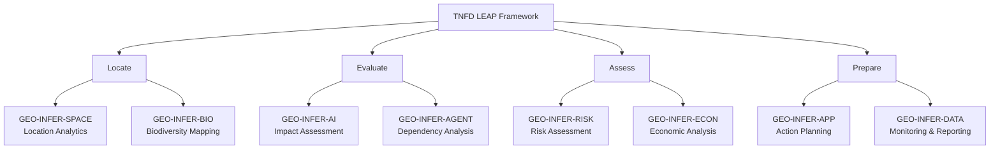

### Nature Data Public Facility Integration

GEO-INFER's integration with the Nature Data Public Facility (NDPF) enables seamless data flow from various sources to end-user applications:

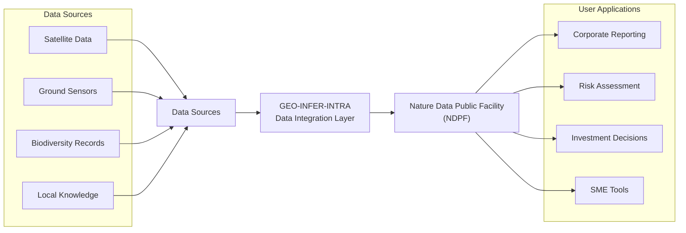

## Module-Specific Capabilities

### GEO-INFER-SPACE: Geospatial Engine

The core geospatial engine provides advanced capabilities for:
- High-resolution satellite imagery analysis
- Real-time location-based analytics
- Spatial data integration and harmonization
- Custom geospatial index development

### GEO-INFER-BIO: Biodiversity Assessment

Specialized tools for biodiversity monitoring and assessment:
- Species distribution modeling
- Ecosystem health indicators
- Habitat connectivity analysis
- Biodiversity impact quantification

### GEO-INFER-AI: Intelligent Analysis

AI-driven capabilities for nature-related assessment:
- Automated impact detection
- Pattern recognition in environmental data
- Predictive modeling of ecosystem changes
- Natural language processing for environmental reports

### GEO-INFER-AGENT: Autonomous Monitoring

Autonomous agent systems for continuous environmental monitoring:
- Automated data collection and validation
- Real-time anomaly detection
- Adaptive sampling strategies
- Intelligent sensor network management

## SME Support Features

### Simplified Assessment Tools

GEO-INFER provides specialized tools for SMEs that simplify nature-related assessments:
- Pre-configured assessment templates
- Industry-specific guidance
- Automated data collection and analysis
- Simplified reporting formats

### AI-Assisted Analysis

The platform leverages AI to assist SMEs in:
- Identifying relevant nature-related risks
- Assessing dependencies on natural resources
- Evaluating potential impacts on biodiversity
- Generating standardized reports

## Data Quality and Governance

### Data Quality Framework

GEO-INFER implements a comprehensive data quality framework aligned with TNFD principles:
- Automated data validation
- Quality assurance protocols
- Data lineage tracking
- Uncertainty quantification

### Governance Controls

The platform includes robust governance features:
- Access control and authentication
- Audit trails for data modifications
- Version control for assessments
- Compliance monitoring tools

## Future Development Roadmap

### Technical Enhancements

Planned technical improvements include:
- Enhanced machine learning capabilities
- Expanded satellite data integration
- Improved real-time monitoring
- Advanced visualization tools

### Integration Priorities

Key integration priorities for the next phase:
- Enhanced NDPF connectivity
- Expanded API capabilities
- Improved interoperability with existing systems
- Enhanced support for emerging standards

## Implementation Support

### Technical Documentation

Comprehensive technical documentation is available:
- API references
- Integration guides
- Best practice recommendations
- Use case examples

### Capacity Building

GEO-INFER provides extensive support for capacity building:
- Training materials
- Implementation workshops
- Technical support services
- Community knowledge sharing

## Conclusion

GEO-INFER's technical framework provides a robust foundation for implementing TNFD recommendations across organizations of all sizes. The modular architecture ensures flexibility and scalability, while the integrated AI capabilities make nature-related assessments more accessible and efficient. Through continuous development and enhancement of these capabilities, GEO-INFER remains at the forefront of supporting global nature-related risk assessment and disclosure requirements.

# Implementation Case Studies

## Agricultural Sector Implementation

### Challenge
A large agricultural corporation needed to assess its dependencies and impacts on natural ecosystems across multiple growing regions, particularly focusing on water resources and pollination services.

### Solution
GEO-INFER deployment included:
- Satellite-based monitoring of crop health and water usage
- Integration of local biodiversity data for pollinator assessment
- Real-time water quality monitoring through sensor networks
- AI-driven prediction of ecosystem service dependencies

### Outcomes
- 30% improvement in water use efficiency
- Enhanced understanding of pollination service dependencies
- Automated TNFD-aligned reporting capabilities
- Improved risk management and mitigation strategies

## Urban Development Assessment

### Challenge
A real estate development company required comprehensive nature-related risk assessment for a new sustainable urban development project.

### Solution
Implemented GEO-INFER tools for:
- Habitat connectivity analysis
- Ecosystem service valuation
- Impact prediction modeling
- Biodiversity offset planning

### Outcomes
- Identified critical wildlife corridors
- Quantified ecosystem service values
- Developed science-based mitigation strategies
- Achieved TNFD compliance in reporting

## Financial Institution Integration

### Challenge
A global investment firm needed to assess nature-related risks across its portfolio of infrastructure investments.

### Solution
GEO-INFER provided:
- Portfolio-wide nature risk screening
- Asset-level impact assessment
- Automated monitoring and reporting
- Integration with existing ESG frameworks

### Outcomes
- Comprehensive nature risk assessment
- Enhanced due diligence processes
- Improved stakeholder communication
- TNFD-aligned disclosure capabilities

## SME Implementation Example

### Challenge
A medium-sized forestry company needed cost-effective tools for nature-related assessment and reporting.

### Solution
Deployed simplified GEO-INFER tools including:
- Pre-configured assessment templates
- Automated data collection
- AI-assisted analysis
- Streamlined reporting

### Outcomes
- Reduced assessment costs
- Improved data quality
- Enhanced reporting capabilities
- Better risk management

## Lessons Learned

### Implementation Process Overview

The following diagram illustrates the key phases and success factors in GEO-INFER implementation:

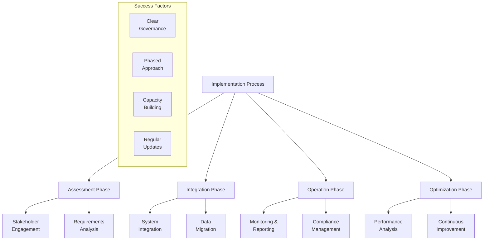

### Key Success Factors
- Early stakeholder engagement
- Clear data governance frameworks
- Phased implementation approach
- Regular capability updates

### Common Challenges
- Data quality variability
- Integration with legacy systems
- Capacity building needs
- Resource constraints

### Best Practices
- Start with pilot projects
- Focus on material issues
- Leverage automated tools
- Build internal capacity

## Future Directions

### Emerging Applications
- Real-time biodiversity monitoring
- Advanced ecosystem modeling
- Enhanced predictive capabilities
- Improved integration with financial systems

### Innovation Opportunities
- Machine learning advancements
- Sensor technology integration
- Blockchain for data verification
- Enhanced visualization tools

These case studies demonstrate GEO-INFER's practical application across different sectors and scales, highlighting its flexibility and effectiveness in supporting TNFD implementation. The lessons learned and best practices identified provide valuable guidance for organizations beginning their nature-related assessment journey. 