# Active Inference Workflows in Geospatial Contexts

This document details how active inference principles are implemented in workflows across the GEO-INFER framework. These workflows demonstrate the practical application of free energy principles in geospatial analysis and modeling.

## Active Inference Process Overview

The core active inference process follows this general workflow:

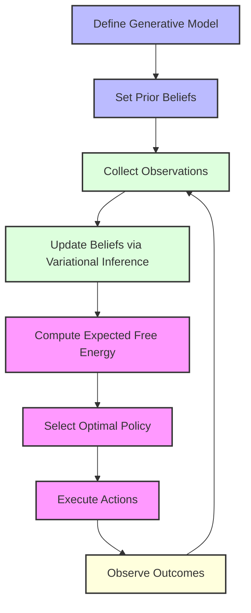

## Spatial Active Inference Workflow

In geospatial contexts, active inference involves spatial components:

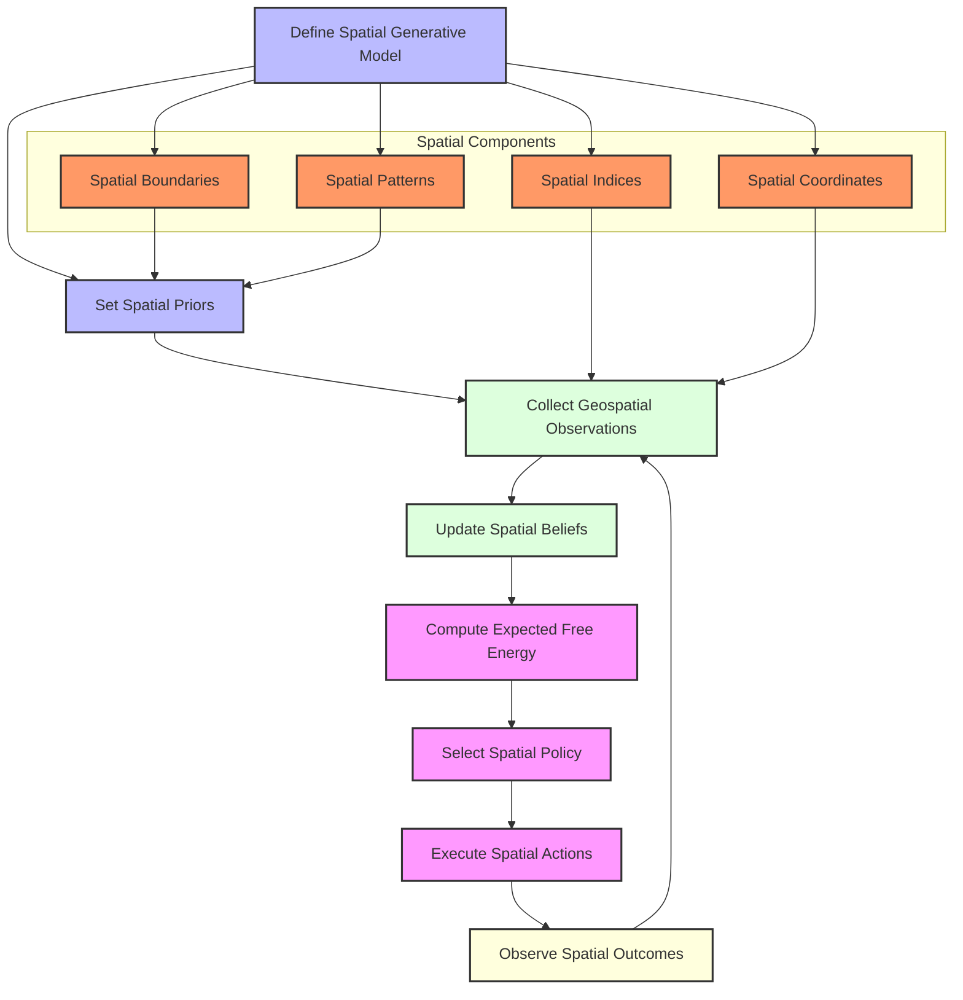

## Temporal Active Inference Workflow

When incorporating temporal dynamics:

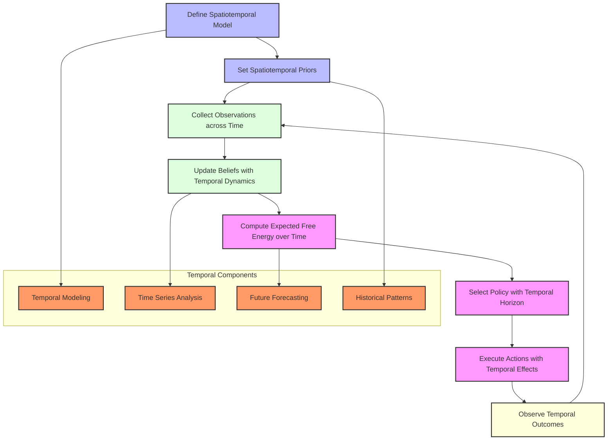

## Multi-Scale Active Inference

When working across different spatial scales:

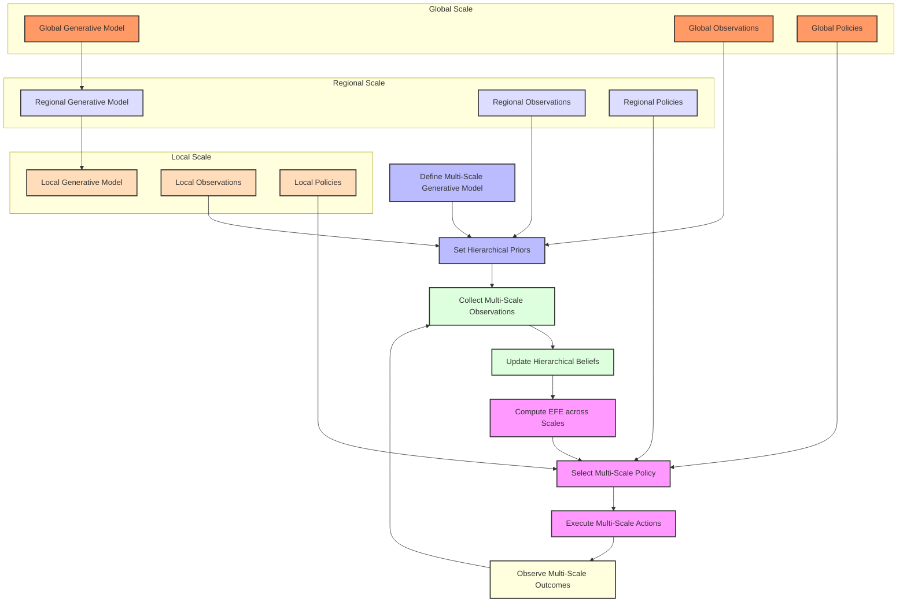

## Active Inference Components

The key components in an active inference workflow:

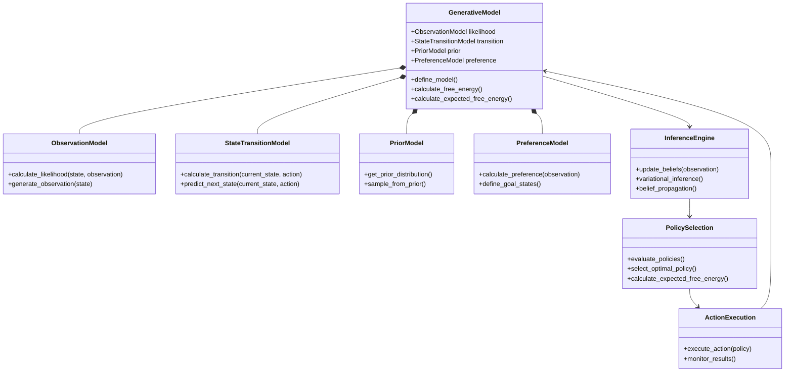

## Geospatial Active Inference Implementation

This diagram shows a concrete implementation in the GEO-INFER framework:

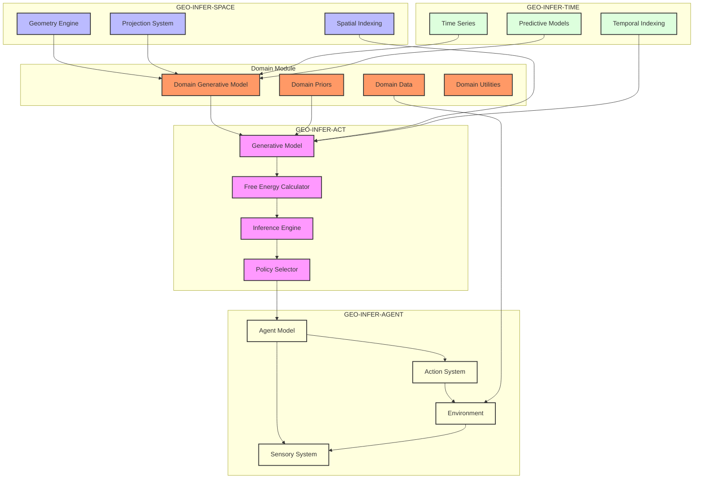

## Workflow Sequence: Land Use Prediction

Example of a complete active inference workflow for land use prediction:

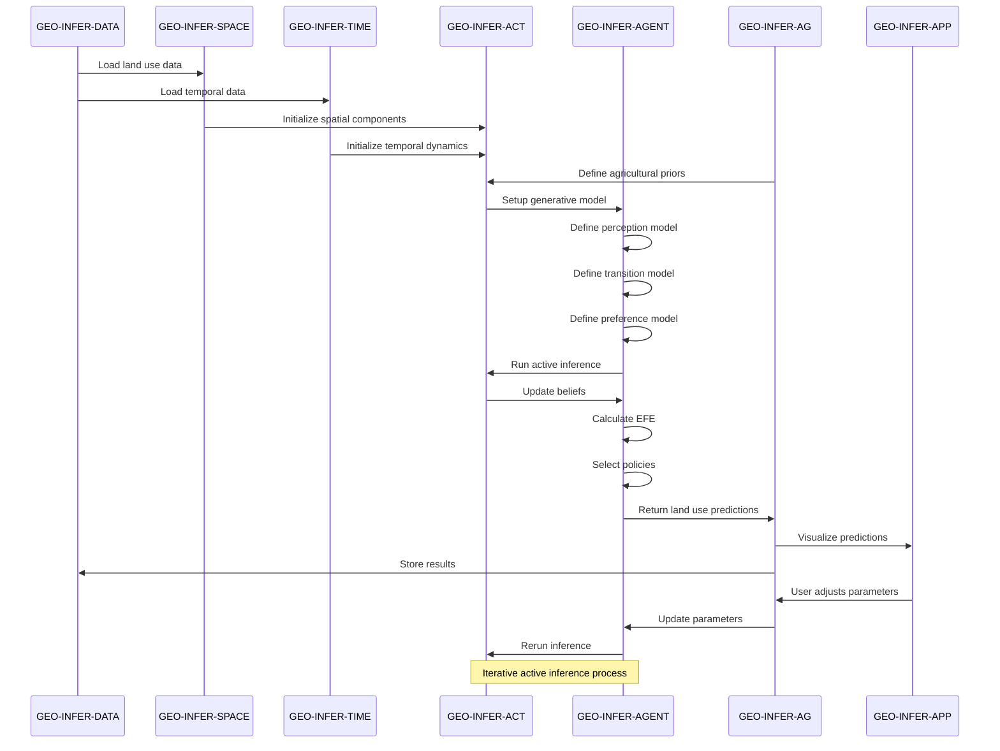

## Hierarchical Perception

Hierarchical perception across scales in geospatial active inference:

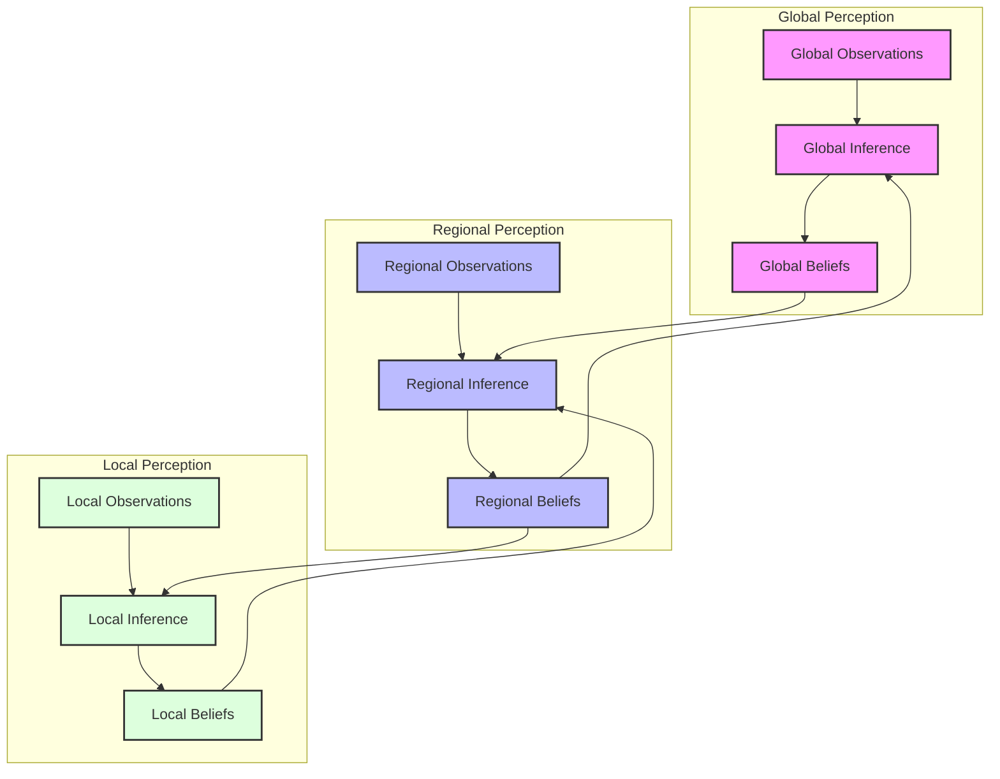

## Example: Drought Prediction Workflow

A concrete example of an active inference workflow for drought prediction:

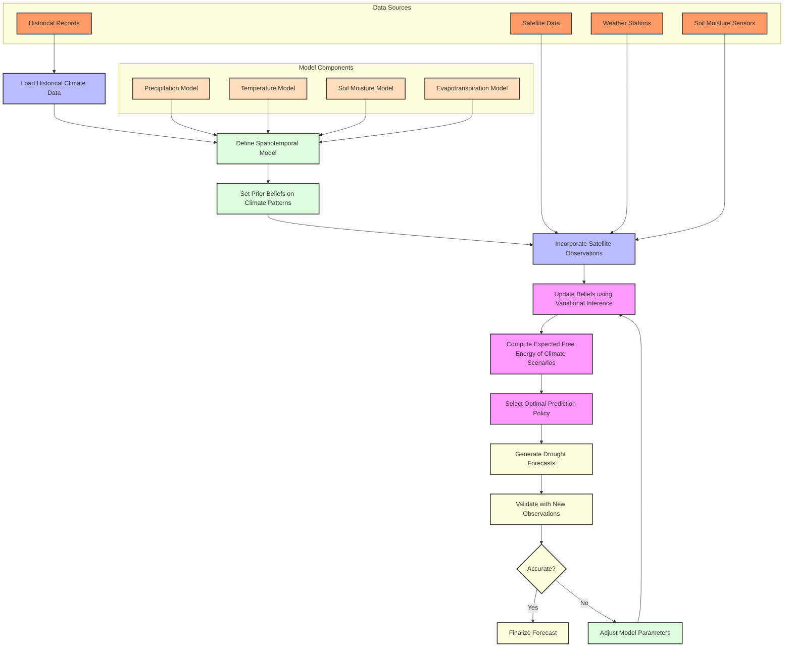

## Policy Selection Process

Detailed view of how policies are evaluated and selected in geospatial active inference:

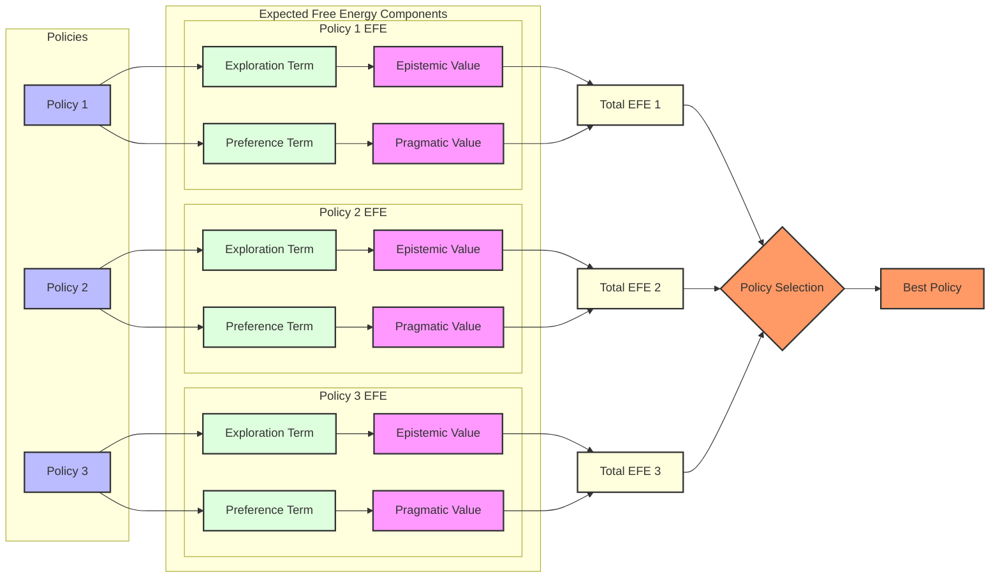

## Implementation in Codebase

The relationship between the workflow design and actual GEO-INFER code:

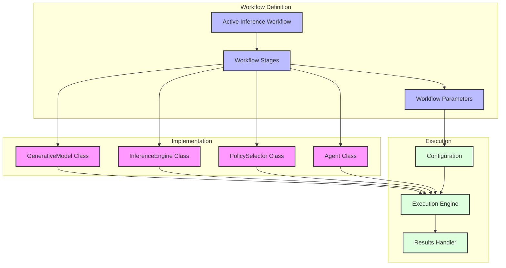

## Key Workflow Templates

The GEO-INFER framework provides several workflow templates for common active inference scenarios in geospatial contexts:

1. **Spatial Belief Updating** - A workflow for updating beliefs about spatial patterns based on new observations
2. **Temporal Forecasting** - A workflow for predicting future states using active inference principles
3. **Multi-Scale Analysis** - A workflow that integrates information across different spatial scales
4. **Agent-Based Simulation** - A workflow for simulating the behavior of multiple agents in a spatial environment
5. **Risk Assessment** - A workflow for assessing risks using active inference to quantify uncertainty
6. **Adaptive Sampling** - A workflow for determining optimal locations for new observations
7. **Intervention Planning** - A workflow for evaluating potential interventions in a spatial system

## Using the Active Inference Workflow Templates

To use these workflow templates:

1. Import the appropriate template from `geo_infer_intra.workflows.templates.active_inference`
2. Configure the template parameters for your specific use case
3. Connect the template to your data sources and sinks
4. Execute the workflow using the workflow engine
5. Analyze and visualize the results

See the [Examples Directory](../examples/workflows/active_inference/) for complete examples of each workflow template. 