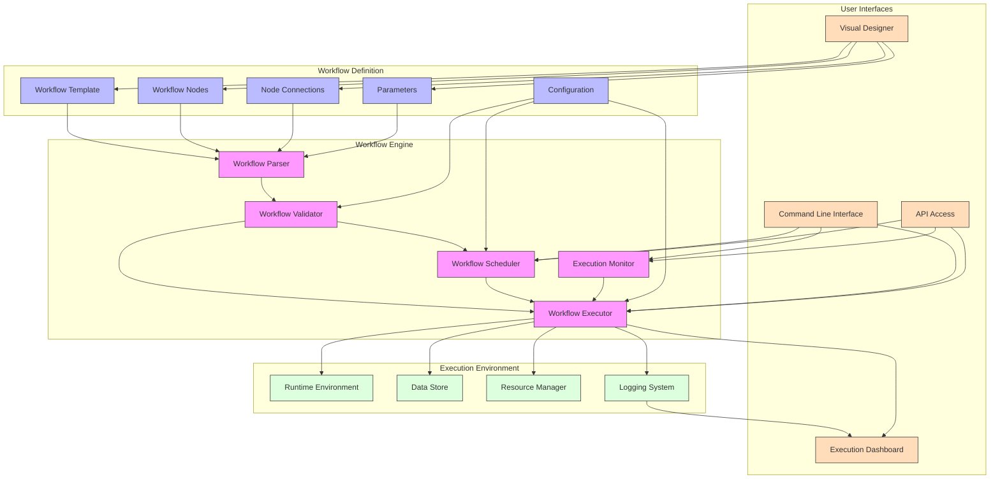
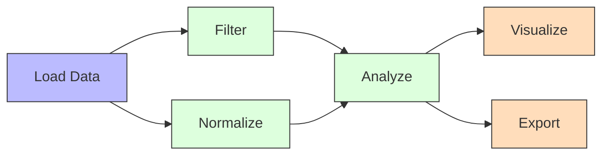
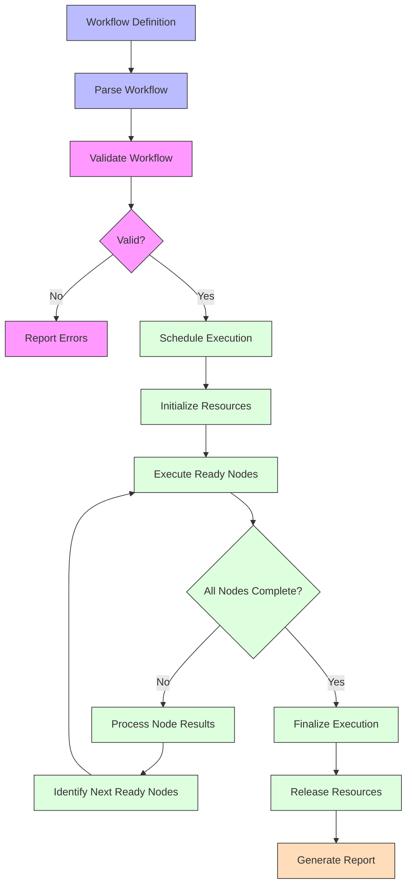
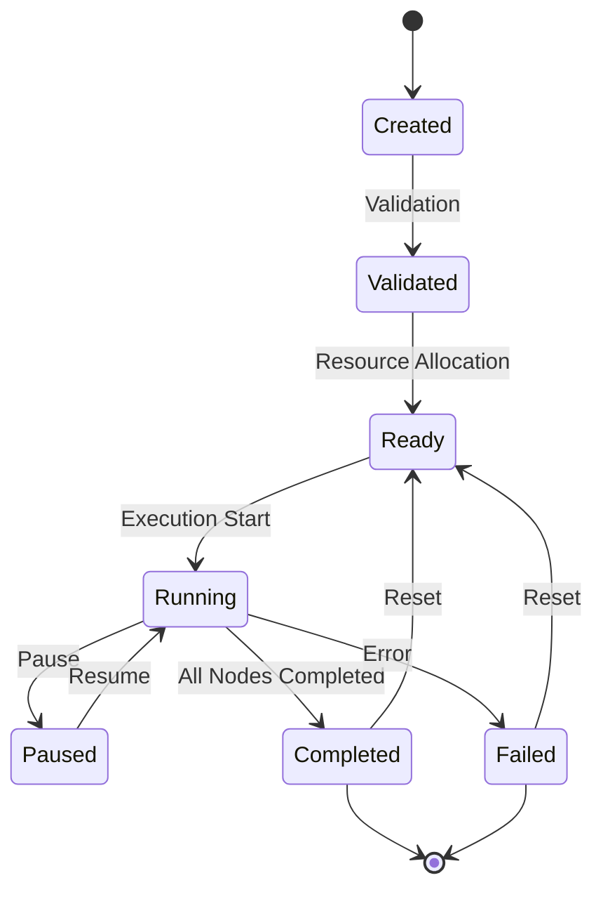
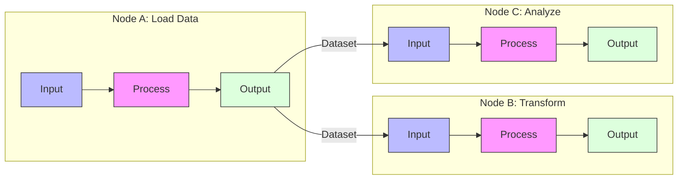
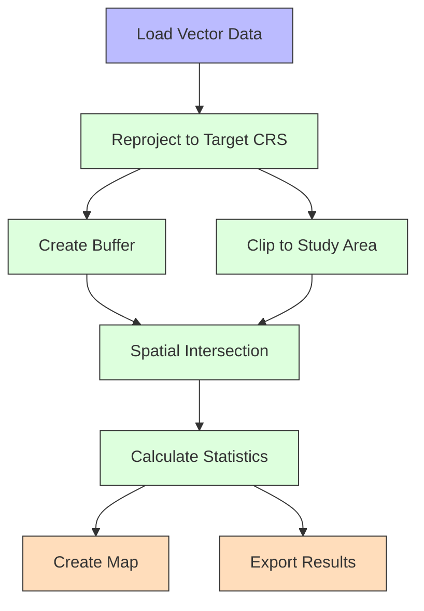
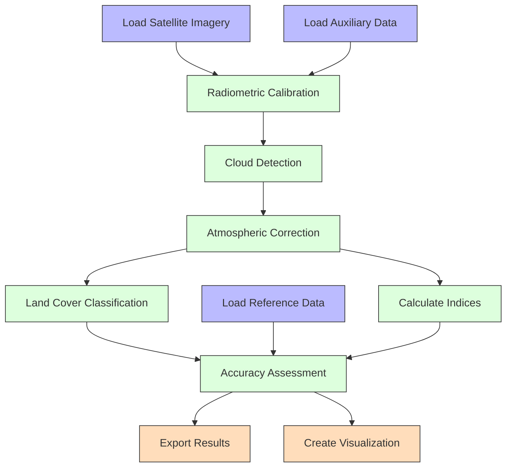
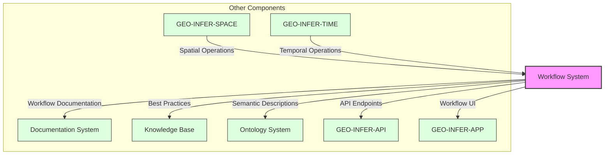

# Workflow System

The GEO-INFER workflow system provides a flexible framework for designing, executing, and managing geospatial data processing and analysis workflows. This document outlines the core components, concepts, and usage of the workflow system.

## Contents

- [Workflow Overview](overview.md) - Introduction to workflows in GEO-INFER
- [Workflow Components](components.md) - Building blocks for workflows
- [Workflow Design](design.md) - Creating and designing workflows
- [Workflow Execution](execution.md) - Running and monitoring workflows
- [Workflow Templates](templates/index.md) - Ready-to-use workflow templates
- [Custom Workflow Nodes](custom_nodes.md) - Developing custom workflow components
- [Error Handling](error_handling.md) - Managing errors in workflows
- [Performance Optimization](optimization.md) - Optimizing workflow execution
- [API Reference](api_reference.md) - Workflow system API documentation

## Workflow Architecture

The GEO-INFER workflow system is built on a directed acyclic graph (DAG) architecture:



## Workflow Concepts

### Workflow Graph

A workflow is defined as a directed acyclic graph (DAG) where:

- **Nodes** represent processing steps or operations
- **Edges** represent data flow between nodes
- **Parameters** control the behavior of nodes
- **Data** flows along edges from source to target nodes

Example workflow graph:



### Node Types

The workflow system includes several built-in node types:

- **Data Source Nodes** - Load data from various sources
- **Processing Nodes** - Transform, filter, and analyze data
- **Visualization Nodes** - Create maps, charts, and other visualizations
- **Export Nodes** - Save results in different formats
- **Decision Nodes** - Control workflow branching based on conditions
- **Container Nodes** - Group related nodes for better organization
- **Link Nodes** - Connect workflows across different parts of a project

## Workflow Execution Process

The process of executing a workflow:



## Workflow State Management

Workflows maintain state information throughout execution:



## Data Flow

Data flows through a workflow along the edges connecting nodes:



## Example Workflows

### Spatial Analysis Workflow



### Remote Sensing Workflow



## Workflow API

Example code for working with the GEO-INFER workflow API:

```python
from geo_infer.workflow import WorkflowManager, WorkflowTemplate, Node, Connection

# Initialize workflow manager
wf_manager = WorkflowManager()

# Create a new workflow from template
template = WorkflowTemplate.load("spatial_analysis")
workflow = wf_manager.create_workflow(template, name="Urban Growth Analysis")

# Customize workflow parameters
workflow.set_parameter("input_data", "urban_boundaries.geojson")
workflow.set_parameter("analysis_years", [2000, 2010, 2020])
workflow.set_parameter("buffer_distance", 500)

# Add a custom node
custom_node = Node(
    id="population_density",
    type="analysis",
    inputs=["urban_areas"],
    outputs=["density_map"],
    parameters={"resolution": "100m"}
)
workflow.add_node(custom_node)

# Connect the custom node
workflow.add_connection(
    Connection(
        source_node="urban_growth", 
        source_output="urban_areas",
        target_node="population_density", 
        target_input="urban_areas"
    )
)

# Validate the workflow
validation_results = workflow.validate()
if validation_results.is_valid:
    # Execute the workflow
    execution = wf_manager.execute_workflow(workflow)
    
    # Monitor execution
    while execution.is_running:
        status = execution.get_status()
        print(f"Progress: {status.progress}%")
        time.sleep(5)
    
    # Get results
    results = execution.get_results()
else:
    # Handle validation errors
    print(validation_results.errors)
```

## Workflow Templates

The GEO-INFER framework provides several pre-defined workflow templates for common geospatial tasks:

- **Spatial Analysis** - Vector data processing and analysis
- **Remote Sensing** - Satellite and aerial imagery processing
- **Terrain Analysis** - Digital elevation model processing
- **Network Analysis** - Transportation and utility network analysis
- **Time Series Analysis** - Temporal data processing
- **Data Preparation** - Data cleaning, transformation, and integration
- **Cartography** - Map generation and visualization
- **Geostatistics** - Spatial statistical analysis

See [Workflow Templates](templates/index.md) for detailed descriptions and usage instructions.

## Integration with Other Components

The workflow system integrates with other GEO-INFER components:



## Best Practices

- **Modular design** - Create reusable workflow components
- **Parameterization** - Make workflows configurable through parameters
- **Error handling** - Implement proper error handling and recovery
- **Documentation** - Document workflows and their components
- **Testing** - Test workflows with different inputs and parameters
- **Version control** - Maintain workflow versions
- **Monitoring** - Monitor workflow execution for performance issues
- **Resource management** - Efficiently manage computational resources

## Related Resources

- [Workflow Templates](templates/index.md)
- [API Reference](api_reference.md)
- [Geospatial Algorithms](../geospatial/algorithms/index.md)
- [GEO-INFER-SPACE Integration](../integration/geo_infer_space.md)
- [Performance Optimization](optimization.md) 