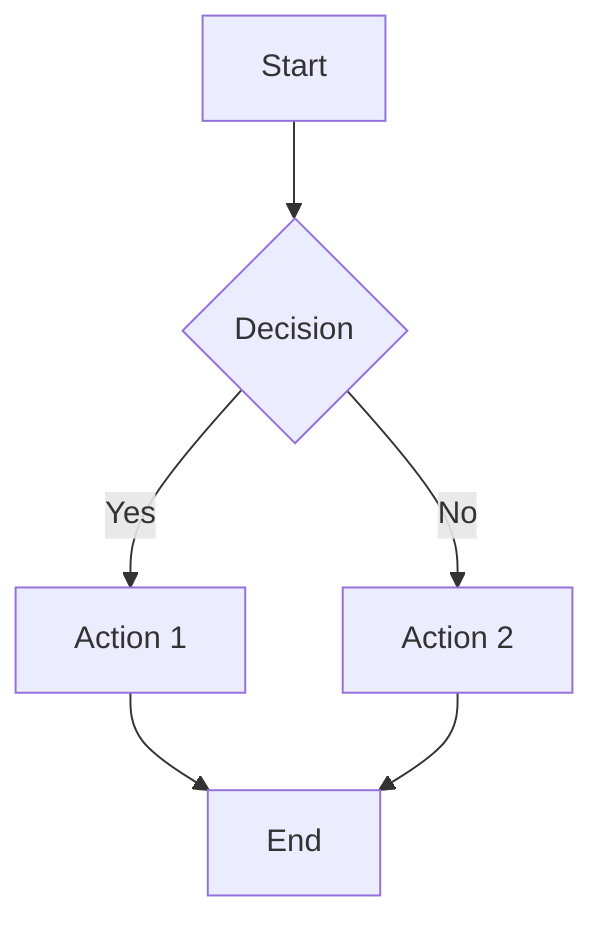

# Markdown to PDF Converter with Mermaid Support

A comprehensive Python script that converts Markdown files to PDF format with full support for Mermaid diagrams, automatic dependency management, and professional styling.

## Features

- ✅ **Mermaid Diagram Support**: Full support for all Mermaid diagram types
- ✅ **Automatic Dependencies**: Checks and installs required Node.js packages
- ✅ **Professional Styling**: GitHub-style markdown with customizable themes
- ✅ **Batch Processing**: Convert multiple files at once with glob patterns
- ✅ **Flexible Output**: Choose output directory or keep PDFs next to source files
- ✅ **Custom Configuration**: JSON-based configuration for advanced customization
- ✅ **Error Handling**: Comprehensive error reporting and logging

## Quick Start

### Prerequisites

The script requires **Node.js** to be installed on your system. All other dependencies will be installed automatically.

**Install Node.js:**
- **Ubuntu/Debian**: `sudo apt install nodejs npm`
- **macOS**: `brew install node` or download from [nodejs.org](https://nodejs.org)
- **Windows**: Download from [nodejs.org](https://nodejs.org)

### Basic Usage

```bash
# Convert a single markdown file
python markdown_to_pdf.py document.md

# Convert multiple files to a specific directory
python markdown_to_pdf.py docs/*.md --output-dir ./pdfs/

# Convert with custom styling
python markdown_to_pdf.py document.md --config example-config.json

# Check dependencies only
python markdown_to_pdf.py --check-deps
```

## Installation & Setup

1. **Download the script** to your project:
   ```bash
   # Copy from GEO-INFER-INTRA/src/
   cp /path/to/GEO-INFER-INTRA/src/markdown_to_pdf.py .
   cp /path/to/GEO-INFER-INTRA/src/example-config.json .
   ```

2. **Make executable** (Linux/macOS):
   ```bash
   chmod +x markdown_to_pdf.py
   ```

3. **First run** (installs dependencies):
   ```bash
   python markdown_to_pdf.py --check-deps
   ```

## Usage Examples

### Single File Conversion
```bash
# Basic conversion (PDF created next to .md file)
python markdown_to_pdf.py README.md

# Convert to specific location
python markdown_to_pdf.py README.md --output-dir ./output/
```

### Multiple File Conversion
```bash
# Convert all markdown files in a directory
python markdown_to_pdf.py docs/*.md --output-dir ./pdfs/

# Convert specific files
python markdown_to_pdf.py file1.md file2.md folder/*.md --output-dir ./output/
```

### Custom Configuration
```bash
# Use custom styling and options
python markdown_to_pdf.py document.md --config my-config.json

# Enable debug logging
python markdown_to_pdf.py document.md --log-level DEBUG
```

## Mermaid Diagram Support

The script fully supports all Mermaid diagram types. Simply include them in your markdown:

````markdown

````

### Supported Mermaid Diagrams
- Flowcharts (`graph` / `flowchart`)
- Sequence Diagrams (`sequenceDiagram`)
- Class Diagrams (`classDiagram`)
- State Diagrams (`stateDiagram`)
- Entity Relationship Diagrams (`erDiagram`)
- User Journey (`journey`)
- Gantt Charts (`gantt`)
- Pie Charts (`pie`)
- Requirement Diagrams (`requirementDiagram`)
- Git Graph (`gitgraph`)

## Configuration

### Default Configuration

The script uses sensible defaults with GitHub-style markdown rendering. No configuration needed for basic usage.

### Custom Configuration

Create a JSON configuration file for advanced customization:

```json
{
  "pdf_options": {
    "format": "A4",
    "margin": "20mm",
    "printBackground": true
  },
  "css": "/* Custom CSS styles */",
  "highlight_style": "github"
}
```

### Configuration Options

| Option | Description | Default |
|--------|-------------|---------|
| `stylesheet` | External CSS files to include | GitHub markdown CSS |
| `css` | Custom CSS styles | GitHub-compatible styles |
| `pdf_options.format` | Page format (A4, Letter, etc.) | `A4` |
| `pdf_options.margin` | Page margins | `20mm` |
| `pdf_options.printBackground` | Include background colors | `true` |
| `highlight_style` | Code syntax highlighting theme | `github` |
| `body_class` | CSS classes for body element | `["markdown-body"]` |

### Example Custom Config

See `example-config.json` for a complete configuration example with:
- Professional GitHub-style formatting
- Optimized print layouts
- Mermaid diagram styling
- Table and code block formatting

## Command Line Options

```
Usage: markdown_to_pdf.py [input_files...] [options]

Arguments:
  input_files              Input markdown file(s) or glob patterns

Options:
  --output-dir DIR         Output directory for PDF files
  --config FILE            Custom configuration file (JSON)
  --log-level LEVEL        Logging level (DEBUG, INFO, WARNING, ERROR)
  --check-deps            Only check dependencies and exit
  --help                  Show help message
```

## Dependencies

The script automatically manages its dependencies:

1. **Node.js** (manual install required)
2. **npm** (comes with Node.js)
3. **md-to-pdf** (automatically installed via npm)

### Dependency Check

```bash
# Verify all dependencies are installed
python markdown_to_pdf.py --check-deps
```

## Troubleshooting

### Common Issues

**1. "Node.js is not installed"**
```bash
# Install Node.js first
# Ubuntu/Debian:
sudo apt install nodejs npm

# macOS:
brew install node

# Windows: Download from nodejs.org
```

**2. "md-to-pdf installation failed"**
```bash
# Try manual installation
npm install -g md-to-pdf

# Or with sudo on Linux/macOS
sudo npm install -g md-to-pdf
```

**3. "Permission denied"**
```bash
# Make script executable
chmod +x markdown_to_pdf.py

# Or run with python explicitly
python markdown_to_pdf.py document.md
```

**4. Mermaid diagrams not rendering**
- Ensure proper syntax in code blocks
- Check that diagrams use `mermaid` language identifier
- Try with `--log-level DEBUG` for detailed error messages

### Debug Mode

Enable debug logging for detailed troubleshooting:

```bash
python markdown_to_pdf.py document.md --log-level DEBUG
```

### Supported Platforms

- ✅ **Linux** (Ubuntu, Debian, CentOS, etc.)
- ✅ **macOS** (Intel and Apple Silicon)
- ✅ **Windows** (Windows 10/11)

## Advanced Usage

### Batch Processing with Scripts

Create a shell script for regular conversions:

```bash
#!/bin/bash
# convert-docs.sh

echo "Converting GEO-INFER documentation..."
python markdown_to_pdf.py \
    docs/materiality/*.md \
    README.md \
    --output-dir ./pdfs/ \
    --config professional-config.json \
    --log-level INFO

echo "Conversion complete! PDFs in ./pdfs/"
```

### Integration with Build Systems

#### Makefile Example
```makefile
.PHONY: docs-pdf
docs-pdf:
	python src/markdown_to_pdf.py docs/*.md --output-dir dist/pdfs/

.PHONY: clean-pdfs
clean-pdfs:
	rm -rf dist/pdfs/
```

#### npm scripts Example
```json
{
  "scripts": {
    "docs:pdf": "python src/markdown_to_pdf.py docs/*.md --output-dir dist/pdfs/",
    "docs:clean": "rm -rf dist/pdfs/"
  }
}
```

## Performance Tips

1. **Batch Processing**: Convert multiple files in one command rather than individual conversions
2. **Custom CSS**: Minimize custom CSS for faster processing
3. **Image Optimization**: Optimize images in markdown for smaller PDF sizes
4. **Mermaid Complexity**: Simplify complex diagrams for better rendering

## Contributing

Found a bug or want to improve the script? 

1. Test your changes with various markdown files
2. Ensure Mermaid diagrams still render correctly
3. Update the README if you add new features
4. Follow Python PEP 8 style guidelines

## License

This script is part of the GEO-INFER framework and is licensed under the MIT License.

## Related Tools

- **[md-to-pdf](https://www.npmjs.com/package/md-to-pdf)**: The underlying conversion engine
- **[Mermaid](https://mermaid-js.github.io/)**: Diagram and flowchart library
- **[Puppeteer](https://github.com/puppeteer/puppeteer)**: Headless Chrome automation (used by md-to-pdf)

---

**Part of the GEO-INFER Framework** 🌍🔍  
*Transforming spatial data into actionable intelligence* 