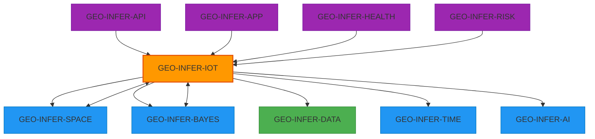
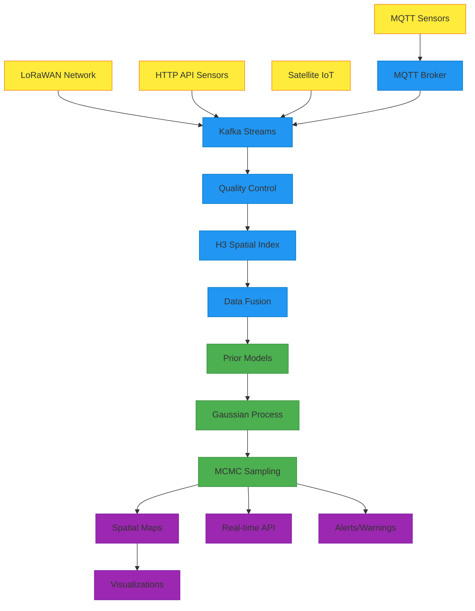

# GEO-INFER-IOT

[]()
[]()
[]()

GEO-INFER-IOT is the Internet of Things and spatial web integration module within the GEO-INFER framework. It provides capabilities for ingesting, processing, and analyzing IoT sensor data in spatial context for real-time monitoring and spatial inference.

### Documentation
- Module page: ../GEO-INFER-INTRA/docs/modules/geo-infer-iot.md
- Modules index: ../GEO-INFER-INTRA/docs/modules/index.md

## Overview 📋

The Internet of Things (IoT) generates massive streams of spatially-referenced sensor data that require sophisticated integration and analysis methods. GEO-INFER-IOT bridges the gap between raw IoT sensor readings and actionable spatial intelligence by:

- **Spatial IoT Data Fusion**: Integrating diverse sensor networks with H3 spatial indexing
- **Real-time Processing**: Stream processing for continuous sensor data ingestion
- **Bayesian Spatial Inference**: Converting point measurements to global posterior distributions
- **Multi-scale Analysis**: From local sensor clusters to global environmental patterns
- **Temporal Integration**: Time-series analysis of sensor networks over time

## 🎯 Key Features

### 🌍 **Global Sensor Network Integration**
- **Multi-protocol Support**: MQTT, CoAP, LoRaWAN, Sigfox, HTTP/REST
- **Standardized Metadata**: Device registration, calibration, and quality metrics
- **Spatial Indexing**: Automatic H3 cell assignment for efficient spatial queries
- **Network Topology**: Understanding sensor relationships and coverage patterns

### 📊 **Real-time Data Processing**
- **Stream Processing**: Apache Kafka integration for high-throughput data streams
- **Quality Control**: Automated anomaly detection and data validation
- **Data Fusion**: Combining multiple sensors measuring the same phenomena
- **Temporal Aggregation**: Multi-resolution time series processing

### 🎲 **Bayesian Spatial Inference**
- **Prior Integration**: Incorporating domain knowledge and historical data
- **Spatial Interpolation**: Gaussian process models for continuous surfaces
- **Uncertainty Quantification**: Full posterior distributions with confidence intervals
- **Multi-variate Models**: Joint inference across multiple environmental variables

### 🗺️ **Spatial Web Integration**
- **OGC Standards**: SensorThings API, WFS-T, SOS compliance
- **Web Services**: RESTful APIs for sensor data access and visualization
- **Real-time Updates**: WebSocket support for live sensor feeds
- **Interoperability**: Integration with existing GIS and environmental systems

## 🔧 Core Capabilities

### IoT Data Ingestion Engine
```python
from geo_infer_iot import IoTDataIngestion, SensorRegistry

# Register sensor network
registry = SensorRegistry()
network = registry.register_network(
    network_id="soil_monitoring_network",
    protocol="mqtt",
    spatial_extent=bounds,
    sensor_types=["soil_moisture", "temperature", "ph"]
)

# Start real-time ingestion
ingestion = IoTDataIngestion(registry)
ingestion.start_stream_processing()
```

### Bayesian Spatial Inference
```python
from geo_infer_iot import BayesianSpatialInference
from geo_infer_bayes import GaussianProcess

# Configure spatial inference
inference = BayesianSpatialInference(
    variable="soil_moisture",
    spatial_resolution="h3_8",
    temporal_window="1h"
)

# Define priors and run inference
priors = {
    "mean_function": "seasonal_trend",
    "covariance": "matern_52",
    "noise_variance": 0.01
}

posterior = inference.infer_spatial_distribution(
    sensor_data=recent_readings,
    priors=priors,
    update_interval="15min"
)
```

### Global Environmental Monitoring
```python
from geo_infer_iot import GlobalMonitoringSystem

# Set up global monitoring for radioactivity
monitoring = GlobalMonitoringSystem(
    variable="background_radiation",
    sensor_networks=["safecast", "eurdep", "ctbto"],
    update_frequency="hourly"
)

# Get real-time global radiation map
radiation_map = monitoring.get_current_global_distribution(
    confidence_level=0.95,
    spatial_resolution="10km"
)
```

## 🔄 Module Integrations

### Primary Dependencies
- **GEO-INFER-SPACE**: H3 spatial indexing, geometric operations, coordinate transformations
- **GEO-INFER-BAYES**: Gaussian processes, MCMC sampling, uncertainty quantification
- **GEO-INFER-DATA**: Sensor data storage, time-series databases, metadata management

### Optional Integrations
- **GEO-INFER-TIME**: Temporal pattern analysis, forecasting, event detection
- **GEO-INFER-AI**: Machine learning for sensor fusion, anomaly detection, predictive maintenance
- **GEO-INFER-API**: Web services for sensor data access and real-time streaming
- **GEO-INFER-APP**: Interactive dashboards, real-time monitoring interfaces
- **GEO-INFER-HEALTH**: Environmental health monitoring, exposure assessment
- **GEO-INFER-RISK**: Environmental risk assessment, early warning systems



## 🌍 Use Cases

### Environmental Monitoring
- **Air Quality Networks**: Real-time PM2.5, NO2, O3 monitoring with spatial interpolation
- **Water Quality**: River, lake, and groundwater monitoring with Bayesian updating
- **Soil Health**: Agricultural soil monitoring for precision farming applications
- **Radiation Monitoring**: Background radiation surveillance and emergency response

### Smart City Applications
- **Traffic Sensing**: Vehicle counting, speed monitoring, congestion analysis
- **Noise Pollution**: Urban sound level mapping and temporal patterns
- **Energy Infrastructure**: Smart grid sensors, renewable energy monitoring
- **Weather Networks**: Hyperlocal weather monitoring and urban heat island analysis

### Agricultural IoT
- **Precision Agriculture**: Soil moisture, nutrients, pest monitoring
- **Livestock Tracking**: Animal health, location, behavior monitoring
- **Crop Monitoring**: Growth stages, disease detection, yield estimation
- **Climate Stations**: Farm-level meteorological monitoring

### Disaster Response
- **Early Warning Systems**: Flood sensors, landslide monitoring, wildfire detection
- **Emergency Response**: Post-disaster infrastructure monitoring
- **Recovery Monitoring**: Environmental recovery assessment and tracking
- **Risk Assessment**: Real-time hazard monitoring and prediction

## 📊 Architecture

### Data Processing Pipeline



## 🚀 Getting Started

### Prerequisites
- Python 3.9+
- Core GEO-INFER modules: SPACE, BAYES, DATA
- Message broker: Apache Kafka or MQTT broker
- Spatial database: PostGIS with H3 extension
- Time-series database: InfluxDB or TimescaleDB

### Installation
```bash
pip install -e ./GEO-INFER-IOT
# Optional protocol extras
pip install paho-mqtt confluent-kafka pyserial aiocoap
```

### Quick Start Example
```python
from geo_infer_iot import IoTSystem
from geo_infer_space import H3SpatialIndex
from geo_infer_bayes import BayesianInference

# Initialize IoT system
iot = IoTSystem()

# Register a soil moisture sensor network
network = iot.register_network(
    name="farm_soil_sensors",
    protocol="mqtt",
    broker_url="mqtt://sensors.farm.com:1883",
    spatial_bounds={"lat_min": 40.0, "lat_max": 41.0, 
                   "lon_min": -74.0, "lon_max": -73.0}
)

# Start real-time processing
iot.start_processing()

# Set up Bayesian spatial inference
inference = iot.setup_spatial_inference(
    variable="soil_moisture",
    spatial_resolution=8,  # H3 resolution
    update_interval="10min"
)

# Get current spatial distribution
current_map = inference.get_posterior_map(
    confidence_intervals=[0.8, 0.95]
)

print(f"Processed {network.sensor_count} sensors")
print(f"Current coverage: {current_map.spatial_coverage:.1%}")
```

### Configuration
IoT systems require careful configuration for optimal performance:

```yaml
# config/iot_config.yaml
sensor_networks:
  - name: "air_quality_network"
    protocol: "mqtt"
    broker_url: "mqtt://broker.example.com:1883"
    topics: ["sensors/+/pm25", "sensors/+/no2"]
    spatial_bounds:
      lat_min: 40.0
      lat_max: 41.0
      lon_min: -74.0
      lon_max: -73.0
    
spatial_processing:
  indexing_system: "h3"
  default_resolution: 8
  aggregation_method: "inverse_distance_weighted"
  
bayesian_inference:
  default_prior: "informative"
  covariance_function: "matern_52"
  inference_engine: "variational"
  update_frequency: "5min"
  
quality_control:
  outlier_detection: true
  temporal_consistency: true
  spatial_consistency: true
  calibration_drift: true
```

## 📁 Project Structure

```
GEO-INFER-IOT/
├── config/
│   ├── example.yaml              # Example configuration
│   ├── protocols/                # Protocol-specific configs
│   └── networks/                 # Pre-defined sensor networks
├── docs/
│   ├── api_schema.yaml          # API documentation
│   ├── protocols.md             # Supported IoT protocols
│   ├── spatial_inference.md     # Bayesian inference guide
│   └── tutorials/               # Step-by-step tutorials
├── examples/
│   ├── air_quality_monitoring.py
│   ├── soil_sensor_network.py
│   ├── radiation_surveillance.py
│   └── smart_city_sensors.py
├── src/geo_infer_iot/
│   ├── __init__.py
│   ├── api/                     # Web API interfaces
│   │   ├── sensor_api.py
│   │   ├── streaming_api.py
│   │   └── inference_api.py
│   ├── core/                    # Core IoT functionality
│   │   ├── ingestion.py         # Data ingestion engine
│   │   ├── protocols.py         # IoT protocol handlers
│   │   ├── registry.py          # Sensor registry
│   │   ├── quality_control.py   # Data validation
│   │   └── spatial_fusion.py    # Spatial data fusion
│   ├── models/                  # Data models and schemas
│   │   ├── sensor.py            # Sensor metadata models
│   │   ├── measurement.py       # Measurement data models
│   │   └── network.py           # Network topology models
│   └── utils/                   # Utility functions
│       ├── calibration.py       # Sensor calibration
│       ├── interpolation.py     # Spatial interpolation
│       └── visualization.py     # Real-time visualization
└── tests/
    ├── unit/                    # Unit tests
    ├── integration/             # Integration tests
    └── performance/             # Performance benchmarks
```

## 🔬 Advanced Features

### Multi-Modal Sensor Fusion
```python
from geo_infer_iot import MultiModalFusion

# Combine satellite, ground, and mobile sensors
fusion = MultiModalFusion()
fusion.add_sensor_type("satellite_aod", weight=0.4)
fusion.add_sensor_type("ground_stations", weight=0.5) 
fusion.add_sensor_type("mobile_sensors", weight=0.1)

# Fuse air quality measurements
fused_data = fusion.fuse_measurements(
    variable="pm25",
    spatial_window="5km",
    temporal_window="1h"
)
```

### Adaptive Sampling Networks
```python
from geo_infer_iot import AdaptiveSampling

# Optimize sensor deployment based on uncertainty
adaptive = AdaptiveSampling(
    target_variable="soil_moisture",
    uncertainty_threshold=0.1,
    budget_constraints={"max_sensors": 100}
)

# Suggest new sensor locations
recommendations = adaptive.suggest_locations(
    current_network=existing_sensors,
    priority_areas=agricultural_fields
)
```

### Predictive Maintenance
```python
from geo_infer_iot import PredictiveMaintenance

# Monitor sensor health and predict failures
maintenance = PredictiveMaintenance()
health_status = maintenance.assess_network_health(
    sensor_network=soil_network,
    metrics=["battery_level", "data_quality", "communication_reliability"]
)

# Get maintenance recommendations
recommendations = maintenance.get_maintenance_schedule(
    priority="critical_sensors",
    time_horizon="30days"
)
```

## 🤝 Contributing

Contributions to GEO-INFER-IOT are highly valued! Areas of particular interest:

- **New IoT Protocols**: Implementation of additional sensor communication protocols
- **Bayesian Models**: Advanced spatial-temporal inference methods
- **Visualization**: Real-time dashboards and interactive mapping tools
- **Performance**: Optimization for large-scale sensor networks
- **Quality Control**: Advanced anomaly detection and data validation methods

Please see the main [Contributing Guidelines](../CONTRIBUTING.md) and module-specific guidelines in `docs/CONTRIBUTING_IOT.md`.

## 📄 License

This project is licensed under the Creative Commons Attribution-NoDerivatives-ShareAlike 4.0 International License (CC BY-ND-SA 4.0). See the [LICENSE](../LICENSE) file for details.

---

