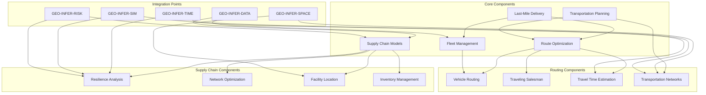

# GEO-INFER-LOG

## Overview
GEO-INFER-LOG provides logistics and supply chain optimization capabilities with geospatial intelligence within the GEO-INFER framework. This module enables efficient movement of goods, route planning, supply chain resilience modeling, and transportation network analysis using advanced spatial algorithms.

## Key Features
- **Route Optimization**: Advanced algorithms for optimal vehicle routing
- **Supply Chain Resilience**: Model and optimize supply chain networks for resilience
- **Last-Mile Delivery**: Specialized solutions for optimizing final delivery stages
- **Multimodal Transportation**: Planning tools for integrating multiple transportation modes

## Architecture



## Directory Structure
```
GEO-INFER-LOG/
├── config/               # Configuration files
├── docs/                 # Documentation
├── examples/             # Example applications
├── src/                  # Source code
│   └── geo_infer_log/    # Main package
│       ├── api/          # API definitions
│       ├── core/         # Core functionality
│       │   ├── routing.py         # Route optimization
│       │   ├── supply_chain.py    # Supply chain modeling
│       │   ├── delivery.py        # Last-mile delivery
│       │   └── transport.py       # Transportation planning
│       ├── models/       # Data models
│       └── utils/        # Utility functions
└── tests/                # Test suite
```

## Getting Started

### Installation
```bash
cd GEO-INFER-LOG
pip install -e .
```

### Basic Usage
```python
from geo_infer_log import RouteOptimizer, Vehicle, VehicleType
import networkx as nx

# Create route optimizer
optimizer = RouteOptimizer()

# Load transportation network
optimizer.load_network("path/to/network.gpickle")

# Add vehicle to the fleet
truck = Vehicle(
    id="truck-001",
    type=VehicleType.TRUCK,
    capacity=1000,
    max_range=500,
    speed=80,
    cost_per_km=1.2,
    emissions_per_km=0.8,
    location=(13.404954, 52.520008)  # Berlin coordinates
)
optimizer.add_vehicle(truck)

# Optimize route
route = optimizer.optimize_route(
    origin=(13.404954, 52.520008),     # Berlin
    destination=(11.576124, 48.137154), # Munich
    waypoints=[
        (9.993682, 53.551086),         # Hamburg
        (8.682127, 50.110924)          # Frankfurt
    ]
)

print(f"Route distance: {route['distance']} km")
print(f"Travel time: {route['travel_time']} minutes")
```

## Logistics Components

### Route Optimization
Advanced algorithms for optimizing movement between locations:
- Vehicle routing problems (VRP)
- Traveling salesman problems (TSP)
- Capacitated routing
- Time-window constrained routing
- Traffic-aware routing

### Fleet Management
Tools for managing and optimizing a fleet of vehicles:
- Vehicle assignment
- Fleet composition optimization
- Maintenance scheduling
- Real-time tracking and rerouting
- Fuel/energy optimization

### Supply Chain Optimization
Models for designing and optimizing supply chain networks:
- Network flow optimization
- Facility location
- Inventory management
- Disruption modeling
- Resilience analysis

### Last-Mile Delivery
Specialized solutions for the final stage of delivery:
- Urban delivery optimization
- Delivery wave planning
- Service area optimization
- Parcel consolidation strategies
- Autonomous delivery planning

### Multimodal Transportation
Planning tools for integrating multiple transportation modes:
- Mode selection optimization
- Intermodal transfer planning
- Multimodal network modeling
- Green transportation policies
- Emissions calculation

## Integration with Other GEO-INFER Modules

- **GEO-INFER-SPACE**: Provides spatial indexing and geographic analysis for transportation networks
- **GEO-INFER-TIME**: Enables temporal modeling for delivery scheduling and traffic patterns
- **GEO-INFER-DATA**: Supplies data management for transportation and logistics datasets
- **GEO-INFER-SIM**: Provides simulation capabilities for testing network scenarios
- **GEO-INFER-RISK**: Integrates risk assessment for supply chain resilience planning
- **GEO-INFER-APP**: Enables user interfaces for logistics planning and monitoring

## Use Cases

- **Logistics Companies**: Optimize delivery routes and fleet management
- **E-commerce**: Improve last-mile delivery efficiency and customer satisfaction
- **Retail Operations**: Optimize supply chain and distribution networks
- **Humanitarian Aid**: Plan and optimize relief supply distribution in disaster scenarios
- **Urban Planning**: Design efficient transportation networks for goods movement
- **Sustainability**: Reduce emissions through optimized routing and mode selection
- **Manufacturing**: Design resilient supplier networks and production logistics

## Advanced Features

### Traffic-Aware Routing
- Historical traffic pattern analysis
- Real-time traffic integration
- Predictive traffic modeling
- Dynamic rerouting based on conditions

### Green Logistics
- Carbon footprint calculation
- Emissions-optimized routing
- Alternative fuel vehicle planning
- Modal shift analysis for environmental impact

### Supply Chain Resilience
- Disruption scenario modeling
- Alternative routing strategies
- Inventory positioning for resilience
- Supplier diversification analysis

### Smart City Integration
- Connected infrastructure coordination
- Traffic signal optimization
- Urban freight planning
- Low emission zone compliance

## Contributing

Contributions to GEO-INFER-LOG are welcome! Please follow the contribution guidelines outlined in the main GEO-INFER documentation.

## License

This project is licensed under the MIT License - see the LICENSE file for details. 