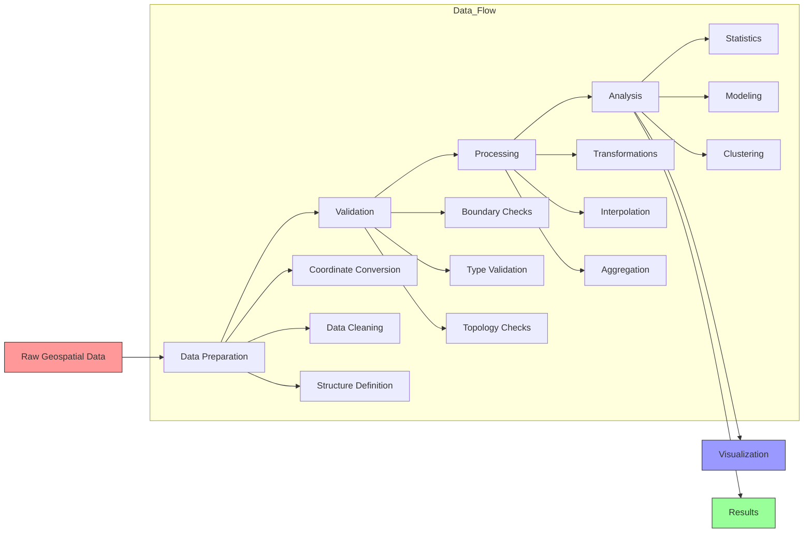
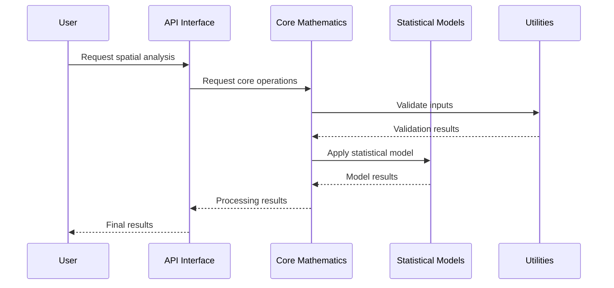
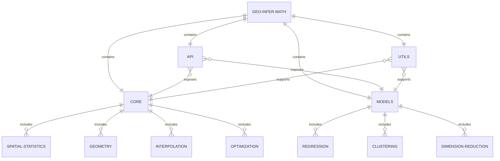

# GEO-INFER-MATH Module Architecture

This document provides an overview of the GEO-INFER-MATH module architecture, showcasing the key components and their relationships.

## Module Structure

```mermaid
graph TD
    GIM[GEO-INFER-MATH] --> CORE[Core Mathematics]
    GIM --> MODELS[Statistical Models]
    GIM --> UTILS[Utilities]
    GIM --> API[API Interfaces]
    
    %% Core Mathematics components
    CORE --> SS[Spatial Statistics]
    CORE --> GEOM[Geometry]
    CORE --> INTERP[Interpolation]
    CORE --> OPT[Optimization]
    CORE --> DIFF[Differential]
    CORE --> TENS[Tensors]
    CORE --> TRANS[Transforms]
    
    %% Statistical Models components
    MODELS --> REG[Regression]
    MODELS --> CLUST[Clustering]
    MODELS --> DR[Dimension Reduction]
    MODELS --> ML[Manifold Learning]
    MODELS --> SPEC[Spectral Analysis]
    
    %% Utilities components
    UTILS --> VAL[Validation]
    UTILS --> CONV[Conversion]
    UTILS --> CONST[Constants]
    UTILS --> DEC[Decorators]
    UTILS --> PAR[Parallel]
    
    %% API components
    API --> SPA[Spatial Analysis API]
    API --> GO[Geometric Operations API]
    API --> SMA[Statistical Modeling API]
    API --> OPTA[Optimization API]
    API --> CMA[Coordinate Management API]
    
    %% Spatial Statistics details
    SS --> MORAN[Moran's I]
    SS --> GETIS[Getis-Ord G*]
    SS --> LISA[LISA]
    SS --> RIPLEY[Ripley's K]
    SS --> SEMI[Semivariogram]
    
    %% Geometry details
    GEOM --> DIST[Distance Calculations]
    GEOM --> AREA[Area Calculations]
    GEOM --> INTER[Intersections]
    GEOM --> BUFF[Buffers]
    GEOM --> PROJ[Projections]
    
    %% Interpolation details
    INTERP --> IDW[Inverse Distance Weighting]
    INTERP --> KRIG[Kriging]
    INTERP --> SPLINE[Splines]
    INTERP --> TIN[Triangulation]
    
    style GIM fill:#f9f,stroke:#333,stroke-width:4px
    style CORE fill:#ccf,stroke:#333,stroke-width:2px
    style MODELS fill:#cfc,stroke:#333,stroke-width:2px
    style UTILS fill:#fcc,stroke:#333,stroke-width:2px
    style API fill:#cff,stroke:#333,stroke-width:2px
```

## Components Description

### Core Mathematics

The Core Mathematics module provides fundamental mathematical operations and algorithms for geospatial analysis:

- **Spatial Statistics**: Statistical methods for analyzing spatial patterns and relationships
- **Geometry**: Geometric calculations for spatial data
- **Interpolation**: Methods for estimating values at unsampled locations
- **Optimization**: Algorithms for solving spatial optimization problems
- **Differential**: Tools for differential equations in spatial contexts
- **Tensors**: Operations for multi-dimensional spatial data
- **Transforms**: Coordinate and projection transformations

### Statistical Models

The Statistical Models module provides mathematical models for analyzing spatial data:

- **Regression**: Spatial regression methods
- **Clustering**: Spatial clustering algorithms
- **Dimension Reduction**: Techniques for reducing dimensionality
- **Manifold Learning**: Methods for manifold learning in spatial contexts
- **Spectral Analysis**: Spectral decomposition techniques

### Utilities

The Utilities module provides supporting functions and tools:

- **Validation**: Data validation tools
- **Conversion**: Data conversion utilities
- **Constants**: Mathematical and physical constants
- **Decorators**: Function decorators for common operations
- **Parallel**: Tools for parallel computation

### API

The API module provides clean interfaces for accessing the library functionality:

- **Spatial Analysis API**: Interface for spatial analysis functions
- **Geometric Operations API**: Interface for geometric operations
- **Statistical Modeling API**: Interface for statistical models
- **Optimization API**: Interface for optimization algorithms
- **Coordinate Management API**: Interface for coordinate transformations

## Data Flow

## Component Interactions

## Module Relationships

