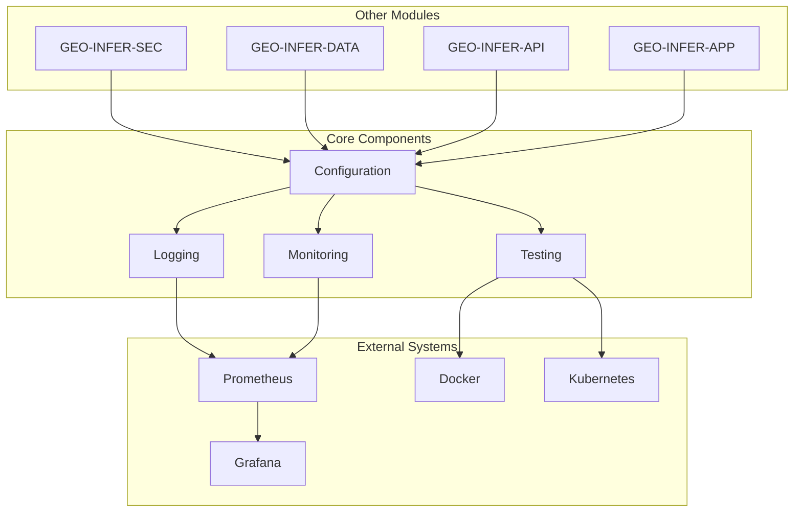
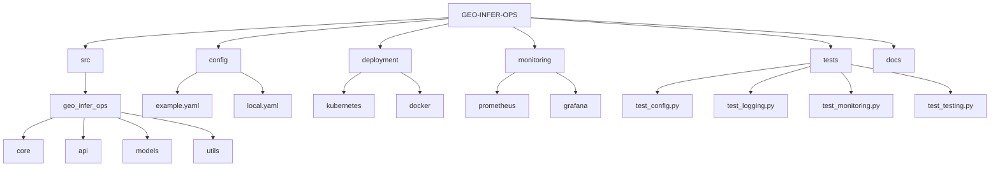
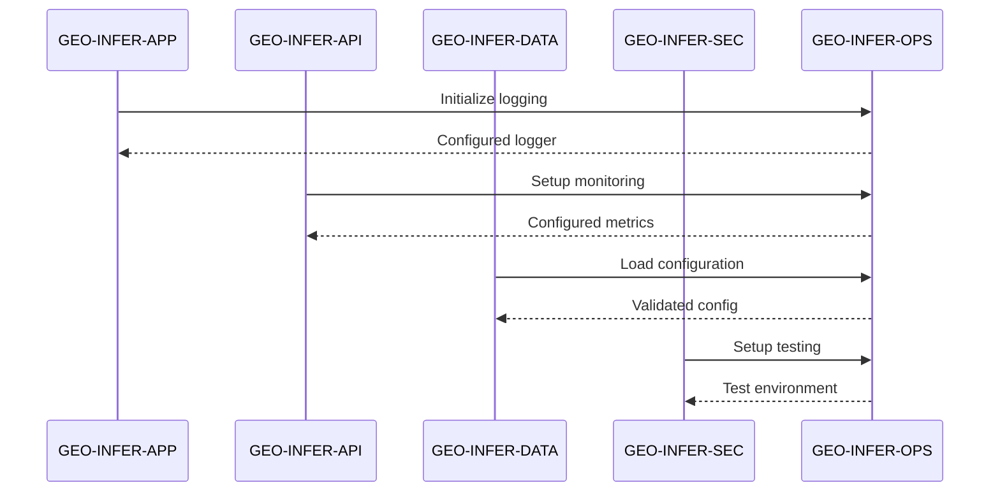
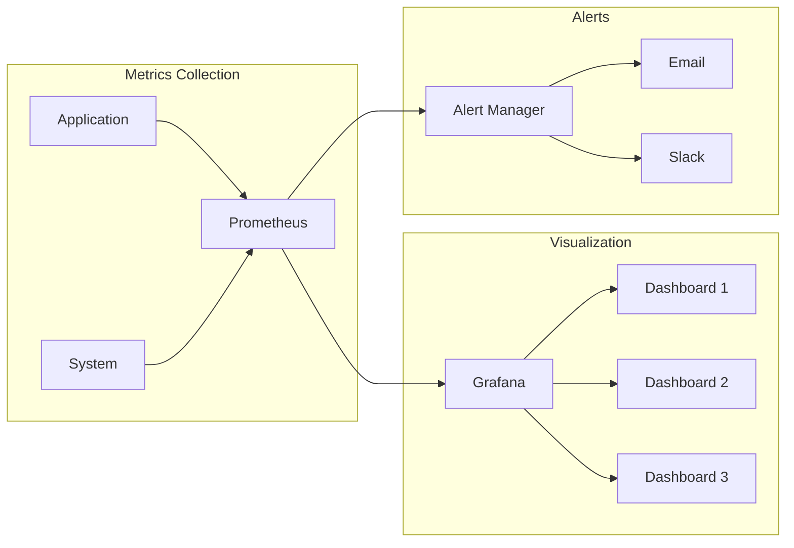

# GEO-INFER-OPS

## Overview
GEO-INFER-OPS is the operational kernel for the GEO-INFER framework, providing essential infrastructure for logging, monitoring, testing, and configuration management. This module serves as the foundation for ensuring reliable, scalable, and maintainable operations across all GEO-INFER components.

## Architecture



## Key Features

### Configuration Management
- YAML-based configuration with validation
- Environment-specific settings
- Secure credential management
- Dynamic configuration updates

### Logging System
- Structured logging with JSON output
- Multiple log levels and formats
- File and console output
- Custom log processors

### Monitoring
- Prometheus metrics integration
- Request/response tracking
- Error rate monitoring
- Resource usage metrics
- Grafana dashboards

### Testing Framework
- Automated test suite
- Coverage reporting
- Parallel test execution
- Mock utilities
- Test data management

## Directory Structure



## Getting Started

### Installation
```bash
pip install -e .
```

### Configuration
```bash
cp config/example.yaml config/local.yaml
# Edit local.yaml with your configuration
```

### Running Tests
```bash
pytest tests/
```

## Integration with Other Modules



## Deployment

### Docker
```bash
docker build -t geo-infer-ops .
docker-compose up -d
```

### Kubernetes
```bash
kubectl apply -f deployment/kubernetes/
```

## Monitoring Dashboard



## Contributing
1. Fork the repository
2. Create a feature branch
3. Commit your changes
4. Push to the branch
5. Create a Pull Request

## License
This project is licensed under the MIT License - see the LICENSE file for details. 