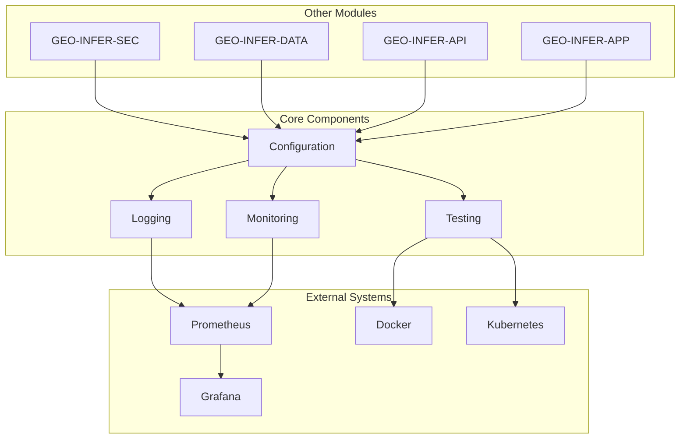
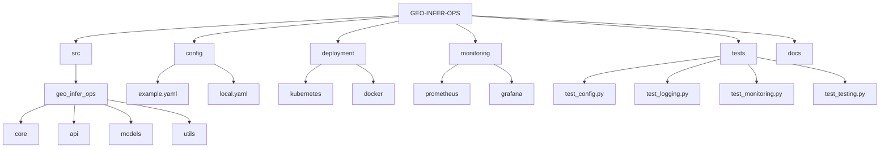
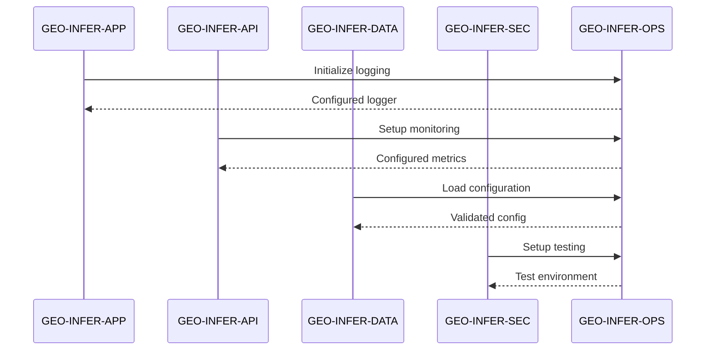
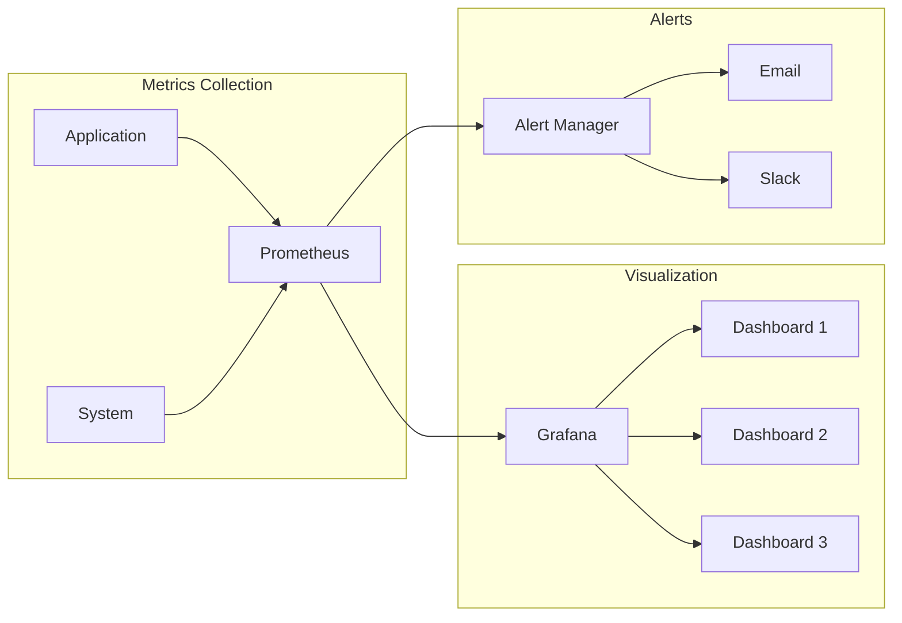

# GEO-INFER-OPS

**Operational Kernel for System Orchestration, Monitoring, and Infrastructure Management**

## Overview

GEO-INFER-OPS provides infrastructure for system orchestration, monitoring, testing, logging, and configuration management. It ensures reliable, scalable, and secure operations across GEO-INFER components with observability, automated testing, and resource management.

### Documentation
- Module page: ../GEO-INFER-INTRA/docs/modules/geo-infer-ops.md
- Modules index: ../GEO-INFER-INTRA/docs/modules/index.md

## Core Objectives

- **System Orchestration**: Coordinate and manage the lifecycle of all GEO-INFER modules and their interdependencies
- **Infrastructure Management**: Provide containerized, scalable deployment with auto-scaling and load balancing
- **Comprehensive Monitoring**: Real-time observability of system performance, health, and resource utilization
- **Automated Testing**: Continuous integration and testing pipelines ensuring code quality and reliability
- **Configuration Management**: Centralized, secure, and version-controlled configuration for all modules
- **Security Operations**: Security monitoring, vulnerability management, and compliance enforcement
- **Disaster Recovery**: Backup, restoration, and business continuity planning

## Architecture



## Data Flow

### Inputs
- **System Metrics**: CPU, memory, disk, network utilization from all modules
- **Application Logs**: Structured logs from all GEO-INFER components
- **Configuration Files**: YAML configurations, environment variables, secrets
- **Health Checks**: Module health status and dependency information
- **External Monitoring**: Infrastructure metrics from cloud providers

### Processes
- **Metrics Collection & Aggregation**: Prometheus-based metrics gathering and storage
- **Log Processing & Analysis**: Structured logging with real-time analysis and alerting
- **Configuration Validation & Distribution**: Centralized config management with validation
- **Automated Testing**: CI/CD pipelines with comprehensive test coverage
- **Resource Orchestration**: Container lifecycle management and auto-scaling

### Outputs
- **Monitoring Dashboards**: Grafana visualizations and real-time system status
- **Alerting & Notifications**: Automated alerts via email, Slack, PagerDuty
- **Configuration Updates**: Validated and distributed configuration changes
- **Test Reports**: Automated testing results and coverage reports
- **System Health Status**: Overall framework health and performance metrics

## Key Features

### 1. Advanced Configuration Management
- **Multi-Environment Support**: Development, staging, production configurations
- **Secret Management**: Integration with HashiCorp Vault, Kubernetes secrets
- **Configuration Validation**: Schema-based validation with error reporting
- **Dynamic Updates**: Hot-reload capability for non-critical configuration changes
- **Version Control**: Git-based configuration versioning with rollback capability

### 2. Comprehensive Logging & Observability
- **Structured Logging**: JSON-formatted logs with consistent schema across modules
- **Centralized Collection**: ELK stack (Elasticsearch, Logstash, Kibana) integration
- **Real-time Analysis**: Log streaming and real-time anomaly detection
- **Correlation IDs**: Request tracing across distributed components
- **Custom Metrics**: Application-specific metrics collection and analysis

### 3. Production-Grade Monitoring
- **Multi-Dimensional Metrics**: Prometheus metrics with labels and tags
- **Custom Dashboards**: Grafana dashboards for different stakeholder needs
- **SLA Monitoring**: Service level indicators and objectives tracking
- **Capacity Planning**: Resource utilization trends and forecasting
- **Performance Profiling**: Application performance monitoring and optimization

### 4. Automated Testing & Quality Assurance
- **Comprehensive Test Suite**: Unit, integration, system, and performance tests
- **Continuous Integration**: GitHub Actions, Jenkins, or GitLab CI integration
- **Quality Gates**: Code coverage, security scanning, performance benchmarks
- **Test Data Management**: Automated test data generation and cleanup
- **Cross-Module Testing**: Integration testing across GEO-INFER components

### 5. Container Orchestration & Deployment
- **Kubernetes Management**: Pod lifecycle, service discovery, load balancing
- **Auto-Scaling**: Horizontal and vertical pod autoscaling based on metrics
- **Rolling Deployments**: Zero-downtime deployments with rollback capability
- **Multi-Cloud Support**: AWS EKS, Google GKE, Azure AKS compatibility
- **Infrastructure as Code**: Terraform and Helm charts for reproducible deployments

## Directory Structure



## 🚀 Quick Start (5 minutes)

### 1. Prerequisites Check
```bash
# Verify system requirements
docker --version      # Docker 20.10+
kubectl version       # Kubernetes 1.20+
python --version      # Python 3.9+

# Check available resources
docker system info | grep "Total Memory"
```

### 2. Installation & Setup
```bash
# Install GEO-INFER-OPS
uv pip install -e ./GEO-INFER-OPS

# Initialize configuration
./scripts/init-ops.sh

# Verify import
python -c "import geo_infer_ops; print('import ok')"
```

### 3. Basic Configuration
```bash
# Copy and customize configuration
cp config/example.yaml config/local.yaml

# Set required environment variables
export GEO_INFER_ENV=local
export PROMETHEUS_PORT=9090
export GRAFANA_PORT=3000

# Validate configuration
python -m geo_infer_ops.cli validate-config config/local.yaml
```

### 4. Start Core Services
```bash
# Start monitoring stack
docker-compose up -d prometheus grafana

# Verify services are running
curl http://localhost:9090/api/v1/status/config  # Prometheus
curl http://localhost:3000/api/health            # Grafana

# Check service logs
docker-compose logs -f prometheus grafana
```

### 5. Monitor First Module
```python
# Simple monitoring example
from geo_infer_ops.monitoring import MetricsCollector
from geo_infer_ops.config import load_config

# Initialize monitoring
config = load_config("config/local.yaml")
metrics = MetricsCollector(config)

# Start collecting metrics
metrics.start_collection()
print("✅ Monitoring active - visit http://localhost:3000 for dashboards")
```

### 6. Next Steps
- 📊 Visit Grafana dashboard: `http://localhost:3000` (admin/admin)
- 🔍 Check Prometheus targets: `http://localhost:9090/targets`
- 📋 See [deployment guide](./docs/deployment.md) for production setup
- 🔧 Review [configuration reference](./docs/configuration.md) for advanced options

## Getting Started (Detailed)

### Installation
```bash
uv pip install -e .
```

### Configuration
```bash
cp config/example.yaml config/local.yaml
# Edit local.yaml with your configuration
```

### Running Tests
```bash
pytest tests/
```

## Integration with Other Modules



## Deployment

### Docker
```bash
docker build -t geo-infer-ops .
docker-compose up -d
```

### Kubernetes
```bash
kubectl apply -f deployment/kubernetes/
```

## Monitoring Dashboard



## Contributing
1. Fork the repository
2. Create a feature branch
3. Commit your changes
4. Push to the branch
5. Create a Pull Request

## License
This project is licensed under the MIT License - see the LICENSE file for details. 