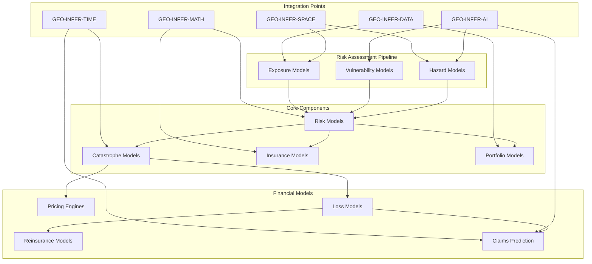

# GEO-INFER-RISK

Geospatial Risk Analysis and Catastrophe Modeling Framework

## Overview

GEO-INFER-RISK is a comprehensive framework for modeling, analyzing, and visualizing geospatial risk across multiple hazards, vulnerabilities, and exposure types. It provides tools for catastrophe modeling, insurance pricing, climate risk assessment, and portfolio risk management with a strong geospatial foundation.

The framework integrates with other GEO-INFER modules to leverage their capabilities for spatial analysis, temporal modeling, AI-driven predictions, and visualization.

## Key Features

- **Multi-Hazard Modeling**: Integrated models for floods, earthquakes, hurricanes, wildfires, and other natural hazards
- **Vulnerability Assessment**: Methods to evaluate the vulnerability of buildings, infrastructure, and populations
- **Exposure Analysis**: Tools for mapping and quantifying exposure of assets at risk
- **Risk Metrics**: Calculation of key risk metrics including AAL, EP curves, and PML
- **Financial Modeling**: Insurance and reinsurance modeling for risk transfer analysis
- **Climate Change Integration**: Support for climate change scenarios and their impact on hazard patterns
- **Geospatial Analysis**: Deep integration with spatial analysis tools and visualization

## Architecture



## Directory Structure

```
GEO-INFER-RISK/
├── config/               # Configuration files for risk models
├── docs/                 # Documentation and research references
├── examples/             # Example risk analysis workflows
├── src/                  # Source code for the framework
│   └── geo_infer_risk/
│       ├── api/          # API components for external integration
│       ├── core/         # Core risk modeling engine
│       ├── models/       # Specific hazard and vulnerability models
│       └── utils/        # Utility functions and tools
└── tests/                # Test cases and validation datasets
```

## Getting Started

### Installation

```bash
# Clone the repository
git clone https://github.com/yourusername/GEO-INFER-RISK.git
cd GEO-INFER-RISK

# Create and activate a virtual environment (optional but recommended)
python -m venv venv
source venv/bin/activate  # On Windows: venv\Scripts\activate

# Install the package
pip install -e .
```

### Basic Usage

```python
import geo_infer_risk as gir

# Create a risk analysis engine with a configuration file
risk_engine = gir.create_risk_analysis(config_path="config/example.yaml")

# Load the models (hazard, vulnerability, exposure)
risk_engine.load_models()

# Run the risk analysis
results = risk_engine.run_analysis()

# Save the results
risk_engine.save_results("my_risk_analysis.json")

# Generate visualizations
risk_engine.plot_results(plot_type="ep_curve", save=True)
```

## Risk Models

GEO-INFER-RISK implements several key components of catastrophe modeling:

### Hazard Models

- **Flood Model**: Riverine, coastal, and pluvial flooding
- **Earthquake Model**: Ground shaking and secondary perils (liquefaction, landslide)
- **Hurricane Model**: Wind, storm surge, and precipitation
- **Wildfire Model**: Fire spread and intensity
- **Drought Model**: Agricultural and hydrological drought impacts

### Vulnerability Models

- **Building Vulnerability**: Damage functions for different building types
- **Infrastructure Vulnerability**: Fragility curves for lifelines and networks
- **Population Vulnerability**: Social vulnerability indices and demographic factors

### Exposure Models

- **Property Exposure**: Building stock, content, and business interruption
- **Infrastructure Exposure**: Critical infrastructure and networks
- **Population Exposure**: Population distribution and demographics

## Integration with Other GEO-INFER Modules

- **GEO-INFER-SPACE**: Spatial indexing and analysis for risk assessment
- **GEO-INFER-TIME**: Temporal modeling of hazard events and climate changes
- **GEO-INFER-AI**: AI/ML models for risk prediction and classification
- **GEO-INFER-VIZ**: Visualization tools for risk maps and analytics dashboards

## Example Applications

- Catastrophe risk assessment for insurance portfolios
- Climate change risk projections for infrastructure
- Urban resilience planning and adaptation
- Post-disaster recovery modeling
- Financial risk transfer optimization

## Contributing

We welcome contributions to GEO-INFER-RISK! Please see our [Contributing Guidelines](CONTRIBUTING.md) for more information on how to get involved.

## License

This project is licensed under the MIT License - see the [LICENSE](LICENSE) file for details.

## Acknowledgements

GEO-INFER-RISK builds upon research and methodologies from multiple fields including:

- Catastrophe modeling and natural hazards research
- Actuarial science and insurance modeling
- Climate science and adaptation planning
- Geospatial information science
- Active inference and Bayesian methods 