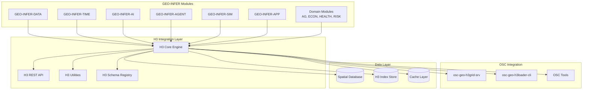

# H3 Integration Schema & Technical Specification

## 📋 Overview

This document provides comprehensive technical schemas and specifications for integrating modules and datasets with H3 (Hexagonal Hierarchical Spatial Index) systems within the GEO-INFER-SPACE framework. It defines standard patterns, data structures, APIs, and integration protocols that enable seamless connectivity across the entire GEO-INFER ecosystem.

## 🏗️ Architecture Overview



## 📊 Data Schema Specifications

### 1. H3 Cell Data Structure

```json
{
  "$schema": "https://geo-infer.org/schemas/h3-cell-v1.json",
  "type": "object",
  "properties": {
    "h3_cell": {
      "type": "string",
      "pattern": "^[0-9a-f]{15}$",
      "description": "H3 cell identifier (15-character hex string)"
    },
    "resolution": {
      "type": "integer",
      "minimum": 0,
      "maximum": 15,
      "description": "H3 resolution level"
    },
    "geometry": {
      "type": "object",
      "description": "GeoJSON geometry for the cell",
      "properties": {
        "type": {
          "enum": ["Polygon"]
        },
        "coordinates": {
          "type": "array",
          "items": {
            "type": "array",
            "items": {
              "type": "array",
              "items": {"type": "number"},
              "minItems": 2,
              "maxItems": 2
            }
          }
        }
      }
    },
    "center": {
      "type": "object",
      "description": "Cell center coordinates",
      "properties": {
        "lat": {"type": "number", "minimum": -90, "maximum": 90},
        "lng": {"type": "number", "minimum": -180, "maximum": 180}
      },
      "required": ["lat", "lng"]
    },
    "properties": {
      "type": "object",
      "description": "Cell properties and aggregated data",
      "additionalProperties": true
    },
    "metadata": {
      "type": "object",
      "description": "Metadata about the cell data",
      "properties": {
        "created_at": {"type": "string", "format": "date-time"},
        "updated_at": {"type": "string", "format": "date-time"},
        "source_module": {"type": "string"},
        "data_version": {"type": "string"},
        "aggregation_method": {"type": "string"}
      }
    }
  },
  "required": ["h3_cell", "resolution", "geometry", "center"]
}
```

### 2. H3 Dataset Collection Schema

```json
{
  "$schema": "https://geo-infer.org/schemas/h3-dataset-v1.json",
  "type": "object",
  "properties": {
    "dataset_id": {
      "type": "string",
      "description": "Unique dataset identifier"
    },
    "metadata": {
      "type": "object",
      "properties": {
        "name": {"type": "string"},
        "description": {"type": "string"},
        "resolution": {"type": "integer", "minimum": 0, "maximum": 15},
        "total_cells": {"type": "integer", "minimum": 0},
        "coverage_area": {
          "type": "object",
          "description": "Bounding box of dataset coverage",
          "properties": {
            "north": {"type": "number"},
            "south": {"type": "number"},
            "east": {"type": "number"},
            "west": {"type": "number"}
          }
        },
        "temporal_extent": {
          "type": "object",
          "properties": {
            "start_time": {"type": "string", "format": "date-time"},
            "end_time": {"type": "string", "format": "date-time"}
          }
        },
        "schema_version": {"type": "string"},
        "source_modules": {
          "type": "array",
          "items": {"type": "string"}
        }
      },
      "required": ["name", "resolution", "total_cells"]
    },
    "cells": {
      "type": "array",
      "items": {"$ref": "#/definitions/h3_cell"},
      "description": "Array of H3 cells in the dataset"
    },
    "statistics": {
      "type": "object",
      "description": "Dataset-level statistics",
      "additionalProperties": true
    }
  },
  "required": ["dataset_id", "metadata", "cells"]
}
```

### 3. Module Integration Configuration

```json
{
  "$schema": "https://geo-infer.org/schemas/h3-module-config-v1.json",
  "type": "object",
  "properties": {
    "module_name": {
      "type": "string",
      "pattern": "^GEO-INFER-[A-Z]+$",
      "description": "Name of the integrating module"
    },
    "h3_configuration": {
      "type": "object",
      "properties": {
        "default_resolution": {
          "type": "integer",
          "minimum": 0,
          "maximum": 15,
          "description": "Default H3 resolution for the module"
        },
        "supported_resolutions": {
          "type": "array",
          "items": {"type": "integer", "minimum": 0, "maximum": 15},
          "description": "List of supported H3 resolutions"
        },
        "data_types": {
          "type": "array",
          "items": {"type": "string"},
          "description": "Types of data the module provides/consumes"
        },
        "aggregation_methods": {
          "type": "array",
          "items": {"enum": ["sum", "mean", "median", "max", "min", "count", "density", "weighted_average"]},
          "description": "Supported aggregation methods"
        },
        "update_frequency": {
          "type": "string",
          "enum": ["real-time", "hourly", "daily", "weekly", "monthly", "on-demand"],
          "description": "How frequently the module updates H3 data"
        }
      },
      "required": ["default_resolution", "supported_resolutions", "data_types"]
    },
    "api_endpoints": {
      "type": "object",
      "description": "Module-specific H3 API endpoints",
      "properties": {
        "base_url": {"type": "string", "format": "uri"},
        "endpoints": {
          "type": "object",
          "patternProperties": {
            "^[a-z_]+$": {
              "type": "object",
              "properties": {
                "path": {"type": "string"},
                "method": {"enum": ["GET", "POST", "PUT", "DELETE"]},
                "description": {"type": "string"}
              }
            }
          }
        }
      }
    },
    "data_schemas": {
      "type": "object",
      "description": "Module-specific data schemas",
      "additionalProperties": {
        "type": "object",
        "description": "JSON Schema for module data"
      }
    }
  },
  "required": ["module_name", "h3_configuration"]
}
```

## 🔌 API Specifications

### 1. H3 Core REST API

#### Base URL Structure
```
https://api.geo-infer.space/h3/v1/
```

#### Authentication
```http
Authorization: Bearer <jwt_token>
X-API-Key: <api_key>
X-Module-ID: <module_identifier>
```

#### Core Endpoints

##### Convert Points to H3 Cells
```http
POST /convert/points-to-h3
Content-Type: application/json

{
  "points": [
    {"lat": 40.7128, "lng": -74.0060, "properties": {...}},
    {"lat": 51.5074, "lng": -0.1278, "properties": {...}}
  ],
  "resolution": 8,
  "aggregation_method": "mean"
}
```

Response:
```json
{
  "status": "success",
  "h3_cells": [
    {
      "h3_cell": "882a100d25fffff",
      "resolution": 8,
      "center": {"lat": 40.7128, "lng": -74.0060},
      "geometry": {...},
      "properties": {...},
      "point_count": 1
    }
  ],
  "metadata": {
    "total_points": 2,
    "total_cells": 2,
    "processing_time_ms": 45
  }
}
```

##### Query H3 Cells by Region
```http
POST /query/cells-by-region
Content-Type: application/json

{
  "region": {
    "type": "Polygon",
    "coordinates": [[...]]
  },
  "resolution": 8,
  "properties_filter": {
    "temperature": {"min": 20, "max": 30}
  }
}
```

##### Aggregate H3 Data
```http
POST /aggregate/h3-data
Content-Type: application/json

{
  "h3_cells": ["882a100d25fffff", "882a100d2dfffff"],
  "aggregation_method": "weighted_average",
  "target_resolution": 7,
  "properties": ["temperature", "humidity", "population"]
}
```

##### Get Neighboring Cells
```http
GET /neighbors/{h3_cell}?k=1&resolution=8
```

Response:
```json
{
  "status": "success",
  "center_cell": "882a100d25fffff",
  "neighbors": [
    {
      "h3_cell": "882a100d2dfffff",
      "distance": 1,
      "direction": "north"
    }
  ],
  "k_ring": 1
}
```

### 2. Module Integration API Patterns

#### Pattern 1: Data Provider Module
```python
class H3DataProvider:
    """Base class for modules that provide data to H3 system"""
    
    def __init__(self, module_config: Dict[str, Any]):
        self.config = module_config
        self.h3_client = H3Client(config)
    
    async def provide_data(self, 
                          region: Dict[str, Any],
                          resolution: int,
                          time_range: Optional[Tuple[datetime, datetime]] = None) -> List[H3Cell]:
        """Provide data for a specific region and resolution"""
        pass
    
    async def update_data(self, h3_cells: List[str]) -> bool:
        """Update data for specific H3 cells"""
        pass
    
    def get_supported_resolutions(self) -> List[int]:
        """Return list of supported H3 resolutions"""
        return self.config['h3_configuration']['supported_resolutions']
```

#### Pattern 2: Data Consumer Module
```python
class H3DataConsumer:
    """Base class for modules that consume H3 data"""
    
    def __init__(self, module_config: Dict[str, Any]):
        self.config = module_config
        self.h3_client = H3Client(config)
    
    async def consume_data(self,
                          h3_cells: List[str],
                          properties: List[str]) -> Dict[str, Any]:
        """Consume H3 data for analysis or processing"""
        pass
    
    async def subscribe_to_updates(self,
                                  region: Dict[str, Any],
                                  callback: Callable) -> str:
        """Subscribe to real-time H3 data updates"""
        pass
```

#### Pattern 3: Bidirectional Module
```python
class H3BidirectionalModule(H3DataProvider, H3DataConsumer):
    """Module that both provides and consumes H3 data"""
    
    async def process_and_update(self,
                                input_cells: List[str],
                                processing_function: Callable) -> List[H3Cell]:
        """Process input H3 data and return updated cells"""
        # Consume input data
        input_data = await self.consume_data(input_cells, ['all'])
        
        # Process data
        processed_data = processing_function(input_data)
        
        # Provide updated data
        updated_cells = await self.provide_data(processed_data)
        
        return updated_cells
```

## 🔗 Module-Specific Integration Patterns

### 1. GEO-INFER-DATA Integration

```python
# Data ingestion and storage patterns
class GeoInferDataH3Integration:
    
    async def ingest_spatial_dataset(self,
                                   dataset_path: str,
                                   target_resolution: int = 8) -> str:
        """Ingest spatial dataset into H3 grid system"""
        
        # 1. Load and validate dataset
        dataset = await self.load_dataset(dataset_path)
        
        # 2. Convert to H3 cells
        h3_cells = await self.convert_to_h3(dataset, target_resolution)
        
        # 3. Store in H3 index
        dataset_id = await self.store_h3_dataset(h3_cells)
        
        return dataset_id
    
    async def query_h3_data(self,
                           spatial_filter: Dict[str, Any],
                           temporal_filter: Optional[Dict[str, Any]] = None,
                           properties: List[str] = None) -> List[H3Cell]:
        """Query H3 data with spatial and temporal filters"""
        pass
```

### 2. GEO-INFER-TIME Integration

```python
# Temporal analysis with H3
class GeoInferTimeH3Integration:
    
    async def analyze_temporal_patterns(self,
                                      h3_cells: List[str],
                                      time_series_property: str,
                                      analysis_window: timedelta) -> Dict[str, Any]:
        """Analyze temporal patterns in H3 cell data"""
        
        # Get time series data for H3 cells
        time_series_data = await self.get_temporal_data(h3_cells, time_series_property)
        
        # Apply temporal analysis
        patterns = await self.detect_patterns(time_series_data, analysis_window)
        
        return patterns
    
    async def forecast_h3_values(self,
                                h3_cells: List[str],
                                property_name: str,
                                forecast_horizon: timedelta) -> Dict[str, Any]:
        """Forecast future values for H3 cells"""
        pass
```

### 3. GEO-INFER-AI Integration

```python
# AI model training and inference with H3 data
class GeoInferAIH3Integration:
    
    async def train_spatial_model(self,
                                 training_regions: List[Dict[str, Any]],
                                 target_property: str,
                                 model_type: str = "regression") -> str:
        """Train AI model using H3 spatial features"""
        
        # Extract H3 features for training regions
        features = await self.extract_h3_features(training_regions)
        
        # Train model
        model_id = await self.train_model(features, target_property, model_type)
        
        return model_id
    
    async def predict_h3_values(self,
                               model_id: str,
                               target_cells: List[str]) -> Dict[str, float]:
        """Generate predictions for H3 cells using trained model"""
        pass
```

### 4. GEO-INFER-AGENT Integration

```python
# Agent-based modeling with H3 spatial context
class GeoInferAgentH3Integration:
    
    async def initialize_spatial_agents(self,
                                      agent_config: Dict[str, Any],
                                      spatial_distribution: str = "random") -> List[Agent]:
        """Initialize agents within H3 spatial framework"""
        
        # Get H3 cells for agent placement
        available_cells = await self.get_available_cells(agent_config['region'])
        
        # Distribute agents across H3 cells
        agents = await self.distribute_agents(available_cells, agent_config)
        
        return agents
    
    async def simulate_agent_movement(self,
                                    agents: List[Agent],
                                    movement_rules: Dict[str, Any],
                                    time_steps: int) -> List[AgentTrajectory]:
        """Simulate agent movement within H3 grid system"""
        pass
```

### 5. Domain Module Integration Examples

#### GEO-INFER-AG (Agriculture)
```python
class AgricultureH3Integration:
    
    async def analyze_crop_yield(self,
                                farm_boundaries: List[Dict[str, Any]],
                                crop_type: str,
                                season: str) -> Dict[str, Any]:
        """Analyze crop yield patterns using H3 aggregation"""
        
        # Convert farm boundaries to H3 cells
        h3_cells = await self.farms_to_h3(farm_boundaries, resolution=10)
        
        # Aggregate yield data
        yield_analysis = await self.aggregate_yield_data(h3_cells, crop_type, season)
        
        return yield_analysis
```

#### GEO-INFER-HEALTH (Health)
```python
class HealthH3Integration:
    
    async def analyze_disease_spread(self,
                                   outbreak_location: Dict[str, Any],
                                   disease_parameters: Dict[str, Any]) -> Dict[str, Any]:
        """Model disease spread using H3 spatial structure"""
        
        # Get H3 cells around outbreak location
        affected_cells = await self.get_k_ring_cells(outbreak_location, k=10)
        
        # Model spread patterns
        spread_model = await self.model_disease_spread(affected_cells, disease_parameters)
        
        return spread_model
```

## 📈 Performance Optimization Patterns

### 1. Caching Strategies

```python
class H3CacheManager:
    """Intelligent caching for H3 operations"""
    
    def __init__(self):
        self.cell_cache = LRUCache(maxsize=10000)
        self.aggregation_cache = TTLCache(maxsize=1000, ttl=3600)
    
    async def get_cached_cells(self, query_hash: str) -> Optional[List[H3Cell]]:
        """Get cached H3 cells for a query"""
        return self.cell_cache.get(query_hash)
    
    async def cache_cells(self, query_hash: str, cells: List[H3Cell]):
        """Cache H3 cells for future use"""
        self.cell_cache[query_hash] = cells
```

### 2. Batch Processing

```python
class H3BatchProcessor:
    """Efficient batch processing for H3 operations"""
    
    async def batch_convert_points(self,
                                  points: List[Dict[str, Any]],
                                  batch_size: int = 1000) -> List[H3Cell]:
        """Convert points to H3 cells in batches"""
        
        results = []
        for i in range(0, len(points), batch_size):
            batch = points[i:i + batch_size]
            batch_results = await self.process_point_batch(batch)
            results.extend(batch_results)
        
        return results
```

### 3. Parallel Processing

```python
import asyncio
from concurrent.futures import ThreadPoolExecutor

class H3ParallelProcessor:
    """Parallel processing for compute-intensive H3 operations"""
    
    def __init__(self, max_workers: int = None):
        self.executor = ThreadPoolExecutor(max_workers=max_workers)
    
    async def parallel_aggregation(self,
                                  cell_groups: List[List[str]],
                                  aggregation_function: Callable) -> List[Any]:
        """Perform parallel aggregation on H3 cell groups"""
        
        loop = asyncio.get_event_loop()
        tasks = []
        
        for group in cell_groups:
            task = loop.run_in_executor(
                self.executor,
                aggregation_function,
                group
            )
            tasks.append(task)
        
        results = await asyncio.gather(*tasks)
        return results
```

## 🔒 Security and Validation

### 1. Data Validation Schema

```python
from pydantic import BaseModel, validator
from typing import List, Optional, Dict, Any

class H3CellModel(BaseModel):
    h3_cell: str
    resolution: int
    center: Dict[str, float]
    properties: Dict[str, Any]
    
    @validator('h3_cell')
    def validate_h3_cell(cls, v):
        if not re.match(r'^[0-9a-f]{15}$', v):
            raise ValueError('Invalid H3 cell format')
        return v
    
    @validator('resolution')
    def validate_resolution(cls, v):
        if not 0 <= v <= 15:
            raise ValueError('H3 resolution must be between 0 and 15')
        return v
```

### 2. Access Control

```python
class H3AccessControl:
    """Access control for H3 operations"""
    
    def __init__(self, permissions_config: Dict[str, Any]):
        self.permissions = permissions_config
    
    async def check_read_permission(self,
                                   user_id: str,
                                   dataset_id: str) -> bool:
        """Check if user has read access to H3 dataset"""
        pass
    
    async def check_write_permission(self,
                                    user_id: str,
                                    h3_cells: List[str]) -> bool:
        """Check if user has write access to H3 cells"""
        pass
```

## 📊 Monitoring and Observability

### 1. Metrics Collection

```python
class H3MetricsCollector:
    """Collect metrics for H3 operations"""
    
    def __init__(self):
        self.operation_counter = Counter()
        self.operation_duration = Histogram()
        self.active_connections = Gauge()
    
    def record_operation(self, operation_type: str, duration: float):
        """Record H3 operation metrics"""
        self.operation_counter.labels(operation=operation_type).inc()
        self.operation_duration.labels(operation=operation_type).observe(duration)
```

### 2. Health Checks

```python
class H3HealthCheck:
    """Health check system for H3 services"""
    
    async def check_h3_service_health(self) -> Dict[str, Any]:
        """Check health of H3 services"""
        
        health_status = {
            "status": "healthy",
            "checks": {
                "h3_core": await self.check_h3_core(),
                "database": await self.check_database(),
                "cache": await self.check_cache(),
                "osc_integration": await self.check_osc_services()
            },
            "timestamp": datetime.utcnow().isoformat()
        }
        
        return health_status
```

## 🚀 Example Integration Implementations

### Complete Module Integration Example

```python
# Example: Complete integration for a custom analytics module
import asyncio
from typing import List, Dict, Any, Optional
from datetime import datetime, timedelta

class CustomAnalyticsH3Module:
    """Example custom module with full H3 integration"""
    
    def __init__(self, config: Dict[str, Any]):
        self.config = config
        self.h3_client = H3Client(config['h3_api'])
        self.cache_manager = H3CacheManager()
        self.metrics_collector = H3MetricsCollector()
    
    async def analyze_spatial_trends(self,
                                   region: Dict[str, Any],
                                   properties: List[str],
                                   time_window: timedelta) -> Dict[str, Any]:
        """Analyze spatial trends in a region"""
        
        start_time = datetime.utcnow()
        
        try:
            # 1. Get H3 cells for region
            h3_cells = await self.h3_client.get_cells_for_region(
                region=region,
                resolution=self.config['default_resolution']
            )
            
            # 2. Get temporal data for cells
            temporal_data = await self.h3_client.get_temporal_data(
                cells=[cell.h3_cell for cell in h3_cells],
                properties=properties,
                time_range=(datetime.utcnow() - time_window, datetime.utcnow())
            )
            
            # 3. Perform analysis
            trends = await self.calculate_trends(temporal_data)
            
            # 4. Cache results
            cache_key = self.generate_cache_key(region, properties, time_window)
            await self.cache_manager.cache_analysis_results(cache_key, trends)
            
            # 5. Record metrics
            operation_duration = (datetime.utcnow() - start_time).total_seconds()
            self.metrics_collector.record_operation("spatial_trend_analysis", operation_duration)
            
            return {
                "status": "success",
                "trends": trends,
                "metadata": {
                    "cells_analyzed": len(h3_cells),
                    "time_window": str(time_window),
                    "analysis_duration": operation_duration
                }
            }
            
        except Exception as e:
            self.metrics_collector.record_error("spatial_trend_analysis", str(e))
            raise
    
    async def calculate_trends(self, temporal_data: Dict[str, Any]) -> Dict[str, Any]:
        """Calculate spatial trends from temporal data"""
        # Implementation of trend calculation logic
        pass
    
    def generate_cache_key(self, region: Dict[str, Any], properties: List[str], time_window: timedelta) -> str:
        """Generate cache key for analysis results"""
        import hashlib
        key_data = f"{region}_{properties}_{time_window}"
        return hashlib.md5(key_data.encode()).hexdigest()
```

## 📚 Best Practices Summary

### 1. **Design Principles**
- **Modularity**: Keep H3 integration logic modular and reusable
- **Scalability**: Design for horizontal and vertical scaling
- **Performance**: Implement caching and batch processing
- **Reliability**: Include error handling and retry mechanisms

### 2. **Data Management**
- **Validation**: Always validate H3 cell identifiers and resolutions
- **Consistency**: Maintain data consistency across resolution levels
- **Versioning**: Version your data schemas and APIs
- **Backup**: Implement backup strategies for H3 datasets

### 3. **Integration Patterns**
- **Standardization**: Use consistent APIs across modules
- **Documentation**: Document all integration points
- **Testing**: Implement comprehensive testing strategies
- **Monitoring**: Monitor performance and errors

### 4. **Security**
- **Authentication**: Implement proper authentication for H3 APIs
- **Authorization**: Control access to H3 datasets and operations
- **Encryption**: Encrypt sensitive H3 data in transit and at rest
- **Auditing**: Log all H3 operations for security auditing

---

This technical schema provides the foundation for robust, scalable, and secure H3 integration across the entire GEO-INFER ecosystem. Each module can implement these patterns according to their specific requirements while maintaining consistency and interoperability.