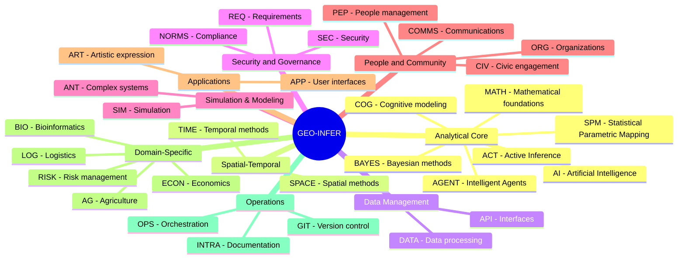
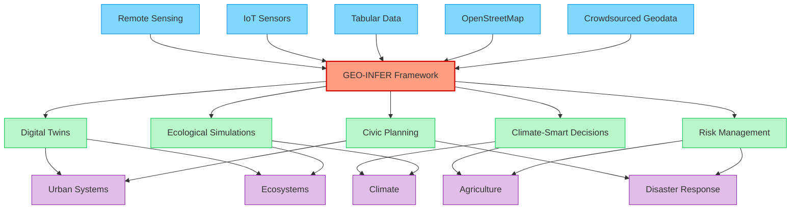
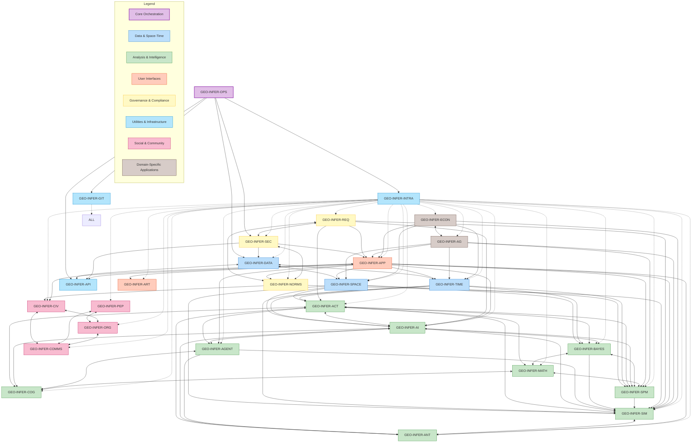
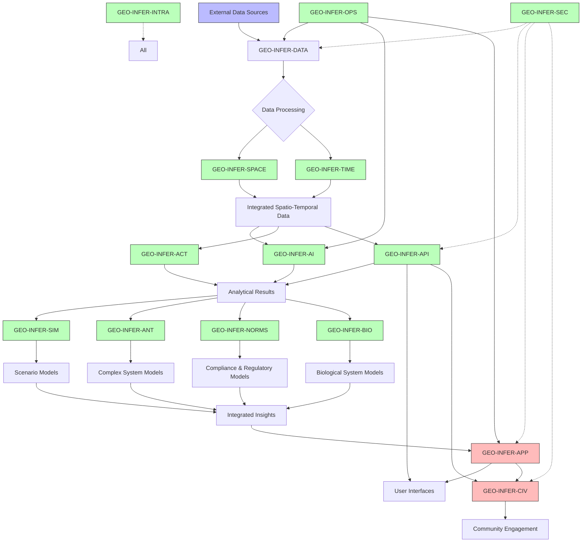
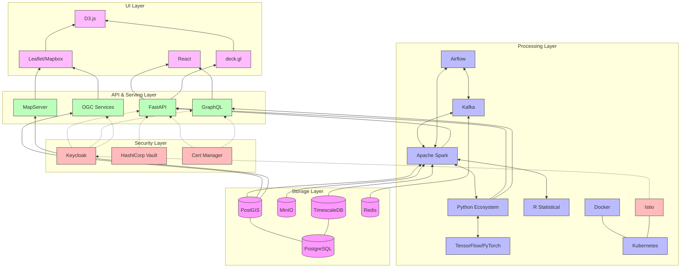
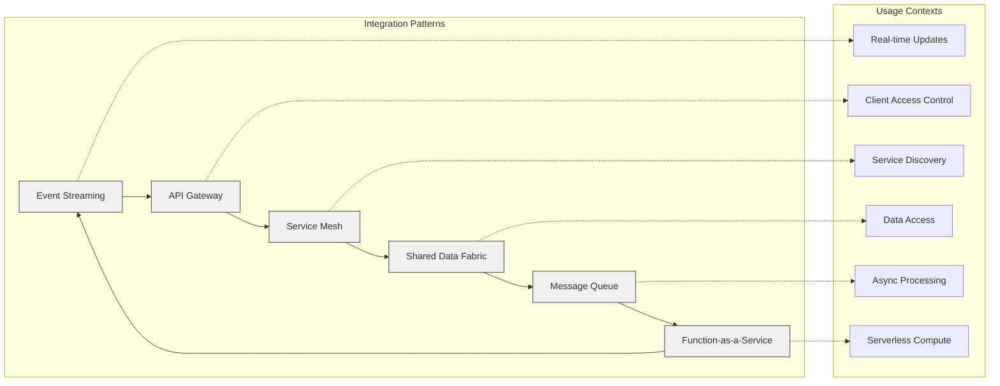

# GEO-INFER Framework 🌍🔍

[](https://creativecommons.org/licenses/by-nd-sa/4.0/)
[](https://www.python.org/downloads/)
[]()
[]()
[](https://doi.org/)
[](https://discord.activeinference.institute/)


<div align="center">
  <a href="#getting-started-">🚀 Get Started</a> •
  <a href="#module-categories-">📦 Module Categories</a> •
  <a href="#core-modules-">🔧 Core Modules</a> •
  <a href="#use-cases-">📋 Use Cases</a> •
  <a href="#contributing-">👥 Contributing</a> •
  <a href="#community-">🌐 Community</a> •
  <a href="#license-">📄 License</a>
</div>

## Overview 📋

GEO-INFER is a comprehensive geospatial inference framework designed for ecological and civic applications. It provides a modular architecture for spatial-temporal analysis, active inference modeling, and community engagement. The framework integrates advanced geospatial analytics, AI/ML capabilities, Bayesian methods, and participatory tools into a cohesive ecosystem.

## 📦 Module Categories


## 🧭 Quick Navigation

| Category                     | Modules                                                                                                                                                      |
| ---------------------------- | ------------------------------------------------------------------------------------------------------------------------------------------------------------ |
| **🧠 Analytical Core**       | [ACT](./GEO-INFER-ACT/), [BAYES](./GEO-INFER-BAYES/), [AI](./GEO-INFER-AI/), [MATH](./GEO-INFER-MATH/), [COG](./GEO-INFER-COG/), [AGENT](./GEO-INFER-AGENT/), [SPM](./GEO-INFER-SPM/) |
| **🗺️ Spatial-Temporal**     | [SPACE](./GEO-INFER-SPACE/), [TIME](./GEO-INFER-TIME/)                                                                                                       |
| **💾 Data Management**       | [DATA](./GEO-INFER-DATA/), [API](./GEO-INFER-API/)                                                                                                           |
| **🔒 Security & Governance** | [SEC](./GEO-INFER-SEC/), [NORMS](./GEO-INFER-NORMS/), [REQ](./GEO-INFER-REQ/)                                                                                |
| **🧪 Simulation & Modeling** | [SIM](./GEO-INFER-SIM/), [ANT](./GEO-INFER-ANT/)                                                                                                             |
| **👥 People & Community**    | [CIV](./GEO-INFER-CIV/), [PEP](./GEO-INFER-PEP/), [ORG](./GEO-INFER-ORG/), [COMMS](./GEO-INFER-COMMS/)                                                       |
| **🖥️ Applications**         | [APP](./GEO-INFER-APP/), [ART](./GEO-INFER-ART/)                                                                                                             |
| **🏢 Domain-Specific**       | [AG](./GEO-INFER-AG/), [ECON](./GEO-INFER-ECON/), [RISK](./GEO-INFER-RISK/), [LOG](./GEO-INFER-LOG/), [BIO](./GEO-INFER-BIO/)                               |
| **⚙️ Operations**            | [OPS](./GEO-INFER-OPS/), [INTRA](./GEO-INFER-INTRA/), [GIT](./GEO-INFER-GIT/)                                                                                |


##  Core Modules

| **Module Name**     | **Purpose**                                                                                        | **Key Features**                                                                                                                                                                                                  |
| ------------------- | -------------------------------------------------------------------------------------------------- | ----------------------------------------------------------------------------------------------------------------------------------------------------------------------------------------------------------------- |
| **GEO-INFER-ACT**   | Analytical and formal Active Inference modeling for nested and interacting systems.                | - [Generative models](./GEO-INFER-ACT/README.md#generative-models) for spatial-temporal dynamics<br>- [Free-energy minimization](./GEO-INFER-ACT/README.md#free-energy-minimization) frameworks for adaptive decision-making<br>- [Probabilistic programming](./GEO-INFER-ACT/README.md#probabilistic-programming) tools for uncertainty quantification                       |
| **GEO-INFER-AG**    | Agricultural methods and farming applications.                                                     | - [Precision agriculture](./GEO-INFER-AG/README.md#precision-agriculture)<br>- [Crop modeling](./GEO-INFER-AG/README.md#crop-modeling)<br>- [Soil & water management](./GEO-INFER-AG/README.md#soil-and-water-management)                                                                                                                                           |
| **GEO-INFER-AI**    | Artificial Intelligence and Machine Learning integration into geospatial workflows.                | - [Automated feature extraction](./GEO-INFER-AI/README.md#feature-extraction) from satellite imagery<br>- [Predictive analytics](./GEO-INFER-AI/README.md#predictive-analytics) for climate change mitigation<br>- [Spatial pattern recognition](./GEO-INFER-AI/README.md#pattern-recognition) and classification                                                 |
| **GEO-INFER-AGENT** | Intelligent agent frameworks for autonomous geospatial decision-making and interaction.            | - [Multi-agent systems](./GEO-INFER-AGENT/README.md#multi-agent-systems) for distributed spatial reasoning<br>- [Autonomous agent architectures](./GEO-INFER-AGENT/README.md#agent-architectures) for geospatial tasks<br>- [Agent-based interfaces](./GEO-INFER-AGENT/README.md#agent-interfaces) and assistants<br>- [Collaborative agent networks](./GEO-INFER-AGENT/README.md#agent-networks) for spatial problems |
| **GEO-INFER-ANT**   | Specialized module for complex systems modeling, using Active Inference principles.                | - [Multi-scale "Ant" entities](./GEO-INFER-ANT/README.md#ant-entities) with movement data integration<br>- [Simulation environments](./GEO-INFER-ANT/README.md#simulation) for colony dynamics<br>- [Ant-inspired algorithms](./GEO-INFER-ANT/README.md#algorithms) for geospatial optimization                                             |
| **GEO-INFER-API**   | API development and integration services for interoperability.                                     | - [OGC-compliant API](./GEO-INFER-API/README.md#ogc-compliance) development<br>- [RESTful and GraphQL](./GEO-INFER-API/README.md#api-interfaces) interfaces for geospatial data<br>- [Webhook integration](./GEO-INFER-API/README.md#webhooks) for real-time updates                                                                            |
| **GEO-INFER-APP**   | User interfaces, accessibility tools, and application development.                                 | - [Map-centric GIS interfaces](./GEO-INFER-APP/README.md#gis-interfaces) with interactive visualizations<br>- [Mobile-friendly data collection](./GEO-INFER-APP/README.md#mobile-collection) tools<br>- [Multilingual support](./GEO-INFER-APP/README.md#multilingual) and accessibility features                                                      |
| **GEO-INFER-ART**   | Art production and aesthetics with geospatial dimensions.                                          | - [Geospatial data visualization](./GEO-INFER-ART/README.md#visualization) as art<br>- [Place-based artistic expression](./GEO-INFER-ART/README.md#artistic-expression) tools<br>- [Aesthetic frameworks](./GEO-INFER-ART/README.md#aesthetics) for map design<br>- [Generative art systems](./GEO-INFER-ART/README.md#generative-art) using geographic inputs                                    |
| **GEO-INFER-BAYES** | Generalized Bayesian inference processes.                                                          | - [Hierarchical models](./GEO-INFER-BAYES/README.md#hierarchical-models)<br>- [MCMC methods](./GEO-INFER-BAYES/README.md#mcmc)<br>- [Variational inference](./GEO-INFER-BAYES/README.md#variational-inference)<br>- [Spatial priors](./GEO-INFER-BAYES/README.md#spatial-priors)                                                                                                                            |
| **GEO-INFER-BIO**   | Bioinformatics analysis with spatial context.                                                      | - [Sequence analysis](./GEO-INFER-BIO/README.md#sequence-analysis) with spatial distribution<br>- [Network analysis](./GEO-INFER-BIO/README.md#network-analysis) for biological systems<br>- [Population dynamics](./GEO-INFER-BIO/README.md#population-dynamics) modeling<br>- [Metabolic pathway](./GEO-INFER-BIO/README.md#metabolic-pathways) visualization                                                      |
| **GEO-INFER-CIV**   | Community engagement and participatory mapping tools.                                              | - [STEW-MAP tools](./GEO-INFER-CIV/README.md#stew-map) for visualizing stewardship networks<br>- [Platforms for community-driven](./GEO-INFER-CIV/README.md#community-platforms) spatial planning<br>- [Participatory sensing](./GEO-INFER-CIV/README.md#participatory-sensing) and data collection frameworks                                              |
| **GEO-INFER-COG**   | Cognitive phenomena and modeling for geospatial systems.                                           | - [Attention mechanisms](./GEO-INFER-COG/README.md#attention) for spatial focus<br>- [Memory models](./GEO-INFER-COG/README.md#memory) for spatial-temporal knowledge<br>- [Trust modeling](./GEO-INFER-COG/README.md#trust) across geographic networks<br>- [Anticipatory systems](./GEO-INFER-COG/README.md#anticipatory) for predictive cognition                      |
| **GEO-INFER-COMMS** | Communications within and outside of the project.                                                  | - [Internal collaboration](./GEO-INFER-COMMS/README.md#internal-collaboration) tools for distributed teams<br>- [External communication](./GEO-INFER-COMMS/README.md#external-communication) channels<br>- [Data visualization](./GEO-INFER-COMMS/README.md#visualization) for public engagement<br>- [Geospatial storytelling](./GEO-INFER-COMMS/README.md#storytelling)                                              |
| **GEO-INFER-DATA**  | Data management, ETL processes, and storage optimization for geospatial data.                      | - [Distributed geospatial data warehousing](./GEO-INFER-DATA/README.md#warehousing)<br>- [ETL pipelines](./GEO-INFER-DATA/README.md#etl) for heterogeneous data sources<br>- [Version control](./GEO-INFER-DATA/README.md#version-control) for geospatial datasets<br>- [Data quality assurance](./GEO-INFER-DATA/README.md#quality-assurance) workflows                                    |
| **GEO-INFER-ECON**  | Economic modeling with spatial dimensions.                                                         | - [Spatial economics](./GEO-INFER-ECON/README.md#spatial-economics)<br>- [Market simulation](./GEO-INFER-ECON/README.md#market-simulation)<br>- [Policy analysis](./GEO-INFER-ECON/README.md#policy-analysis)                                                                                                                                                   |
| **GEO-INFER-GIT**   | Git integration and version control workflows for data and code.                                   | - [Automated versioning](./GEO-INFER-GIT/README.md#automated-versioning) for geospatial datasets<br>- [Branching strategies](./GEO-INFER-GIT/README.md#branching)<br>- [Integration with CI/CD](./GEO-INFER-GIT/README.md#ci-cd)<br>- [Repository management tools](./GEO-INFER-GIT/README.md#repository-tools)                               |
| **GEO-INFER-INTRA** | Project documentation, workflows, processes, and ontology management.                              | - [Standardized ontologies](./GEO-INFER-INTRA/README.md#ontologies) for cross-domain interoperability<br>- [Visual programming](./GEO-INFER-INTRA/README.md#visual-programming) tools to simplify learning curves<br>- [Open-source documentation](./GEO-INFER-INTRA/README.md#documentation) adhering to FAIR principles                                  |
| **GEO-INFER-MATH**  | Analytical and mathematical basis for all other packages.                                          | - [Mathematical formulations](./GEO-INFER-MATH/README.md#formulations) of geospatial relationships<br>- [Statistical methods](./GEO-INFER-MATH/README.md#statistics) for spatial data analysis<br>- [Algebraic structures](./GEO-INFER-MATH/README.md#algebraic-structures) for spatial modeling<br>- [Category theory](./GEO-INFER-MATH/README.md#category-theory) applications to geospatial systems |
| **GEO-INFER-NORMS** | Social-technical compliance modeling with deterministic and probabilistic aspects.                 | - [Compliance tracking](./GEO-INFER-NORMS/README.md#compliance) using geospatial frameworks<br>- [Probabilistic modeling](./GEO-INFER-NORMS/README.md#probabilistic-modeling) of social norms in urban planning<br>- [Tools for mapping](./GEO-INFER-NORMS/README.md#mapping-tools) regulatory impacts on ecological systems                                   |
| **GEO-INFER-OPS**   | Operational kernel for system orchestration, logging, testing, and architecture.                   | - [Scalable architecture](./GEO-INFER-OPS/README.md#architecture) for distributed geospatial processing<br>- [Integrated logging](./GEO-INFER-OPS/README.md#logging) and monitoring systems<br>- [Automated testing](./GEO-INFER-OPS/README.md#testing) pipelines<br>- [Modular integration](./GEO-INFER-OPS/README.md#integration) of AI-driven analytics                     |
| **GEO-INFER-ORG**   | Organizations and Decentralized Autonomous Organizations (DAOs).                                   | - [Modular governance](./GEO-INFER-ORG/README.md#governance) components<br>- [Complex token engineering](./GEO-INFER-ORG/README.md#token-engineering) for voice and value<br>- [AI-assisted proposal](./GEO-INFER-ORG/README.md#ai-proposals) making and vetting<br>- [Holonic nesting](./GEO-INFER-ORG/README.md#holonic-nesting) of sub-DAOs and guild networks                |
| **GEO-INFER-PEP**   | People management, HR, and CRM functions.                                                          | - [Talent acquisition](./GEO-INFER-PEP/README.md#talent)<br>- [Skills development](./GEO-INFER-PEP/README.md#skills)<br>- [Community relationship](./GEO-INFER-PEP/README.md#community-relationships) management<br>- [Conflict resolution](./GEO-INFER-PEP/README.md#conflict-resolution)                                                                                                      |
| **GEO-INFER-REQ**   | Requirements engineering using the Properties, Processes, and Perspectives Inter-Framework (P3IF). | - [P3IF implementation](./GEO-INFER-REQ/README.md#p3if)<br>- [Modular abstraction](./GEO-INFER-REQ/README.md#abstraction) between frameworks<br>- [Multiplexing factors](./GEO-INFER-REQ/README.md#multiplexing) across domains<br>- [Harmonization](./GEO-INFER-REQ/README.md#harmonization) of vocabularies and narratives<br>- [Expanded security](./GEO-INFER-REQ/README.md#security) considerations                |
| **GEO-INFER-SEC**   | Security and privacy frameworks for sensitive geospatial information.                              | - [Geospatial data anonymization](./GEO-INFER-SEC/README.md#anonymization) techniques<br>- [Role-based access control](./GEO-INFER-SEC/README.md#access-control) for location data<br>- [Compliance frameworks](./GEO-INFER-SEC/README.md#compliance) for international regulations<br>- [Secure data sharing](./GEO-INFER-SEC/README.md#secure-sharing) protocols across jurisdictions      |
| **GEO-INFER-SIM**   | Simulation environments for hypothesis testing and policy evaluation.                              | - [Digital twin technology](./GEO-INFER-SIM/README.md#digital-twins) for urban/ecological scenarios<br>- [Agent-based models](./GEO-INFER-SIM/README.md#agent-models) for behavior prediction<br>- [Scenario planning](./GEO-INFER-SIM/README.md#scenario-planning) and policy evaluation tools                                                       |
| **GEO-INFER-SPM**   | Statistical Parametric Mapping for continuous spatial-temporal field analysis.                     | - [General Linear Model (GLM)](./GEO-INFER-SPM/README.md#general-linear-model-glm-analysis) for geospatial data<br>- [Random Field Theory (RFT)](./GEO-INFER-SPM/README.md#random-field-theory-rft) for multiple comparison correction<br>- [Cluster-level inference](./GEO-INFER-SPM/README.md#statistical-inference) for spatial patterns<br>- [Multi-resolution analysis](./GEO-INFER-SPM/README.md#multi-resolution-analysis) across scales |
| **GEO-INFER-SPACE** | Advanced spatial methods for land, water, air, and more.                                           | - [Multi-resolution spatial indexing](./GEO-INFER-SPACE/README.md#spatial-indexing) (e.g., H3 hexagonal grids)<br>- [Real-time geospatial analytics](./GEO-INFER-SPACE/README.md#real-time-analytics) using IoT<br>- [Support for Earth Observation](./GEO-INFER-SPACE/README.md#earth-observation) data via STAC protocols                                           |
| **GEO-INFER-TIME**  | Temporal methods for timeline expression and fusion of dynamic data.                               | - [Integration of time-series](./GEO-INFER-TIME/README.md#time-series) geospatial datasets<br>- [Predictive modeling](./GEO-INFER-TIME/README.md#predictive-modeling) of temporal trends<br>- [Real-time updates](./GEO-INFER-TIME/README.md#real-time) using WebSocket technologies                                                                  |
| **GEO-INFER-RISK**  | Risk modeling, Insurance, and Re-insurance for geospatial applications.                            | - [Catastrophe modeling](./GEO-INFER-RISK/README.md#catastrophe-modeling) and natural disaster risk assessment<br>- [Insurance pricing models](./GEO-INFER-RISK/README.md#insurance-pricing) with spatial components<br>- [Climate change risk](./GEO-INFER-RISK/README.md#climate-risk) forecasting<br>- [Portfolio exposure](./GEO-INFER-RISK/README.md#portfolio-exposure) management                          |
| **GEO-INFER-LOG**   | Logistics and supply chain optimization with geospatial intelligence.                             | - [Route optimization](./GEO-INFER-LOG/README.md#route-optimization) and fleet management<br>- [Supply chain resilience](./GEO-INFER-LOG/README.md#supply-chain) modeling<br>- [Last-mile delivery](./GEO-INFER-LOG/README.md#last-mile) solutions<br>- [Multimodal transportation](./GEO-INFER-LOG/README.md#multimodal) planning                                                         |

## 🔄 Framework Position in Geospatial Ecosystem




## 🚀 Getting Started

### Prerequisites
- Python 3.9 or higher
- Git
- Docker (optional)
### Installation
```bash
# Clone the repository
git clone https://github.com/activeinference/GEO-INFER.git
cd GEO-INFER

# Create and activate virtual environment
python -m venv venv
source venv/bin/activate  # On Windows: venv\Scripts\activate

# Install dependencies
pip install -r requirements.txt
```
### Quick Start
```python
from geo_infer import Space, Time, Act

# Initialize core components
space = Space()
time = Time()
act = Act()

# Perform basic spatial-temporal analysis
result = act.analyze(space, time)
```
## 📋 Use Cases

### Ecological Applications
- Biodiversity monitoring
- Climate change impact assessment
- Ecosystem service valuation
- Habitat connectivity analysis

### Civic Applications
- Community-based mapping
- Participatory planning
- Environmental justice assessment
- Urban resilience planning

### Research Applications
- Spatial-temporal modeling
- Complex system analysis
- Multi-scale ecological studies
- Interdisciplinary research

## 👥 Contributing

We welcome contributions! Please see our [Contributing Guidelines](CONTRIBUTING.md) for details on:
- Code of Conduct
- Development Process
- Pull Request Process
- Coding Standards

## 🌐 Community

Join our growing community:
- [Discord Server](https://discord.activeinference.institute/)
- [GitHub Discussions](https://github.com/activeinference/GEO-INFER/discussions)
- [Documentation](https://docs.geo-infer.org)
- [Blog](https://blog.geo-infer.org)


## 📊 Real-World Case Studies

<details>
<summary><b>🌾 Precision Agriculture: Midwest Farming Cooperative</b></summary>

### Challenge
A farming cooperative managing 125,000 acres across the Midwest needed to optimize irrigation, reduce pesticide use, and increase crop yield while adapting to changing climate patterns.

### Solution
We implemented a comprehensive solution using GEO-INFER modules:
- **AG**: Crop-specific modeling and management
- **SPACE**: High-resolution field mapping with drone imagery
- **TIME**: Historical climate data integration
- **AI**: Predictive analytics for pest outbreaks
- **SIM**: Scenario planning for different weather patterns

### Results
- **22% reduction** in water usage
- **18% decrease** in pesticide application
- **15% increase** in crop yield
- **$4.2M annual savings** across the cooperative
- Carbon sequestration improvements qualified for **additional carbon credits**


</details>

<details>
<summary><b>🏙️ Urban Resilience: Coastal City Adaptation</b></summary>

### Challenge
A coastal city of 850,000 residents faced increasing flood risks from sea level rise and more frequent storm events, threatening infrastructure and communities.

### Solution
GEO-INFER enabled a comprehensive resilience strategy:
- **SPACE** & **TIME**: Integrated elevation models with tide patterns and storm forecasts
- **SIM**: Dynamic flood simulations under multiple climate scenarios
- **RISK**: Vulnerability assessment across critical infrastructure
- **CIV**: Community-driven adaptation planning
- **APP**: Public-facing early warning system

### Results
- **30% faster** emergency response during flooding events
- **Prioritized protection** for vulnerable communities
- **$620M saved** in potential infrastructure damage
- **85% resident approval** of participatory planning process
- Successfully secured **$45M in climate resilience funding**


</details>

<details>
<summary>🌳 Conservation: Rainforest Monitoring Network</summary>

### Challenge
An international conservation organization needed to monitor 2.3 million hectares of rainforest across multiple countries, tracking deforestation, biodiversity, and carbon stocks.

### Solution
GEO-INFER provided an integrated monitoring solution:
- **SPACE**: Multi-source satellite imagery analysis
- **TIME**: Temporal change detection
- **AI**: Automated forest disturbance alerts
- **DATA**: Distributed sensor network integration
- **CIV**: Indigenous community monitoring participation

### Results
- **Near real-time detection** of illegal logging activities
- **43% reduction** in enforcement response time
- **92% accuracy** in disturbance classification
- **Transparent verification** for carbon credit markets
- Successful **legal action** against 12 major violators


</details>

<details>
<summary>⚠️ Disaster Management: Multi-Hazard Early Warning</summary>

### Challenge
A region prone to multiple natural hazards (earthquakes, floods, wildfires) needed an integrated early warning system with improved prediction capabilities.

### Solution
A comprehensive GEO-INFER implementation included:
- **RISK**: Multi-hazard risk modeling and cascading effects
- **TIME**: Real-time sensor data integration
- **AGENT**: Automated alert generation and dissemination
- **APP**: Mobile early warning application
- **SIM**: Evacuation scenario modeling

### Results
- **Average 15-minute increase** in early warning time
- **32% improvement** in evacuation efficiency
- **97% population reach** for emergency alerts
- **Seamless coordination** across multiple agencies
- **Estimated 127 lives saved** during major flood event


</details>

## Additional Notes 📌

- 🔄 **Interconnectivity Across Modules**: While each module has a distinct purpose, they are designed to work cohesively as part of a larger ecosystem.
- 📊 **Scalability & Modularity**: Each module can be independently scaled or extended based on project requirements.
- 🌐 **Open Source Collaboration**: All modules adhere to open-source principles to encourage global contributions.
- 🛡️ **Ethical Frameworks Embedded**: Ethical considerations are integrated across all modules to ensure responsible use of geospatial data.

## Project Structure 📂

Each module generally follows this standardized structure, though some may include additional directories specific to their domain or function (e.g., `etl/`, `storage/`, `repos/`).
```
MODULE_NAME/
├── config/               # Configuration files
├── docs/                 # Documentation
├── examples/             # Example applications and use cases
├── src/                  # Source code
│   └── module_package/   # Main package
│       ├── api/          # API definitions
│       ├── core/         # Core functionality
│       ├── models/       # Data models
│       └── utils/        # Utility functions
└── tests/                # Test suite
```

## Technology Stack 💻

### Core Technologies

- 🐍 **Python Ecosystem**
  - [NumPy](https://numpy.org/) & [SciPy](https://scipy.org/) for numerical computing
  - [Pandas](https://pandas.pydata.org/) for data manipulation
  - [GeoPandas](https://geopandas.org/) for geospatial data operations
  - [PyTorch](https://pytorch.org/) & [TensorFlow](https://www.tensorflow.org/) for machine learning

- 🗄️ **Data Storage**
  - [PostgreSQL](https://www.postgresql.org/) with [PostGIS](https://postgis.net/) extension for spatial data
  - [TimescaleDB](https://www.timescale.com/) for time-series data
  - [MinIO](https://min.io/) for object storage (S3-compatible)
  - [Redis](https://redis.io/) for caching and pub/sub messaging

- 🌐 **API & Services**
  - [FastAPI](https://fastapi.tiangolo.com/) for RESTful services
  - [GraphQL](https://graphql.org/) for flexible data queries
  - [gRPC](https://grpc.io/) for high-performance microservices
  - [RabbitMQ](https://www.rabbitmq.com/) for message queuing

- 🖥️ **Frontend**
  - [ReactJS](https://reactjs.org/) for web interfaces
  - [Leaflet](https://leafletjs.com/) & [Mapbox](https://www.mapbox.com/) for interactive maps
  - [D3.js](https://d3js.org/) for data visualization
  - [deck.gl](https://deck.gl/) for large-scale WebGL visualizations

- 🚢 **DevOps**
  - [Docker](https://www.docker.com/) for containerization
  - [Kubernetes](https://kubernetes.io/) for orchestration
  - [GitHub Actions](https://github.com/features/actions) for CI/CD
  - [Terraform](https://www.terraform.io/) for infrastructure as code

## Framework Architecture

The following diagram illustrates the relationships and interactions between all modules in the GEO-INFER framework:



## Module Interaction Flow



## Technology Stack Architecture



## Integration Architecture 🔄

The GEO-INFER framework features a sophisticated integration architecture that connects all modules through standardized interfaces and protocols:


## Domain-Specific Use Cases

The GEO-INFER framework supports a wide range of domain-specific use cases, including but not limited to:

- **Agricultural Monitoring and Management**
  - Precision agriculture for crop health monitoring and management
  - Soil and water management optimization

- **Urban Planning and Community Engagement**
  - Community-driven spatial planning initiatives
  - Stewardship network visualization and management

- **Ecological Research and Conservation**
  - Biodiversity monitoring and analysis
  - Ecological impact assessment and mitigation strategies

- **Economic Modeling and Policy Analysis**
  - Spatial economics for market simulation and policy analysis
  - Economic impact assessment and policy development

- **Artistic Expression and Cultural Interpretation**
  - Geospatial data visualization as art
  - Place-based artistic expression tools
  - Cultural interpretations of spatial data

- **Advanced Spatial Methods and Analytics**
  - Multi-resolution spatial indexing and geospatial analytics
  - Real-time geospatial analytics using IoT and edge computing

- **Data Management and ETL Processes**
  - Distributed geospatial data warehousing
  - Intelligent ETL pipelines for heterogeneous data sources

- **Security and Privacy Frameworks**
  - Geospatial data anonymization techniques
  - Role-based access control for location data

- **Governance and Compliance Modeling**
  - Compliance tracking using geospatial ESG frameworks
  - Probabilistic modeling of social norms in urban planning scenarios

- **Simulation and Modeling Environments**
  - Digital twin technology for simulating urban or ecological scenarios
  - Agent-based models for behavior prediction under various conditions

- **Cognitive Modeling and AI Integration**
  - Attention mechanisms for spatial focus
  - Memory models for spatial-temporal knowledge representation
  - Trust modeling across geographic networks

- **Community Engagement and Participation**
  - Tools like STEW-MAP for community-driven spatial planning
  - Platforms enabling community-driven initiatives

## Implementation Guidelines 🛠️

### Module Development Standards

To ensure consistency and interoperability across the GEO-INFER framework, all module development should adhere to the following standards:

1. **API Contract Specifications**
   - All modules must implement standardized interfaces as defined in GEO-INFER-API
   - Use OpenAPI 3.0+ for RESTful services documentation
   - GraphQL schema must be version-controlled and backward compatible

2. **Containerization Requirements**
   - Each module should be containerized using Docker
   - Helm charts should be provided for Kubernetes deployment
   - Multi-architecture support (amd64, arm64) required for edge computing scenarios

3. **Testing Protocol**
   - Minimum 95% test coverage for core functionality
   - Integration tests validating interoperability with dependent modules
   - Performance benchmarks for geospatial operations
   - Security scanning integrated into CI/CD pipeline

4. **Documentation Standards**
   - API reference using standard formats (OpenAPI, GraphQL schema)
   - Technical documentation for developers
   - User-friendly guides for end-users
   - Interactive examples where applicable

### Cross-Module Integration Patterns

The GEO-INFER architecture uses several key integration patterns to ensure robust, scalable communication between modules:



## 🚀 Quick Start Code Examples

Get started quickly with these practical examples:

<details>
<summary><b>Basic Spatial Analysis</b></summary>

```python
import geoinfer.space as gis
import geoinfer.data as gid
import matplotlib.pyplot as plt

# Load and prepare geospatial data
dataset = gid.load_dataset("urban_heat_islands")
cities = dataset.filter(population_gt=500000)

# Perform spatial analysis
heat_clusters = gis.cluster_analysis(
    data=cities,
    method="dbscan",
    feature="surface_temp",
    spatial_resolution="30m"
)

# Visualize results
fig = plt.figure(figsize=(12, 8))
gis.plot_clusters(
    heat_clusters,
    basemap="osm",
    color_by="intensity",
    title="Urban Heat Island Clusters"
)
plt.show()

# Export results
heat_clusters.export_geojson("heat_clusters.geojson")
```

</details>

<details>
<summary><b>Time Series Forecasting</b></summary>

```python
import geoinfer.time as git
import geoinfer.data as gid
import geoinfer.ai as gia
import pandas as pd

# Load temporal geospatial data
stations = gid.load_dataset("weather_stations")
rainfall = stations.get_time_series("precipitation", "2010-01-01", "2023-01-01")

# Create spatial-temporal model
model = gia.create_model(
    model_type="spatial_temporal_lstm",
    spatial_features=["elevation", "distance_to_coast", "land_cover"],
    temporal_features=["precipitation", "temperature"],
    target="precipitation",
    forecast_horizon="7d"
)

# Train model
model.train(
    train_data=rainfall.filter(date_lt="2022-01-01"),
    validation_data=rainfall.filter(date_between=["2022-01-01", "2022-06-01"]),
    epochs=50,
    batch_size=32
)

# Generate predictions
predictions = model.predict(
    test_data=rainfall.filter(date_gt="2022-06-01"),
    return_confidence=True
)

# Evaluate results
evaluation = model.evaluate(actual=rainfall, predicted=predictions)
print(f"RMSE: {evaluation.rmse}, MAE: {evaluation.mae}")

# Export forecast visualization
git.plot_forecast(
    actual=rainfall,
    predicted=predictions,
    uncertainty=True,
    export_path="rainfall_forecast.png"
)
```

</details>

<details>
<summary><b>Agent-Based Simulation</b></summary>

```python
import geoinfer.agent as gia
import geoinfer.sim as gis
import geoinfer.space as gsp

# Setup simulation environment
city_grid = gsp.create_grid(
    bounds=[-74.02, 40.70, -73.95, 40.78],  # Manhattan bounds
    resolution="100m",
    crs="EPSG:4326"
)

# Define agent behaviors
pedestrian_behavior = gia.define_behavior(
    type="active_inference",
    goals=["minimize_travel_time", "maximize_pleasant_routes"],
    perception_radius="200m",
    adaptation_rate=0.3
)

# Initialize agents
population = gia.create_agents(
    count=5000,
    type="pedestrian",
    behavior=pedestrian_behavior,
    initial_distribution="population_density"
)

# Setup simulation parameters
simulation = gis.Simulation(
    environment=city_grid,
    agents=population,
    duration="24h",
    time_step="5min",
    external_factors={
        "weather": "rainy",
        "time_of_day": "workday_morning",
        "events": ["concert_central_park"]
    }
)

# Run simulation
results = simulation.run(realtime_visualization=False)

# Analyze results
hotspots = gis.analyze_density(
    agent_positions=results.get_agent_positions(),
    method="kernel_density",
    time_slices=["morning", "noon", "evening"]
)

# Visualize flows
gis.plot_flows(
    agent_trajectories=results.get_trajectories(),
    basemap="cartodb_dark",
    animate=True,
    save_path="pedestrian_flows.gif"
)
```

</details>

<details>
<summary><b>Community Engagement Platform</b></summary>

```python
import geoinfer.civ as gic
import geoinfer.app as gia
import geoinfer.space as gis

# Initialize community project
project = gic.Project(
    name="Neighborhood Green Space Planning",
    area=gis.load_geometry("neighborhood_boundaries.geojson"),
    description="Collaborative planning for new urban green spaces"
)

# Setup stakeholder groups
project.add_stakeholder_group("residents", weight=0.4)
project.add_stakeholder_group("local_business", weight=0.2)
project.add_stakeholder_group("city_planners", weight=0.3)
project.add_stakeholder_group("environmental_experts", weight=0.1)

# Create participatory mapping application
mapping_app = gia.create_app(
    type="participatory_mapping",
    project=project,
    base_layers=["satellite", "streets", "heat"],
    tools=["draw", "comment", "vote", "measure"]
)

# Add survey for data collection
survey = gic.create_survey(
    questions=[
        "What types of green space would you prefer?",
        "How far would you walk to a green space?",
        "What activities would you like to do there?"
    ],
    spatial_context=True
)
mapping_app.add_component(survey)

# Deploy application
deployment = mapping_app.deploy(
    platform="web",
    authentication="email",
    analytics=True,
    url="greenspace-planning.example.org"
)

# Generate participation report after 30 days
report = gic.generate_report(
    project=project,
    metrics=["participation_rate", "demographic_representation", "consensus_areas"],
    format="pdf"
)
```

</details>

<details>
<summary><b>Risk Assessment Integration</b></summary>

```python
import geoinfer.risk as gir
import geoinfer.data as gid
import geoinfer.space as gis
import geoinfer.sim as gim

# Load infrastructure and hazard data
power_grid = gid.load_infrastructure("power_grid.gpkg")
flood_zones = gid.load_hazard_layer("flood_zones.tif")
historical_events = gid.load_timeseries("historical_floods.csv")

# Define vulnerability model
vulnerability_model = gir.create_vulnerability_model(
    infrastructure_type="power_grid",
    hazard_type="flooding",
    construction_data=power_grid.attributes["construction_year"],
    maintenance_data=power_grid.attributes["last_maintenance"],
    failure_history=historical_events
)

# Calculate risk scores
risk_assessment = gir.assess_risk(
    assets=power_grid,
    hazard=flood_zones,
    vulnerability_model=vulnerability_model,
    scenarios=["10yr", "50yr", "100yr"],
    include_uncertainty=True
)

# Identify critical points
critical_points = gir.identify_critical_nodes(
    network=power_grid,
    risk_scores=risk_assessment,
    methodology="network_centrality",
    cascade_potential=True
)

# Generate mitigation strategies
strategies = gir.generate_strategies(
    critical_assets=critical_points,
    budget_constraint="10M",
    time_horizon="5yr",
    prioritization="cost_benefit"
)

# Create decision support dashboard
dashboard = gir.create_dashboard(
    risk_data=risk_assessment,
    critical_nodes=critical_points,
    strategies=strategies,
    interactive=True,
    export_path="risk_dashboard.html"
)
```

</details>

## Contributing 🤝

We welcome contributions from the community! To contribute to the GEO-INFER framework:

1. Fork the repository you wish to contribute to
2. Create a feature branch (`git checkout -b feature/amazing-feature`)
3. Commit your changes using conventional commits (`git commit -m 'feat: Add amazing feature'`)
4. Push to the branch (`git push origin feature/amazing-feature`)
5. Open a Pull Request

Please see our [CONTRIBUTING.md](CONTRIBUTING.md) for detailed guidelines on code style, testing requirements, and the review process.

## Community 👪

Join our community to collaborate, ask questions, and share your work:

- **GitHub Discussions**: For feature requests, Q&A, and general discussion
- **Issue Tracker**: For bug reports and specific implementation issues
- **Slack Channel**: For real-time collaboration and community support
- **Monthly Webinars**: Learn about the latest developments and use cases

To stay updated on GEO-INFER development:

- Watch this repository for notifications on new releases
- Star the repository to show your support
- Follow our blog for in-depth articles and tutorials

## Future Research Directions 🔬

The GEO-INFER framework continues to evolve, with several key areas of ongoing and future research:

- **Federated Active Inference** 🧠
  - Distributed perception-action loops across geospatial networks
  - Multi-agent collaborative belief updating mechanisms
  - Cross-domain generative model sharing and validation

- **Quantum Computing Applications** ⚛️
  - Quantum algorithms for complex spatial optimization problems
  - Quantum machine learning for geospatial pattern recognition
  - Quantum-secured geospatial data transmission protocols

- **Neuromorphic Processing for Spatial Data** 🔄
  - Spike-based computing for real-time spatial data processing
  - Energy-efficient edge computing for remote sensing applications
  - Biologically-inspired spatial memory systems

- **Digital Twin Integration** 🌐
  - High-fidelity simulation environments for policy testing
  - Real-time synchronization between physical and digital representations
  - Multi-scale modeling from microhabitats to planetary systems

- **Cross-DAO Geospatial Governance** 🔗
  - Interoperable decision-making frameworks across jurisdictions
  - Token-engineering for spatial resource allocation
  - On-chain spatial rights and responsibilities

- **Extended Reality Interfaces** 👓
  - Immersive visualization of complex geospatial data
  - Haptic interfaces for intuitive interaction with spatial information
  - AR/VR/MR tools for collaborative spatial planning

## License 📄

This project is licensed under the Creative Commons Attribution-NoDerivatives-ShareAlike 4.0 International License (CC BY-ND-SA 4.0) - see the [LICENSE](LICENSE) file for details. 