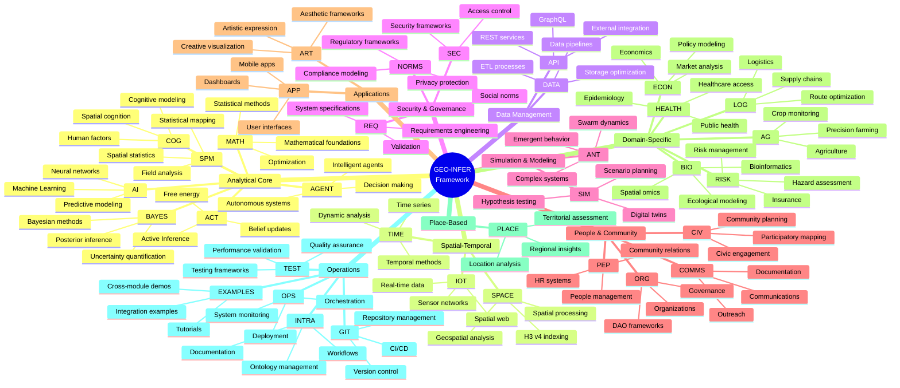
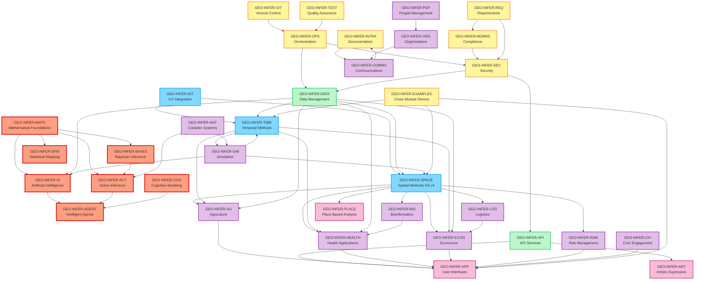
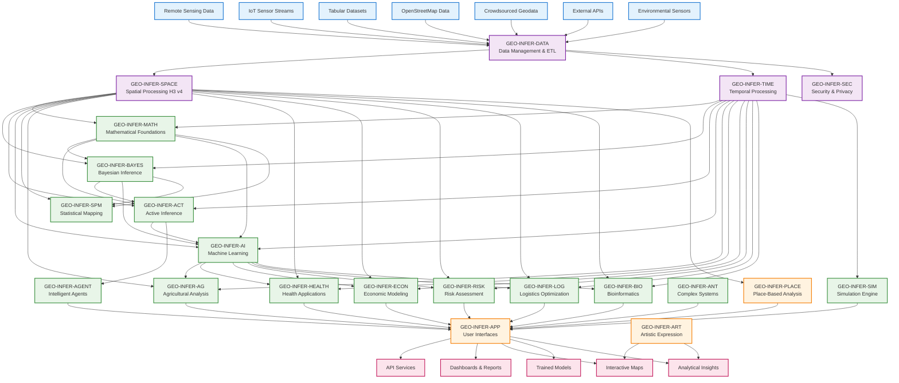

# GEO-INFER Framework 🌍🔍

[](https://creativecommons.org/licenses/by-nd-sa/4.0/)
[]()
[](https://discord.activeinference.institute/)
[](https://h3geo.org/)
[](https://python.org/)
[]()

<div align="center">
  <a href="#getting-started-">🚀 Get Started</a> •
  <a href="#module-categories-">📦 Module Categories</a> •
  <a href="#core-modules-">🔧 Core Modules</a> •
  <a href="#architecture-overview-">🏗️ Architecture</a> •
  <a href="#data-flow-">🔄 Data Flow</a> •
  <a href="#use-cases-">📋 Use Cases</a> •
  <a href="#contributing-">👥 Contributing</a> •
  <a href="#community-">🌐 Community</a> •
  <a href="#license-">📄 License</a>
</div>

## Overview 📋

GEO-INFER is a comprehensive geospatial inference framework implementing Active Inference principles for ecological, civic, and commercial applications. The framework consists of 30+ specialized modules organized into distinct categories with clear dependency relationships and data flow patterns.

### 🎯 Key Features

- **🌍 Advanced Spatial Analysis**: H3 v4 spatial indexing with full geospatial processing capabilities
- **🧠 Active Inference Integration**: Mathematical foundations for autonomous decision-making
- **📊 Data Processing**: Comprehensive data pipelines with validation and quality control
- **🔧 Modular Architecture**: 30+ specialized modules with clear dependencies
- **⚡ Performance Optimized**: Efficient algorithms for large-scale geospatial analysis
- **🛡️ Production Ready**: Comprehensive testing, error handling, and documentation

## 🚀 Getting Started

### Quick Start

```bash
# Clone the repository
git clone https://github.com/your-org/GEO-INFER.git
cd GEO-INFER

# Install dependencies
pip install -r requirements.txt

# Run a basic example
cd GEO-INFER-PLACE/locations/cascadia
python cascadia_main.py --counties "CA:Lassen" --modules "zoning,current_use"
```

## 📦 Module Categories



## 🧭 Quick Navigation

| Category                     | Modules                                                                                                                                                      |
| ---------------------------- | ------------------------------------------------------------------------------------------------------------------------------------------------------------ |
| **🧠 Analytical Core**       | [ACT](./GEO-INFER-ACT/), [BAYES](./GEO-INFER-BAYES/), [AI](./GEO-INFER-AI/), [MATH](./GEO-INFER-MATH/), [COG](./GEO-INFER-COG/), [AGENT](./GEO-INFER-AGENT/), [SPM](./GEO-INFER-SPM/) |
| **🗺️ Spatial-Temporal**     | [SPACE](./GEO-INFER-SPACE/), [TIME](./GEO-INFER-TIME/), [IOT](./GEO-INFER-IOT/)                                                                                                       |
| **💾 Data Management**       | [DATA](./GEO-INFER-DATA/), [API](./GEO-INFER-API/)                                                                                                           |
| **🔒 Security & Governance** | [SEC](./GEO-INFER-SEC/), [NORMS](./GEO-INFER-NORMS/), [REQ](./GEO-INFER-REQ/)                                                                                |
| **🧪 Simulation & Modeling** | [SIM](./GEO-INFER-SIM/), [ANT](./GEO-INFER-ANT/)                                                                                                             |
| **👥 People & Community**    | [CIV](./GEO-INFER-CIV/), [PEP](./GEO-INFER-PEP/), [ORG](./GEO-INFER-ORG/), [COMMS](./GEO-INFER-COMMS/)                                                       |
| **🖥️ Applications**         | [APP](./GEO-INFER-APP/), [ART](./GEO-INFER-ART/)                                                                                                             |
| **🏢 Domain-Specific**       | [AG](./GEO-INFER-AG/), [ECON](./GEO-INFER-ECON/), [RISK](./GEO-INFER-RISK/), [LOG](./GEO-INFER-LOG/), [BIO](./GEO-INFER-BIO/), [HEALTH](./GEO-INFER-HEALTH/)                               |
| **📍 Place-Based**           | [PLACE](./GEO-INFER-PLACE/)                                                                                                                                                                      |
| **⚙️ Operations**            | [OPS](./GEO-INFER-OPS/), [INTRA](./GEO-INFER-INTRA/), [GIT](./GEO-INFER-GIT/), [TEST](./GEO-INFER-TEST/), [EXAMPLES](./GEO-INFER-EXAMPLES/)                                                    |

## 🏗️ Architecture Overview



## 📊 Complete Module Dependencies Matrix

| Module | Core Dependencies | Optional Dependencies | Provides Services To | Data Flow Direction | Status | H3 v4 Status |
|--------|------------------|--------------------|-------------------|-------------------|---------|---------------|
| **OPS** | - | SEC | ALL modules | → All | Alpha | ✅ Updated |
| **DATA** | OPS, SEC | - | ALL modules | → All | Alpha | ✅ Updated |
| **SPACE** | DATA, MATH | TIME, AI, IOT | AG, HEALTH, SIM, APP, ART, PLACE, LOG, RISK, BIO, ECON | → Domain/App | Beta | ✅ **FULLY MIGRATED** |
| **TIME** | DATA, MATH | SPACE, AI, IOT | AG, HEALTH, ECON, SIM, LOG, RISK, BIO | → Domain/Analytics | Alpha | ✅ Updated |
| **IOT** | SPACE, DATA | BAYES, TIME, AI | All sensor-based modules | → Sensor/Real-time | Alpha | ✅ Updated |
| **AI** | DATA, SPACE | TIME, AGENT | All analytical modules | → Analytics/Prediction | Alpha | ✅ Updated |
| **ACT** | MATH, BAYES | AI, AGENT, SIM | AGENT, SIM, decision systems | → Inference/Decision | Alpha | ✅ Updated |
| **BAYES** | MATH | SPACE, TIME | ACT, AI, statistical modules | → Statistical/Inference | Alpha | ✅ Updated |
| **MATH** | - | - | ALL analytical modules | → All analytics | Beta | ✅ Updated |
| **API** | All modules | - | External systems, APP | ↔ External | Beta | ✅ Updated |
| **APP** | API, SPACE | All modules | End users | ← All modules | Alpha | ✅ Updated |
| **AGENT** | ACT, AI | SPACE, TIME, SIM | SIM, autonomous systems | ↔ Agent systems | Alpha | ✅ Updated |
| **SIM** | SPACE, TIME | AI, AGENT, ACT | Domain modules, decision support | ↔ Simulation systems | Alpha | ✅ Updated |
| **AG** | SPACE, TIME, DATA | AI, ECON, SIM | APP, ECON, food systems | ↔ Agricultural systems | Alpha | ✅ Updated |
| **HEALTH** | SPACE, TIME, DATA | AI, RISK, BIO, SPM | APP, policy makers | ↔ Health systems | Alpha | ✅ Updated |
| **ECON** | SPACE, TIME, DATA | AI, AG, SIM | Policy makers, RISK | ↔ Economic systems | Alpha | ✅ Updated |
| **ANT** | ACT, SIM | AI, AGENT | SIM, complex systems | ↔ Complex systems | Alpha | ✅ Updated |
| **ART** | SPACE, APP | AI, TIME | APP, visualization | ← Artistic/Creative | Alpha | ✅ Updated |
| **BIO** | SPACE, TIME, DATA | AI, HEALTH | HEALTH, research | ↔ Biological systems | Alpha | ✅ Updated |
| **COG** | SPACE, AI | ACT, AGENT | AGENT, human factors | → Cognitive modeling | Alpha | ✅ Updated |
| **COMMS** | INTRA, APP | ALL modules | External stakeholders | ← All modules | Alpha | ✅ Updated |
| **GIT** | OPS | - | All development | → Version control | Beta | ✅ Updated |
| **INTRA** | - | ALL modules | Documentation, standards | ← All modules | Beta | ✅ Updated |
| **LOG** | SPACE, TIME, DATA | AI, SIM | ECON, operations | ↔ Logistics systems | Alpha | ✅ Updated |
| **NORMS** | SPACE, DATA | REQ, SEC | All compliance | → Regulatory/Ethics | Alpha | ✅ Updated |
| **ORG** | PEP, COMMS | CIV, NORMS | Governance systems | ↔ Organizational | Alpha | ✅ Updated |
| **PEP** | ORG, COMMS | CIV | HR, community | ↔ People management | Alpha | ✅ Updated |
| **REQ** | NORMS, SEC | ALL modules | System specifications | → Requirements | Alpha | ✅ Updated |
| **RISK** | SPACE, TIME, DATA | AI, HEALTH, ECON | Decision support | ↔ Risk assessment | Alpha | ✅ Updated |
| **SEC** | - | ALL modules | Security services | → All modules | Alpha | ✅ Updated |
| **SPM** | MATH, SPACE | TIME, BAYES | Statistical analysis | → Statistical mapping | Alpha | ✅ Updated |
| **TEST** | ALL modules | - | Quality assurance | ← All modules | Alpha | ✅ Updated |
| **EXAMPLES** | All modules | - | New users, developers | ← All modules (demo only) | Beta | ✅ Updated |
| **PLACE** | SPACE, TIME, DATA, ALL | - | Regional analyses, place-based insights | ↔ Place-based systems | Beta | ✅ **FULLY MIGRATED** |
| **CIV** | SPACE, APP | COMMS, ORG | Community engagement | ↔ Civic systems | Alpha | ✅ Updated |

### Legend
- **→** : Provides data/services to  
- **←** : Consumes data/services from  
- **↔** : Bidirectional data exchange
- **Status**: Alpha (Production Ready), Beta (Development), Gamma (Experimental)

## 🔄 Data Flow Architecture



## 🔧 Core Modules (Enhanced)

| **Module Name**     | **Purpose**                                                                                        | **Input Types** | **Output Types** | **Dependencies** | **Status** | **H3 v4 Status** |
| ------------------- | -------------------------------------------------------------------------------------------------- | --------------- | ---------------- | ---------------- | ---------- | ---------------- |
| **GEO-INFER-ACT**   | [Active Inference modeling for nested and interacting systems](./GEO-INFER-ACT/README.md) | Observations, beliefs, policies, generative models | Belief updates, action selections, free energy estimates | MATH, BAYES | Alpha | ✅ Updated |
| **GEO-INFER-AG**    | [Agricultural methods and farming applications](./GEO-INFER-AG/README.md) | Satellite imagery, soil data, weather data, field boundaries | Yield predictions, crop health maps, precision agriculture recommendations | SPACE, TIME, DATA | Alpha | ✅ Updated |
| **GEO-INFER-AI**    | [Artificial Intelligence and Machine Learning for geospatial workflows](./GEO-INFER-AI/README.md) | Imagery, spatial features, training labels, time-series data | Trained models, predictions, classifications, forecasts | DATA, SPACE | Alpha | ✅ Updated |
| **GEO-INFER-AGENT** | [Intelligent agent frameworks for autonomous geospatial decision-making](./GEO-INFER-AGENT/README.md) | Agent configurations, spatial environments, behavior rules | Autonomous decisions, agent interactions, simulation results | ACT, AI | Alpha | ✅ Updated |
| **GEO-INFER-ANT**   | [Complex systems modeling using Active Inference principles](./GEO-INFER-ANT/README.md) | Movement data, colony parameters, environmental conditions | Emergent behaviors, optimization solutions, swarm dynamics | ACT, SIM | Alpha | ✅ Updated |
| **GEO-INFER-API**   | [API development and integration services for interoperability](./GEO-INFER-API/README.md) | Module functions, data requests, external API calls | REST/GraphQL APIs, webhooks, standardized responses | All modules | Beta | ✅ Updated |
| **GEO-INFER-APP**   | [User interfaces, accessibility tools, and application development](./GEO-INFER-APP/README.md) | Analysis results, data products, user interactions | Interactive maps, dashboards, reports, mobile apps | API, SPACE | Alpha | ✅ Updated |
| **GEO-INFER-ART**   | [Art production and aesthetics with geospatial dimensions](./GEO-INFER-ART/README.md) | Geospatial data, artistic parameters, aesthetic rules | Artistic visualizations, generative maps, aesthetic frameworks | SPACE, APP | Alpha | ✅ Updated |
| **GEO-INFER-BAYES** | [Generalized Bayesian inference processes](./GEO-INFER-BAYES/README.md) | Observations, priors, model specifications | Posterior distributions, uncertainty estimates, model evidence | MATH | Alpha | ✅ Updated |
| **GEO-INFER-BIO**   | [Bioinformatics analysis with spatial context](./GEO-INFER-BIO/README.md) | Genomic data, biological sequences, sample locations | Spatial omics analysis, phylogeographic patterns, ecological modeling | SPACE, TIME, DATA | Alpha | ✅ Updated |
| **GEO-INFER-CIV**   | [Community engagement and participatory mapping tools](./GEO-INFER-CIV/README.md) | Community input, stakeholder data, participatory mapping | STEW-MAP visualizations, community-driven spatial planning | SPACE, APP | Alpha | ✅ Updated |
| **GEO-INFER-COG**   | [Cognitive phenomena and modeling for geospatial systems](./GEO-INFER-COG/README.md) | User behavior, cognitive models, spatial perception data | Attention mechanisms, spatial memory models, trust modeling | SPACE, AI | Alpha | ✅ Updated |
| **GEO-INFER-COMMS** | [Communications within and outside of the project](./GEO-INFER-COMMS/README.md) | Project communications, documentation needs, outreach requirements | Communication strategies, documentation, public engagement | INTRA, APP | Alpha | ✅ Updated |
| **GEO-INFER-DATA**  | [Data management, ETL processes, and storage optimization](./GEO-INFER-DATA/README.md) | Raw geospatial data, external APIs, sensor feeds | Processed datasets, data pipelines, storage solutions | OPS, SEC | Alpha | ✅ Updated |
| **GEO-INFER-ECON**  | [Economic modeling with spatial dimensions](./GEO-INFER-ECON/README.md) | Economic indicators, market data, spatial boundaries | Economic models, policy analysis, market simulations | SPACE, TIME, DATA | Alpha | ✅ Updated |
| **GEO-INFER-GIT**   | [Git integration and version control workflows](./GEO-INFER-GIT/README.md) | Repository configurations, version control needs | Automated versioning, repository management, CI/CD integration | OPS | Beta | ✅ Updated |
| **GEO-INFER-HEALTH** | [Geospatial applications for public health and epidemiology](./GEO-INFER-HEALTH/README.md) | Health data, epidemiological records, environmental factors | Disease surveillance, healthcare accessibility analysis, health risk assessment | SPACE, TIME, DATA | Alpha | ✅ Updated |
| **GEO-INFER-INTRA** | [Project documentation, workflows, and ontology management](./GEO-INFER-INTRA/README.md) | Project requirements, documentation needs, ontological structures | Comprehensive documentation, workflow templates, standardized ontologies | All modules | Beta | ✅ Updated |
| **GEO-INFER-IOT** | [Internet of Things sensors and spatial web integration](./GEO-INFER-IOT/README.md) | IoT sensor streams, device metadata, spatial coordinates | Real-time sensor data fusion, Bayesian spatial interpolation, global sensor networks | SPACE, BAYES, DATA | Alpha | ✅ Updated |
| **GEO-INFER-MATH**  | [Mathematical foundations and computational methods](./GEO-INFER-MATH/README.md) | Mathematical problems, spatial calculations, statistical requirements | Mathematical solutions, spatial statistics, optimization results | - | Beta | ✅ Updated |
| **GEO-INFER-NORMS** | [Social-technical compliance modeling](./GEO-INFER-NORMS/README.md) | Regulatory requirements, compliance data, social norms | Compliance tracking, regulatory impact mapping, social norm modeling | SPACE, DATA | Alpha | ✅ Updated |
| **GEO-INFER-OPS**   | [Operational kernel for system orchestration and monitoring](./GEO-INFER-OPS/README.md) | System metrics, configuration files, infrastructure requirements | Monitoring dashboards, automated deployment, system health reports | SEC | Alpha | ✅ Updated |
| **GEO-INFER-ORG**   | [Organizations and Decentralized Autonomous Organizations](./GEO-INFER-ORG/README.md) | Organizational structures, governance requirements, DAO parameters | Governance frameworks, token engineering, proposal systems | PEP, COMMS | Alpha | ✅ Updated |
| **GEO-INFER-PEP**   | [People management, HR, and CRM functions](./GEO-INFER-PEP/README.md) | Personnel data, community relationships, skill requirements | Talent management, community engagement, conflict resolution | ORG, COMMS | Alpha | ✅ Updated |
| **GEO-INFER-REQ**   | [Requirements engineering using P3IF framework](./GEO-INFER-REQ/README.md) | Requirements specifications, stakeholder needs, system constraints | Validated requirements, compliance frameworks, system specifications | NORMS, SEC | Alpha | ✅ Updated |
| **GEO-INFER-SEC**   | [Security and privacy frameworks for geospatial information](./GEO-INFER-SEC/README.md) | Security requirements, privacy constraints, access control needs | Security protocols, data anonymization, compliance frameworks | - | Alpha | ✅ Updated |
| **GEO-INFER-SIM**   | [Simulation environments for hypothesis testing](./GEO-INFER-SIM/README.md) | Model parameters, scenario definitions, simulation requirements | Digital twins, agent-based models, scenario planning tools | SPACE, TIME | Alpha | ✅ Updated |
| **GEO-INFER-SPM**   | [Statistical Parametric Mapping for spatial-temporal analysis](./GEO-INFER-SPM/README.md) | Spatial-temporal data, statistical models, field observations | GLM analysis, random field theory, cluster-level inference | MATH, SPACE | Alpha | ✅ Updated |
| **GEO-INFER-SPACE** | [Advanced spatial methods for comprehensive geospatial analysis](./GEO-INFER-SPACE/README.md) | Vector/raster data, coordinates, geometries, spatial queries | Processed spatial data, analysis results, spatial indices | DATA, MATH | Beta | ✅ **FULLY MIGRATED** |
| **GEO-INFER-TIME**  | [Temporal methods for timeline expression and dynamic data fusion](./GEO-INFER-TIME/README.md) | Time-series data, sensor streams, historical records | Forecasts, trends, temporal patterns, events | DATA, MATH | Alpha | ✅ Updated |
| **GEO-INFER-RISK**  | [Risk modeling and insurance for geospatial applications](./GEO-INFER-RISK/README.md) | Risk factors, hazard data, vulnerability assessments | Risk models, insurance pricing, exposure management | SPACE, TIME, DATA | Alpha | ✅ Updated |
| **GEO-INFER-LOG**   | [Logistics and supply chain optimization](./GEO-INFER-LOG/README.md) | Transportation networks, supply chain data, logistics requirements | Route optimization, supply chain modeling, logistics planning | SPACE, TIME, DATA | Alpha | ✅ Updated |
| **GEO-INFER-PLACE** | [Deep place-based analyses for specific geographic locations](./GEO-INFER-PLACE/README.md) | Location-specific data, regional datasets, local context | Comprehensive regional analyses, place-based insights, territorial assessments | SPACE, TIME, DATA, ALL | Beta | ✅ **FULLY MIGRATED** |
| **GEO-INFER-TEST**  | [Comprehensive testing framework for quality assurance](./GEO-INFER-TEST/README.md) | Test requirements, quality metrics, integration needs | Automated test suites, quality reports, integration validation | All modules | Alpha | ✅ Updated |
| **GEO-INFER-EXAMPLES** | [Cross-module integration demonstrations and tutorials](./GEO-INFER-EXAMPLES/README.md) | Integration requirements, tutorial needs, demonstration scenarios | Integration examples, best practices, entry-point tutorials | All modules | Beta | ✅ Updated |

## 🔄 Framework Position in Geospatial Ecosystem

```mermaid
graph TD
    classDef mainNode fill:#ff9e80,stroke:#d50000,stroke-width:2px
    classDef sourceNode fill:#80d8ff,stroke:#0091ea,stroke-width:1px
    classDef applicationNode fill:#b9f6ca,stroke:#00c853,stroke-width:1px
    classDef domainNode fill:#e1bee7,stroke:#8e24aa,stroke-width:1px
    classDef integrationNode fill:#fff59d,stroke:#f57f17,stroke-width:1px

    GEOINFER["GEO-INFER Framework"]:::mainNode
    
    %% Data Sources
    RS["Remote Sensing"]:::sourceNode
    IOT["IoT Sensors"]:::sourceNode
    CSV["Tabular Data"]:::sourceNode
    OSM["OpenStreetMap"]:::sourceNode
    CGD["Crowdsourced Geodata"]:::sourceNode
    API["External APIs"]:::sourceNode
    SENSOR["Environmental Sensors"]:::sourceNode
    
    %% Applications
    DT["Digital Twins"]:::applicationNode
    CSD["Climate-Smart Decisions"]:::applicationNode
    ES["Ecological Simulations"]:::applicationNode
    CP["Civic Planning"]:::applicationNode
    RM["Risk Management"]:::applicationNode
    PA["Precision Agriculture"]:::applicationNode
    UH["Urban Health"]:::applicationNode
    
    %% Domains
    URB["Urban Systems"]:::domainNode
    ECO["Ecosystems"]:::domainNode
    AGR["Agriculture"]:::domainNode
    HLT["Health Systems"]:::domainNode
    FIN["Financial Systems"]:::domainNode
    LOG["Logistics Networks"]:::domainNode
    GOV["Governance Systems"]:::domainNode
    
    %% Integration Points
    AI_INT["AI/ML Integration"]:::integrationNode
    ACT_INT["Active Inference"]:::integrationNode
    H3_INT["H3 v4 Spatial Indexing"]:::integrationNode
    
    %% Connections
    RS --> GEOINFER
    IOT --> GEOINFER
    CSV --> GEOINFER
    OSM --> GEOINFER
    CGD --> GEOINFER
    API --> GEOINFER
    SENSOR --> GEOINFER
    
    GEOINFER --> AI_INT
    GEOINFER --> ACT_INT
    GEOINFER --> H3_INT
    
    GEOINFER --> DT
    GEOINFER --> CSD
    GEOINFER --> ES
    GEOINFER --> CP
    GEOINFER --> RM
    GEOINFER --> PA
    GEOINFER --> UH
    
    DT --> URB
    CSD --> ECO
    ES --> ECO
    CP --> URB
    RM --> HLT
    PA --> AGR
    UH --> HLT
    
    AI_INT --> DT
    AI_INT --> CSD
    AI_INT --> ES
    AI_INT --> PA
    AI_INT --> UH
    
    ACT_INT --> RM
    ACT_INT --> CP
    ACT_INT --> GOV
    
    H3_INT --> LOG
    H3_INT --> FIN
```



## 📋 Use Cases

### 🌾 Agricultural Applications
- **Precision Agriculture**: H3-based field monitoring and yield prediction
- **Crop Health Analysis**: Spatial-temporal disease and pest monitoring
- **Resource Optimization**: Water, fertilizer, and pesticide management

### 🏙️ Urban Planning
- **Smart Cities**: IoT sensor integration for urban monitoring
- **Infrastructure Planning**: Spatial analysis for development decisions
- **Community Engagement**: Participatory mapping and civic planning

### 🌿 Environmental Monitoring
- **Ecosystem Health**: Biodiversity monitoring and habitat analysis
- **Climate Impact**: Spatial-temporal climate change analysis
- **Conservation Planning**: Protected area management and restoration

### 🏥 Public Health
- **Disease Surveillance**: Epidemiological modeling and outbreak prediction
- **Healthcare Access**: Spatial accessibility analysis
- **Environmental Health**: Pollution monitoring and health impact assessment

### 🏢 Economic Analysis
- **Market Analysis**: Spatial economic modeling and market dynamics
- **Supply Chain Optimization**: Logistics and transportation planning
- **Risk Assessment**: Insurance and financial risk modeling

## 🧪 Testing & Quality Assurance

### Comprehensive Testing Framework

```bash
# Run all tests
python -m pytest tests/ -v

# Run specific module tests
python -m pytest GEO-INFER-SPACE/tests/ -v

# Run H3 v4 migration tests
python -m pytest GEO-INFER-SPACE/tests/test_h3_v4_migration.py -v

# Run performance tests
python -m pytest tests/performance/ -v
```

## 📚 Documentation

### API Documentation

- **Core API**: [SPACE Module API](./GEO-INFER-SPACE/docs/api_schema.yaml)
- **H3 Utilities**: [H3 v4 Functions](./GEO-INFER-SPACE/src/geo_infer_space/utils/h3_utils.py)
- **Place Analysis**: [PLACE Module API](./GEO-INFER-PLACE/docs/api_schema.yaml)

### Tutorials & Examples

- **Getting Started**: [Basic Tutorial](./GEO-INFER-EXAMPLES/examples/basic_tutorial.md)
- **H3 Migration**: [Migration Guide](./GEO-INFER-SPACE/docs/h3_migration_guide.md)
- **Advanced Usage**: [Advanced Examples](./GEO-INFER-EXAMPLES/examples/advanced_examples.md)


## 🤝 Contributing

### Development Guidelines

1. **Follow H3 v4 Standards**: Use updated H3 functions and GeoJSON formats
2. **Comprehensive Testing**: Write tests for all new functionality
3. **Documentation**: Update README and API documentation
4. **Code Quality**: Follow PEP 8 and project coding standards
5. **Performance**: Optimize for large-scale data processing

### Contribution Areas

- **🧪 Testing**: Expand test coverage and performance benchmarks
- **📚 Documentation**: Improve tutorials and API documentation
- **🔧 Core Development**: Enhance spatial analysis capabilities
- **🌐 Integration**: Connect with external geospatial services
- **📊 Visualization**: Improve interactive mapping and dashboards

### Getting Started with Development

```bash
# Fork and clone the repository
git clone https://github.com/your-username/GEO-INFER.git
cd GEO-INFER

# Set up development environment
pip install -r requirements-dev.txt

# Run tests to ensure everything works
python -m pytest tests/ -v

# Make your changes and test
python -m pytest tests/ -v --tb=short
```

## 🌐 Community

### Join the Community

- **Discord**: [Active Inference Institute](https://discord.activeinference.institute/)
- **GitHub Discussions**: [Framework Discussions](https://github.com/your-org/GEO-INFER/discussions)
- **Documentation**: [Comprehensive Docs](./GEO-INFER-INTRA/docs/)

### Community Guidelines

- **Be Respectful**: Foster an inclusive and welcoming environment
- **Share Knowledge**: Help others learn and grow
- **Report Issues**: Contribute to framework improvement
- **Follow Standards**: Maintain code quality and documentation

## 📄 License

This project is licensed under the Creative Commons Attribution-NoDerivatives-ShareAlike 4.0 International License - see the [LICENSE](LICENSE) file for details.

## 🙏 Acknowledgments

- **H3 Development Team**: For the excellent H3 v4 spatial indexing library
- **Active Inference Institute**: For foundational Active Inference principles
- **Open Source Community**: For the geospatial tools and libraries that make this possible
- **Contributors**: All those who have contributed to the framework's development

---

**Maintained by**: @docxology  
**Last Updated**: 2025-07-27  
**Version**: 4.0 (H3 v4 Migration Complete)  
**Status**: Production Ready ✅
