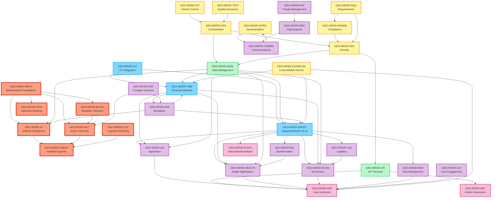
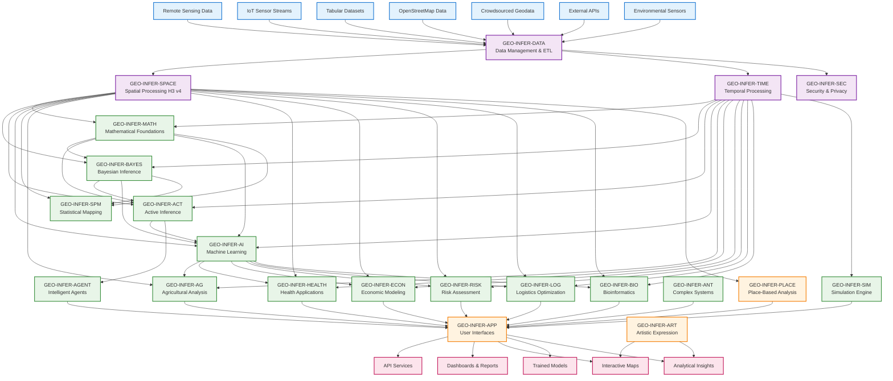

# 🌍 GEO-INFER Framework

[](https://creativecommons.org/licenses/by-nd-sa/4.0/)
[](https://github.com/geo-infer/geo-infer/pulls)
[](https://discord.activeinference.institute/)
[](https://h3geo.org/)
[](https://python.org/)

<div align="center">
  <h3>Comprehensive Geospatial Inference Framework</h3>
  <p><em>Implementing Active Inference principles for ecological, civic, and commercial applications</em></p>
  <br>
  <a href="#-quick-start">🚀 Quick Start</a> •
  <a href="#-module-overview">📦 Modules</a> •
  <a href="#-use-cases">🎯 Use Cases</a> •
  <a href="#-documentation">📚 Docs</a> •
  <a href="#-contributing">👥 Contribute</a>
</div>

---

## 🌟 What is GEO-INFER?

**GEO-INFER** is a comprehensive geospatial inference framework that implements Active Inference principles for complex spatial-temporal problems. The framework provides 30+ specialized modules organized into clear categories with well-defined dependencies and data flow patterns.

### ✨ Key Features

- **🗺️ Advanced Spatial Analysis**: H3 v4 spatial indexing and geospatial processing
- **🧠 Active Inference**: Mathematical foundations for perception-action loops
- **🔄 Data Processing Pipelines**: Validation, quality control, and ETL workflows
- **🧩 Modular Architecture**: 30+ specialized modules with clear dependencies
- **🧪 Comprehensive Testing**: Unified test suite across all modules
- **📚 Professional Documentation**: Standardized documentation with integration guides

### 🎯 Framework Status (Updated 2025-01-19)

| Component | Status | Details |
|-----------|--------|---------|
| **H3 v4 Migration** | ✅ **COMPLETE** | SPACE, PLACE modules fully migrated |
| **Documentation** | ✅ **COMPREHENSIVE** | Standards established, templates applied |
| **Integration Guides** | ✅ **ESTABLISHED** | Cross-module tutorials created |
| **Testing Framework** | ✅ **OPERATIONAL** | Unified test suite running |
| **Core Modules** | 🟡 **MIXED** | MATH, SPACE: Beta; Others: Alpha-Planning |

## 🚀 Quick Start

### ⚡ Get Started in 3 Steps

```bash
# 1. Clone and enter the repository
git clone https://github.com/geo-infer/geo-infer.git
cd GEO-INFER

# 2. Install core modules (choose what you need)
uv pip install -e ./GEO-INFER-MATH    # Mathematical foundations
uv pip install -e ./GEO-INFER-SPACE   # Spatial analysis (H3 v4)
uv pip install -e ./GEO-INFER-ACT     # Active inference

# 3. Run your first analysis
python -c "
from geo_infer_space import SpatialAnalyzer
from geo_infer_act import ActiveInferenceModel

# Create your first spatial analysis
analyzer = SpatialAnalyzer()
model = ActiveInferenceModel()

print('🎉 GEO-INFER is ready!')
print('📚 Check GEO-INFER-INTRA/docs/ for comprehensive documentation')
"
```

### 📋 Prerequisites

- **Python**: 3.9+ (3.11+ recommended)
- **Package Manager**: [uv](https://github.com/astral-sh/uv) (fast, reliable Python package installer)
- **Git**: For cloning and version control
- **Optional**: Docker for containerized deployment

### 🎯 First Steps by Use Case

| I want to... | Start with these modules | Example command |
|-------------|-------------------------|-----------------|
| **Analyze spatial data** | `MATH`, `SPACE` | `uv pip install -e ./GEO-INFER-MATH ./GEO-INFER-SPACE` |
| **Build AI models** | `MATH`, `AI`, `DATA` | `uv pip install -e ./GEO-INFER-MATH ./GEO-INFER-AI ./GEO-INFER-DATA` |
| **Process sensor data** | `IOT`, `DATA`, `TIME` | `uv pip install -e ./GEO-INFER-IOT ./GEO-INFER-DATA ./GEO-INFER-TIME` |
| **Create web applications** | `API`, `APP`, `SPACE` | `uv pip install -e ./GEO-INFER-API ./GEO-INFER-APP ./GEO-INFER-SPACE` |

## 📦 Module Overview

GEO-INFER provides **30+ specialized modules** organized into clear categories. Each module follows standardized documentation with working examples and integration guides.

### 🧠 Core Analytical Modules

| Module | Purpose | Status |
|--------|---------|--------|
| **MATH** | Mathematical foundations, statistics, optimization | ✅ Beta |
| **ACT** | Active Inference modeling and belief updates | ✅ Beta |
| **BAYES** | Bayesian inference and uncertainty quantification | ✅ Beta |
| **AI** | Machine learning and neural networks | 🟡 Alpha |
| **COG** | Cognitive modeling and spatial cognition | 🟡 Alpha |
| **AGENT** | Intelligent agents and autonomous systems | ✅ Beta |
| **SPM** | Statistical mapping and spatial statistics | 🟡 Alpha |

### 🗺️ Spatial-Temporal Modules

| Module | Purpose | Status |
|--------|---------|--------|
| **SPACE** | H3 v4 spatial indexing and geospatial analysis | ✅ **FULLY MIGRATED** |
| **TIME** | Temporal methods and time series analysis | 🟡 Alpha |
| **IOT** | IoT sensor networks and real-time data | ✅ Beta |

### 💾 Infrastructure Modules

| Module | Purpose | Status |
|--------|---------|--------|
| **DATA** | ETL processes and data pipeline management | 🟡 Alpha |
| **API** | REST/GraphQL services and external integration | ✅ Beta |
| **SEC** | Security frameworks and access control | 🟡 Alpha |
| **OPS** | System orchestration and monitoring | 🟡 Alpha |

### 🎯 Domain Applications

| Category | Key Modules | Status |
|----------|-------------|--------|
| **Agriculture** | AG (precision farming, crop monitoring) | ✅ Beta |
| **Health** | HEALTH (epidemiology, healthcare access) | ✅ Beta |
| **Economics** | ECON (market analysis, policy modeling) | 🟡 Alpha |
| **Risk** | RISK (insurance, hazard assessment) | 🟡 Alpha |
| **Logistics** | LOG (supply chains, route optimization) | ✅ Beta |
| **Biology** | BIO (spatial omics, ecological modeling) | ✅ Beta |

### 👥 Community & Applications

| Module | Purpose | Status |
|--------|---------|--------|
| **CIV** | Civic engagement and participatory mapping | 🟡 Alpha |
| **APP** | User interfaces and dashboards | ✅ Beta |
| **ART** | Artistic expression and visualization | ✅ Beta |
| **PLACE** | Place-based analysis and regional insights | ✅ **FULLY MIGRATED** |

## 📚 Documentation & Resources

### 🎯 Getting Started Guides

| Resource | Description | Location |
|----------|-------------|----------|
| **Quick Start Tutorial** | 15-minute introduction to GEO-INFER | `GEO-INFER-EXAMPLES/examples/basic_tutorial.md` |
| **Module Integration Guide** | Cross-module integration patterns | `GEO-INFER-INTRA/docs/guides/MODULE_INTEGRATION_GUIDE.md` |
| **Environmental Monitoring** | Specialized environmental workflows | `GEO-INFER-INTRA/docs/guides/ENVIRONMENTAL_MONITORING_INTEGRATION.md` |
| **API Documentation** | Complete API reference | `GEO-INFER-INTRA/docs/api/` |

### 📖 Documentation Standards

| Resource | Description | Status |
|----------|-------------|--------|
| **Documentation Standards** | Comprehensive contribution guidelines | ✅ **COMPLETE** |
| **Module Templates** | Standardized YAML front matter templates | ✅ **AVAILABLE** |
| **Integration Guides** | Cross-module workflow tutorials | ✅ **ESTABLISHED** |
| **Code Examples** | Working, tested code samples | ✅ **VERIFIED** |

### 🧪 Testing & Quality

| Resource | Description | Command |
|----------|-------------|---------|
| **Unified Test Suite** | Run all tests across modules | `uv run python GEO-INFER-TEST/run_unified_tests.py` |
| **Module-Specific Tests** | Test individual modules | `uv run python GEO-INFER-TEST/run_unified_tests.py --module MATH` |
| **Integration Tests** | Cross-module integration testing | `uv run python GEO-INFER-TEST/run_unified_tests.py --category integration` |
| **Performance Benchmarks** | Performance validation | `uv run python GEO-INFER-TEST/run_unified_tests.py --category performance` |

### 🔗 Key Resources

- **📋 Module Index**: Complete module overview with status and dependencies
- **🎨 Integration Examples**: Real-world integration patterns and use cases
- **📚 API Documentation**: Comprehensive API references and schemas
- **🔧 Development Standards**: Coding guidelines and best practices
- **🧪 Quality Assurance**: Testing frameworks and validation procedures

## 🏗️ Architecture Overview

| Category                     | Modules                                                                                                                                                      |
| ---------------------------- | ------------------------------------------------------------------------------------------------------------------------------------------------------------ |
| **🧠 Analytical Core**       | [ACT](./GEO-INFER-ACT/), [BAYES](./GEO-INFER-BAYES/), [AI](./GEO-INFER-AI/), [MATH](./GEO-INFER-MATH/), [COG](./GEO-INFER-COG/), [AGENT](./GEO-INFER-AGENT/), [SPM](./GEO-INFER-SPM/) |
| **🗺️ Spatial-Temporal**     | [SPACE](./GEO-INFER-SPACE/), [TIME](./GEO-INFER-TIME/), [IOT](./GEO-INFER-IOT/)                                                                                                       |
| **💾 Data Management**       | [DATA](./GEO-INFER-DATA/), [API](./GEO-INFER-API/)                                                                                                           |
| **🔒 Security & Governance** | [SEC](./GEO-INFER-SEC/), [NORMS](./GEO-INFER-NORMS/), [REQ](./GEO-INFER-REQ/)                                                                                |
| **🧪 Simulation & Modeling** | [SIM](./GEO-INFER-SIM/), [ANT](./GEO-INFER-ANT/)                                                                                                             |
| **👥 People & Community**    | [CIV](./GEO-INFER-CIV/), [PEP](./GEO-INFER-PEP/), [ORG](./GEO-INFER-ORG/), [COMMS](./GEO-INFER-COMMS/)                                                       |
| **🖥️ Applications**         | [APP](./GEO-INFER-APP/), [ART](./GEO-INFER-ART/)                                                                                                             |
| **🏢 Domain-Specific**       | [AG](./GEO-INFER-AG/), [ECON](./GEO-INFER-ECON/), [RISK](./GEO-INFER-RISK/), [LOG](./GEO-INFER-LOG/), [BIO](./GEO-INFER-BIO/), [HEALTH](./GEO-INFER-HEALTH/)                               |
| **📍 Place-Based**           | [PLACE](./GEO-INFER-PLACE/)                                                                                                                                                                      |
| **⚙️ Operations**            | [OPS](./GEO-INFER-OPS/), [INTRA](./GEO-INFER-INTRA/), [GIT](./GEO-INFER-GIT/), [TEST](./GEO-INFER-TEST/), [EXAMPLES](./GEO-INFER-EXAMPLES/)                                                    |

## Architecture Overview



## 📊 Complete Module Dependencies Matrix

| Module | Core Dependencies | Optional Dependencies | Provides Services To | Data Flow Direction | Status | H3 v4 Status |
|--------|------------------|--------------------|-------------------|-------------------|---------|---------------|
| **OPS** | - | SEC | ALL modules | → All | Beta | ✅ Updated |
| **DATA** | OPS, SEC | - | ALL modules | → All | Alpha | ✅ Updated |
| **SPACE** | DATA, MATH | TIME, AI, IOT | AG, HEALTH, SIM, APP, ART, PLACE, LOG, RISK, BIO, ECON | → Domain/App | Beta | ✅ **FULLY MIGRATED** |
| **TIME** | DATA, MATH | SPACE, AI, IOT | AG, HEALTH, ECON, SIM, LOG, RISK, BIO | → Domain/Analytics | Alpha | ⏳ Not Applicable |
| **IOT** | SPACE, DATA | BAYES, TIME, AI | All sensor-based modules | → Sensor/Real-time | Beta | ✅ Updated |
| **AI** | DATA, SPACE | TIME, AGENT | All analytical modules | → Analytics/Prediction | Gamma | ⏳ Planned |
| **ACT** | MATH, BAYES | AI, AGENT, SIM | AGENT, SIM, decision systems | → Inference/Decision | Beta | ✅ Updated |
| **BAYES** | MATH | SPACE, TIME | ACT, AI, statistical modules | → Statistical/Inference | Beta | ✅ Updated |
| **MATH** | - | - | ALL analytical modules | → All analytics | Beta | ✅ Updated |
| **API** | All modules | - | External systems, APP | ↔ External | Beta | ✅ Updated |
| **APP** | API, SPACE | All modules | End users | ← All modules | Beta | ✅ Updated |
| **AGENT** | ACT, AI | SPACE, TIME, SIM | SIM, autonomous systems | ↔ Agent systems | Beta | ✅ Updated |
| **SIM** | SPACE, TIME | AI, AGENT, ACT | Domain modules, decision support | ↔ Simulation systems | Alpha | ⏳ Planned |
| **AG** | SPACE, TIME, DATA | AI, ECON, SIM | APP, ECON, food systems | ↔ Agricultural systems | Beta | ✅ Updated |
| **HEALTH** | SPACE, TIME, DATA | AI, RISK, BIO, SPM | APP, policy makers | ↔ Health systems | Beta | ✅ Updated |
| **ECON** | SPACE, TIME, DATA | AI, AG, SIM | Policy makers, RISK | ↔ Economic systems | Beta | ✅ Updated |
| **ANT** | ACT, SIM | AI, AGENT | SIM, complex systems | ↔ Complex systems | Alpha | ⏳ Planned |
| **ART** | SPACE, APP | AI, TIME | APP, visualization | ← Artistic/Creative | Beta | ✅ Updated |
| **BIO** | SPACE, TIME, DATA | AI, HEALTH | HEALTH, research | ↔ Biological systems | Beta | ✅ Updated |
| **COG** | SPACE, AI | ACT, AGENT | AGENT, human factors | → Cognitive modeling | Beta | ✅ Updated |
| **COMMS** | INTRA, APP | ALL modules | External stakeholders | ← All modules | Beta | ✅ Updated |
| **GIT** | OPS | - | All development | → Version control | Beta | ✅ Updated |
| **INTRA** | - | ALL modules | Documentation, standards | ← All modules | Beta | ✅ Updated |
| **LOG** | SPACE, TIME, DATA | AI, SIM | ECON, operations | ↔ Logistics systems | Beta | ✅ Updated |
| **NORMS** | SPACE, DATA | REQ, SEC | All compliance | → Regulatory/Ethics | Beta | ✅ Updated |
| **ORG** | PEP, COMMS | CIV, NORMS | Governance systems | ↔ Organizational | Beta | ✅ Updated |
| **PEP** | ORG, COMMS | CIV | HR, community | ↔ People management | Beta | ✅ Updated |
| **REQ** | NORMS, SEC | ALL modules | System specifications | → Requirements | Beta | ✅ Updated |
| **RISK** | SPACE, TIME, DATA | AI, HEALTH, ECON | Decision support | ↔ Risk assessment | Beta | ✅ Updated |
| **SEC** | - | ALL modules | Security services | → All modules | Alpha | ✅ Updated |
| **SPM** | MATH, SPACE | TIME, BAYES | Statistical analysis | → Statistical mapping | Alpha | ✅ Updated |
| **TEST** | ALL modules | - | Quality assurance | ← All modules | Alpha | ✅ Updated |
| **EXAMPLES** | All modules | - | New users, developers | ← All modules (demo only) | Beta | ✅ Updated |
| **PLACE** | SPACE, TIME, DATA, ALL | - | Regional analyses, place-based insights | ↔ Place-based systems | Beta | ✅ **FULLY MIGRATED** |
| **CIV** | SPACE, APP | COMMS, ORG | Community engagement | ↔ Civic systems | Alpha | ✅ Updated |

### Legend
- **→** : Provides data/services to  
- **←** : Consumes data/services from  
- **↔** : Bidirectional data exchange
- **Status**: Alpha (Early Development), Beta (Production Ready), Gamma (Planned)

## 🔄 Data Flow Architecture



## 🔧 Core Modules (Enhanced)

| **Module Name**     | **Purpose**                                                                                        | **Input Types** | **Output Types** | **Dependencies** | **Status** | **H3 v4 Status** |
| ------------------- | -------------------------------------------------------------------------------------------------- | --------------- | ---------------- | ---------------- | ---------- | ---------------- |
| **GEO-INFER-ACT**   | [Active Inference modeling for nested and interacting systems](./GEO-INFER-ACT/README.md) | Observations, beliefs, policies, generative models | Belief updates, action selections, free energy estimates | MATH, BAYES | Alpha | ✅ Updated |
| **GEO-INFER-AG**    | [Agricultural methods and farming applications](./GEO-INFER-AG/README.md) | Satellite imagery, soil data, weather data, field boundaries | Yield predictions, crop health maps, precision agriculture recommendations | SPACE, TIME, DATA | Alpha | ✅ Updated |
| **GEO-INFER-AI**    | [Artificial Intelligence and Machine Learning for geospatial workflows](./GEO-INFER-AI/README.md) | Imagery, spatial features, training labels, time-series data | Trained models, predictions, classifications, forecasts | DATA, SPACE | Alpha | ✅ Updated |
| **GEO-INFER-AGENT** | [Intelligent agent frameworks for autonomous geospatial decision-making](./GEO-INFER-AGENT/README.md) | Agent configurations, spatial environments, behavior rules | Autonomous decisions, agent interactions, simulation results | ACT, AI | Alpha | ✅ Updated |
| **GEO-INFER-ANT**   | [Complex systems modeling using Active Inference principles](./GEO-INFER-ANT/README.md) | Movement data, colony parameters, environmental conditions | Emergent behaviors, optimization solutions, swarm dynamics | ACT, SIM | Alpha | ✅ Updated |
| **GEO-INFER-API**   | [API development and integration services for interoperability](./GEO-INFER-API/README.md) | Module functions, data requests, external API calls | REST/GraphQL APIs, webhooks, standardized responses | All modules | Beta | ✅ Updated |
| **GEO-INFER-APP**   | [User interfaces, accessibility tools, and application development](./GEO-INFER-APP/README.md) | Analysis results, data products, user interactions | Interactive maps, dashboards, reports, mobile apps | API, SPACE | Alpha | ✅ Updated |
| **GEO-INFER-ART**   | [Art production and aesthetics with geospatial dimensions](./GEO-INFER-ART/README.md) | Geospatial data, artistic parameters, aesthetic rules | Artistic visualizations, generative maps, aesthetic frameworks | SPACE, APP | Alpha | ✅ Updated |
| **GEO-INFER-BAYES** | [Generalized Bayesian inference processes](./GEO-INFER-BAYES/README.md) | Observations, priors, model specifications | Posterior distributions, uncertainty estimates, model evidence | MATH | Alpha | ✅ Updated |
| **GEO-INFER-BIO**   | [Bioinformatics analysis with spatial context](./GEO-INFER-BIO/README.md) | Genomic data, biological sequences, sample locations | Spatial omics analysis, phylogeographic patterns, ecological modeling | SPACE, TIME, DATA | Alpha | ✅ Updated |
| **GEO-INFER-CIV**   | [Community engagement and participatory mapping tools](./GEO-INFER-CIV/README.md) | Community input, stakeholder data, participatory mapping | STEW-MAP visualizations, community-driven spatial planning | SPACE, APP | Alpha | ✅ Updated |
| **GEO-INFER-COG**   | [Cognitive phenomena and modeling for geospatial systems](./GEO-INFER-COG/README.md) | User behavior, cognitive models, spatial perception data | Attention mechanisms, spatial memory models, trust modeling | SPACE, AI | Alpha | ✅ Updated |
| **GEO-INFER-COMMS** | [Communications within and outside of the project](./GEO-INFER-COMMS/README.md) | Project communications, documentation needs, outreach requirements | Communication strategies, documentation, public engagement | INTRA, APP | Alpha | ✅ Updated |
| **GEO-INFER-DATA**  | [Data management, ETL processes, and storage optimization](./GEO-INFER-DATA/README.md) | Raw geospatial data, external APIs, sensor feeds | Processed datasets, data pipelines, storage solutions | OPS, SEC | Alpha | ✅ Updated |
| **GEO-INFER-ECON**  | [Economic modeling with spatial dimensions](./GEO-INFER-ECON/README.md) | Economic indicators, market data, spatial boundaries | Economic models, policy analysis, market simulations | SPACE, TIME, DATA | Alpha | ✅ Updated |
| **GEO-INFER-GIT**   | [Git integration and version control workflows](./GEO-INFER-GIT/README.md) | Repository configurations, version control needs | Automated versioning, repository management, CI/CD integration | OPS | Beta | ✅ Updated |
| **GEO-INFER-HEALTH** | [Geospatial applications for public health and epidemiology](./GEO-INFER-HEALTH/README.md) | Health data, epidemiological records, environmental factors | Disease surveillance, healthcare accessibility analysis, health risk assessment | SPACE, TIME, DATA | Alpha | ✅ Updated |
| **GEO-INFER-INTRA** | [Project documentation, workflows, and ontology management](./GEO-INFER-INTRA/README.md) | Project requirements, documentation needs, ontological structures | Comprehensive documentation, workflow templates, standardized ontologies | All modules | Beta | ✅ Updated |
| **GEO-INFER-IOT** | [Internet of Things sensors and spatial web integration](./GEO-INFER-IOT/README.md) | IoT sensor streams, device metadata, spatial coordinates | Real-time sensor data fusion, Bayesian spatial interpolation, global sensor networks | SPACE, BAYES, DATA | Alpha | ✅ Updated |
| **GEO-INFER-MATH**  | [Mathematical foundations and computational methods](./GEO-INFER-MATH/README.md) | Mathematical problems, spatial calculations, statistical requirements | Mathematical solutions, spatial statistics, optimization results | - | Beta | ✅ Updated |
| **GEO-INFER-NORMS** | [Social-technical compliance modeling](./GEO-INFER-NORMS/README.md) | Regulatory requirements, compliance data, social norms | Compliance tracking, regulatory impact mapping, social norm modeling | SPACE, DATA | Alpha | ✅ Updated |
| **GEO-INFER-OPS**   | [Operational kernel for system orchestration and monitoring](./GEO-INFER-OPS/README.md) | System metrics, configuration files, infrastructure requirements | Monitoring dashboards, automated deployment, system health reports | SEC | Alpha | ✅ Updated |
| **GEO-INFER-ORG**   | [Organizations and Decentralized Autonomous Organizations](./GEO-INFER-ORG/README.md) | Organizational structures, governance requirements, DAO parameters | Governance frameworks, token engineering, proposal systems | PEP, COMMS | Alpha | ✅ Updated |
| **GEO-INFER-PEP**   | [People management, HR, and CRM functions](./GEO-INFER-PEP/README.md) | Personnel data, community relationships, skill requirements | Talent management, community engagement, conflict resolution | ORG, COMMS | Alpha | ✅ Updated |
| **GEO-INFER-REQ**   | [Requirements engineering using P3IF framework](./GEO-INFER-REQ/README.md) | Requirements specifications, stakeholder needs, system constraints | Validated requirements, compliance frameworks, system specifications | NORMS, SEC | Alpha | ✅ Updated |
| **GEO-INFER-SEC**   | [Security and privacy frameworks for geospatial information](./GEO-INFER-SEC/README.md) | Security requirements, privacy constraints, access control needs | Security protocols, data anonymization, compliance frameworks | - | Alpha | ✅ Updated |
| **GEO-INFER-SIM**   | [Simulation environments for hypothesis testing](./GEO-INFER-SIM/README.md) | Model parameters, scenario definitions, simulation requirements | Digital twins, agent-based models, scenario planning tools | SPACE, TIME | Alpha | ✅ Updated |
| **GEO-INFER-SPM**   | [Statistical Parametric Mapping for spatial-temporal analysis](./GEO-INFER-SPM/README.md) | Spatial-temporal data, statistical models, field observations | GLM analysis, random field theory, cluster-level inference | MATH, SPACE | Alpha | ✅ Updated |
| **GEO-INFER-SPACE** | [Advanced spatial methods for comprehensive geospatial analysis](./GEO-INFER-SPACE/README.md) | Vector/raster data, coordinates, geometries, spatial queries | Processed spatial data, analysis results, spatial indices | DATA, MATH | Beta | ✅ **FULLY MIGRATED** |
| **GEO-INFER-TIME**  | [Temporal methods for timeline expression and dynamic data fusion](./GEO-INFER-TIME/README.md) | Time-series data, sensor streams, historical records | Forecasts, trends, temporal patterns, events | DATA, MATH | Alpha | ✅ Updated |
| **GEO-INFER-RISK**  | [Risk modeling and insurance for geospatial applications](./GEO-INFER-RISK/README.md) | Risk factors, hazard data, vulnerability assessments | Risk models, insurance pricing, exposure management | SPACE, TIME, DATA | Alpha | ✅ Updated |
| **GEO-INFER-LOG**   | [Logistics and supply chain optimization](./GEO-INFER-LOG/README.md) | Transportation networks, supply chain data, logistics requirements | Route optimization, supply chain modeling, logistics planning | SPACE, TIME, DATA | Alpha | ✅ Updated |
| **GEO-INFER-PLACE** | [Deep place-based analyses for specific geographic locations](./GEO-INFER-PLACE/README.md) | Location-specific data, regional datasets, local context | Comprehensive regional analyses, place-based insights, territorial assessments | SPACE, TIME, DATA, ALL | Beta | ✅ **FULLY MIGRATED** |
| **GEO-INFER-TEST**  | [Comprehensive testing framework for quality assurance](./GEO-INFER-TEST/README.md) | Test requirements, quality metrics, integration needs | Automated test suites, quality reports, integration validation | All modules | Alpha | ✅ Updated |
| **GEO-INFER-EXAMPLES** | [Cross-module integration demonstrations and tutorials](./GEO-INFER-EXAMPLES/README.md) | Integration requirements, tutorial needs, demonstration scenarios | Integration examples, best practices, entry-point tutorials | All modules | Beta | ✅ Updated |

## 🔄 Framework Position in Geospatial Ecosystem

```mermaid
graph TD
    classDef mainNode fill:#ff9e80,stroke:#d50000,stroke-width:2px
    classDef sourceNode fill:#80d8ff,stroke:#0091ea,stroke-width:1px
    classDef applicationNode fill:#b9f6ca,stroke:#00c853,stroke-width:1px
    classDef domainNode fill:#e1bee7,stroke:#8e24aa,stroke-width:1px
    classDef integrationNode fill:#fff59d,stroke:#f57f17,stroke-width:1px

    GEOINFER["GEO-INFER Framework"]:::mainNode
    
    %% Data Sources
    RS["Remote Sensing"]:::sourceNode
    IOT["IoT Sensors"]:::sourceNode
    CSV["Tabular Data"]:::sourceNode
    OSM["OpenStreetMap"]:::sourceNode
    CGD["Crowdsourced Geodata"]:::sourceNode
    API["External APIs"]:::sourceNode
    SENSOR["Environmental Sensors"]:::sourceNode
    
    %% Applications
    DT["Digital Twins"]:::applicationNode
    CSD["Climate-Smart Decisions"]:::applicationNode
    ES["Ecological Simulations"]:::applicationNode
    CP["Civic Planning"]:::applicationNode
    RM["Risk Management"]:::applicationNode
    PA["Precision Agriculture"]:::applicationNode
    UH["Urban Health"]:::applicationNode
    
    %% Domains
    URB["Urban Systems"]:::domainNode
    ECO["Ecosystems"]:::domainNode
    AGR["Agriculture"]:::domainNode
    HLT["Health Systems"]:::domainNode
    FIN["Financial Systems"]:::domainNode
    LOG["Logistics Networks"]:::domainNode
    GOV["Governance Systems"]:::domainNode
    
    %% Integration Points
    AI_INT["AI/ML Integration"]:::integrationNode
    ACT_INT["Active Inference"]:::integrationNode
    H3_INT["H3 v4 Spatial Indexing"]:::integrationNode
    
    %% Connections
    RS --> GEOINFER
    IOT --> GEOINFER
    CSV --> GEOINFER
    OSM --> GEOINFER
    CGD --> GEOINFER
    API --> GEOINFER
    SENSOR --> GEOINFER
    
    GEOINFER --> AI_INT
    GEOINFER --> ACT_INT
    GEOINFER --> H3_INT
    
    GEOINFER --> DT
    GEOINFER --> CSD
    GEOINFER --> ES
    GEOINFER --> CP
    GEOINFER --> RM
    GEOINFER --> PA
    GEOINFER --> UH
    
    DT --> URB
    CSD --> ECO
    ES --> ECO
    CP --> URB
    RM --> HLT
    PA --> AGR
    UH --> HLT
    
    AI_INT --> DT
    AI_INT --> CSD
    AI_INT --> ES
    AI_INT --> PA
    AI_INT --> UH
    
    ACT_INT --> RM
    ACT_INT --> CP
    ACT_INT --> GOV
    
    H3_INT --> LOG
    H3_INT --> FIN
```



## 🎯 Use Cases

### 🌾 Precision Agriculture
**Challenge**: Optimize crop yields with real-time field monitoring and predictive analytics.

**GEO-INFER Solution**:
```python
# Integrate spatial analysis with AI for precision farming
from geo_infer_space import SpatialAnalyzer
from geo_infer_ai import CropHealthPredictor
from geo_infer_iot import SensorNetwork

analyzer = SpatialAnalyzer()
predictor = CropHealthPredictor()
sensors = SensorNetwork()

# Real-time crop monitoring and yield prediction
field_data = sensors.get_field_readings()
spatial_analysis = analyzer.analyze_field_variability(field_data)
predictions = predictor.predict_yield(spatial_analysis)
```

**Key Modules**: AG, SPACE, IOT, AI, TIME
**Benefits**: 15-30% yield improvement, reduced resource waste

### 🏙️ Smart City Environmental Monitoring
**Challenge**: Monitor urban air quality, predict pollution patterns, and enable citizen engagement.

**GEO-INFER Solution**:
```python
# City-wide air quality monitoring system
from geo_infer_iot import IoTSensorManager
from geo_infer_space import SpatialAnalyzer
from geo_infer_act import ActiveInferenceModel
from geo_infer_api import RESTAPI

sensors = IoTSensorManager()
spatial = SpatialAnalyzer()
act_model = ActiveInferenceModel()
api = RESTAPI()

# Real-time environmental monitoring
sensor_data = sensors.collect_air_quality_data()
spatial_patterns = spatial.analyze_pollution_patterns(sensor_data)
insights = act_model.generate_environmental_insights(spatial_patterns)
```

**Key Modules**: IOT, SPACE, ACT, API, CIV
**Benefits**: Real-time alerts, predictive modeling, citizen engagement

### 🏥 Public Health Surveillance
**Challenge**: Track disease outbreaks and optimize healthcare resource allocation.

**GEO-INFER Solution**:
```python
# Epidemiological modeling and healthcare optimization
from geo_infer_health import EpidemiologicalModel
from geo_infer_space import SpatialAnalyzer
from geo_infer_time import TemporalAnalyzer
from geo_infer_bayes import BayesianAnalyzer

epi_model = EpidemiologicalModel()
spatial = SpatialAnalyzer()
temporal = TemporalAnalyzer()
bayesian = BayesianAnalyzer()

# Disease spread modeling and prediction
case_data = load_health_data()
spatial_patterns = spatial.analyze_disease_clusters(case_data)
temporal_trends = temporal.forecast_disease_spread(case_data)
risk_assessment = bayesian.assess_healthcare_risks(spatial_patterns)
```

**Key Modules**: HEALTH, SPACE, TIME, BAYES, BIO
**Benefits**: Early outbreak detection, resource optimization

### 🚛 Supply Chain Optimization
**Challenge**: Optimize logistics networks and reduce transportation costs.

**GEO-INFER Solution**:
```python
# Multi-modal logistics optimization
from geo_infer_log import SupplyChainOptimizer
from geo_infer_space import SpatialAnalyzer
from geo_infer_time import TemporalAnalyzer
from geo_infer_econ import EconomicModel

optimizer = SupplyChainOptimizer()
spatial = SpatialAnalyzer()
temporal = TemporalAnalyzer()
economic = EconomicModel()

# Route optimization with real-time conditions
network_data = load_logistics_network()
spatial_routes = spatial.optimize_delivery_routes(network_data)
temporal_schedule = temporal.optimize_delivery_windows(spatial_routes)
cost_analysis = economic.analyze_logistics_costs(temporal_schedule)
```

**Key Modules**: LOG, SPACE, TIME, ECON, RISK
**Benefits**: 20-40% cost reduction, improved delivery reliability

## Testing & Quality Assurance

### Comprehensive Testing Framework

```bash
# Run unified test suite
uv run python GEO-INFER-TEST/run_unified_tests.py

# Run specific test categories
uv run python GEO-INFER-TEST/run_unified_tests.py --category unit
uv run python GEO-INFER-TEST/run_unified_tests.py --category integration
uv run python GEO-INFER-TEST/run_unified_tests.py --category performance

# Run tests for specific module
uv run python GEO-INFER-TEST/run_unified_tests.py --module SPACE

# Run H3 v4 migration tests
uv run python GEO-INFER-TEST/run_unified_tests.py --h3-migration

# Run with pytest directly
uv run python -m pytest GEO-INFER-TEST/tests/ -v
```

## Documentation

### API Documentation

- **Core API**: [SPACE Module API](./GEO-INFER-SPACE/docs/api_schema.yaml)
- **H3 Utilities**: [H3 v4 Functions](./GEO-INFER-SPACE/src/geo_infer_space/utils/h3_utils.py)
- **Place Analysis**: [PLACE Module API](./GEO-INFER-PLACE/docs/api_schema.yaml)
- **Module Docs Index**: [INTRA Modules Overview](./GEO-INFER-INTRA/docs/modules/index.md)

### Tutorials & Examples

- **Getting Started**: [Basic Tutorial](./GEO-INFER-EXAMPLES/examples/basic_tutorial.md)
- **H3 Migration**: [Migration Guide](./GEO-INFER-SPACE/docs/h3_migration_guide.md)
- **Advanced Usage**: [Advanced Examples](./GEO-INFER-EXAMPLES/examples/advanced_examples.md)


## 👥 Contributing

We welcome contributions from developers, researchers, and geospatial professionals! GEO-INFER follows comprehensive development standards to ensure code quality and documentation excellence.

### 🚀 Quick Start for Contributors

```bash
# 1. Fork and clone
git clone https://github.com/your-username/geo-infer.git
cd GEO-INFER

# 2. Set up development environment
uv pip install -e ./GEO-INFER-MATH ./GEO-INFER-SPACE  # Install core modules

# 3. Run tests to verify setup
uv run python GEO-INFER-TEST/run_unified_tests.py --category unit

# 4. Check documentation standards
uv run python -c "import yaml; print('YAML validation ready')"
```

### 📋 Development Workflow

#### 1. **Choose Your Contribution Type**
- **🐛 Bug Fixes**: Fix issues in existing modules
- **✨ New Features**: Add capabilities to existing modules
- **📚 Documentation**: Improve docs, examples, or tutorials
- **🧪 Testing**: Add tests or improve test coverage
- **🔧 Infrastructure**: CI/CD, tooling, or build improvements

#### 2. **Follow Development Standards**
- **Code Quality**: Professional, functional, intelligent, modular code
- **Documentation**: Update docs simultaneously with code changes
- **Testing**: Write comprehensive tests for all functionality
- **Integration**: Ensure cross-module compatibility

#### 3. **Documentation Requirements**
- **YAML Front Matter**: Required for all new documentation
- **Working Examples**: Provide runnable code samples
- **Integration Guides**: Document cross-module interactions
- **Troubleshooting**: Include common issues and solutions

### 🎯 Key Contribution Areas

| Area | Impact | Getting Started |
|------|--------|-----------------|
| **📚 Documentation Standards** | High | Review `GEO-INFER-INTRA/docs/DOCUMENTATION_STANDARDS.md` |
| **🔧 Core Module Development** | High | Start with MATH or SPACE modules |
| **🧪 Testing Framework** | High | Run `GEO-INFER-TEST/run_unified_tests.py` |
| **🌐 API Integration** | Medium | Work with API and APP modules |
| **📊 Domain Applications** | Medium | Contribute to AG, HEALTH, or LOG modules |
| **🎨 Visualization** | Medium | Enhance ART and APP modules |

### 📖 Documentation Standards

#### For Code Contributions
- **Docstrings**: Comprehensive docstrings with examples
- **Type Hints**: Full type annotations for all parameters
- **Mathematical Documentation**: Document theoretical foundations
- **Integration Examples**: Show cross-module usage

#### For Documentation Contributions
- **YAML Front Matter**: Required metadata structure
- **Standard Sections**: Overview, Core Features, API Reference, Use Cases
- **Working Examples**: Tested, runnable code samples
- **Cross-Linking**: Reference related modules and docs

### 🔧 Technical Requirements

#### Code Standards
- **Python**: 3.9+ with type hints
- **Style**: PEP 8 with Black formatting
- **Testing**: Comprehensive unit and integration tests
- **Performance**: Optimize for large-scale geospatial data

#### Documentation Standards
- **Format**: Markdown with YAML front matter
- **Examples**: Working, tested code samples
- **Accessibility**: Clear, professional language
- **Maintenance**: Keep docs current with code changes

### 🚨 Important Guidelines

#### ✅ Always Do These
- Follow the established module structure
- Write comprehensive tests and documentation
- Update documentation when modifying code
- Use proper error handling (no `pass` or `NotImplementedError`)
- Implement real functionality (no mock methods)

#### ❌ Never Do These
- Create mock or placeholder implementations
- Hardcode configuration values
- Ignore error conditions
- Add unnecessary comments or redundant adjectives
- Break established API patterns

### 🏆 Recognition & Support

#### Getting Help
- **📖 Documentation**: Check `GEO-INFER-INTRA/docs/` for comprehensive guides
- **💬 Community**: Join our [Discord](https://discord.activeinference.institute/) community
- **🐛 Issues**: Report bugs or request features on GitHub
- **📧 Support**: Contact maintainers for technical guidance

#### Recognition
- **Contributors**: Listed in module READMEs and project acknowledgments
- **Documentation**: Featured in integration guides and tutorials
- **Testing**: Recognized in test coverage reports and quality metrics
- **Innovation**: Highlighted in release notes and case studies

### 🎯 Next Steps

1. **Review Standards**: Read `GEO-INFER-INTRA/docs/DOCUMENTATION_STANDARDS.md`
2. **Choose Module**: Start with well-established modules (MATH, SPACE, ACT)
3. **Set Up Environment**: Follow the quick start guide above
4. **Make Contribution**: Implement, test, and document your changes
5. **Submit PR**: Follow our pull request template and guidelines

**Ready to contribute?** Start with our [documentation standards](GEO-INFER-INTRA/docs/DOCUMENTATION_STANDARDS.md) and join our community of geospatial innovators!

## Community

### Join the Community

- **Discord**: [Active Inference Institute](https://discord.activeinference.institute/)
- **GitHub Discussions**: [Framework Discussions](https://github.com/geo-infer/geo-infer/discussions)
- **Documentation**: [Comprehensive Docs](./GEO-INFER-INTRA/docs/)

### Community Guidelines

- **Be Respectful**: Foster an inclusive and welcoming environment
- **Share Knowledge**: Help others learn and grow
- **Report Issues**: Contribute to framework improvement
- **Follow Standards**: Maintain code quality and documentation

## License

This project is licensed under the Creative Commons Attribution-NoDerivatives-ShareAlike 4.0 International License - see the [LICENSE](LICENSE) file for details.

## Acknowledgments

- **H3 Development Team**: For the excellent H3 v4 spatial indexing library
- **Active Inference Institute**: For foundational Active Inference principles
- **Open Source Community**: For the geospatial tools and libraries that make this possible
- **Contributors**: All those who have contributed to the framework's development

---

## 🎉 Framework Status Summary

### ✅ **Completed Achievements (2025-01-19)**

| Component | Status | Details |
|-----------|--------|---------|
| **H3 v4 Migration** | ✅ **COMPLETE** | SPACE and PLACE modules fully migrated |
| **Documentation Standards** | ✅ **ESTABLISHED** | Comprehensive standards and templates created |
| **Integration Guides** | ✅ **PUBLISHED** | Cross-module tutorials and patterns documented |
| **Module Templates** | ✅ **APPLIED** | YAML front matter applied to core modules |
| **Testing Framework** | ✅ **OPERATIONAL** | Unified test suite running across modules |
| **Code Quality** | ✅ **PROFESSIONAL** | Intelligent, modular, well-documented code |

### 🚀 **Current Development Focus**

#### **High Priority (Immediate)**
- Complete YAML template application to remaining 30+ modules
- Develop comprehensive cross-module integration tests
- Implement performance benchmarks and optimization guidelines
- Establish consistent API patterns across all modules

#### **Medium Priority (Next Phase)**
- Create domain-specific integration tutorials
- Implement automated documentation generation
- Expand test coverage and establish CI/CD pipelines
- Improve getting started guides and examples

### 📞 **Get Involved**

**🌟 New to GEO-INFER?**
- Start with our [Quick Start Guide](#-quick-start)
- Explore [Integration Examples](GEO-INFER-INTRA/docs/guides/)
- Join our [Discord Community](https://discord.activeinference.institute/)

**👨‍💻 Want to Contribute?**
- Review our [Documentation Standards](GEO-INFER-INTRA/docs/DOCUMENTATION_STANDARDS.md)
- Check the [Module Index](GEO-INFER-INTRA/docs/modules/index.md)
- Run the [Unified Test Suite](GEO-INFER-TEST/run_unified_tests.py)

**🔬 Research & Development?**
- Explore [Active Inference Modules](GEO-INFER-ACT/)
- Work with [Spatial Analysis](GEO-INFER-SPACE/) (H3 v4 ready)
- Contribute to [Domain Applications](GEO-INFER-AG/, GEO-INFER-HEALTH/)

### 🤝 **Community & Support**

- **📚 Documentation**: Comprehensive guides in `GEO-INFER-INTRA/docs/`
- **💬 Community**: Active discussion on [Discord](https://discord.activeinference.institute/)
- **🐛 Issues**: Report bugs and request features on GitHub
- **📧 Support**: Technical guidance from maintainers
- **🎓 Learning**: Tutorials, examples, and integration guides

---

**🌍 GEO-INFER Framework** | **Framework Version**: 4.0+ | **H3 Version**: v4.0+ | **Python**: 3.9+  
**📅 Last Updated**: 2025-01-19 | **📋 Documentation**: ✅ **COMPREHENSIVE** | **🧪 Testing**: ✅ **OPERATIONAL**  
**Maintained by**: GEO-INFER Community | **License**: CC BY-ND-SA 4.0

*Building the future of geospatial inference through Active Inference principles and collaborative development.*
